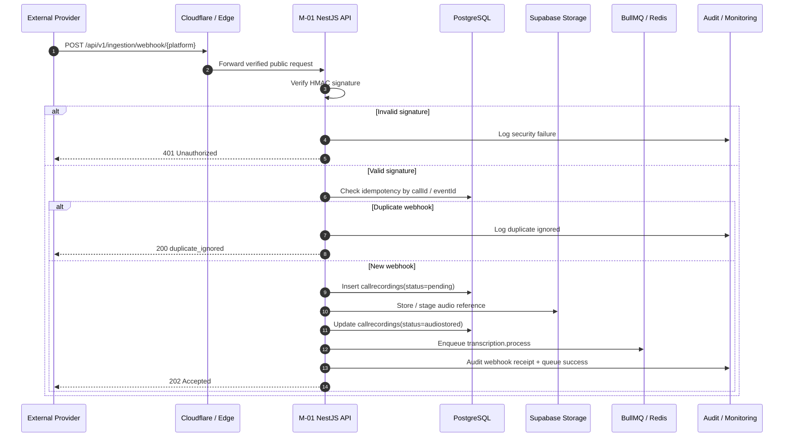
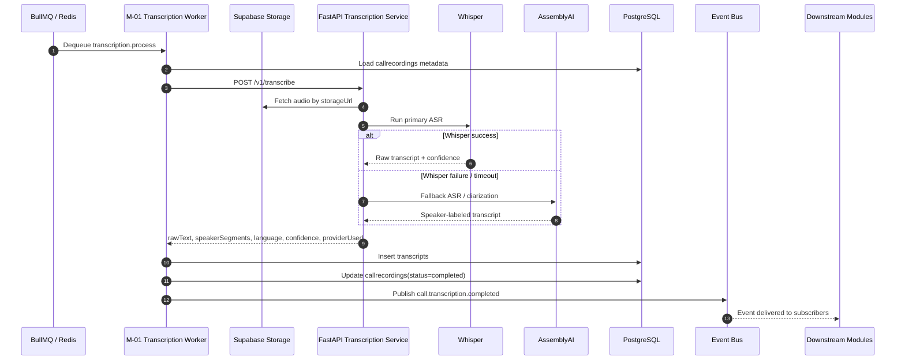
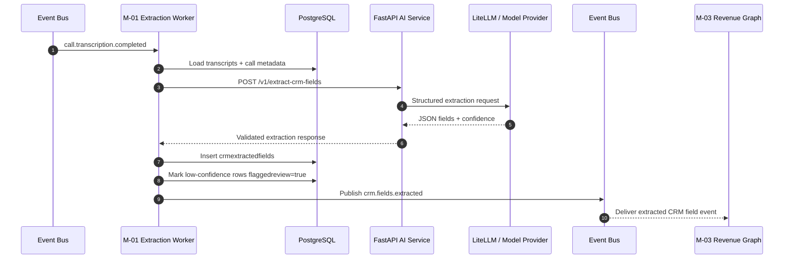
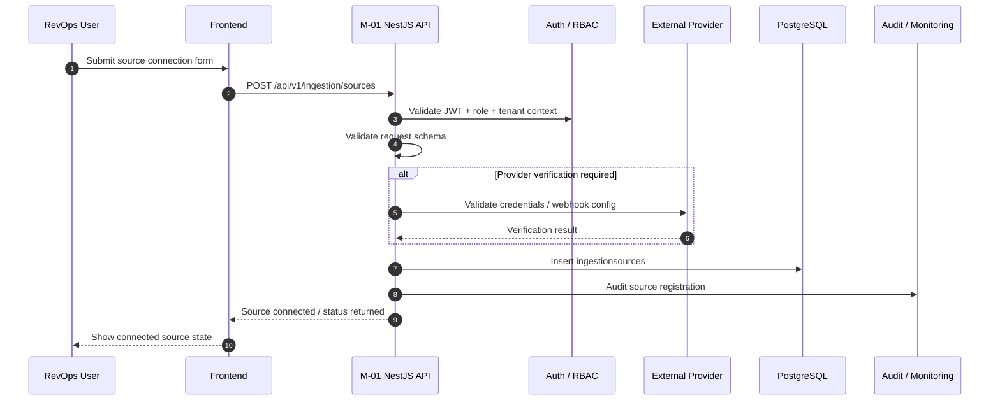

# Doc #14 — M-01 Sequence Diagrams

This document contains the core sequence diagrams for **M-01 Capture & Transcription**. It is written for fast onboarding, so a new engineer can understand the most important async flows without reading all source code first.

M-01 is the Capture-stage foundation of the platform. It owns webhook ingestion, source registration, raw call metadata intake, transcription flow coordination, extracted CRM field generation, and emission of the first major platform events such as `call.transcription.completed` and `crm.fields.extracted`.

## Scope

The diagrams in this document cover the M-01 flows that are complex enough to deserve their own sequence documentation: webhook to transcription job, transcription completion to event emission, transcript to AI extraction to CRM-field event, and source onboarding / registration.

These are the flows most engineers will touch first because they sit on the critical path for downstream modules. If these flows fail, later modules do not receive the data or events they depend on.

---

## SD-01 — External source webhook to transcription job

### Diagram Title

**Zoom / Teams / Meet / Dialer webhook to queued transcription job**.

### Purpose

Use this diagram when working on inbound webhook handlers, idempotency, audio fetch preparation, or job enqueue logic in `api/v1/ingestion`. It shows how an external provider event becomes an internal transcription job without mixing sync request handling and long-running processing.

### Actors

- External Provider.
- Cloudflare / Edge protection layer.
- NestJS M-01 API (`/api/v1/ingestion/webhook/*`).
- PostgreSQL.
- Supabase Storage.
- BullMQ / Redis.
- Audit / Monitoring stack.

### Preconditions

- Source is already registered for the tenant.
- Webhook secret is stored for that ingestion source.
- Tenant is known or resolvable from source mapping.
- External provider includes a valid HMAC signature.
- Recording URL or equivalent audio reference is present in the webhook payload.

### Main Sequence

1. External provider sends call-completed webhook to the correct M-01 webhook endpoint.
2. Edge protection allows the request through rate limiting and public endpoint controls.
3. M-01 verifies HMAC signature before doing any expensive work.
4. M-01 checks idempotency using `callId` or provider event identity.
5. M-01 creates `callrecordings` row with initial status such as `pending`.
6. M-01 downloads or stages the recording and uploads raw audio reference into storage for transcription processing.
7. M-01 updates call status to reflect audio stored / ready state.
8. M-01 enqueues BullMQ transcription job with `callId`, `tenantId`, storage URL, and relevant metadata.
9. M-01 returns success to the provider quickly, keeping the heavy transcription work async.

### Alternate Paths

- Duplicate webhook: M-01 detects existing `callrecordings` entry and returns a safe duplicate-ignored response.
- Invalid signature: request is rejected with 401 and no call record is created.
- Missing recording URL: request is logged, call may move to failed state, and no transcription job is queued.
- Storage upload failure: queue step is skipped and retry / alert path starts.

### Postconditions

- `callrecordings` exists for the tenant.
- Audio reference is stored or staged for later transcription.
- A BullMQ transcription job exists in queue.
- Downstream processing can now happen asynchronously without holding the webhook open.

### Failure Notes

- Invalid HMAC should fail fast and never create data.
- Audio fetch or upload failures should retry with backoff, then move to failed state and alert via Sentry / ops tooling if exhausted.
- Duplicate provider deliveries are normal and must be treated as idempotent, not exceptional.

### Mermaid Source

---

## SD-02 — Transcription processing to transcript persisted to event emitted

### Diagram Title

**Queued transcription processing to persisted transcript and `call.transcription.completed` event**.

### Purpose

Use this diagram when working on workers, Python transcription service integration, transcript persistence, fallback ASR logic, or completion-event publication. This is the most critical operational flow in M-01 because many downstream modules depend on the transcript event.

### Actors

- BullMQ / Redis.
- M-01 transcription worker.
- Supabase Storage.
- FastAPI transcription service.
- Whisper primary ASR.
- AssemblyAI fallback / diarization support.
- PostgreSQL.
- Event bus via BullMQ.
- Downstream modules such as M-03, M-04, M-05, M-06.

### Preconditions

- Transcription job already exists in BullMQ.
- Audio is available through storage URL.
- Internal network path to transcription service is healthy.
- Tenant and call metadata exist in `callrecordings`.
- Provider credentials for Whisper / fallback path are configured.

### Main Sequence

1. BullMQ worker dequeues `transcription.process` job.
2. Worker loads call metadata and storage location.
3. Worker calls internal FastAPI transcription service endpoint.
4. Transcription service fetches audio from storage.
5. Service runs Whisper as the primary ASR path.
6. If needed, fallback path uses AssemblyAI and diarization support.
7. Service produces raw transcript, speaker-labeled segments, detected language, and confidence score.
8. M-01 persists transcript into `transcripts` table.
9. M-01 updates `callrecordings.status` to `completed`.
10. M-01 publishes `call.transcription.completed` with transcript metadata.
11. Downstream modules consume the event asynchronously for later workflows.

### Alternate Paths

- Whisper timeout or failure triggers AssemblyAI fallback.
- Callback or internal response validation fails, causing retry instead of partial transcript storage.
- Transcript is low-confidence and is marked `flaggedForReview` while still being stored.
- Event publish retried if Redis / BullMQ write temporarily fails.

### Postconditions

- `transcripts` row exists with raw text, speaker segments, language, provider, and confidence score.
- `callrecordings.status` is updated to `completed` on success.
- `call.transcription.completed` is emitted to the platform event bus.
- Downstream modules now have the official trigger for capture-stage completion.

### Failure Notes

- If both Whisper and fallback fail, call remains in failed transcription state and downstream modules do nothing because they wait for the event.
- Queue retry count should be limited to avoid silent retry storms.
- Dead-lettered jobs should be visible in ops dashboards and support runbooks.

### Mermaid Source

---

## SD-03 — Transcript to AI Data Extractor to CRM field event

### Diagram Title

**Completed transcript to AI Data Extractor to `crm.fields.extracted` event**.

### Purpose

Use this diagram when working on AI Data Extractor, post-transcription orchestration, confidence gating, or M-01 to M-03 integration boundaries. It shows how transcript data becomes structured CRM-ready fields without direct CRM writes from M-01.

### Alternate Entry Paths

*Note: While this diagram shows the primary `call.transcription.completed` trigger, the extraction flow can also be triggered via:*
- *Explicit extraction regeneration by user*
- *BullMQ retry replay*
- *Backfill job for historic calls*
*These alternate paths skip the event trigger and directly invoke the extraction worker logic.*

### Actors

- Event bus / BullMQ.
- M-01 extraction worker.
- PostgreSQL.
- FastAPI AI services endpoint `POST /v1/extract-crm-fields`.
- LiteLLM / approved LLM providers behind Python service.
- M-03 Revenue Graph downstream consumer.

### Preconditions

- `call.transcription.completed` has already been emitted.
- Transcript exists for the tenant and call.
- Extraction schema and confidence thresholds are configured.
- Python AI service is reachable.
- M-01 has not already produced the same extraction version for that call, unless this is an explicit regeneration.

### Main Sequence

1. M-01 extraction worker consumes `call.transcription.completed`.
2. Worker loads transcript text, speaker segments, and source metadata from PostgreSQL.
3. Worker builds extraction payload and calls internal AI service `POST /v1/extract-crm-fields`.
4. Python AI service runs structured extraction through approved LLM path and returns JSON with field values and confidence scores.
5. M-01 validates the response shape before any persistence.
6. M-01 stores extracted rows in `crmextractedfields`.
7. Low-confidence outputs are marked `flaggedreview = true`.
8. M-01 publishes `crm.fields.extracted` event.
9. M-03 Revenue Graph consumes the event and later performs approved CRM enrichment handling.

### Alternate Paths

- Empty extraction result is valid if the conversation lacks useful CRM signals.
- Invalid JSON or schema mismatch causes extraction failure and retry / alert path.
- Low-confidence field values are stored but flagged for review.
- Duplicate event replay is ignored through idempotency checks.

### Postconditions

- `crmextractedfields` rows exist for the call.
- Fields have confidence scores and review flags.
- `crm.fields.extracted` is published for downstream handling.
- M-01 remains within boundary by publishing structured output instead of directly mutating other modules or CRM systems.

### Failure Notes

- M-01 must not bypass Python and call LLM SDKs directly from TypeScript.
- Repeated schema failures should be treated as contract bugs, not infinite retry cases.
- DLQ entries should preserve enough context for safe replay.

### Mermaid Source

---

## SD-04 — Connector onboarding and source registration flow

### Diagram Title

**Frontend source onboarding to registered ingestion source**.

### Purpose

Use this diagram when working on source connection UX, source registration APIs, RevOps setup, or webhook secret creation. It is optional compared with the first three flows, but it is useful because onboarding quality determines whether ingestion works at all.

### Actors

- RevOps user / frontend.
- NestJS M-01 API (`POST /api/v1/ingestion/sources`).
- Platform Core auth / RBAC.
- PostgreSQL.
- External provider API / OAuth setup where applicable.
- Audit / Monitoring.

### Preconditions

- User is authenticated with JWT.
- User has RevOps or allowed admin role.
- Tenant context is available from request pipeline.
- Connector configuration details are present for selected platform.

### Main Sequence

1. RevOps user submits connect-source form in frontend.
2. Frontend calls `POST /api/v1/ingestion/sources` with platform and connection details.
3. M-01 validates JWT, RBAC, and request schema.
4. M-01 may call external provider auth / verification flow depending on connector type.
5. M-01 generates or stores webhook secret / connection metadata.
6. M-01 inserts `ingestionsources` row with connection status.
7. API returns source registration result to frontend.
8. Audit trail records the onboarding action.

### Alternate Paths

- Invalid credentials or failed provider validation leads to `connectionstatus = error` or a rejected request.
- Duplicate source registration should be prevented or reconciled safely.
- Source may be created in disconnected state first, then activated after external verification.

### Postconditions

- `ingestionsources` exists for the tenant with platform, connection state, and secret metadata.
- Frontend can list connected sources using `GET /api/v1/ingestion/sources`.
- Webhook and ingestion flows can later resolve tenant and source from this registration state.

### Failure Notes

- Bad connector setup should fail before any webhook traffic is accepted.
- Support should have enough logs to identify auth, secret, or provider-validation issues quickly.

### Mermaid Source

---

## Notes for engineers

- Keep sequence names aligned with real API paths and event names such as `/api/v1/ingestion/webhook/zoom`, `call.transcription.completed`, and `crm.fields.extracted`.
- Do not add direct cross-module DB writes to “simplify” these flows; the architecture requires public APIs and events instead.
- Do not move AI inference into NestJS services; TypeScript orchestrates, Python performs AI work.
- If a future code change alters any of these steps, update this document in the same PR so the diagram stays trustworthy for freshers and reviewers.
