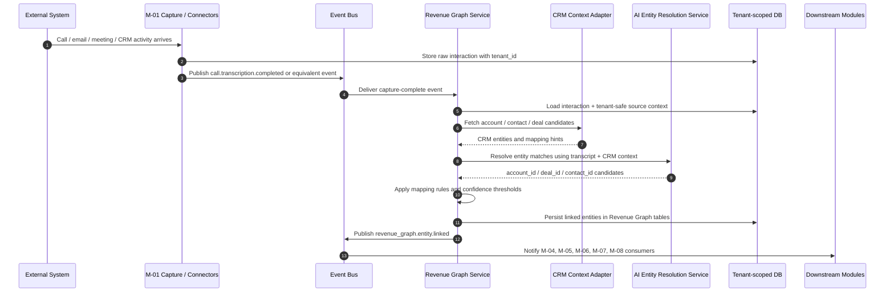
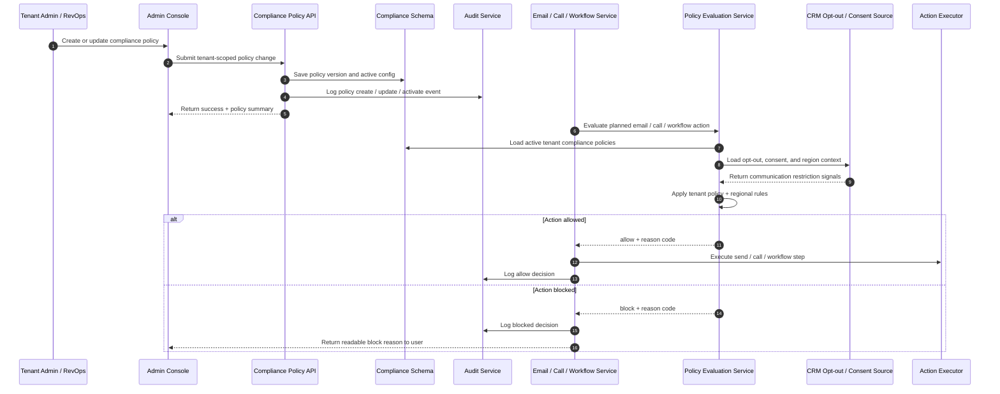
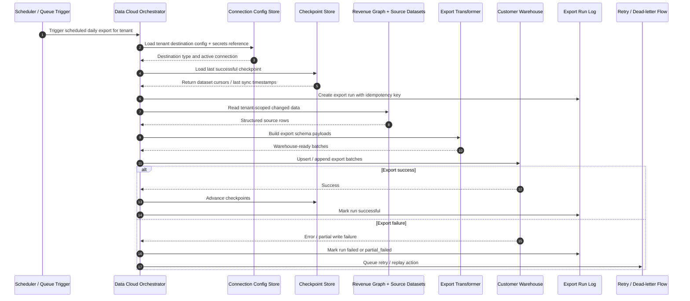
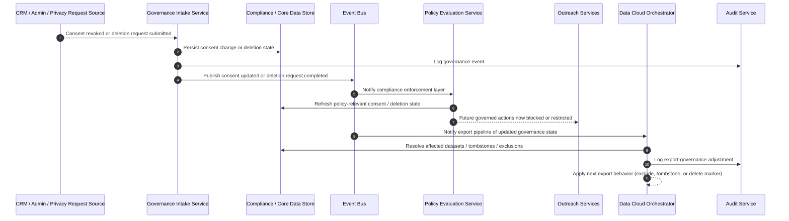

# M10 Flows — Sequence Diagrams

This document contains the key sequence diagrams for the M10 product-facing grouping: **Revenue Graph**, **Configure Compliance Settings**, and **Data Cloud / Data Export**. M10 is grouped together at the product level, but the actual runtime ownership is split: Revenue Graph and Data Cloud align mainly to the model/data platform, while Configure Compliance Settings is a cross-cutting governance capability enforced across platform actions.[1][2]

These flows are written to help backend engineers, QA engineers, PMs, and freshers understand where events begin, where ownership changes, and where enforcement or export decisions are made. The architecture requires event-driven module communication, strict tenant isolation, idempotent jobs, and customer-owned data export without manual Relanto.ai intervention.[2]

## Flow 1 — Captured interaction to Revenue Graph entity linking

This flow shows how raw captured interaction data becomes structured revenue context. The system architecture places Revenue Graph in the model stage, where captured interaction records are cleaned, normalized, and connected to accounts, contacts, deals, and other revenue entities so downstream modules can use business context instead of disconnected raw data.[1][2]

### Notes

- M-01 is the capture entry point and M-03 is the model-stage owner that turns raw interaction records into linked business context.[1][2]
- Downstream modules should consume the published event or public contracts rather than directly querying internal ownership logic, because the platform architecture requires event-driven boundaries between modules.[2]
- Every write must stay tenant-scoped, because the architecture mandates shared PostgreSQL with RLS and no cross-tenant mixing of client data.[2]

## Flow 2 — Admin policy update to outreach enforcement

This flow shows how an admin configuration change becomes a real runtime enforcement decision for email or call actions. The product mapping defines Configure Compliance Settings as admin-configured email and call compliance rules, and the architecture requires the platform to enforce CRM opt-outs and regional policies through shared governance controls.[1][2]

### Notes

- Compliance configuration is not enough by itself; enforcement must happen at runtime immediately before outreach or governed actions execute.[2]
- The main runtime inputs are tenant policy, CRM opt-out state, consent information, and region-aware rules such as GDPR- and CCPA-oriented restrictions.[1][2]
- Audit logging is required both for policy changes and for allow/block decisions, because this feature affects governance-sensitive platform actions.[2]

## Flow 3 — Scheduled Data Cloud export and retry

This flow shows how customer-owned platform data moves to a client-owned warehouse. The product mapping defines Data Cloud as a structured export capability for conversations, deal insights, forecast data, user activity, and AI insights, while the architecture requires daily sync, supported warehouse destinations, idempotent jobs, and customer ownership of exported data.[1][2]

### Notes

- Data Cloud belongs to the customer-ownership story: clients must be able to export all of their data, in full, to supported client-owned destinations such as Snowflake, BigQuery, Databricks, S3, and Redshift.[2]
- Export runs must be idempotent and safe to retry, because the architecture explicitly marks Data Cloud jobs as idempotent and daily sync as the required baseline behavior.[2]
- Source reads and destination writes must remain tenant-scoped, because cross-tenant data access is forbidden across the platform.[2]

## Flow 4 — Consent change or deletion to governance and export enforcement

This flow shows how a consent revocation or deletion request affects both compliance behavior and exported data behavior. The architecture requires client data deletion to be automated, forbids shared-model training use without explicit consent, and treats Configure Compliance Settings plus Data Cloud as enforcement points for customer-controlled data usage.[2]

### Notes

- The architecture explicitly says no AI training pipeline may read client data unless an explicit consent record exists, so consent changes are governance events, not just profile updates.[2]
- Client data deletion must be an automated operation, and future exports must reflect deletion-aware behavior rather than relying on manual cleanup.[2]
- This flow touches both cross-cutting governance and Data Cloud, which is why it should stay in a shared M10 flows document rather than inside only one feature TDD.[2]

## Diagram usage rules

Use these sequence diagrams as **cross-feature flow references**, not as replacements for feature TDDs. The system architecture says feature-specific internal logic belongs in the relevant TDD, while shared infrastructure, data-flow understanding, and module interaction patterns belong in architecture and sequence documentation.[2]

### Recommended mapping

| Diagram | Primary owner | Supporting docs |
|---|---|---|
| Captured interaction to Revenue Graph entity linking | Revenue Graph / M-03 | `tdd-revenue-graph.md` |
| Admin policy update to outreach enforcement | Platform Core / Governance | `tdd-configure-compliance-settings.md` |
| Scheduled Data Cloud export and retry | Data Platform / M-03 | `tdd-data-cloud.md` |
| Consent change or deletion to governance and export enforcement | Shared: Governance + Data Cloud | `tdd-configure-compliance-settings.md`, `tdd-data-cloud.md` |

The best way to maintain M10 documentation is to keep **one README, three feature TDDs, and one shared flows file**. That keeps the product grouping understandable for freshers while preserving the real architecture ownership boundaries needed by engineers and reviewers.[1][2]