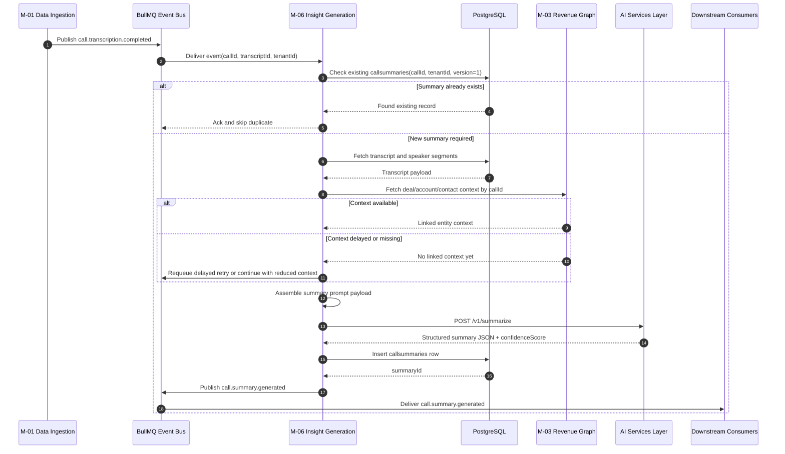
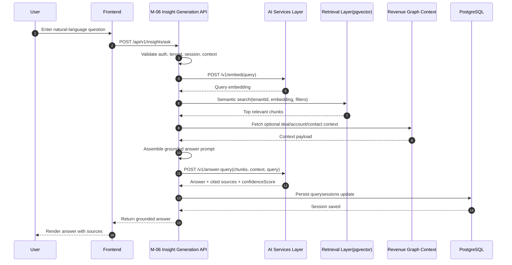
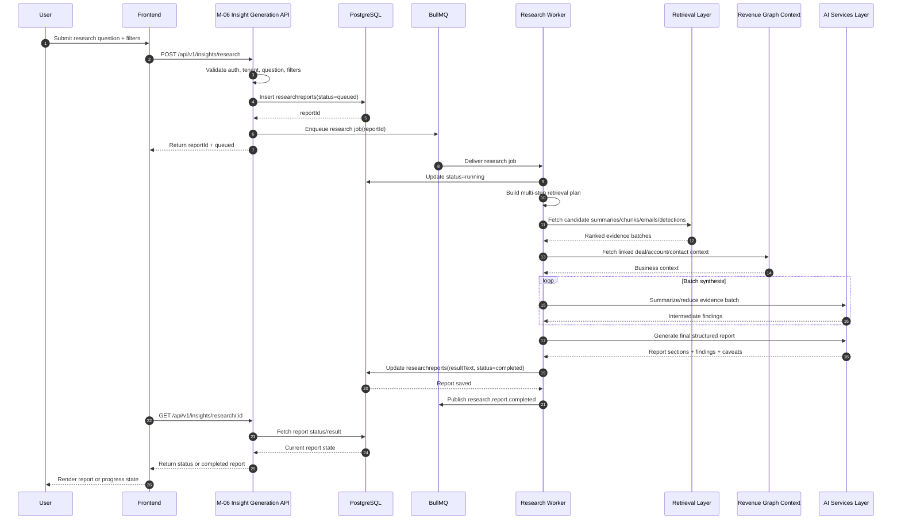
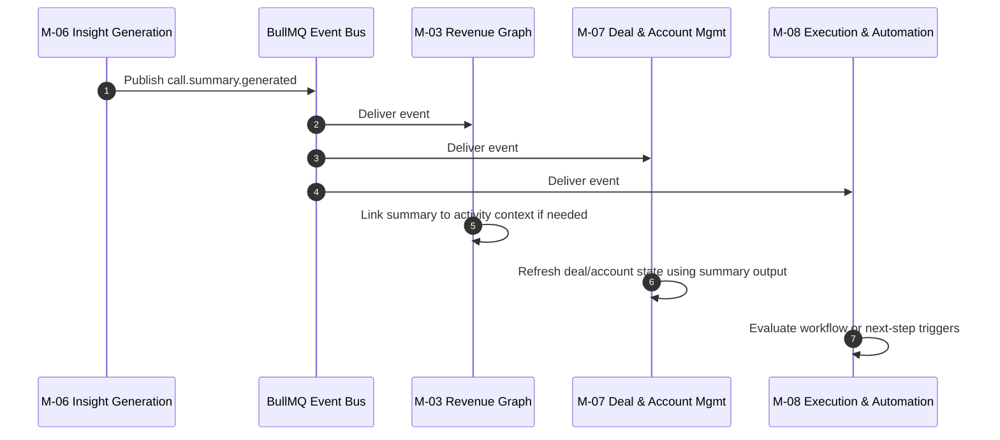
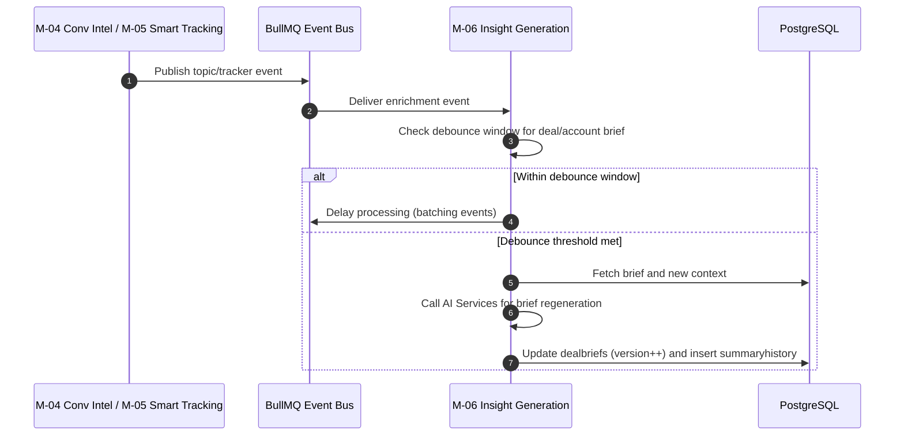

# Doc #14 — Sequence Diagrams: M3 AI Summaries & GenAI

## 1. Purpose

M3 needs sequence diagrams because its flows are not simple request-response handlers. The module sits in the **Analyze** stage, consumes upstream conversation signals, performs retrieval and AI generation, persists generated outputs, and emits downstream events for other modules to use. 

These diagrams are the clearest way to show:
- async event intake
- retrieval-heavy flows
- prompt assembly
- AI service calls
- storage writes
- event emission
- downstream consumption boundaries 

## 2. Diagram Inventory

Recommended files for M3:

- `SD-01-summary-generation.md` — Tracker and topic events to AI Smart Summary to `call.summary.generated`
- `SD-02-ask-anything-rag.md` — User question to Ask Anything retrieval to grounded answer
- `SD-03-deep-research-orchestration.md` — Deep Research job submission to multi-step retrieval and report generation
- `SD-04-summary-generated-downstream.md` — Optional downstream consumption of `call.summary.generated` by later modules 
- `SD-05-deal-brief-enrichment.md` — Topic tag and tracker detection enrichment flows for deal brief refresh

## 3. Standard Template

Use this same structure for every sequence diagram file so the docs stay easy to scan, especially for freshers and new engineers. The goal is to keep each diagram understandable before someone reads the full TDD. 

### Required sections
- Diagram title
- Purpose
- Actors
- Preconditions
- Main sequence
- Alternate paths
- Postconditions
- Failure notes
- Mermaid source 

### Writing rules
- Keep actor names short and stable.
- Show tenant-safe retrieval and storage explicitly when relevant.
- Show the boundary between NestJS product logic and Python AI services clearly.
- Show where async queueing begins and ends.
- Show what is stored and what event, if any, is emitted afterward. 

---

# SD-01 — Summary Generation

## Diagram title
**SD-01 — Tracker and topic events to AI Smart Summary to `call.summary.generated`** 

## Purpose
This diagram shows how M3 generates a call summary after a completed transcript is available and how topic tags and tracker detections enrich downstream summary-aware outputs. It should make clear that summary generation is async, grounded in stored transcript and context data, and ends with both persistence and event emission. 

## Actors
- M-01 Data Ingestion
- BullMQ Event Bus
- M-06 Insight Generation
- PostgreSQL
- M-03 Revenue Graph
- AI Services Layer
- M-05 Smart Tracking
- Downstream consumers (optional display in same diagram or separate SD-04) 

## Preconditions
- `call.transcription.completed` has been published by M-01.
- Transcript exists for the given `transcriptId` and `tenantId`.
- Revenue Graph context may or may not already be linked.
- Topic tags and tracker detections may arrive before or after the summary depending on async timing, but the base summary flow must still work. 

## Main sequence
1. M-01 publishes `call.transcription.completed`.
2. BullMQ delivers event to M-06.
3. M-06 checks idempotency for existing version-1 summary.
4. M-06 fetches transcript from PostgreSQL.
5. M-06 fetches deal/account context from M-03 Revenue Graph.
6. M-06 assembles prompt payload from transcript plus context.
7. M-06 calls AI Services `POST /v1/summarize`.
8. AI Services runs LLM generation and returns structured summary JSON.
9. M-06 stores summary in `callsummaries`.
10. M-06 emits `call.summary.generated`.
11. Downstream modules may consume the event later. 

## Alternate paths
- If Revenue Graph linkage is missing, M-06 waits briefly and retries before proceeding with reduced context.
- If a summary already exists for `callId` version 1, the job is skipped.
- If topic tags arrive later, summary regeneration is not automatic unless explicitly defined by product policy. 

## Postconditions
- `callsummaries` contains a persisted AI-generated summary for the call.
- Summary record is tenant-scoped and versioned.
- `call.summary.generated` is available for downstream consumers. 

## Failure notes
- If PostgreSQL is unavailable, BullMQ retries.
- If AI Services times out, the job retries and eventually moves to failure handling.
- If write fails, the summary is not considered complete and event emission must not happen. 

## Mermaid source

---

# SD-02 — Ask Anything RAG

## Diagram title
**SD-02 — User question to Ask Anything retrieval to grounded answer** 

## Purpose
This diagram shows the synchronous Ask Anything path where a user submits a natural-language question, M3 performs embedding-based retrieval plus contextual grounding, calls the AI answer service, stores the conversation turn, and returns an answer with sources. It should clearly show query intake, retrieval, prompt assembly, AI generation, storage, and response. 

## Actors
- User
- Frontend
- M-06 Insight Generation API
- AI Services Layer
- pgvector / retrieval layer
- PostgreSQL
- Revenue Graph context service 

## Preconditions
- User is authenticated.
- Tenant context is available.
- Session exists or a new session can be created.
- Relevant transcript chunks and embeddings are already stored. 

## Main sequence
1. User submits a question in the frontend.
2. Frontend calls `POST /api/v1/insights/ask`.
3. M-06 validates auth, tenant, question, and context.
4. M-06 calls embedding service for the user query.
5. M-06 runs vector search over relevant chunks with tenant and optional entity filters.
6. M-06 fetches additional business context if needed.
7. M-06 assembles grounded answer prompt with chunks and context.
8. M-06 calls AI Services `POST /v1/answer-query`.
9. AI Services returns grounded answer plus sources.
10. M-06 stores the user/assistant exchange in `querysessions`.
11. M-06 returns answer to frontend. 

## Alternate paths
- If no session exists, M-06 creates one.
- If retrieval is weak, M-06 may still answer with limited confidence and explicit caveats.
- If vector retrieval fails, the system may fall back to text-only or metadata-only retrieval depending on product policy. 

## Postconditions
- User receives a grounded answer.
- Session history is persisted.
- Sources used in the answer are stored with the assistant response. 

## Failure notes
- If embeddings are unavailable, the query cannot use normal RAG retrieval.
- If AI generation fails, the response should return an error-safe failure rather than fabricated output.
- Low-confidence answers should be marked accordingly if the output contract supports it. 

## Mermaid source

---

# SD-03 — Deep Research Orchestration

## Diagram title
**SD-03 — Deep Research job submission to multi-step retrieval and report generation** 

## Purpose
This diagram shows the long-running async orchestration flow for AI Deep Researcher. It should make clear that this feature is not short Q&A; it creates a research job, performs multi-step retrieval and synthesis over large conversation sets, stores a report in `researchreports`, and exposes status/result retrieval through API. 

## Actors
- User
- Frontend
- M-06 Insight Generation API
- PostgreSQL
- BullMQ Worker
- Retrieval layer
- Revenue Graph context layer
- AI Services Layer 

## Preconditions
- User is authenticated and authorized.
- Research question and filters are valid.
- Tenant-scoped source data exists.
- Background worker capacity is available. 

## Main sequence
1. User submits research question and filters.
2. Frontend calls `POST /api/v1/insights/research`.
3. M-06 validates input and creates `researchreports` row with status `queued`.
4. M-06 enqueues research worker job.
5. Worker picks up job and sets status `running`.
6. Worker builds multi-step retrieval plan.
7. Worker retrieves summaries, transcripts, emails, detections, and CRM-linked context in batches.
8. Worker performs intermediate syntheses across batches.
9. Worker calls AI Services for final report assembly.
10. Worker stores final report in `researchreports.resultText`.
11. Worker marks report `completed` and publishes `research.report.completed`.
12. Frontend polls `GET /api/v1/insights/research/:id`.
13. M-06 returns status or final report. 

## Alternate paths
- If the dataset is too broad, retrieval is narrowed using filters and ranking.
- If evidence is sparse, the report is still generated with explicit caveats.
- If worker retries are exhausted, status becomes `failed`. 

## Postconditions
- `researchreports` contains report metadata and final output or failure state.
- User can fetch status and final report later.
- The report remains tenant-scoped and auditable. 

## Failure notes
- Retrieval timeout, AI timeout, or write failure can move the job into retry flow.
- Failed jobs should not appear as completed reports.
- Partial internal progress may exist, but user-facing output should only be shown once completion succeeds. 

## Mermaid source

---

# SD-04 — Summary Event Downstream

## Diagram title
**SD-04 — `call.summary.generated` consumed by downstream modules** 

## Purpose
This optional diagram shows how M3 output becomes useful outside M3. It helps engineers understand that the summary is not the end of the pipeline; it is a handoff point into deal/account management and other downstream workflow modules. 

## Actors
- M-06 Insight Generation
- BullMQ Event Bus
- M-03 Revenue Graph
- M-07 Deal and Account Management
- M-08 Execution and Automation 

## Preconditions
- A call summary has been successfully persisted.
- `call.summary.generated` has been published. 

## Main sequence
1. M-06 emits `call.summary.generated`.
2. BullMQ delivers it to subscribed consumers.
3. M-03 may enrich linked activity context.
4. M-07 refreshes deal health or summary-driven signals.
5. M-08 may use generated insights for next-best-action or workflow logic, where applicable. 

## Alternate paths
- Some consumers may ignore low-confidence or flagged summaries.
- Consumers must be idempotent because the same event can be retried. 

## Postconditions
- Downstream modules receive fresh summary-based context without direct table coupling.
- Event-driven boundaries remain intact. 

## Failure notes
- Consumer failure must not roll back the original summary creation.
- Failed consumers retry independently using BullMQ and DLQ rules. 

## Mermaid source

---

# SD-05 — Deal Brief Enrichment

## Diagram title
**SD-05 — Topic tag and tracker detection enrichment flows for deal brief refresh**

## Purpose
This diagram shows the alternate paths for summary and brief enrichment triggered by `call.topics.tagged` or `tracker.detection.created`. It illustrates how M3 uses debounce rules to avoid regeneration storms when multiple downstream signals arrive in close proximity.

## Actors
- M-04 Conversation Intelligence (topic source)
- M-05 Smart Tracking (tracker source)
- BullMQ Event Bus
- M-06 Insight Generation (Brief refresh worker)
- PostgreSQL

## Main sequence
1. M-04 emits `call.topics.tagged` or M-05 emits `tracker.detection.created`.
2. BullMQ delivers event to M-06.
3. M-06 checks debounce rules for the target deal brief (e.g., waiting 5 minutes for additional related events).
4. Worker queues brief refresh job.
5. Worker runs AI brief regeneration using updated contexts.
6. M-06 updates `dealbriefs` with incremented version and adds to `summaryhistory`.

## Mermaid source

## 4. Diagram Conventions

### Actor naming
Use stable actor names taken from the architecture:
- `M-06 Insight Generation`
- `AI Services Layer`
- `BullMQ Event Bus`
- `PostgreSQL`
- `Revenue Graph`
- `Frontend`
- `User` 

### What every diagram should show
Every M3 sequence diagram should explicitly show:
- intake point, event or API
- validation or idempotency check
- retrieval or context fetch
- prompt assembly
- AI generation call
- DB write
- emitted event or returned response 

### Async boundary rule
When the flow crosses from immediate API handling into queued job processing, show that boundary visibly. This is especially important for summary generation and deep research, because the architecture is strongly event-driven and BullMQ-backed. 

### Ownership rule
Do not draw M3 directly querying tables owned by other modules unless the architecture explicitly allows it. Show cross-module coordination through public API calls or events, not hidden internal table access. 

## 5. Notes for Engineers

These diagrams are not just visuals for presentations. They are implementation guidance for controller, worker, retrieval, prompt-builder, and persistence boundaries inside M3.   
For a fresher, the easiest mental model is: **input comes in, context is gathered, AI generates structured output, data is stored, and the system either responds or emits an event**. That is the recurring pattern across all M3 flows. 

