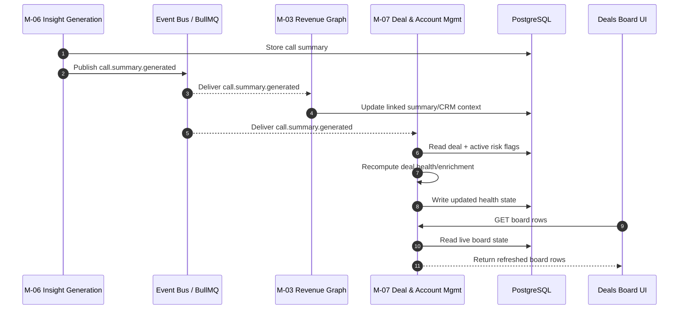
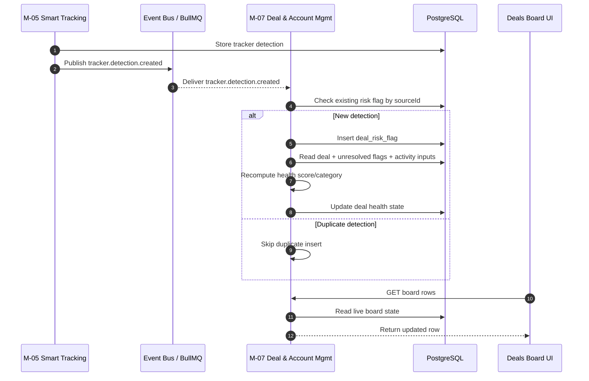
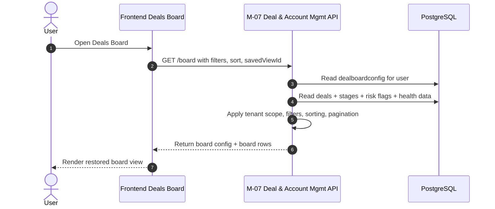
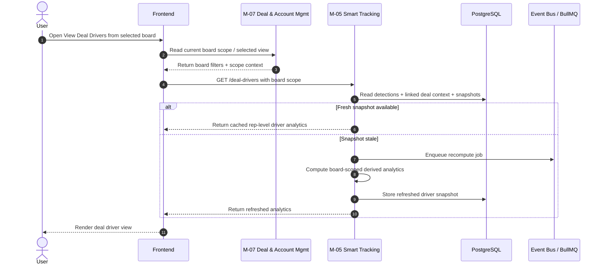

# Doc #14 — Sequence Diagrams for M4

Important mapping note
M4 Deal Intelligence is a product grouping, not a single runtime service. Deals Boards is architecturally served by M-07 Deal and Account Management, while View Deal Drivers is currently served by M-05 Smart Tracking and Search. Sequence diagrams must therefore show the real runtime owners, not only the product grouping. 

---

## SD-01 — Call Summary Generated to Deal Board Enrichment and Board Refresh

### Diagram title
Call summary generated to deal board enrichment and board refresh. 

### Purpose
This diagram shows how a newly generated AI summary contributes to deal enrichment and how the Deals Board later reflects updated health and context. It is an event-driven recomputation flow, not a user-read flow. 

### Actors
- M-06 Insight Generation
- Event Bus / BullMQ
- M-03 Revenue Graph
- M-07 Deal and Account Management
- PostgreSQL
- Frontend Deals Board UI 

### Preconditions
- A call transcript already exists from upstream transcription flow. 
- The call is linked, or linkable, to deal and account context through Revenue Graph. 
- M-06 has generated and stored a structured summary. 
- M-07 board rows read live or near-live deal state from PostgreSQL-backed board data. 

### Main sequence
1. M-06 stores the generated call summary in its summary store. 
2. M-06 publishes `call.summary.generated` with summary ID, call ID, tenant ID, confidence score, and generated timestamp. 
3. M-03 consumes the summary-generated event and updates linked CRM and Revenue Graph context as needed. 
4. M-07 consumes the summary-generated event because board health, risk, and enrichment can depend on newly available summary outputs. 
5. M-07 fetches the current deal state and active unresolved risk flags for the linked deal. 
6. M-07 recomputes health-related derived state using stage, activity recency, unresolved flags, and summary-derived next-step or risk context where applicable. 
7. M-07 writes the refreshed deal health state back to PostgreSQL. 
8. Later, when a user opens or refreshes the Deals Board, the board endpoint reads the latest deal state and shows the updated row. 

### Alternate paths
- If the deal is not yet linked when the summary is created, upstream logic may delay or proceed without full context, and board enrichment catches up after linking is available. 
- If the summary has low confidence, it may be marked for review, but downstream consumers can still decide whether to use or ignore it according to business rules. 

### Postconditions
- The latest deal health data is stored in M-07-owned board-serving tables. 
- The next board read shows updated values without needing a separate manual enrichment step. 

### Failure notes
- If `call.summary.generated` is never published, M-07 never learns about the new summary and the board remains stale. 
- If PostgreSQL write fails during recompute, BullMQ retries apply and board enrichment is delayed, not partially trusted. 
- This flow can fail even when board reads are healthy, because recomputation and rendering are different concerns. 

### Mermaid source

---

## SD-02 — Tracker Detection to Deal Risk Flag Update to Board Row Refresh

### Diagram title
Tracker detection to deal risk flag update to board row refresh. 

### Purpose
This diagram shows how a tracker detection becomes a deal risk flag and eventually changes what users see on the Deals Board. It is the clearest example of event-driven risk recomputation inside the M4 product experience. 

### Actors
- M-05 Smart Tracking and Search
- Event Bus / BullMQ
- M-07 Deal and Account Management
- PostgreSQL
- Frontend Deals Board UI 

### Preconditions
- Smart Tracker detection has already been produced from conversation or email analysis. 
- The detection has tenant, call, and ideally deal context. 
- The target deal exists in M-07 board-serving data. 

### Main sequence
1. M-05 creates a tracker detection record. 
2. M-05 publishes `tracker.detection.created` with detection ID, tracker ID, call ID, tenant ID, deal ID, snippet, confidence score, and detection time. 
3. M-07 consumes the tracker detection event. 
4. M-07 checks whether a risk flag for the same source already exists to preserve idempotency. 
5. If the event is new, M-07 inserts a `deal_risk_flags` row with risk type, severity, source, source ID, and detected timestamp. 
6. M-07 reads current deal state plus unresolved risk flags and activity-derived inputs. 
7. M-07 recomputes the deal health score and category. 
8. M-07 writes the refreshed deal state back to board-serving storage. 
9. On the next board load, the UI receives the updated row with revised health badge and risk indicators. 

### Alternate paths
- If the detection confidence is below product thresholds, the event may still exist but may be filtered from some downstream presentations. 
- If the same detection is delivered twice, the unique or idempotent check prevents duplicate risk-flag insertion. 
- If the detection arrives before deal linkage is complete, M-07 may defer or only partially enrich until the deal context is available. 

### Postconditions
- A new or updated risk flag exists for the deal. 
- The deal health score reflects the latest tracker-driven risk state. 
- The board row becomes consistent with the latest known risk inputs. 

### Failure notes
- If the event bus is delayed, board rows remain readable but stale. 
- If idempotency is implemented incorrectly, duplicate detections can inflate risk state. 
- This flow is separate from board reads, so successful GET responses do not prove risk recomputation is healthy. 

### Mermaid source

---

## SD-03 — User Opens Deals Board with Filters, Sorting, and Saved View Restoration

### Diagram title
User opens Deals Board with filters, sorting, and saved view restoration. 

### Purpose
This diagram shows the synchronous board-read path for the main Deals Board experience. It must stay clearly separate from recompute flows because the board UI may read successfully even when upstream enrichment jobs are stale. 

### Actors
- User
- Frontend Deals Board UI
- M-07 Deal and Account Management API
- PostgreSQL
- Optional M-03 / M-06 read dependencies for enrichment lookups where the endpoint composes additional data 

### Preconditions
- The user is authenticated and tenant context is available. 
- M-07 has existing deal board configuration and board-serving data for the tenant. 
- Deal records, risk flags, and health scores already exist from prior sync and recompute flows. 

### Main sequence
1. The user opens the Deals Board screen. 
2. The frontend loads saved board-view configuration for the user, including columns, visible fields, and filters. 
3. The frontend sends a board-read request with selected filters, sorting, pagination, and saved-view parameters. 
4. M-07 validates tenant and user scope. 
5. M-07 reads `dealboardconfigs`, deals, deal stages, risk flags, and health-related data from PostgreSQL. 
6. M-07 applies filters, sorting, and board shaping rules. 
7. M-07 returns board rows and the restored board configuration. 
8. The frontend renders stage columns, rows, badges, filters, and any saved-view state. 

### Alternate paths
- If no saved view exists, the frontend falls back to the tenant or product default board configuration. 
- If optional enrichment data is temporarily unavailable, the board can still render core deal data and risk state already stored in M-07. 

### Postconditions
- The user sees the board with the expected filters and sort order restored. 
- No recomputation is triggered purely by this read path unless explicitly designed as a separate refresh action. 

### Failure notes
- A board-read failure usually means API, auth, DB, or query-shaping issues. 
- A board-read success does not guarantee freshness of risk flags, summaries, or engagement signals, because those are produced by separate async flows. 

### Mermaid source

---

## SD-04 — User Opens View Deal Drivers from Selected Board to Rep-Level Analytics Computation

### Diagram title
User opens View Deal Drivers from selected board to rep-level analytics computation. 

### Purpose
This diagram shows how the user moves from a selected Deals Board context into View Deal Drivers. It must clearly show that the board defines the input scope, while M-05 owns the derived rep-level analytics computation and delivery. 

### Actors
- User
- Frontend UI
- M-07 Deal and Account Management API
- M-05 Smart Tracking and Search API
- PostgreSQL
- Event Bus / BullMQ, if async recompute is needed before serving fresh results 

### Preconditions
- The user is already in a board context or has selected a board/view definition. 
- Board warning state exists or can be read for the scoped deals. 
- M-05 has access to required detections, linked deal context, and prior driver snapshots. 

### Main sequence
1. The user clicks View Deal Drivers from a selected Deals Board. 
2. The frontend captures board filters, selected scope, and user context. 
3. The frontend requests driver analytics from M-05 using the current board scope as input context. 
4. M-05 validates tenant, user, and scope. 
5. M-05 reads relevant detections, linked deal context, and prior deal-driver snapshot data. 
6. M-05 uses board warnings and scoped deals as the input universe, then computes or refreshes normalized driver analytics at rep level. 
7. M-05 ranks drivers by affected deals, signal counts, severity, or similar summary logic. 
8. M-05 returns rep-level deal driver analytics to the frontend. 
9. The frontend renders the driver view connected to the originating board context. 

### Alternate paths
- If a fresh driver snapshot already exists, M-05 can serve the cached result immediately. 
- If the snapshot is stale, M-05 can trigger async recompute and either return the latest available snapshot with freshness metadata or delay until recompute completes, depending on product policy. 
- If board warnings are unavailable, M-05 should fail clearly or degrade to the latest valid board-scoped snapshot rather than pretending the analytics are fresh. 

### Postconditions
- The user sees rep-level analytics tied to the selected board. 
- The system preserves the rule that View Deal Drivers is not just a raw warning list; it is derived analytics computed from the board-scoped warning universe. 

### Failure notes
- If the board read path is healthy but M-05 recompute is stale, users may enter Deal Drivers successfully but see outdated analytics. 
- If board scope is passed incorrectly, analytics may be mathematically valid but semantically wrong because they were computed on the wrong deal set. 
- This diagram should never collapse M-05 and M-07 into one box, because that hides the real ownership split. 

### Mermaid source

