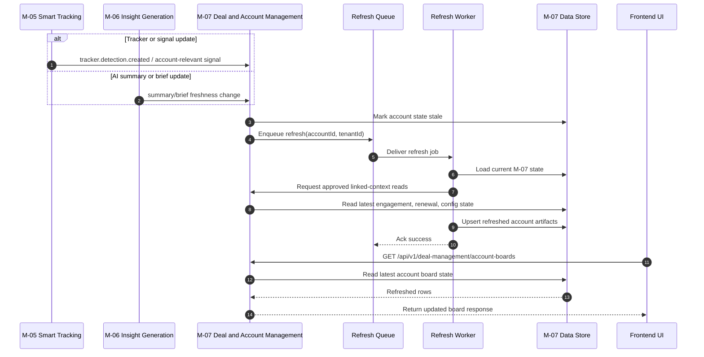
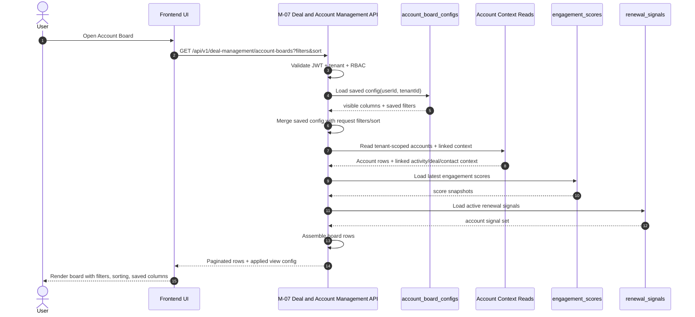
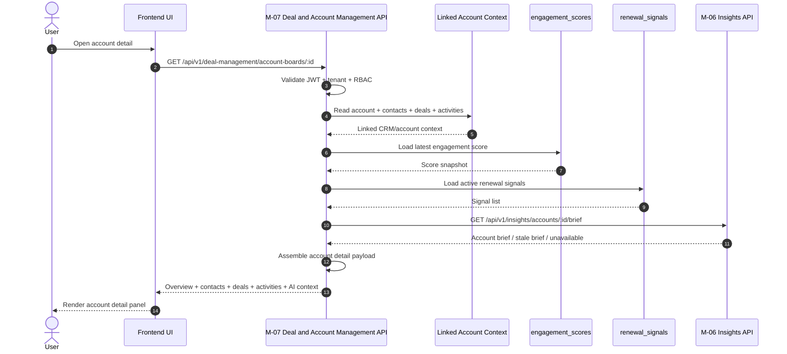

# SD-01 — Upstream Insight Output to Account Board Refresh

## Diagram title

Upstream Insight Output to Account Board Refresh 

## Purpose

This diagram shows how upstream insight changes lead to **async account board refresh** in M5 Account Intelligence, without forcing full recomputation during user read requests.   
The main goal is to keep Account Boards fast at read time while still reflecting newer AI context, engagement signals, and account-level intelligence from upstream modules. 

## Actors

- M-05 Smart Tracking 
- M-06 Insight Generation 
- M-07 Deal and Account Management / Account Boards 
- Refresh Worker / Queue processor in M-07 design layer 
- PostgreSQL tables: `engagement_scores`, `renewal_signals`, `account_board_configs` 
- Frontend Account Board UI 

## Preconditions

- The account is already linked to CRM entities and activities through upstream account context. 
- M-07 has tenant-scoped account board data available for the affected account. 
- Upstream modules have produced new signals, summaries, or account context relevant to the account. 
- Queueing and retry infrastructure is available for async refresh behavior. 

## Main sequence

1. M-05 or M-06 produces new account-relevant insight, such as tracker-derived signal impact or updated AI summary context. 
2. M-07 consumes the relevant upstream change through approved event or refresh-trigger handling rather than direct internal table access. 
3. M-07 marks the affected account row or detail sections as stale. 
4. M-07 enqueues an async refresh job for the affected `tenantId + accountId`. 
5. Refresh worker loads latest linked account context, activity rollups, signal state, and account brief inputs through approved boundaries. 
6. Worker recomputes or refreshes M-07-owned artifacts such as latest engagement score snapshot, renewal signals, and cached account display state. 
7. M-07 stores refreshed state in tenant-scoped records. 
8. The next user read request serves the updated account row or account detail data. 

## Alternate paths

- If multiple upstream changes arrive quickly for the same account, refresh jobs are deduplicated or debounced so the account is refreshed once per short processing window. 
- If only AI brief content changed, M-07 refreshes only AI context freshness metadata and brief-linked state instead of recomputing every engagement component. 
- If only activity recency changed, M-07 refreshes engagement and freshness state without touching unrelated account config data. 

## Postconditions

- The affected account has refreshed board-visible state stored or ready for next-read hydration. 
- Board rows and account detail panels show updated freshness timestamps and latest available signals. 
- No direct cross-module internal access was used; all module boundaries remain intact. 

## Failure notes

- If refresh fails, the last-known account state remains readable, but the row/detail should be marked stale. 
- Retry behavior must be idempotent and follow queue retry + dead-letter handling patterns. 
- If upstream context is incomplete, partial refresh is allowed so the board does not become unavailable. 

## Mermaid source

# SD-02 — User Opens Account Board with Filters, Sorting, and Saved View Restoration

## Diagram title

User Opens Account Board with Filters, Sorting, and Saved View Restoration 

## Purpose

This diagram shows the **read-time hydration path** when a user opens Account Boards and the system restores saved view preferences such as filters, visible columns, and sorting.   
It focuses on fast UI assembly using stored board config plus account-linked data, engagement signals, and AI context summary snippets. 

## Actors

- End User 
- Frontend Account Board UI 
- M-07 Deal and Account Management API 
- `account_board_configs` 
- Account-linked data store / approved account context access path 
- `engagement_scores` 
- `renewal_signals` 

## Preconditions

- User is authenticated with JWT and belongs to a valid tenant. 
- User has permission to view Account Boards under tenant RBAC rules. 
- At least some account-linked data is already available for the tenant. 
- If user has a saved board config, it exists in `account_board_configs`. 

## Main sequence

1. User opens the Account Board page. 
2. Frontend sends `GET /api/v1/deal-management/account-boards` with auth context and optional query params. 
3. M-07 validates JWT, tenant context, and user RBAC access. 
4. M-07 loads the user’s saved account board config, including visible columns and saved filters. 
5. M-07 merges saved config with request-time filters or sorts, where request-time values take precedence. 
6. M-07 loads tenant-scoped account records and linked board context needed for rows. 
7. M-07 joins latest engagement scores and renewal signals for each visible account. 
8. M-07 assembles row payloads including account identity, activity recency, health indicators, prioritization cues, and AI context summary snippets. 
9. M-07 returns paginated board rows to the frontend. 
10. Frontend renders the restored view with filters, sorting, saved columns, and row-level indicators. 

## Alternate paths

- If no saved board config exists, M-07 uses platform defaults for visible columns, sorting, and filters. 
- If a saved filter is invalid due to schema evolution, M-07 drops the invalid part and returns the rest of the view safely. 
- If AI context is stale or missing for some rows, M-07 still returns the rows with partial-state metadata. 

## Postconditions

- The user sees the account board with the correct tenant-scoped rows and restored view settings. 
- The board is usable even if some AI context blocks are stale or absent. 
- The frontend and backend remain aligned on minimum row schema. 

## Failure notes

- If auth or tenant checks fail, the API returns an authorization error without any row data. 
- If account config lookup fails, M-07 should fall back to default view settings instead of failing the entire board load. 
- If account-linked joins are partially missing, M-07 should return partial rows where allowed and emit observability signals for missing joins. 

## Mermaid source

# SD-03 — User Opens Account Detail Panel with CRM Context, Engagement Activity, and AI Context Hydration

## Diagram title

User Opens Account Detail Panel with CRM Context, Engagement Activity, and AI Context Hydration 

## Purpose

This diagram shows the **detail read-time hydration flow** when a user opens one account from the board and the system builds the detailed account workspace view.   
It highlights how CRM-linked context, activity history, engagement state, and AI-generated account brief context come together in one account detail panel. 

## Actors

- End User 
- Frontend Account Detail UI 
- M-07 Deal and Account Management API 
- Linked account/contact/deal/activity context source via approved read path 
- `engagement_scores` 
- `renewal_signals` 
- M-06 Insight Generation API for account brief 

## Preconditions

- User is already authenticated and authorized for the tenant. 
- The account exists and belongs to the active tenant. 
- Linked contacts, deals, and activities are available through approved account context reads. 
- M-06 account brief may be available, stale, or temporarily unavailable. 

## Main sequence

1. User clicks an account row or opens account detail from Account Board. 
2. Frontend calls `GET /api/v1/deal-management/account-boards/:id`. 
3. M-07 validates JWT, tenant scope, and account access permissions. 
4. M-07 loads base account record and linked CRM context such as contacts, deals, and activities. 
5. M-07 loads latest engagement score snapshot and active renewal signals for the account. 
6. M-07 requests latest AI account brief from the approved M-06 public API path or uses latest cached brief metadata if that is the serving pattern. 
7. M-07 assembles the account detail response, including overview, contacts, deals, activity timeline, engagement state, signal list, AI context, and recommended next actions. 
8. Frontend renders the full account detail panel. 

## Alternate paths

- If the M-06 account brief is stale but available, M-07 returns it with freshness metadata and optionally triggers background refresh. 
- If the M-06 account brief is unavailable, M-07 still returns CRM context, engagement activity, and signals with an AI-context-unavailable state. 
- If the account has no linked recent activity, the detail panel still loads with empty-state messaging and a neutral or unknown health state. 

## Postconditions

- The user sees a hydrated account detail panel built from linked CRM context, engagement artifacts, and AI-generated account context where available. 
- The detail panel is readable even if one sub-section is stale or degraded. 
- No unauthorized tenant or cross-account data is exposed. 

## Failure notes

- If the account is not found in tenant scope, return `404` or access failure without leaking account existence across tenants. 
- If contacts or activities are partially missing, M-07 should return the rest of the detail panel with partial-data indicators. 
- If the M-06 call fails, do not fail the entire account detail request unless product explicitly requires AI context to be mandatory. 

## Mermaid source

