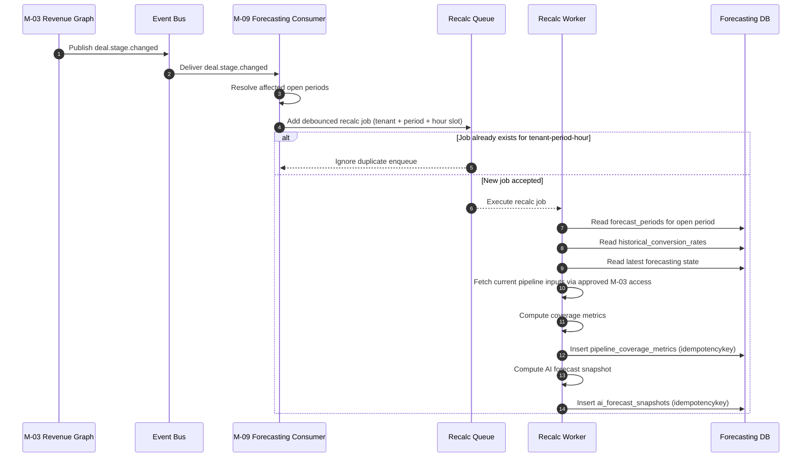
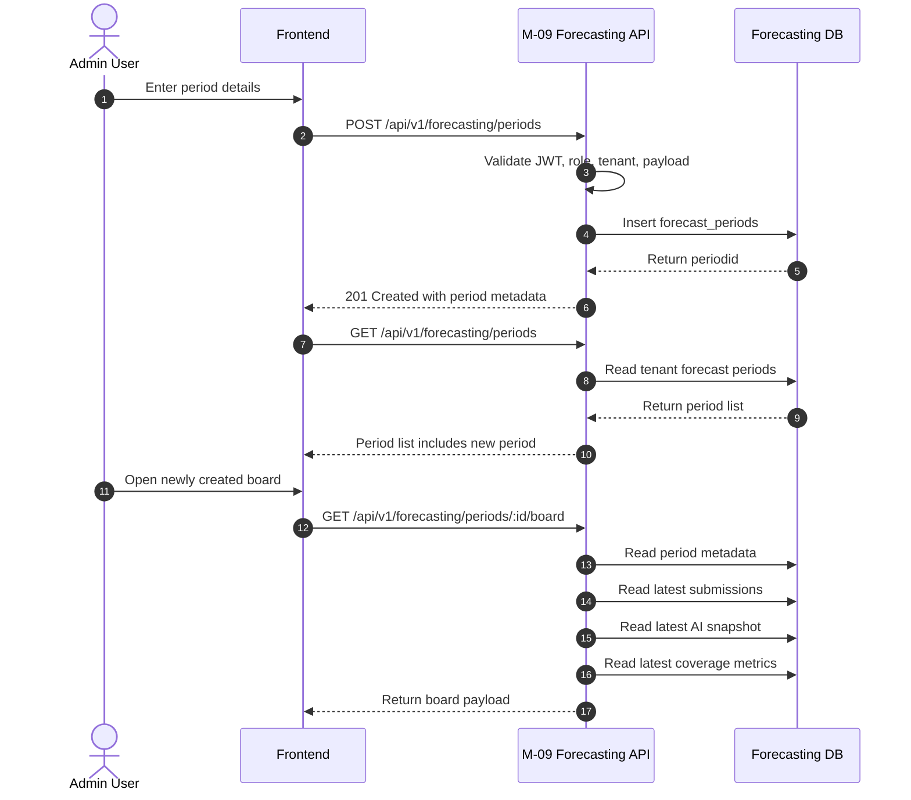
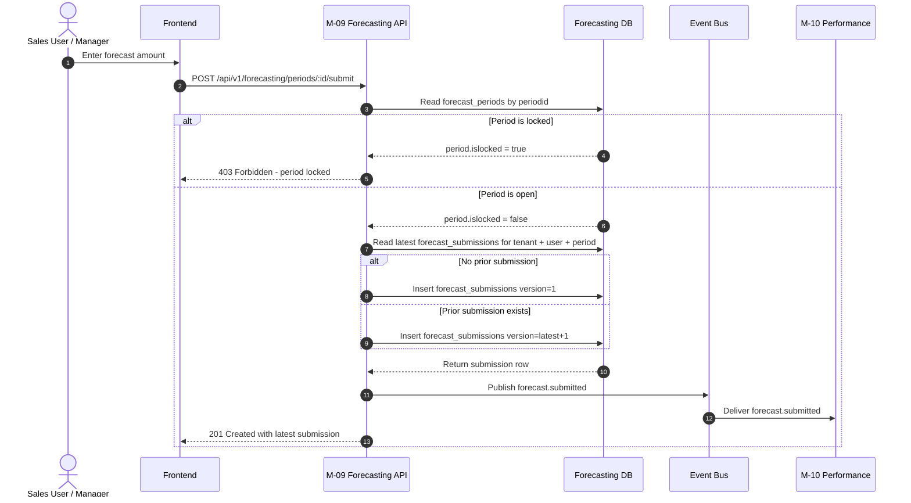
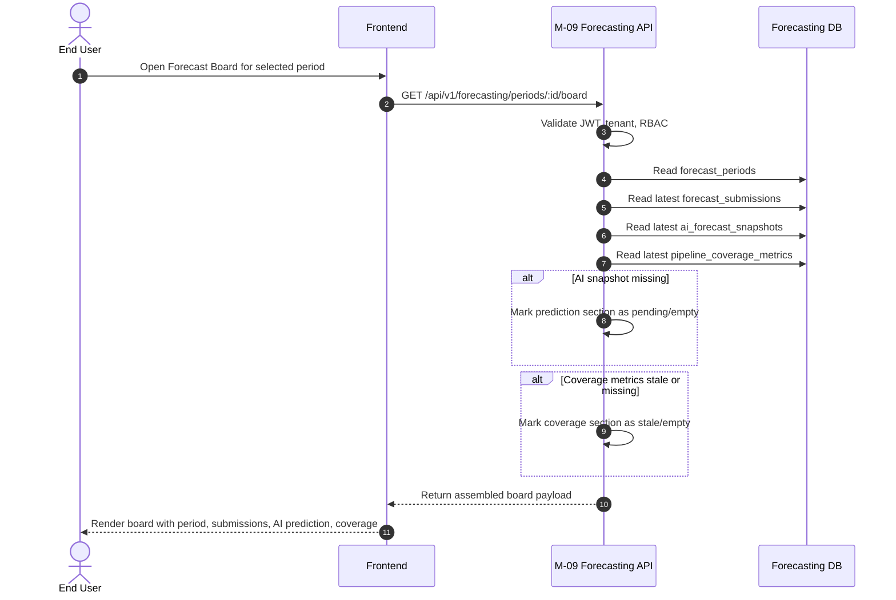

# Doc #14 — Sequence Diagrams for M6 Forecasting Prediction

This document contains the main sequence diagrams for **M6 Forecasting Prediction** / **M-09 Forecasting and Prediction**. The goal is to show the important runtime flows clearly and separately so engineers can distinguish between background recalculation, admin setup actions, submission-time validation, and read-time board loading. 

---

# SD-01 — deal.stage.changed to Coverage Recalculation to AI Forecast Snapshot Refresh

## Diagram Title
**SD-01 — deal.stage.changed to coverage recalculation to AI forecast snapshot refresh** 

## Purpose
This diagram shows the background recalculation flow triggered by upstream pipeline movement. It explains how M-09 reacts to `deal.stage.changed`, batches noisy events, refreshes coverage metrics, and then refreshes AI forecast snapshots for open periods. 

## Actors
- M-03 Revenue Graph 
- Event Bus / Queue 
- M-09 Forecasting API / Event Consumer 
- Recalculation Worker 
- Forecasting Database 

## Preconditions
- At least one forecast period exists for the tenant. 
- The period is open and eligible for recalculation. 
- M-03 has already persisted updated deal stage and value data. 
- Queue worker is healthy and able to process recalculation jobs. 

## Main Sequence
1. M-03 publishes `deal.stage.changed` after a deal-stage update is completed. 
2. M-09 consumes the event and determines which open forecast periods for that tenant are affected. 
3. M-09 generates a debounced recalculation job keyed by tenant, period, and hour slot. 
4. Queue worker executes the recalculation job after the short batching delay. 
5. Worker reads current pipeline state from approved upstream sources. 
6. Worker computes new pipeline coverage metrics and writes `pipeline_coverage_metrics` using an idempotency key. 
7. Worker computes refreshed AI forecast output using current pipeline data and historical conversion rates. 
8. Worker writes a new `ai_forecast_snapshots` row with prediction, confidence range, model inputs, timestamp, and idempotency key. 

## Alternate Paths
- If the same tenant and period already have a recalculation job for the current hourly slot, the new event is absorbed by the debounce mechanism and no duplicate job is added. 
- If a period is locked or no longer open, recalculation for that period is skipped. 
- If only coverage refresh succeeds but prediction refresh fails, the system keeps the latest valid prediction snapshot and retries according to queue rules. 

## Postconditions
- `pipeline_coverage_metrics` contains the latest valid coverage record for the affected period. 
- `ai_forecast_snapshots` contains the latest valid prediction snapshot for the affected period. 
- Forecast Board reads can now show fresher coverage and prediction data. 

## Failure Notes
- Duplicate event delivery must not create duplicate metric or snapshot records because recalculation uses idempotency rules. 
- Queue failure or backlog can delay freshness, so the board may temporarily serve previous valid data. 
- Missing upstream data should fail safely and preserve the last successful snapshot instead of writing misleading zero-value outputs. 

## Mermaid Source

---

# SD-02 — Admin Creates Forecast Period to Board Becomes Available

## Diagram Title
**SD-02 — Admin creates forecast period to board becomes available** 

## Purpose
This diagram shows how a new forecast period is created and then becomes accessible in the board experience. It separates admin period setup from user read-time board loading. 

## Actors
- Admin User 
- Frontend 
- M-09 Forecasting API 
- Forecasting Database 

## Preconditions
- Admin user is authenticated. 
- Admin has permission to create forecast periods. 
- Tenant context is set correctly. 

## Main Sequence
1. Admin opens forecasting setup in the frontend. 
2. Frontend sends `POST /api/v1/forecasting/periods` with period name, date range, and revenue target. 
3. M-09 validates admin access and request payload. 
4. M-09 creates a new `forecast_periods` row with `islocked = false`. 
5. Frontend later calls `GET /api/v1/forecasting/periods` and receives the new period in the period list. 
6. User selects the new period and opens `GET /api/v1/forecasting/periods/:id/board`. 
7. M-09 assembles board data using period metadata plus latest submissions, AI snapshot, and coverage metrics if available. 
8. The Forecast Board becomes visible for that newly created period. 

## Alternate Paths
- If the period is created before initial coverage or AI prediction exists, the board still loads but may show empty or stale-state placeholders for those sections. 
- If the admin creates a future period, it still appears in period listings but may have limited immediate board activity. 

## Postconditions
- A new period exists in `forecast_periods`. 
- The period appears in the period-list endpoint response. 
- The board endpoint can serve a read model for the new period. 

## Failure Notes
- Invalid payload or missing target should reject creation. 
- Unauthorized non-admin users must not be able to create forecast periods. 
- Missing downstream snapshots should not block period creation or board visibility. 

## Mermaid Source

---

# SD-03 — User Submits Forecast Amount with Locked-Period Guard and Version Bump

## Diagram Title
**SD-03 — User submits forecast amount with locked-period guard and version bump** 

## Purpose
This diagram shows the manual forecast submission flow. It highlights locked-period validation, version bump behavior, append-only submission storage, and emission of `forecast.submitted`. 

## Actors
- Sales User / Manager 
- Frontend 
- M-09 Forecasting API 
- Forecasting Database 
- Event Bus 
- M-10 Performance and Coaching 

## Preconditions
- User is authenticated and authorized to submit. 
- Target forecast period exists. 
- Period belongs to the user’s tenant. 

## Main Sequence
1. User enters a forecast amount on the Forecast Board. 
2. Frontend sends `POST /api/v1/forecasting/periods/:id/submit`. 
3. M-09 loads the target period from `forecast_periods`. 
4. M-09 checks the locked-period guard. 
5. If open, M-09 queries the latest existing submission for `(tenantid, periodid, userid)`. 
6. M-09 creates a new `forecast_submissions` row with version `1` for first submit or `latest + 1` for re-submit. 
7. M-09 emits `forecast.submitted` with submission metadata. 
8. M-10 consumes the event for downstream forecast-accuracy and dashboard use cases. 
9. Frontend refreshes the board and shows the new latest version. 

## Alternate Paths
- If this is the user’s first submission for the period, version is `1`. 
- If this is a re-submission, M-09 appends a new row and increments version. 
- If a manager is submitting in their allowed workflow, the same versioning rules still apply. 

## Postconditions
- A new row exists in `forecast_submissions`. 
- The newest version becomes the active visible submission. 
- `forecast.submitted` is available to downstream consumers. 

## Failure Notes
- If the period is locked, submission is rejected with forbidden error and no new row is created. 
- If the period is missing, request fails with not-found behavior. 
- Duplicate downstream event processing must be safe because consumers use submission uniqueness for idempotent handling. 

## Mermaid Source

---

# SD-04 — User Opens Forecast Board with AI Prediction plus Coverage Metrics

## Diagram Title
**SD-04 — User opens Forecast Board with AI prediction plus coverage metrics** 

## Purpose
This diagram shows the read-time board loading flow. It makes clear that board loading is different from submission-time writes and different from background recalculation. 

## Actors
- End User 
- Frontend 
- M-09 Forecasting API 
- Forecasting Database 

## Preconditions
- Target forecast period exists. 
- User is authorized to view the board. 
- At least the period metadata exists, even if coverage or prediction sections are not yet fresh. 

## Main Sequence
1. User selects a forecast period in the UI. 
2. Frontend calls `GET /api/v1/forecasting/periods/:id/board`. 
3. M-09 validates JWT, tenant, and board access. 
4. M-09 reads period metadata from `forecast_periods`. 
5. M-09 reads the latest user/team submissions from `forecast_submissions`. 
6. M-09 reads the latest AI prediction from `ai_forecast_snapshots`. 
7. M-09 reads the latest coverage metrics from `pipeline_coverage_metrics`. 
8. M-09 assembles a board response containing period info, submission state, AI prediction, and coverage metrics. 
9. Frontend renders the spreadsheet-like Forecast Board. 

## Alternate Paths
- If AI prediction is missing, the board still loads with an empty-state or “prediction pending” section. 
- If coverage metrics are stale, the board loads but marks freshness and shows last valid values. 
- If the period is locked, board remains readable but submit controls are disabled in the UI. 

## Postconditions
- User sees the current board state for the selected period. 
- Board can render target progress, latest AI prediction, latest coverage, and current/manual submission data. 

## Failure Notes
- Unauthorized access must be rejected before any tenant data is returned. 
- Partial data availability should degrade gracefully at section level instead of failing the whole board where possible. 
- Stale data should be explicitly labeled so users do not mistake old values for freshly recomputed ones. 

## Mermaid Source

---

# Diagram Usage Notes

These four diagrams should be used together, not interchangeably:
- **SD-01** is the **background recalculation** flow driven by upstream events. 
- **SD-02** is the **admin setup** flow for period creation. 
- **SD-03** is the **write-time submission** flow with lock guard and versioning. 
- **SD-04** is the **read-time board loading** flow for the user-facing Forecast Board. 

This separation is important because M6 behavior is easiest to understand when reads, writes, and async refreshes are shown as different system paths. 

