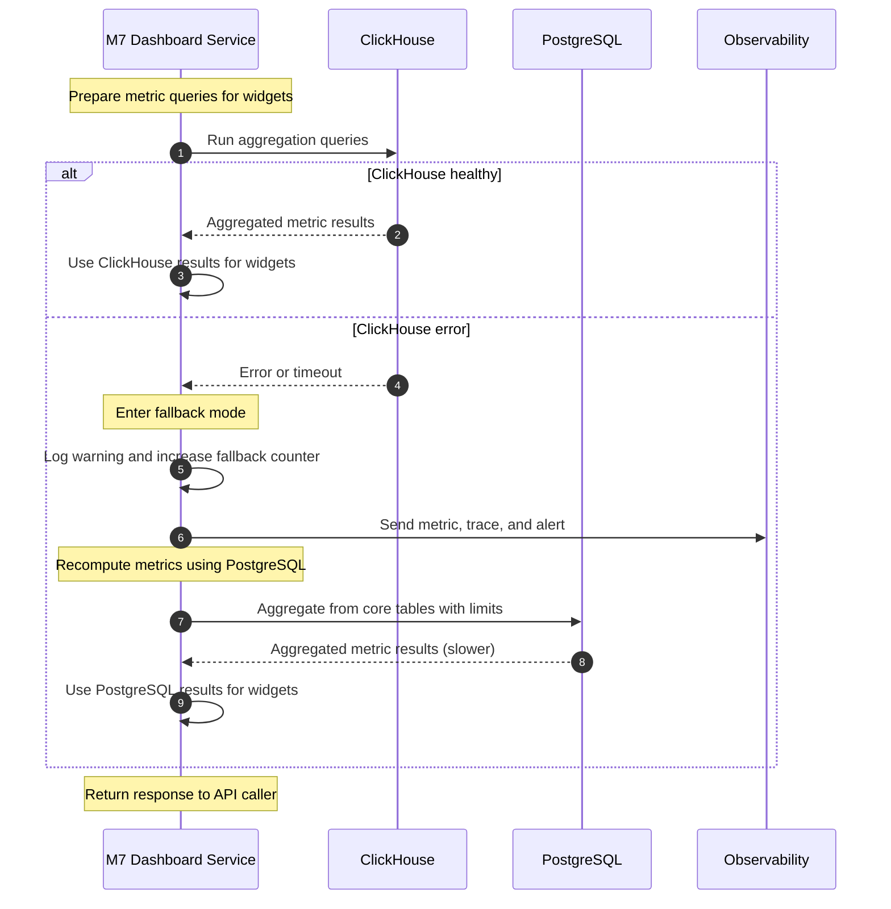

# Sequence Diagram — ClickHouse Fallback to PostgreSQL

This document shows the internal behavior when the dashboard service tries to read metrics from ClickHouse, but ClickHouse is unavailable. Revenue Dashboards must still remain available by falling back to PostgreSQL.

## 1. Actors

- M7 Dashboard Service
- ClickHouse (analytics store)
- PostgreSQL (core + dashboards)
- Observability / Alerts (logging, metrics, alert manager)

## 2. High-Level Description

When computing metrics for one or more dashboard widgets:

1. The M7 Dashboard Service builds aggregation queries for ClickHouse.
2. It calls ClickHouse via the analytics client.
3. If ClickHouse responds successfully, results are used as normal.
4. If ClickHouse errors (connection error, timeout, health check fails):
   - The service logs a warning and increments a fallback metric.
   - It switches to a PostgreSQL query path to recompute the same metrics using core tables.
   - It may restrict time ranges or row counts to keep performance acceptable.
   - It sends an alert via the observability stack to signal ClickHouse issues.
5. The service continues to respond to the API call using PostgreSQL results, keeping dashboards available but potentially slower.

## 3. Mermaid Sequence Diagram

## 4. Key Notes for Engineers

- Fallback is **transparent to the caller** (the API still returns a valid response), but slower.
- The service should:
  - Log a clear message when falling back.
  - Emit metrics for fallback rate.
  - Trigger alerts when fallback rate crosses a threshold, so SREs know ClickHouse is unhealthy.
- PostgreSQL queries in fallback mode should:
  - Use appropriate indexes and reasonable time ranges.
  - Avoid unbounded scans for very large tenants.