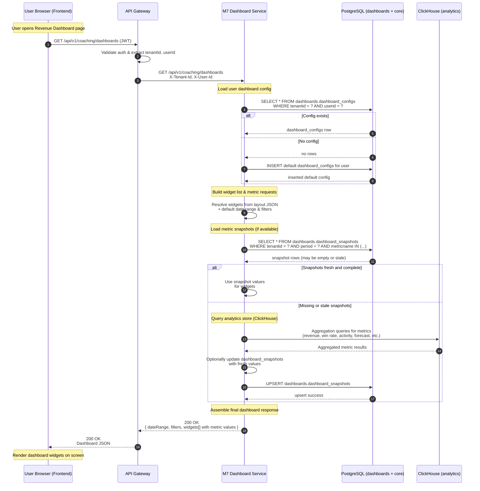

# Sequence Diagram — Dashboard Read Flow

This document shows what happens when a user opens the Revenue Dashboard page and the frontend calls `GET /api/v1/coaching/dashboards`.

## 1. Actors

- User browser / frontend app
- API Gateway (or BFF)
- M7 Dashboard Service (Coaching & Training service)
- PostgreSQL (dashboards schema and upstream schemas)
- ClickHouse (analytics store)
- Auth / Identity provider (for context only)

## 2. High-Level Description

When the dashboard page loads:

1. The frontend calls the dashboards API with the user’s auth token.
2. The gateway validates auth and forwards to the M7 Dashboard Service.
3. The service loads user config (layout, filters, date range) from PostgreSQL.
4. The service resolves widgets and decides which metrics to compute.
5. For each metric, it first tries to read from cached snapshots; if not fresh, it queries ClickHouse.
6. If ClickHouse is healthy, results come from ClickHouse; otherwise it falls back to PostgreSQL (see separate fallback diagram).
7. The service returns a dashboard response to the frontend.

## 3. Mermaid Sequence Diagram

## 4. Key Notes for Engineers

- Frontend never talks directly to ClickHouse or PostgreSQL; only to the dashboards API.
- Dashboard config is **per-tenant, per-user**, backed by `dashboards.dashboard_configs`.
- Snapshots (`dashboards.dashboard_snapshots`) are used to speed up repeated dashboard loads.
- ClickHouse is preferred for heavy aggregations; PostgreSQL is only used as a fallback or to store configuration and snapshots.