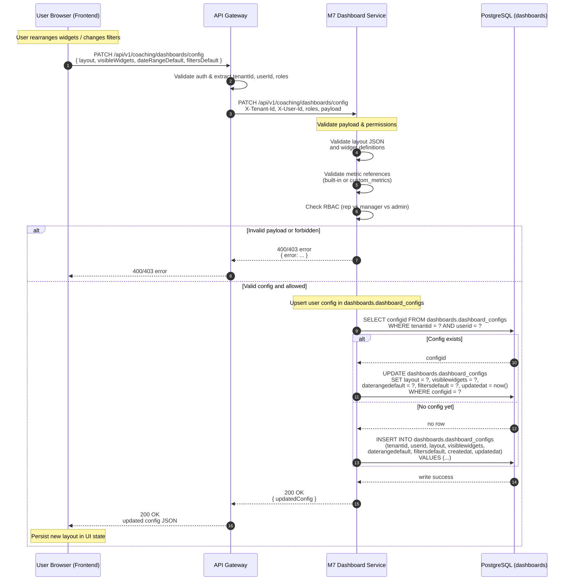

# Sequence Diagram — Save Dashboard Config (Layout + Filters)

This document shows what happens when a user updates their dashboard layout or default filters and the frontend calls `PATCH /api/v1/coaching/dashboards/config`.

## 1. Actors

- User browser / frontend app
- API Gateway (or BFF)
- M7 Dashboard Service
- PostgreSQL (dashboards schema)
- Auth / Identity provider (for context)

## 2. High-Level Description

When a user drags widgets, changes default filters, or updates their default date range:

1. Frontend sends a PATCH request with the new layout and defaults.
2. Gateway validates auth and forwards to M7 Dashboard Service with tenant and user context.
3. Service validates the payload (widget IDs, types, metrics, limits).
4. Service enforces RBAC (user can only edit their own config unless they have admin privileges).
5. Service updates the `dashboards.dashboard_configs` row for that `(tenantid, userid)`.
6. Service returns the updated configuration to the frontend.

## 3. Mermaid Sequence Diagram

## 4. Key Notes for Engineers

- This flow modifies only **configuration**, not metrics or snapshots.
- All writes are scoped by `tenantid` and `userid`; RLS ensures isolation.
- RBAC should prevent a normal user from editing another user’s config or global templates.
- Validation should enforce:
  - Known widget types.
  - Valid metric identifiers.
  - Reasonable limits (e.g., max widgets per dashboard).