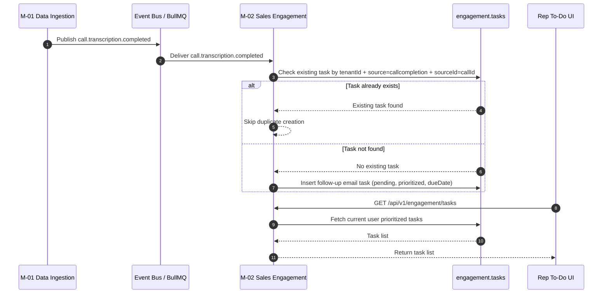
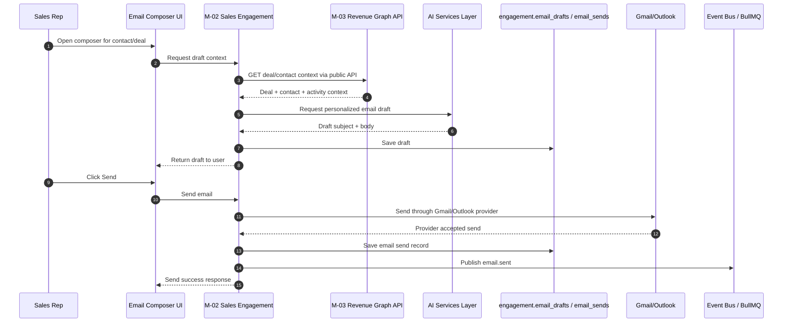
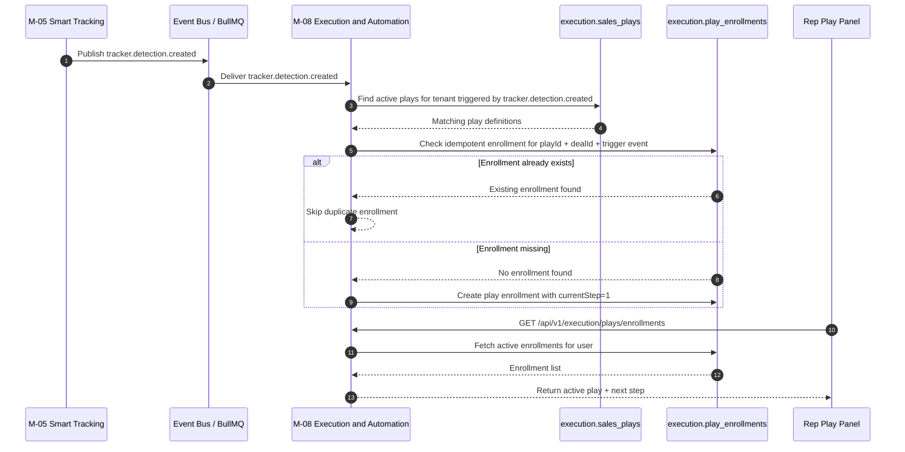
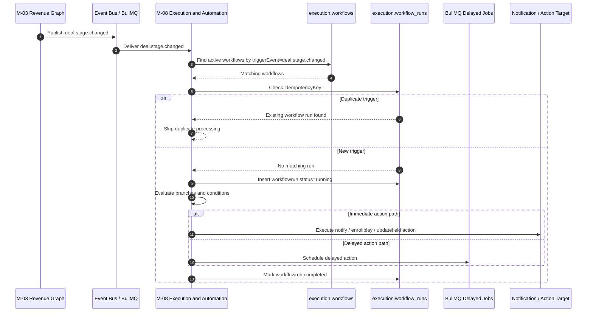
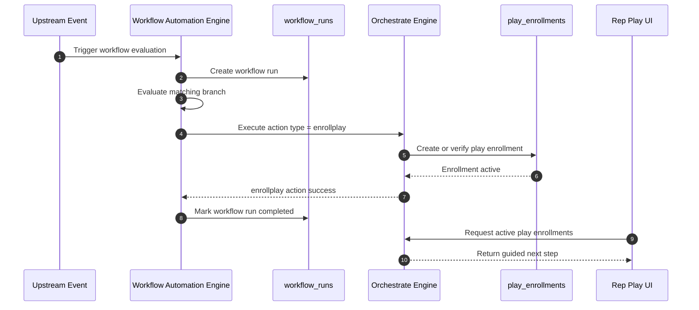

# Sequence Diagrams: M8 Flows

## Purpose

This document captures the main runtime flows for **M8 Sales Engagement** features using sequence diagrams. In product language, M8 includes **Email Composer**, **Engage To-Do**, **Orchestrate**, and **Workflow Automation**, but at the architecture level these features are split across **M-02 Sales Engagement** and **M-08 Execution and Automation**. 

The diagrams below focus on the most important end-to-end behaviors that a developer or fresher needs to understand before building inside this area. They follow the SAD event model and keep cross-module communication event-driven wherever the architecture requires it. 

## Boundary Reminder

- **M-02 Sales Engagement** owns:
  - Email Composer 
  - Engage To-Do 

- **M-08 Execution and Automation** owns:
  - Orchestrate 
  - Workflow Automation 

- **M8 Sales Engagement** is the product grouping only. It is **not** one backend module. 

## Flow List

This file includes the core flows:
1. Post-call follow-up task creation in Engage To-Do. 
2. Draft and send email using Email Composer. 
3. Auto-enroll a deal into Orchestrate from tracker detection. 
4. Trigger Workflow Automation from deal stage change. 
5. Orchestrate + Workflow Automation interaction boundary. 

---

## Flow 1: Post-call follow-up task creation

This is one of the most important M8 flows because the SAD explicitly states that **M-02 consumes `call.transcription.completed`** and creates an AI-suggested follow-up email task for the call owner, with an idempotency guard that skips duplicate task creation for the same `sourceId = callId`. 

### Notes

- Producer: `call.transcription.completed` comes from **M-01 Data Ingestion**. 
- Consumer: **M-02 Sales Engagement** consumes that event. 
- Required behavior: create follow-up task **idempotently** so retries do not create duplicates. 

---

## Flow 2: Draft and send email using Email Composer

Email Composer belongs to **M-02 Sales Engagement** and supports composing, sending, and scheduling AI-personalized emails. The SAD also allows **M-02** to call the **M-03 Revenue Graph public API** for real-time context lookup, which is one of the few documented synchronous cross-module exceptions. 

### Notes

- **M-02 emits `email.sent`** after successful send persistence. 
- Downstream consumers of `email.sent` include **M-03**, **M-05**, and **M-07**. 
- This flow is primarily synchronous from the user’s point of view, but the downstream impact after `email.sent` is event-driven. 

---

## Flow 3: Auto-enroll Orchestrate play from tracker detection

Orchestrate belongs to **M-08 Execution and Automation** and reacts to event signals such as `tracker.detection.created`. The SAD says M-08 evaluates configured logic from these signals and uses them for play enrollment and next-best-action behavior. 

### Notes

- Producer: **M-05 Smart Tracking** emits `tracker.detection.created`. 
- Consumer: **M-08 Execution and Automation** consumes it. 
- This flow belongs to **Orchestrate**, not Workflow Automation, because the main output is **guided play enrollment** rather than generalized branch execution. 

---

## Flow 4: Trigger Workflow Automation from deal stage change

Workflow Automation also belongs to **M-08**, but unlike Orchestrate, it focuses on **complex branching automation**. The SAD says `deal.stage.changed` is consumed by M-08, and workflow runs should be tracked using `workflowruns` with a unique `idempotencyKey` to prevent duplicate trigger execution. 

### Notes

- Producer: `deal.stage.changed` is published by **M-03 Revenue Graph** in the event registry. 
- Consumers: **M-08** and **M-09** consume it. 
- Workflow Automation must remain **retry-safe** and **idempotent** because BullMQ retries can redeliver events. 

---

## Flow 5: Orchestrate and Workflow Automation boundary

Freshers often confuse these two because both live in **M-08** and both can react to the same signal family. This sequence shows the correct separation: **Workflow Automation** can trigger an `enrollplay` action, but the actual **play enrollment** still belongs to the Orchestrate side of M-08. 

### Notes

- **Workflow Automation** decides whether an action should happen. 
- **Orchestrate** owns the play model and enrollment records. 
- Keeping these concerns separate avoids turning Workflow Automation into a duplicate play engine. 

---

## Ownership cheat sheet

| Flow | Primary Feature | Owner Module | Main Trigger |
|---|---|---|---|
| Post-call follow-up task creation | Engage To-Do  | M-02  | `call.transcription.completed`  |
| Draft and send email | Email Composer  | M-02  | User action, then `email.sent` emitted  |
| Play enrollment from tracker signal | Orchestrate  | M-08  | `tracker.detection.created`  |
| Branching automation from stage change | Workflow Automation  | M-08  | `deal.stage.changed`  |
| Workflow triggers play enrollment | Workflow Automation + Orchestrate  | M-08  | Branch action `enrollplay`  |

## Event cheat sheet

The most relevant event names for M8 flows are:
- `call.transcription.completed` 
- `email.sent` 
- `tracker.detection.created` 
- `deal.stage.changed` 
- `call.summary.generated` 
- `insight.summary.ready` was added during architecture review as a missing event that M-08 may depend on in future or extended flows. 

## Developer rules

- Never treat **M8** as one backend code module. Map each flow to **M-02** or **M-08** first. 
- Use **events or approved public APIs**, not direct cross-schema reads. 
- Make all event consumers **idempotent**. 
- Keep **business logic in TypeScript** product services and **AI inference in Python** AI services. 
- If you add a new event to any sequence diagram, first ensure it exists in the formal event registry. The SAD is explicit that unregistered queue names should not be introduced casually. 