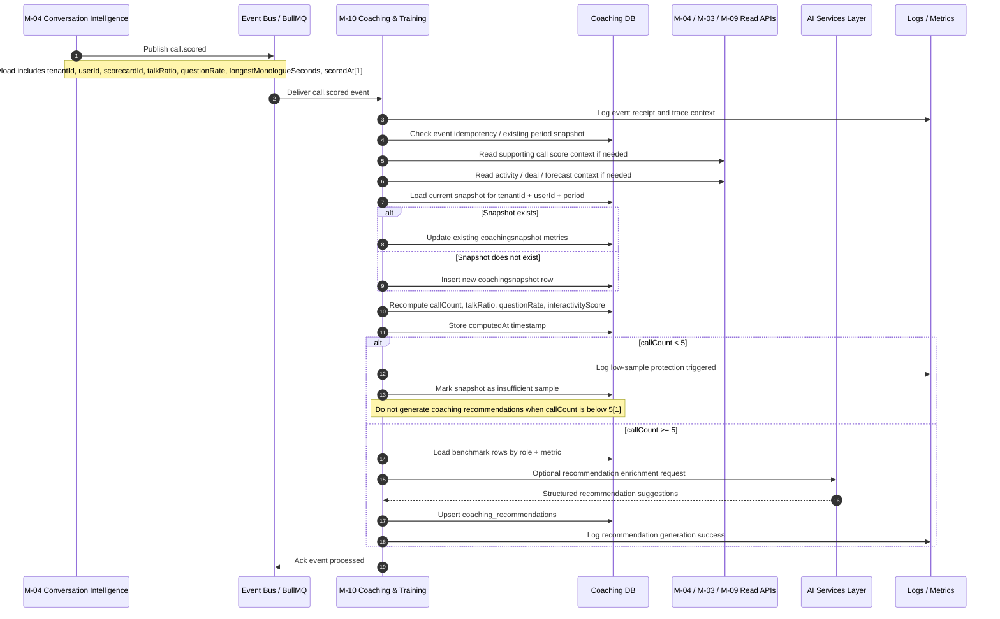
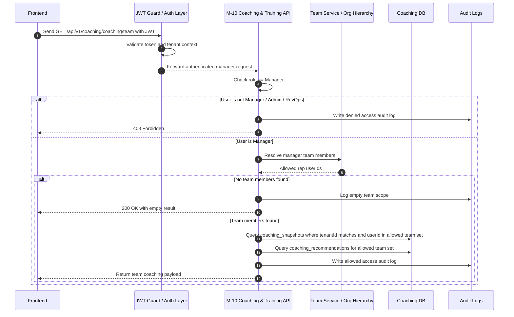
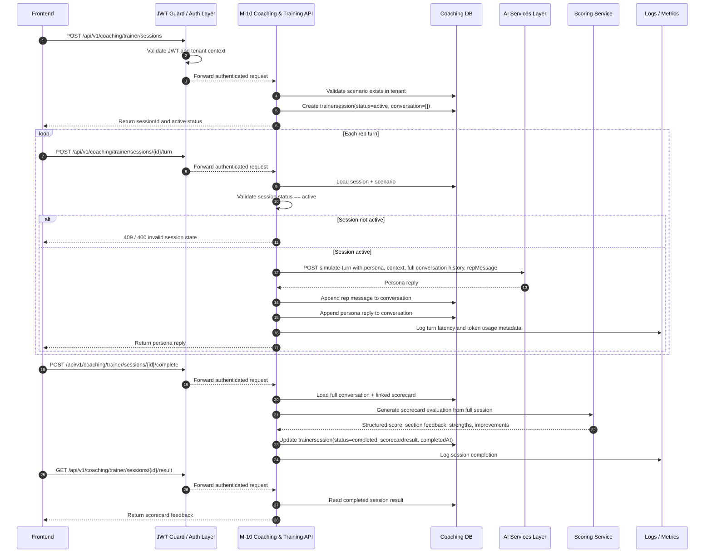
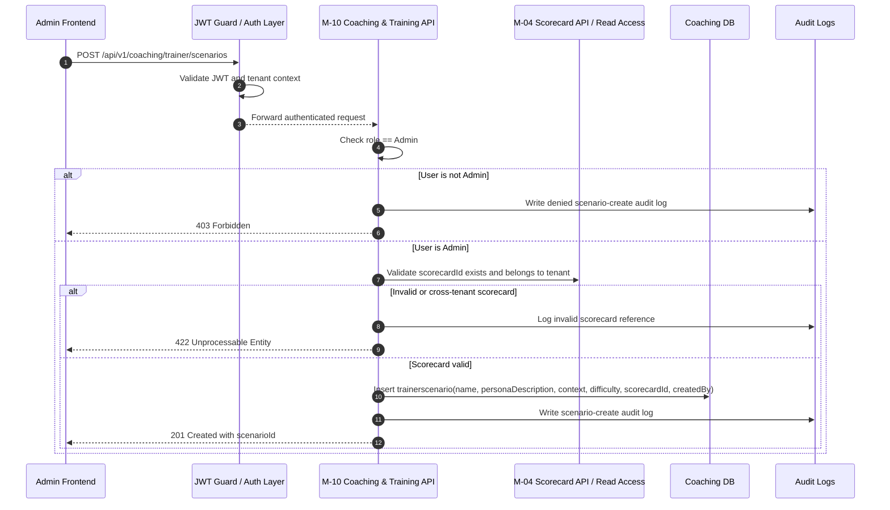

# Sequence Diagrams: M9 Flows

## 1. Document Control

| Field | Value |
|---|---|
| Document Title | Sequence Diagrams - M9 Flows |
| Product Module Name | M9 Coaching Training |
| Architecture Owner Module | M-10 Coaching and Training |
| Lifecycle Stage | Optimize |
| Document Type | Sequence Diagram Document |
| Version | v1.0 |
| Status | Draft for implementation |
| File Path | `docs/modules/m09/Sequence Diagrams: M9 flows.md` |
| Covered Features | Sales Coaching Insights, AI Trainer |

## 2. Purpose

This document captures the main runtime flows for M9 Coaching Training, whose architecture owner is M-10 Coaching and Training.   
It focuses on the most important sequences for Sales Coaching Insights and AI Trainer so engineers can implement event handling, APIs, RBAC, persistence, and AI interactions correctly. 

These sequence diagrams are written in Mermaid so they can be rendered directly in Markdown-friendly documentation tools.

## 3. Covered Flows

This document includes:
- `call.scored` event to coaching snapshot update to recommendation generation. 
- Manager opens team coaching view with RBAC check. 
- User starts AI Trainer session, sends turns, receives persona replies, and completes scoring. 
- Admin creates trainer scenario with linked scorecard and persona definition. 

---

## 4. Flow 1: Call Scored to Coaching Snapshot Update

### 4.1 What this flow shows

This flow shows how M-10 consumes the `call.scored` event from M-04, updates the rep coaching snapshot, applies the low-sample guard, and generates coaching recommendations when the sample is reliable.   
The architecture states that `call.scored` is consumed by M-10 and that coaching recommendations must not be generated when `callCount < 5`. 

### 4.2 Mermaid diagram

### 4.3 Implementation notes

Important implementation points:
- `call.scored` is published by M-04 and consumed by M-10. 
- The event payload includes user-level scoring fields such as talk ratio, question rate, and longest monologue seconds. 
- Snapshot writes must be idempotent and update the existing period row instead of inserting duplicates. 
- Recommendation generation must be skipped when the sample is too small. 

---

## 5. Flow 2: Manager Opens Team Coaching View

### 5.1 What this flow shows

This flow shows how a manager opens the team coaching page, how RBAC is enforced, and how M-10 returns only the coaching snapshots for reps on that manager’s team.   
The architecture explicitly states that reps can see only their own coaching data, managers can see only reps on their team, and admins or RevOps can view all. 

### 5.2 Mermaid diagram

### 5.3 Implementation notes

Important implementation points:
- The architecture defines `GET /api/v1/coaching/coaching/team` as the manager team coaching endpoint. 
- RBAC must be enforced in backend code, not just the frontend. 
- Team membership must be resolved before querying coaching data. 
- All queries must remain tenant-scoped. 

---

## 6. Flow 3: AI Trainer Session

### 6.1 What this flow shows

This flow shows a rep starting a trainer session, sending multiple turns, receiving persona replies, and completing the session for scorecard-based feedback.   
The architecture says each trainer turn sends full conversation history plus persona and context to the AI service, then appends both the rep message and persona reply back into the session. 

### 6.2 Mermaid diagram

### 6.3 Implementation notes

Important implementation points:
- The architecture defines `POST /api/v1/coaching/trainer/sessions`, `POST /api/v1/coaching/trainer/sessions/:id/turn`, and `GET /api/v1/coaching/trainer/sessions/:id/result`. 
- Each turn must include the full conversation history sent to the AI service. 
- Session states include `active`, `completed`, and `abandoned`. 
- Final feedback is tied to a linked scorecard and stored as structured result data. 

---

## 7. Flow 4: Admin Creates Trainer Scenario

### 7.1 What this flow shows

This flow shows how an admin creates a trainer scenario with persona definition, context, difficulty, and a linked scorecard.   
The architecture stores scenario definitions in `trainer_scenarios` and exposes an admin API to create them. 

### 7.2 Mermaid diagram

### 7.3 Implementation notes

Important implementation points:
- The architecture defines `POST /api/v1/coaching/trainer/scenarios` as an admin endpoint. 
- A scenario includes `name`, `personadescription`, `context`, `difficulty`, `scorecardid`, and `createdby`. 
- The linked scorecard must be validated in the same tenant before saving the scenario. 
- Scenario creation should be audit logged because it changes training behavior for users.

---

## 8. Cross-Flow Rules

These rules apply across all diagrams:
- M9 is the product-facing package name, while the architecture owner is M-10 Coaching and Training. 
- M-10 is a terminal module and does not emit downstream lifecycle events. 
- All reads and writes must be tenant-scoped. 
- RBAC must be enforced server-side. 
- AI inference must happen through internal AI services, while product business logic remains in TypeScript. 

## 9. Developer Notes

For implementation:
- Keep event handling idempotent for coaching snapshot updates. 
- Keep trainer sessions stateful in M-10 and AI turn simulation stateless in the AI service. 
- Use full conversation history for every trainer turn. 
- Apply low-sample protection before generating coaching recommendations. 
