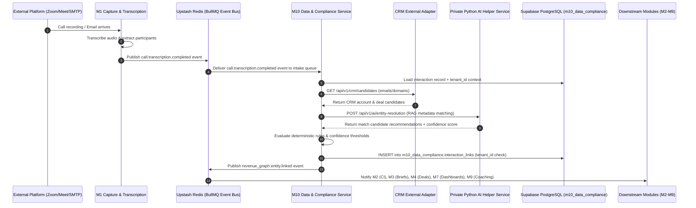
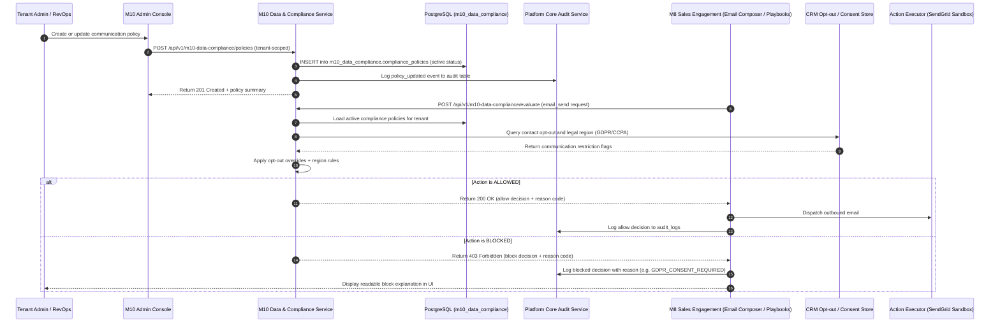
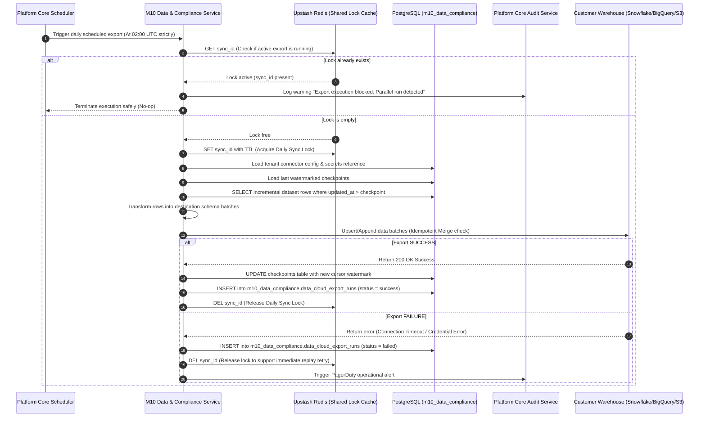
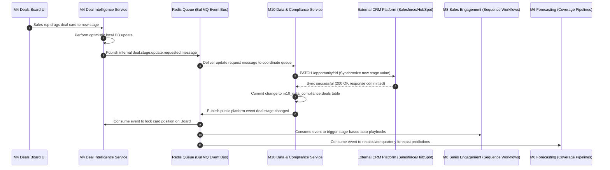

# M10 Flows — Sequence Diagrams

| Field | Value |
| --- | --- |
| **Document ID** | Doc #11-Seq |
| **Module** | M10 Data & Compliance |
| **Technical Workspace** | `modules/m10-data-compliance/` |
| **Canonical API Prefix** | `/api/v1/m10-data-compliance` |
| **Owned Table Schema** | `m10_data_compliance` |
| **Status** | Approved |
| **Version** | v3.0 |
| **Last Updated** | 2026-05-18 |
| **Owner** | Technical Architecture Team & Relanto Engineering |

---

## 1. Introduction

This document houses the core sequence diagrams for the unified **M10 Data & Compliance** monorepo package workspace (`modules/m10-data-compliance/`). 

These flows represent the runtime boundaries between **M10**, the platform core, and peer modules. They enforce key architectural rules, including:
*   **Separation of TypeScript Logic and Python AI helper services**
*   **Decoupled event-driven module borders using BullMQ**
*   **Row-Level Security (RLS) database isolation**
*   **The Deals Board Stage-Change Pattern (ADR-005)**
*   **The Daily Synchronization Lock (02:00 UTC sync_id Redis key)**

---

## 2. Sequence Flows

### Flow 1 — Captured Interaction to Revenue Graph Entity Linking

This flow demonstrates how raw interaction recordings are converted into structured business relationships without direct cross-module database coupling.

### Flow 2 — Admin Policy Update to Outreach Enforcement

This flow details how compliance rules are administered and subsequently enforced at runtime prior to dispatching outbound communications.

### Flow 3 — Scheduled Data Cloud Export with Daily Sync Lock

This flow maps the scheduled daily extraction of platform records to client-owned destinations, showing the critical **02:00 UTC Redis sync_id lock** prevention check.

### Flow 4 — Deals Board Stage-Change Pattern (ADR-005)

This flow documents how UI-triggered pipeline stage updates are coordinated through M10 to maintain CRM synchronization integrity.

---

## 3. Diagram Usage & Review Guidelines

*   **Engineering Implementation Reference**: Developers building M10 backend controllers must structure their code to support the exact event contracts and asynchronous boundaries outlined in these diagrams.
*   **At-Least-Once Delivery**: Downstream modules consuming `revenue_graph.entity.linked` or `deal.stage.changed` must implement standard idempotency checks to tolerate duplicate event deliveries safely.
*   **Doppler Secrets Context**: Database adapters and CRM integration services depicted in Flows 1, 2, and 3 must retrieve their API keys and connection strings dynamically via Doppler secrets mapping, never referencing plaintext strings in code.