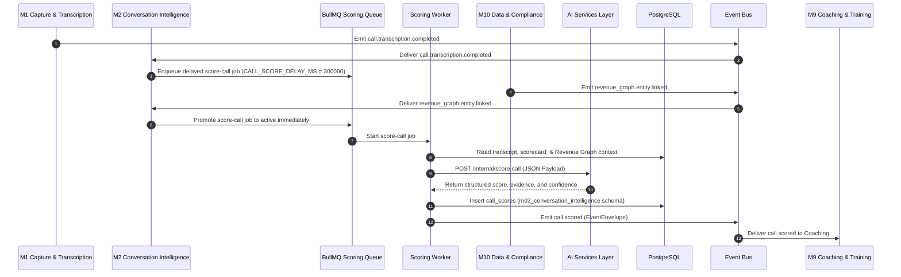
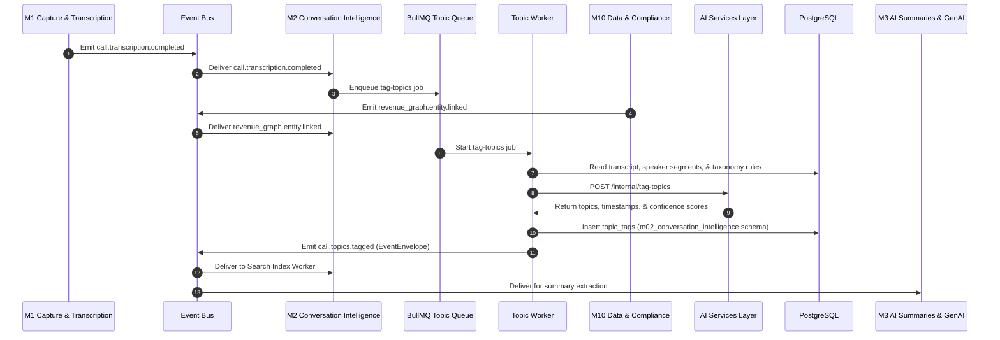
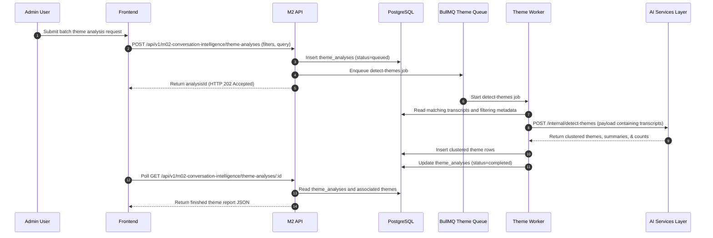
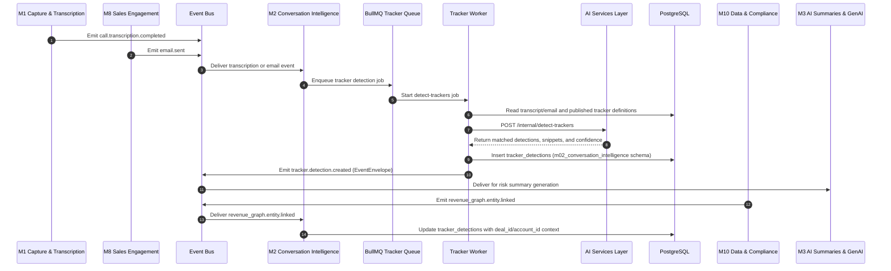
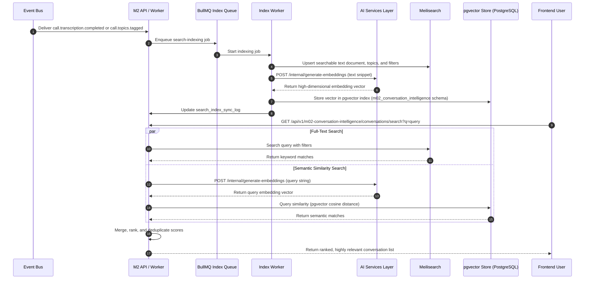
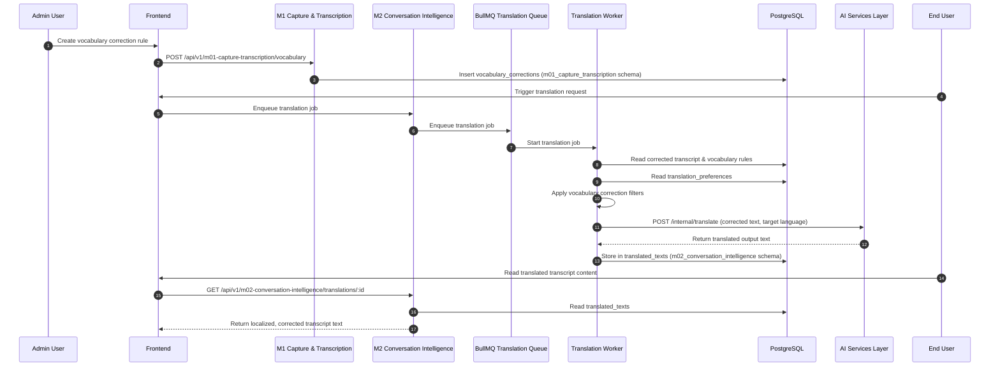

# Doc #14 — Sequence Diagrams for M2 Conversation Intelligence

This document defines the approved sequence diagrams for the **M2 Conversation Intelligence** module. All workflows within this module are designed to be **asynchronous, event-driven, and resilient**. Every flow illustrates the upstream event or request, queue handoff, background worker execution, private AI service call, PostgreSQL/Meilisearch persistence, and downstream event publication.

---

## SD-01 — Revenue Graph Event to AI Call Reviewer to `call.scored`

### Purpose
This diagram shows how a completed call transcript is evaluated and scored by the AI Call Reviewer once Revenue Graph context becomes available from M10. The scoring worker enqueues the transcript upon M1 completion but waits up to 5 minutes for entity linkage context to select the correct deal-specific or account-specific scorecard template before persisting the final call score.

### Actors
- **M1** (Capture & Transcription) — Upstream transcript generator.
- **M10** (Data & Compliance / Revenue Graph) — Centralized data sync and CRM relationship owner.
- **M2** (Conversation Intelligence / BullMQ) — Message queue and worker engine.
- **AI Services Layer** — Python FastAPI microservice (`POST /internal/score-call`).
- **PostgreSQL** — Stores scorecard metadata and results in the `m02_conversation_intelligence` schema.
- **Event Bus** — Standard event router.
- **M9** (Coaching & Training) — Downstream consumer of scored call metrics.

### Preconditions
- A call transcript exists and has been successfully recorded in PostgreSQL.
- At least one active scorecard is configured for the tenant.
- BullMQ workers are running.

### Mermaid Sequence Diagram

---

## SD-02 — Revenue Graph Event to AI Topic Tagger to `call.topics.tagged`

### Purpose
This diagram shows how M2 tags a call transcript with structured, high-accuracy discussion topics (e.g. pricing, competitor, product issues) after transcription completes. This tagging enriches Meilisearch indexes and allows downstream filters to work.

### Actors
- **M1** (Capture & Transcription) — Upstream transcript generator.
- **M10** (Data & Compliance) — Upstream Revenue Graph entity router.
- **M2** (Conversation Intelligence / BullMQ) — Message queue and topic tagging worker.
- **AI Services Layer** — Python FastAPI microservice (`POST /internal/tag-topics`).
- **PostgreSQL** — Stores topic tags in `m02_conversation_intelligence.topic_tags`.
- **Event Bus** — Standard event router.
- **M3** (AI Summaries & GenAI) — Downstream consumer for taxonomy search indexing.

### Mermaid Sequence Diagram

---

## SD-03 — Batch Theme Analysis Flow (AI Theme Spotter)

### Purpose
This diagram shows the asynchronous batch theme analysis process. A user triggers theme clustering across many calls via the API, which runs as a long-running background job via BullMQ.

### Actors
- **Admin User** — Initiates the batch theme spotter request.
- **Frontend** — Captures inputs and polls for results.
- **M2 API** — Exposes `/api/v1/m02-conversation-intelligence/theme-analyses`.
- **PostgreSQL** — Stores theme data in `m02_conversation_intelligence.theme_analyses` & `themes`.
- **BullMQ Theme Queue** — Manages job persistence.
- **AI Services Layer** — Python FastAPI microservice (`POST /internal/detect-themes`).

### Mermaid Sequence Diagram

---

## SD-04 — Tracker Detection Flow (`tracker.detection.created`)

### Purpose
This diagram shows how M2 detects semantic business signals (e.g. pricing risk, objections) from call transcripts and outbound emails. It uses intent-based NLP classification rather than plain keyword searches, and enriches results once M10 Revenue Graph metadata is linked.

### Actors
- **M1** (Capture & Transcription) — Generates call transcripts.
- **M8** (Sales Engagement) — Generates outbound email text.
- **M10** (Data & Compliance) — Links entities in the Revenue Graph.
- **M2** (Conversation Intelligence / BullMQ) — Handles tracker queuing and execution.
- **AI Services Layer** — Python FastAPI microservice (`POST /internal/detect-trackers`).
- **PostgreSQL** — Stores detections in `m02_conversation_intelligence.tracker_detections`.
- **M3** (AI Summaries & GenAI) — Downstream consumer for risk flags.

### Mermaid Sequence Diagram

---

## SD-05 — Search Indexing and Hybrid Query Flow

### Purpose
This diagram shows how conversation text and AI-derived signals (topics, trackers) are indexed in Meilisearch and pgvector, and how a user's hybrid query merges full-text and semantic vector scores.

### Actors
- **M2 API** & **Index Worker** — Controls search queries and transforms records.
- **Meilisearch** — Handles high-performance full-text search.
- **AI Services Layer** — Generates embeddings via `POST /internal/generate-embeddings`.
- **PostgreSQL (pgvector)** — Performs similarity searches.
- **Frontend** — Initiates library queries.

### Mermaid Sequence Diagram

---

## SD-06 — Transcript Correction and Translation Flow

### Purpose
This diagram shows how vocabulary corrections are registered and applied, and how user translation preferences localize transcripts via background workers.

### Actors
- **Admin User** — Defines business vocabulary rules.
- **M1** (Capture & Transcription) — Receives vocab rules.
- **M2 API** — Exposes `/api/v1/m02-conversation-intelligence/translations/:id`.
- **BullMQ Translation Queue** — Enqueues translation work.
- **AI Services Layer** — Python FastAPI microservice (`POST /internal/translate`).
- **PostgreSQL** — Stores translations in `m02_conversation_intelligence.translated_texts`.

### Mermaid Sequence Diagram

