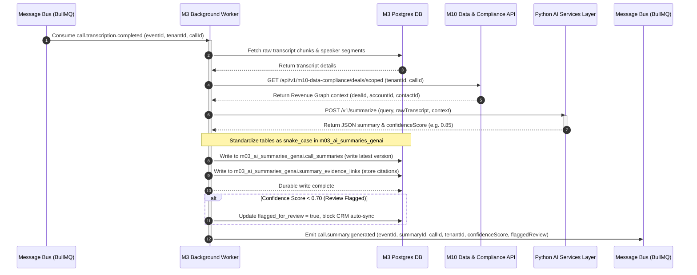
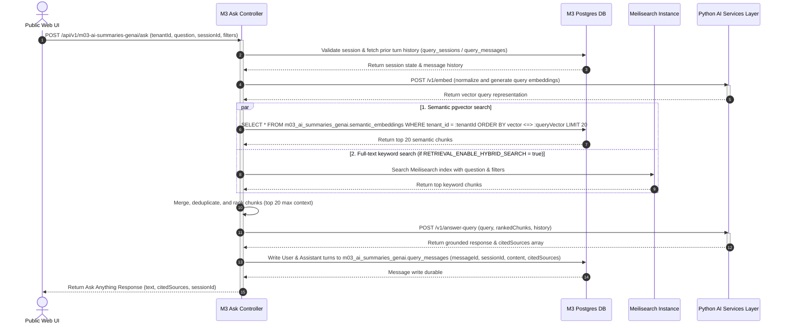
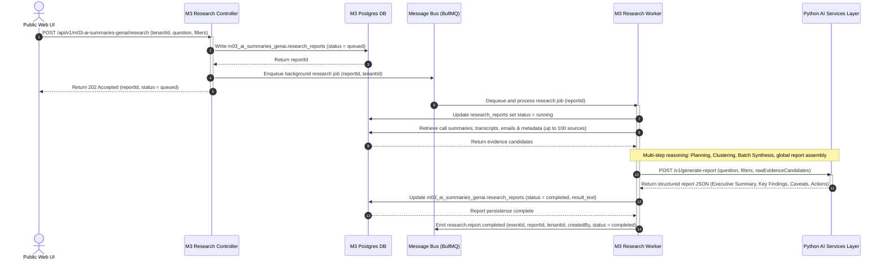
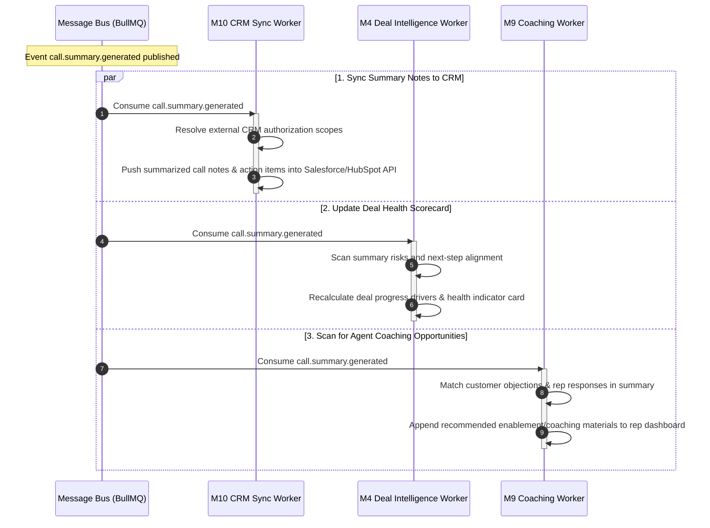
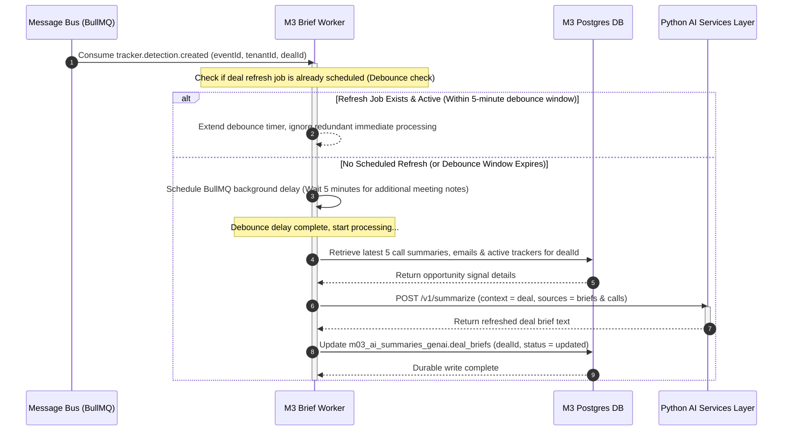

# Doc #19 — M3 Sequence Diagrams

## 1. Document Control

- **Document Title:** Sequence Diagrams — M3 AI Summaries & GenAI
- **Module:** M3 AI Summaries & GenAI
- **Owner:** Tech Lead / AI Lead / Backend Lead
- **Status:** Approved
- **Version:** v3.0
- **Last Updated:** 2026-05-18

---

## 2. SD-01: Async Call Summary Generation

This diagram illustrates the asynchronous workflow triggered when a call transcript is finalized, resulting in structured summary generation, confidence-score validation, normalized evidence linking, and event emission.

---

## 3. SD-02: Ask Anything Conversational Chat (RAG)

This diagram describes the real-time RAG query flow, which merges pgvector semantic search and Meilisearch full-text search (hybrid retrieval), performs prompt assembly, generates answers with cited sources, and tracks session message history.

---

## 4. SD-03: AI Deep Researcher Async Workflow

This diagram outlines the long-running async research report workflow. It accepts a query, registers a queued report row, schedules the multi-step reasoning worker, indexes/batches evidence, generates structured findings, and notifies downstream consumers via Message Bus.

---

## 5. SD-04: Downstream Consumption of Call Summary Generated

This diagram tracks how downstream modules react asynchronously when M3 publishes a `call.summary.generated` event on the Message Bus.

---

## 6. SD-05: Deal Brief Refresh Flow via Tracker Detections

This diagram illustrates how changes in customer interactions trigger a debounced deal brief refresh in M3. When a tracker detection is created, a debounced job is scheduled to wait for consecutive calls, preventing database/LLM write-flooding.

