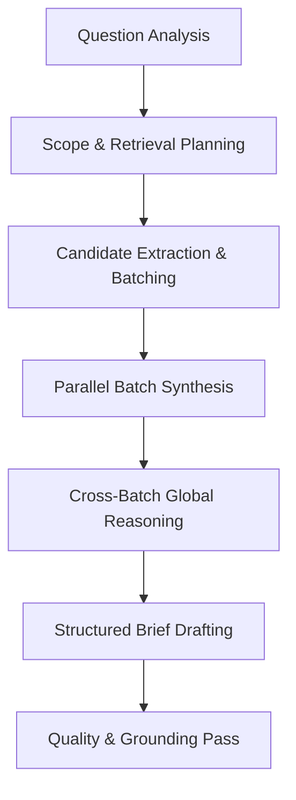

# Doc #11c — Technical Design Document (TDD): AI Deep Researcher

## 1. Document Control

- **Document Title:** Technical Design Document — AI Deep Researcher
- **Feature Name:** AI Deep Researcher (Async Multi-Call Report Synthesis)
- **Module Name:** M3 AI Summaries & GenAI
- **Workspace Directory:** `modules/m03-ai-summaries-genai/`
- **Owner:** Product Engineering — M3
- **Status:** Approved
- **Version:** v3.0
- **Last Updated:** 2026-05-18

---

## 2. Business & Feature Context

### Business Problem
Sales directors, RevOps managers, and executive leaders need answers to highly complex, trend-based questions that span dozens of accounts and hundreds of historical conversations. Examples include tracking recurring product objections, identifying reasons for late-stage deal stagnation, or discovering market feedback trends. Standard summaries or short-form chat tools are limited in context size and reasoning capabilities. AI Deep Researcher addresses this by performing async multi-step planning, clustering, and deep synthesis over large corpora to generate structured, board-ready research briefs.

### What this feature does
AI Deep Researcher is an advanced asynchronous analysis engine. When a user submits a complex strategic question along with metadata filters (such as date ranges, rep lists, deal stages, or customer segments), the system initiates a background reasoning graph. Using a stateful LangGraph agentic workflow, it retrieves up to 100 relevant sources (call summaries, transcripts, emails, trackers, and topic tags), synthesizes them in parallel batches, and produces a structured markdown report containing executive summaries, key findings, risks, and recommended actions.

### Value Proposition
- Automates strategic trend analysis that previously required days of manual audit work.
- Accelerates executive decision-making by surfacing recurring deal risks and objections.
- Maximizes factual grounding by enforcing strict source-evidence cross-referencing.
- Controls resource costs by structuring high-volume analysis into bounded parallel batches.

---

## 3. Scope & Dependencies

### In Scope
- Async job orchestration utilizing Redis-backed BullMQ workers.
- Stateful multi-step reasoning agentic workflow mapped via LangGraph.
- Extended hybrid retrieval fetching up to 100 relevant interaction sources.
- Structured report generation outputting Markdown-formatted briefs.
- Active concurrency throttling and resource limits per tenant.
- Execution-completed event notification via Message Bus.

### Out of Scope
- Short-form conversational query answering; that belongs exclusively to Ask Anything.
- Real-time in-call alerts or single-meeting recap summaries.
- Web search or retrieval of documents outside the verified tenant monorepo database.

### Upstream Dependencies
- **M1 Capture & Transcription:** Supplies raw transcripts and meeting segments.
- **M2 Conversation Intelligence:** Supplies active tracker alerts and topic labels.
- **M10 Data & Compliance (Revenue Graph):** Supplies account scopes, deal segments, and user access models.

### Downstream Consumers
- **Frontend report dashboard:** Renders report details, status tracking, and copy-export actions.
- **M8 Sales Engagement / Playbook engines:** To trigger action playbooks based on research recommendations.
- **Downstream event subscribers:** Subscribing to completed research events to notify users.

---

## 4. API Specification

All endpoints are hosted under the unified prefix: `/api/v1/m03-ai-summaries-genai`.

### POST /api/v1/m03-ai-summaries-genai/research
- **Description:** Submit a complex research question and schedule an async report job.
- **Headers:** `Authorization: Bearer <token>`, `X-Tenant-ID: <uuid>`
- **Request Payload:**
  ```json
  {
    "question": "What objections are most common in late-stage enterprise deals that did not progress this quarter?",
    "filters": {
      "dateRange": {
        "start": "2026-01-01T00:00:00Z",
        "end": "2026-03-31T23:59:59Z"
      },
      "dealStage": ["proposal", "negotiation"],
      "accountSegment": ["enterprise"]
    }
  }
  ```
- **Response Payload (`202 Accepted`):**
  ```json
  {
    "reportId": "uuid",
    "status": "queued",
    "createdAt": "2026-05-18T23:43:19Z"
  }
  ```

### GET /api/v1/m03-ai-summaries-genai/research/:id
- **Description:** Retrieve the current status and generated content of a research job.
- **Response Payload (`200 OK`):**
  ```json
  {
    "reportId": "uuid",
    "tenantId": "uuid",
    "status": "completed",
    "question": "What objections are most common...",
    "filters": {
      "dealStage": ["proposal", "negotiation"]
    },
    "resultText": "# Executive Summary\n- Enterprise deals encounter...",
    "createdBy": "user-uuid",
    "createdAt": "2026-05-18T23:43:19Z",
    "updatedAt": "2026-05-18T23:55:20Z"
  }
  ```

---

## 5. Stateful Agentic Reasoning Workflow

AI Deep Researcher implements a multi-step stateful reasoning workflow managed via **LangGraph**. The workflow progresses through discrete computational nodes, saving intermediate states to ensure resilience and recovery:



### Workflow Nodes
1. **Question Analysis:** Analyzes the research question to identify core business intents, required signal classes, and entity scopes.
2. **Scope Planning:** Converts question metadata and UI filters into structured SQL and Meilisearch query filters.
3. **Evidence Retrieval:** Pulls up to 100 candidate sources (call summaries, transcripts, emails, tracker detections) and groups them by time, rep, or deal ID.
4. **Parallel Batch Synthesis:** Batches candidates into subsets (max 10 candidates per batch) and synthesizes findings in parallel to bypass single-prompt context limitations.
5. **Cross-Batch Global Reasoning:** Compares intermediate batch syntheses, resolving contradictions and identifying trend distributions.
6. **Structured Brief Drafting:** Assembles findings into a comprehensive, markdown-formatted business report.
7. **Quality Check Pass:** Verifies that every claim is grounded, removes weak assertions, and inserts source references.

---

## 6. Database Schema Design

All tables reside under the `m03_ai_summaries_genai` PostgreSQL schema.

```sql
-- 1. Research Reports Table
CREATE TABLE m03_ai_summaries_genai.research_reports (
  report_id     UUID PRIMARY KEY DEFAULT gen_random_uuid(),
  tenant_id     UUID NOT NULL,
  question      TEXT NOT NULL,
  filters       JSONB NOT NULL, -- Stored input scopes
  status        VARCHAR NOT NULL CHECK (status IN ('queued', 'running', 'completed', 'failed')),
  result_text   TEXT NULL,      -- Persisted markdown brief
  created_by    UUID NOT NULL,
  created_at    TIMESTAMPTZ DEFAULT NOW(),
  updated_at    TIMESTAMPTZ DEFAULT NOW()
);

-- Indexes for performance & security
CREATE INDEX idx_research_reports_tenant ON m03_ai_summaries_genai.research_reports (tenant_id, created_by);
```

---

## 7. AI Model & Operational Parameters

### Model Choices & Endpoints
- AI Deep Researcher routes long-reasoning tasks to `gpt-4o` (configured via `OPENAI_MODEL_RESEARCH`).
- Prompt structures are version-pinned (`PROMPT_VERSION_RESEARCH = v1`) and validate JSON schemas (`PROMPT_STRICT_JSON = true`).
- The worker executes research calls to the private FastAPI AI Services layer using the canonical endpoint `POST /v1/generate-report` (`AI_RESEARCH_ENDPOINT`).

### Concurrency Limits & Throttling
To prevent external token rate-limiting and manage infrastructure costs:
- **Tenant Concurrency Cap:** A single tenant is restricted to **2 concurrent** AI Deep Researcher jobs.
- Excess requests are queued in BullMQ.
- **Global Concurrency Ceiling:** BullMQ workers maintain a global worker concurrency cap of 3 (`RESEARCH_QUEUE_CONCURRENCY = 3`).
- **Runtime Timeout:** Jobs are terminated if execution exceeds 15 minutes (`RESEARCH_JOB_MAX_RUNTIME_MS = 900000`).

---

## 8. Event-Driven Messaging Contract (Drift #3 Resolution)

When a background worker completes a research report, M3 publishes a `research.report.completed` event on BullMQ to notify downstream modules and trigger UI notifications:

- **Event Name:** `research.report.completed`
- **Envelope Casing:** Strictly `camelCase` properties aligned to the platform's `EventEnvelopeSchema`.
- **Payload Schema:**
  ```json
  {
    "eventId": "uuid",
    "tenantId": "uuid",
    "correlationId": "uuid",
    "occurredAt": "2026-05-18T23:55:20Z",
    "publishedAt": "2026-05-18T23:55:21Z",
    "data": {
      "reportId": "uuid",
      "createdBy": "uuid",
      "status": "completed",
      "questionSummary": "Objections in late-stage enterprise deals...",
      "sourceCount": 42
    }
  }
  ```
- **Action:** Only emit after `research_reports.status` is set to `completed` and the write is durable.

---

## 9. Error Resiliency & Security

- **Graceful Failure:** If a job encounters fatal errors or exceeds the retry budget (`RESEARCH_RETRY_MAX = 3`), the worker sets `status = failed` in the database.
- **Dead-Letter Queue:** Runaway or crashed jobs route to the DLQ (`QUEUE_DLQ_ENABLED = true`) for diagnostic reviews.
- **Tenant Separation:** All RAG retrieval queries, intermediate states, and final report records are bounded by `tenant_id`. Cross-tenant context leakage is prevented at both the database level (RLS) and search index filters.
