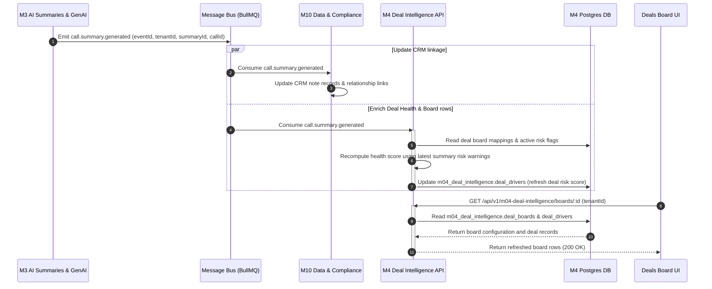
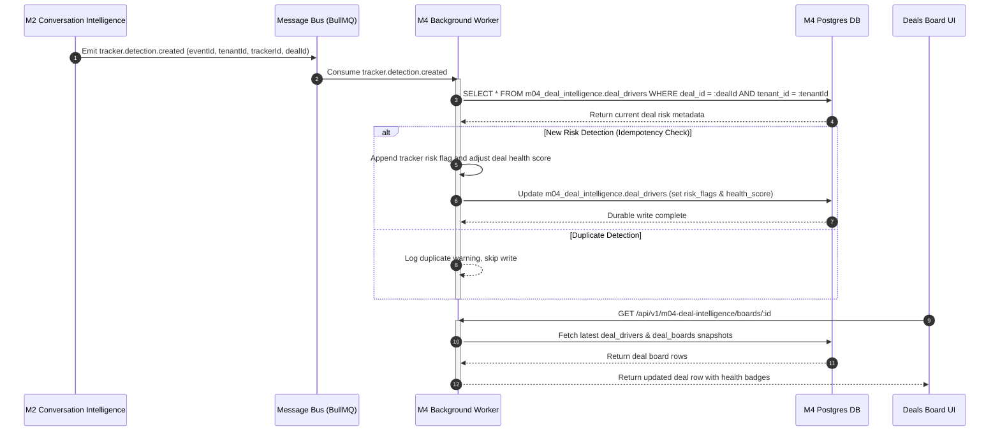
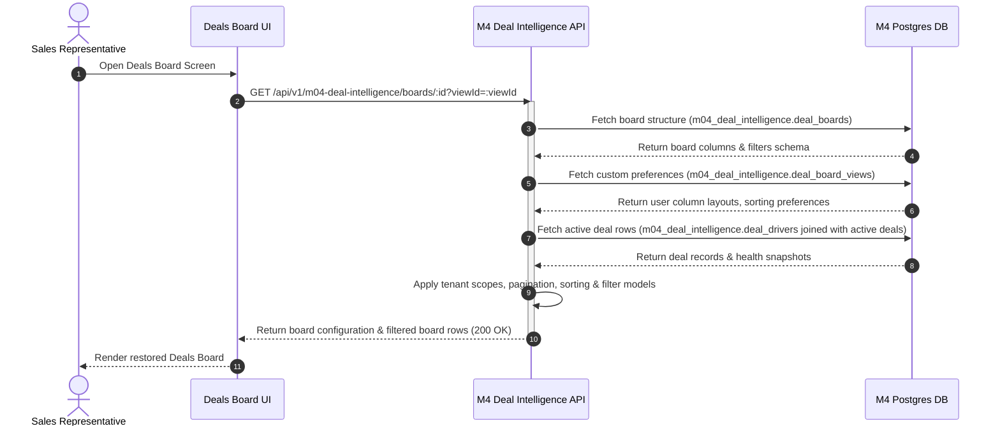
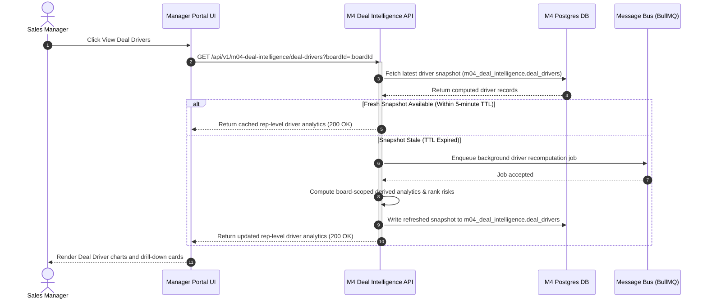
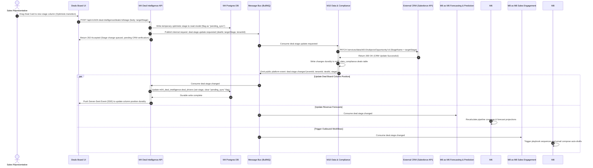

# Doc #14 — Sequence Diagrams for M4

## 1. Document Control

- **Document Title:** Sequence Diagrams — M4 Deal Intelligence
- **Module:** M4 Deal Intelligence
- **Owner:** Product Engineering — M4
- **Status:** Approved
- **Version:** v3.0
- **Last Updated:** 2026-05-18

---

## 2. SD-01: Call Summary Generated to Deal Board Enrichment

This diagram shows how a newly generated call summary in **M3** triggers an asynchronous deal health recomputation and updates the board read-models in **M4**.

---

## 3. SD-02: Tracker Detection to Deal Risk Flag Update

This diagram illustrates the asynchronous flow when a dynamic keyword tracker in **M2** fires, creating a deal risk flag and updating the active pipeline Deals Board rows in **M4**.

---

## 4. SD-03: User Opens Deals Board & Saved View Restoration

This diagram maps the read-heavy REST query path where a user opens the Deals Board UI, fetching the board layout, columns, and applying their personalized saved filters and views.

---

## 5. SD-04: User Opens View Deal Drivers Scoped Analytics

This diagram describes how a manager inspects rep-level driver analytics scoped to a specific Deals Board segment, served asynchronously using precomputed snapshots.

---

## 6. SD-05: ADR-005 Deals Board UI Stage-Change Request Pattern

This diagram details the core architectural constraint defined in **ADR-005**. When a user drags a deal card to a new stage column on the Deals Board UI:

