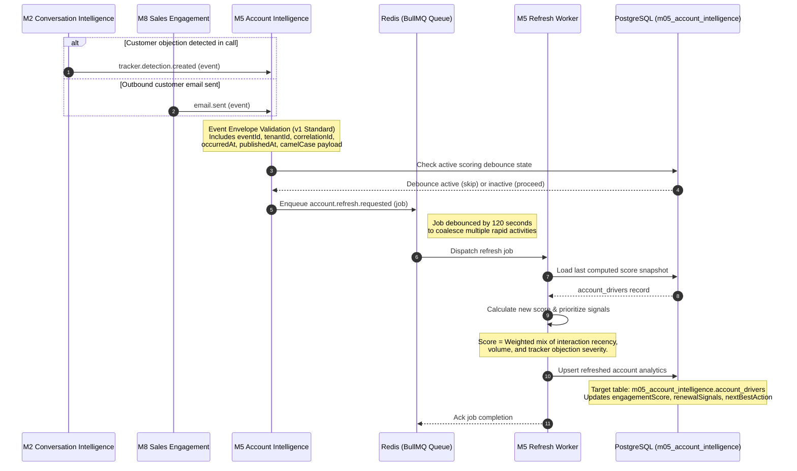
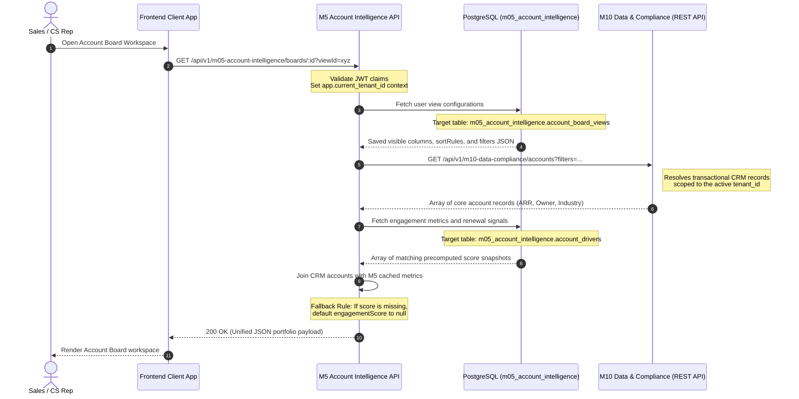
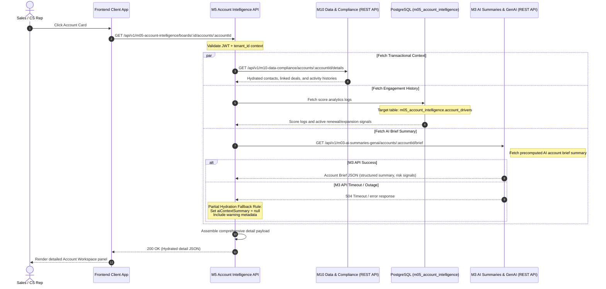

# Sequence Diagrams for M5 Account Intelligence

## 1. Document Control

- **Document Title:** Sequence Diagrams — M5 Account Intelligence
- **Module Name:** M5 Account Intelligence
- **Workspace Directory:** `modules/m05-account-intelligence/`
- **Owner:** Product Engineering — M5
- **Status:** Approved
- **Version:** v3.0
- **Last Updated:** 2026-05-18

---

## SD-01 — Upstream Event Integration to Account Board Refresh

### Purpose
This diagram models the asynchronous event-driven workflow when upstream customer interactions or AI-generated signals occur. Rather than blocking transactional performance by computing activity and risk metrics in the read-path, M5 enqueues debounced scoring jobs to refresh cached read-models in PostgreSQL.

### Preconditions
- The account has been resolved and mapped within the platform CRM database.
- An event-broker (BullMQ backed by Redis) is online and routing messages.
- The PostgreSQL target table resides under the tenant-scoped `m05_account_intelligence` schema.

### Mermaid Diagram

### Postconditions
- The `m05_account_intelligence.account_drivers` row is updated with refreshed scores and prioritization logs.
- Next client board reads immediately display current engagement metrics without running calculations synchronously.

---

## SD-02 — User Opens Account Board with Saved View Restoration

### Purpose
This diagram illustrates the hydration sequence when a sales representative or customer success manager opens the portfolio cockpit. The system retrieves customized column orderings, active filters, and joins core CRM records via **M10 Data & Compliance** with M5-owned engagement layers.

### Preconditions
- The requesting user is authenticated with a JWT.
- Row-Level Security (RLS) is active on the PostgreSQL tenant database.

### Mermaid Diagram

### Postconditions
- Portfolio records are displayed applying filters, column preferences, and engagement flags.
- Complete separation of CRM data ownership (M10) and UI representation (M5) is maintained.

---

## SD-03 — User Opens Account Detail Panel with AI Context Hydration

### Purpose
This diagram details the deep hydration workflow when a user inspects a specific account card. The panel merges transactional history with the AI summary brief generated by **M3 AI Summaries & GenAI**.

### Preconditions
- The selected account exists and is mapped inside the tenant workspace scope.
- If M3 AI summaries fail or timeout, the M5 endpoint must execute partial fallback hydration.

### Mermaid Diagram

### Postconditions
- User sees detailed activity timelines, stakeholder directories, and summary briefs.
- Resilience is preserved; dependency outages do not crash the primary account workspace.
