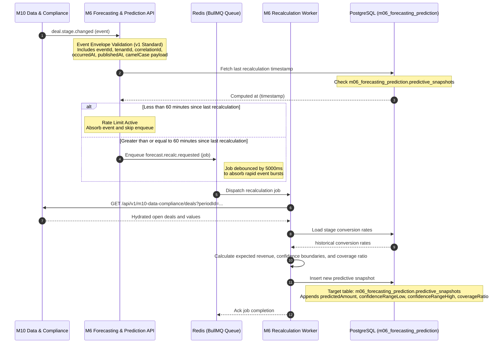
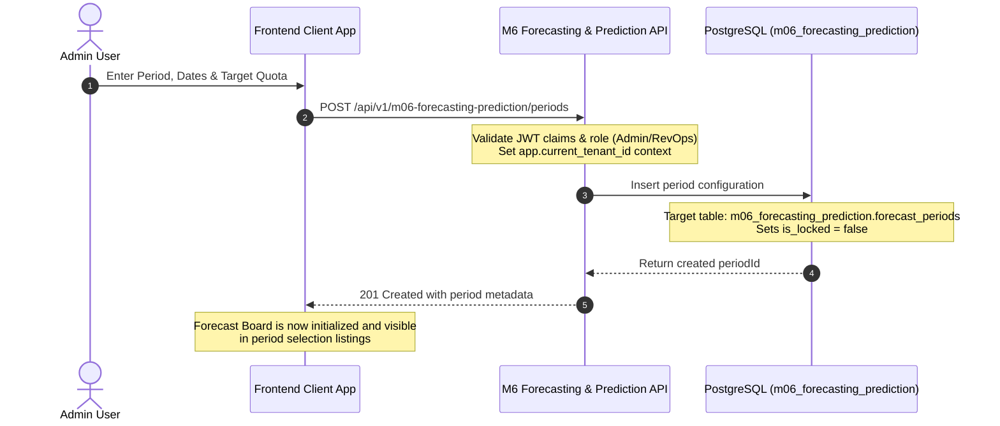
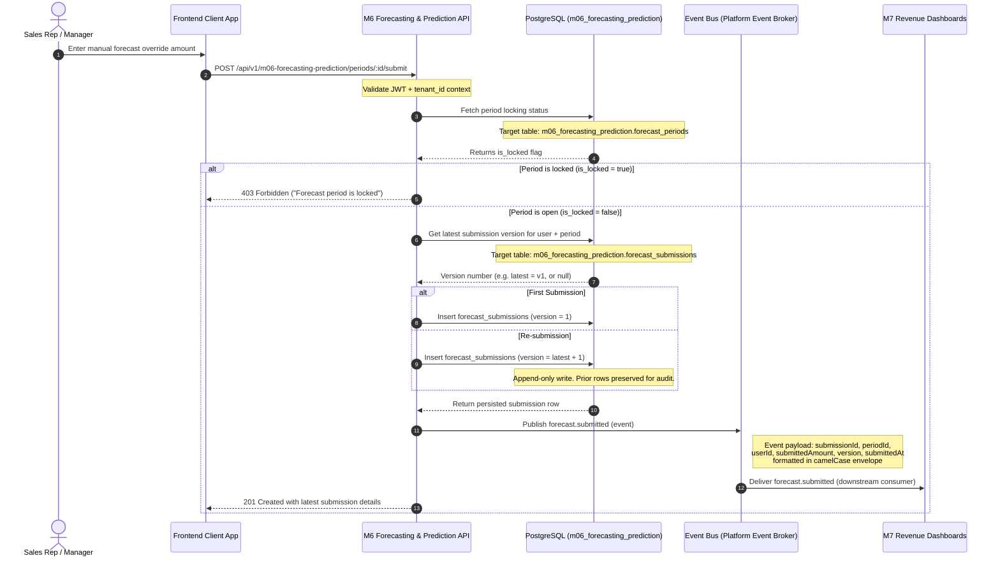
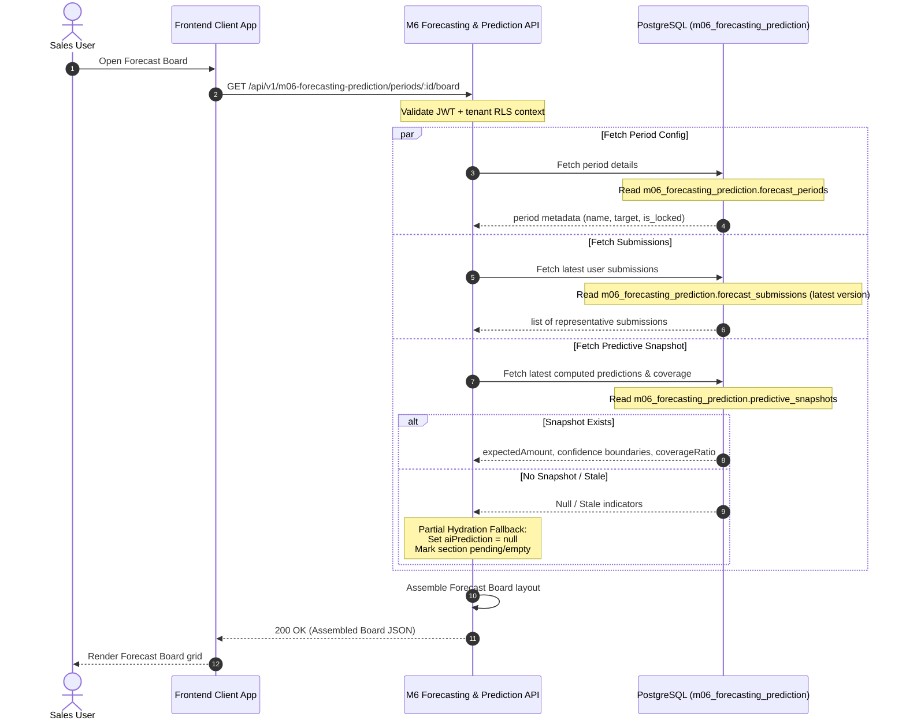

# Sequence Diagrams for M6 Forecasting & Prediction

## 1. Document Control

- **Document Title:** Sequence Diagrams — M6 Forecasting & Prediction
- **Module Name:** M6 Forecasting & Prediction
- **Workspace Directory:** `modules/m06-forecasting-prediction/`
- **Owner:** Product Engineering — M6
- **Status:** Approved
- **Version:** v3.0
- **Last Updated:** 2026-05-18

---

## SD-01 — Upstream Event to Forecast Recalculation

### Purpose
This diagram models the asynchronous event-driven workflow when upstream deal pipeline changes occur. Rather than blocking transactions by calculating heavy mathematical predictions on the read path, M6 enqueues debounced and rate-limited recalculation jobs to update cached read-models in PostgreSQL.

### Preconditions
- The target period is open and eligible for recalculation.
- The PostgreSQL target table resides under the tenant-scoped `m06_forecasting_prediction` schema.
- **Rate Limit Guard:** A maximum of one recalculation per tenant/period is allowed within a 60-minute window.

### Mermaid Diagram

### Postconditions
- The `m06_forecasting_prediction.predictive_snapshots` row is updated with fresh calculations.
- Quota Boards immediately render fresh predictive analytics.

---

## SD-02 — Admin Creates Forecast Period to Board Available

### Purpose
This diagram illustrates the workflow where an administrator defines forecast period parameters, start/end dates, and revenue quotas, initializing the board workspace for sales team interactions.

### Preconditions
- The requesting admin user is authenticated with a JWT.
- Row-Level Security (RLS) is active on the PostgreSQL database.

### Mermaid Diagram

### Postconditions
- A new record exists inside `m06_forecasting_prediction.forecast_periods`.
- Forecast Board endpoints can now serve read-models for the period.

---

## SD-03 — User Submits Forecast Amount with Locked-Period Guard

### Purpose
This diagram details the manual forecast submission sequence. It highlights the locked-period validation, append-only immutable row versioning, and the propagation of `forecast.submitted` downstream.

### Preconditions
- Sales user is authenticated and tenant-authorized.
- The forecast period is open (`is_locked = false`).

### Mermaid Diagram

### Postconditions
- An immutable new version record is appended to `m06_forecasting_prediction.forecast_submissions`.
- Downstream performance dashboards ingest the submission event to calculate attainment scores.

---

## SD-04 — User Opens Forecast Board with AI Predictions

### Purpose
This diagram shows the read-path assembly workflow when a user opens the Quota and Forecast Board. The system compositionally overlays period metadata, submissions, predictions, and coverage ratios.

### Preconditions
- Target forecast period exists.
- Partial hydration fallbacks are enabled if background calculations are missing.

### Mermaid Diagram

### Postconditions
- User views the collaborative Forecast Board spreadsheet grid.
- Stale background metrics degrade gracefully without breaking page assembly.
