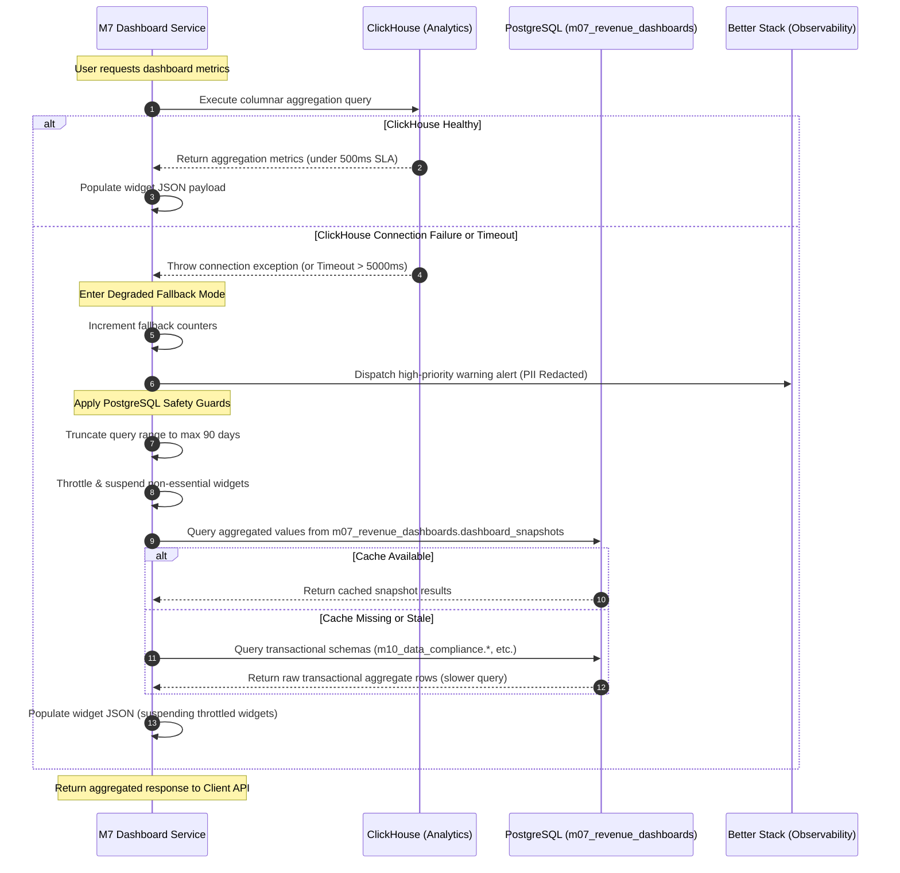

# Sequence Diagram — ClickHouse Fallback to PostgreSQL

This document specifies the internal execution sequence when the dashboard service encounters a ClickHouse query failure. To ensure absolute platform resilience, M7 switches database queries to PostgreSQL, dispatches alarms, and enforces resource-throttling limits.

## 1. Document Control

- **Document Title:** Sequence Diagram — ClickHouse Fallback to PostgreSQL
- **Feature Name:** ClickHouse Failover Fallback & Resource Protection
- **Module Name:** M7 Revenue Dashboards
- **Workspace Directory:** `modules/m07-revenue-dashboards/`
- **Owner:** Product Engineering — M7
- **Status:** Approved
- **Version:** v3.0
- **Last Updated:** 2026-05-18

---

## 2. Actors & Components

- **M7 Dashboard Service:** NestJS backend service residing at `modules/m07-revenue-dashboards/`.
- **ClickHouse:** High-performance columnar database (primary analytics engine).
- **PostgreSQL:** Transactional database (using namespace schema `m07_revenue_dashboards`).
- **Better Stack:** Observability, tracing, and alert delivery platform.

---

## 3. Mermaid Sequence Diagram



---

## 4. Key Engineering Implementations

1. **Better Stack Integration:** Every fallback incident must trigger a structured telemetry log. The warning payload must carry the `tenant_id` and the raw ClickHouse exception string, with all user PII fields redacted.
2. **Resource-Throttling Execution:** Non-essential widgets must return a lightweight object structure:
   ```json
   {
     "id": "widget-competitor-theme-trends",
     "status": "suspended",
     "message": "This widget is temporarily unavailable due to system optimization. It will restore shortly."
   }
   ```
3. **Optimistic Range Truncation:** Date filters exceeding 90 days are silently truncated to a rolling 90-day window during PostgreSQL aggregation queries to prevent database lockups.