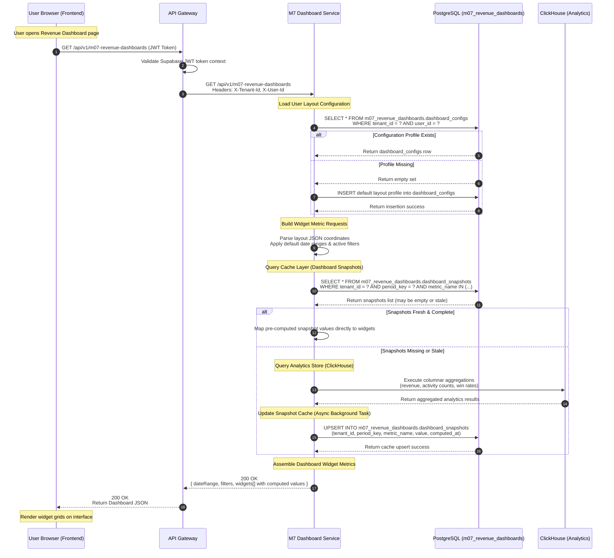

# Sequence Diagram — Dashboard Read Flow

This document details the API execution sequence when a client requests active revenue performance dashboards and metrics.

## 1. Document Control

- **Document Title:** Sequence Diagram — Dashboard Read Flow
- **Feature Name:** Dashboard Read Flow
- **Module Name:** M7 Revenue Dashboards
- **Workspace Directory:** `modules/m07-revenue-dashboards/`
- **Owner:** Product Engineering — M7
- **Status:** Approved
- **Version:** v3.0
- **Last Updated:** 2026-05-18

---

## 2. Actors & Components

- **User Browser (Frontend):** Renders dashboard layouts and widgets.
- **API Gateway:** Validates access tokens and passes standard headers.
- **M7 Dashboard Service:** NestJS backend service residing at `modules/m07-revenue-dashboards/`.
- **PostgreSQL:** Transactional database (using namespace schema `m07_revenue_dashboards`).
- **ClickHouse:** Columnar database (primary analytics engine).

---

## 3. Mermaid Sequence Diagram

---

## 4. Key Notes for Engineers

1. **Gateway Auth Propagation:** The API gateway must intercept the incoming Authorization JWT, verify the signature, and append the `X-Tenant-Id` and `X-User-Id` headers before forwarding the request to the M7 service.
2. **Snapshot Cache Expiry:** In Step 61, snapshot freshness is computed by checking if the current time minus the `computed_at` timestamp is less than `M07_SNAPSHOT_STALENESS_THRESHOLD_MINUTES` (defaults to 60 minutes).
3. **Optimistic UI:** If ClickHouse triggers a cache recalculation, the write-path to `dashboard_snapshots` is processed as an asynchronous task, preventing write operations from blocking the client's HTTP response.