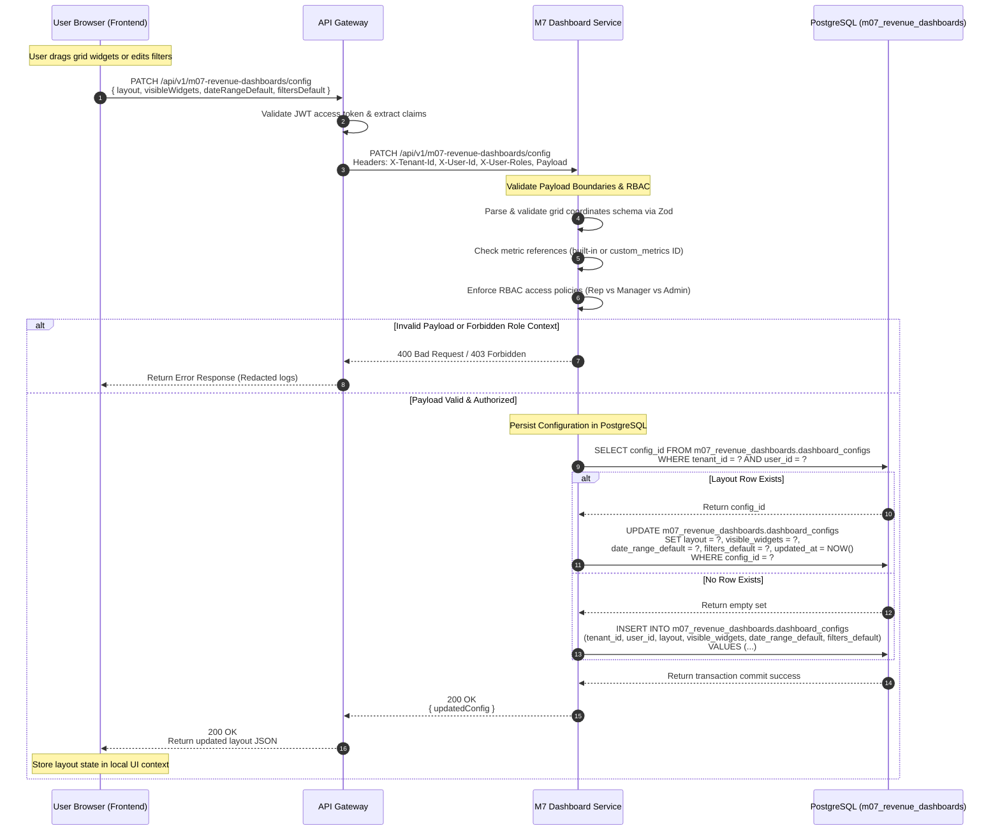

# Sequence Diagram — Save Dashboard Config (Layout + Filters)

This document shows what happens when a user updates their dashboard layout grid positions, default filters, or date range presets.

## 1. Document Control

- **Document Title:** Sequence Diagram — Save Dashboard Layout Config
- **Feature Name:** Save Dashboard Layout Configuration
- **Module Name:** M7 Revenue Dashboards
- **Workspace Directory:** `modules/m07-revenue-dashboards/`
- **Owner:** Product Engineering — M7
- **Status:** Approved
- **Version:** v3.0
- **Last Updated:** 2026-05-18

---

## 2. Actors & Components

- **User Browser (Frontend):** Sends drag-and-drop coordinate changes and configuration updates.
- **API Gateway:** Passes token claims and request headers.
- **M7 Dashboard Service:** NestJS backend service residing at `modules/m07-revenue-dashboards/`.
- **PostgreSQL:** Transactional database (using namespace schema `m07_revenue_dashboards`).

---

## 3. Mermaid Sequence Diagram

---

## 4. Key Notes for Engineers

1. **Validation Checks (Zod DTOs):** The layout update payload must carry valid grid coordinate properties (`x`, `y`, `w`, `h` as integers). An invalid grid width or coordinate will throw a `400 Bad Request` before database queries are formulated.
2. **Access Control Safeguards:** Normal sales representatives are strictly forbidden from writing or altering organizational or team-shared template presets. Admins and RevOps are the exclusive writers of shared dashboard configurations.
3. **Idempotent Write Operations:** The service wraps the PostgreSQL SELECT and UPDATE/INSERT steps into a single database transaction, ensuring RLS checks are locked during execution.