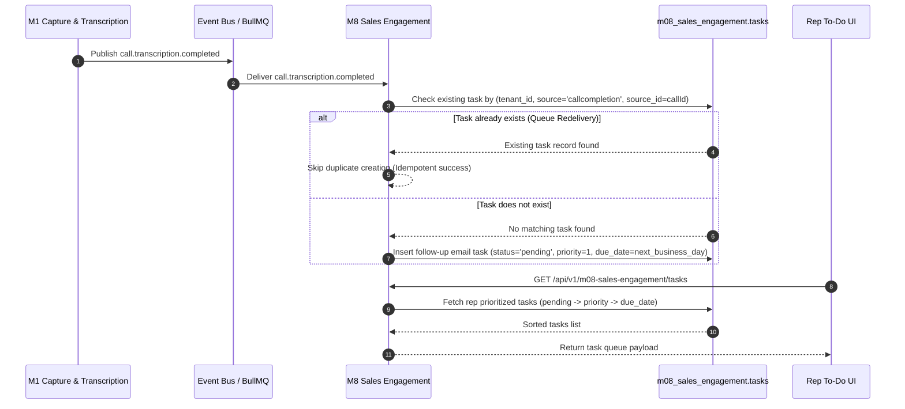
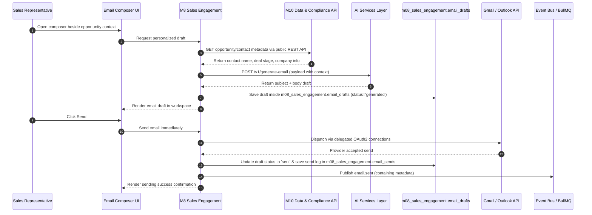
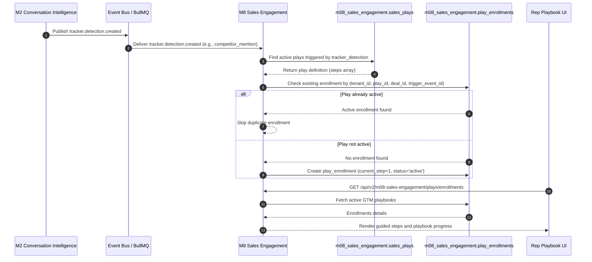
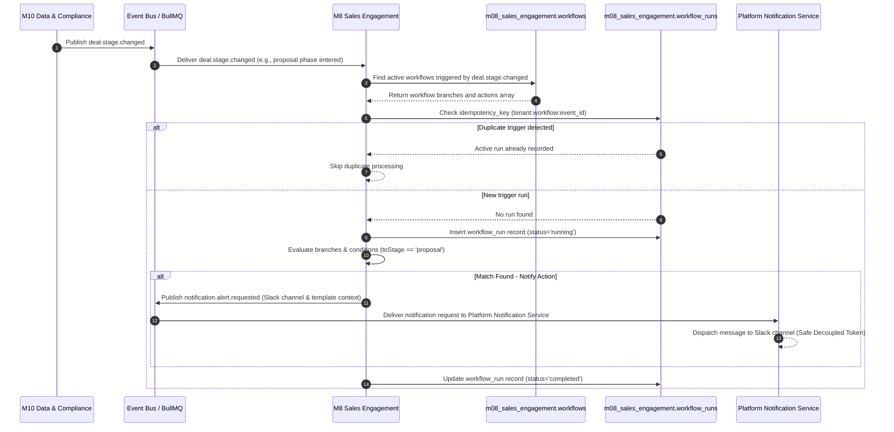
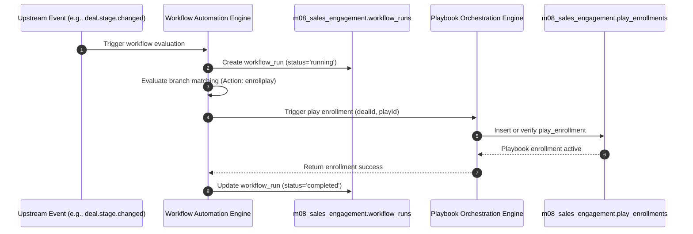

# Sequence Diagrams — M8 Sales Engagement Flows

## 1. Document Control

- **Document Title:** Sequence Diagrams — M8 Sales Engagement Flows
- **Module Name:** M8 Sales Engagement
- **Technical Workspace:** `modules/m08-sales-engagement/`
- **Owner:** Product Engineering — M8
- **Status:** Approved
- **Version:** v3.0
- **Last Updated:** 2026-05-18

---

## 2. Purpose & Module Boundaries

This document defines the runtime flows for the core capabilities of **M8 Sales Engagement** in Mermaid sequence diagram notation.

Under the **v3.0 Codebase SSOT**, all four features (**Email Composer**, **Engage To-Do**, **Orchestrate**, and **Workflow Automation**) are physically unified within a single independent package located at `modules/m08-sales-engagement/`. They utilize a shared PostgreSQL schema namespace `m08_sales_engagement` and a canonical API prefix `/api/v1/m08-sales-engagement`.

All diagrams below have been aligned to standard decoupled modules:
- **M1 Capture & Transcription:** Publishes transcriptions.
- **M2 Conversation Intelligence:** Publishes tracker detections.
- **M8 Sales Engagement:** Owns outreach, tasks, playbooks, and automations.
- **M10 Data & Compliance:** Owns opportunity stages and CRM transactional context.

---

## 3. Core Sequence Diagrams

### Flow 1: Post-call prioritized follow-up task creation
This flow illustrates how M8 consumes a call completion signal to idempotently create a rep follow-up task in Engage To-Do.

---

### Flow 2: AI email draft generation and delegated send
This flow shows the delegated email composing and immediate dispatch path, calling M10 for context.

---

### Flow 3: Auto-enroll deal in GTM Playbook from Tracker Detection
This flow shows how GTM playbooks are automatically activated when meeting trackers detect risk.

---

### Flow 4: Branching Workflow triggers notification alert (decoupled Slack)
This flow highlights how branching automations trigger Slack alerts safely using the Platform Notification Service.

---

### Flow 5: Branching Workflow Auto-Enrollment Handoff
Shows the interaction boundary between Workflow Automation and GTM Playbook Orchestration.

---

## 4. Key Ownership & Events Telemetry

### Developer Cheat Sheet

| Feature | Data Namespace | Primary API prefix | Primary Queue Trigger |
| :--- | :--- | :--- | :--- |
| **Email Composer** | `m08_sales_engagement.email_*` | `/api/v1/m08-sales-engagement/emails` | `email.sent` (Emitted) |
| **Engage To-Do** | `m08_sales_engagement.tasks` | `/api/v1/m08-sales-engagement/tasks` | `call.transcription.completed` (Consumed) |
| **Orchestrate** | `m08_sales_engagement.sales_plays` | `/api/v1/m08-sales-engagement/plays` | `tracker.detection.created` (Consumed) |
| **Workflow Automation** | `m08_sales_engagement.workflows` | `/api/v1/m08-sales-engagement/workflows` | `deal.stage.changed` (Consumed) |
| **Platform Notification** | N/A (Platform Layer) | N/A (Platform Layer) | `notification.alert.requested` (Emitted) |