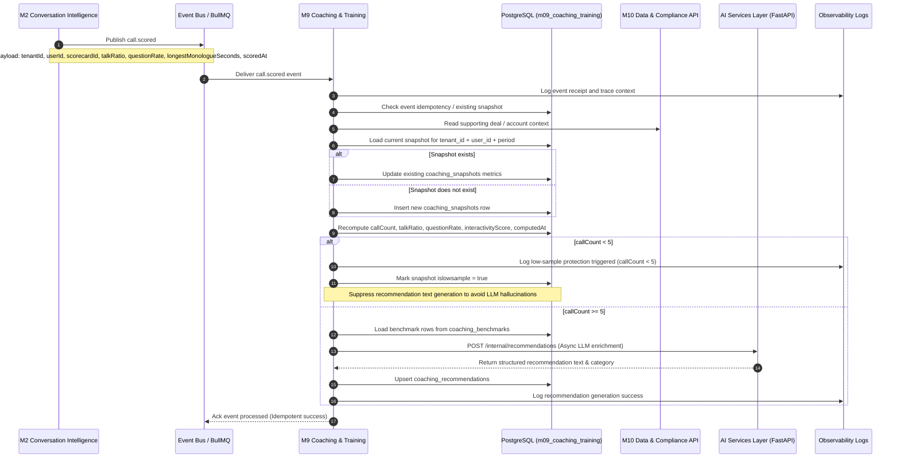
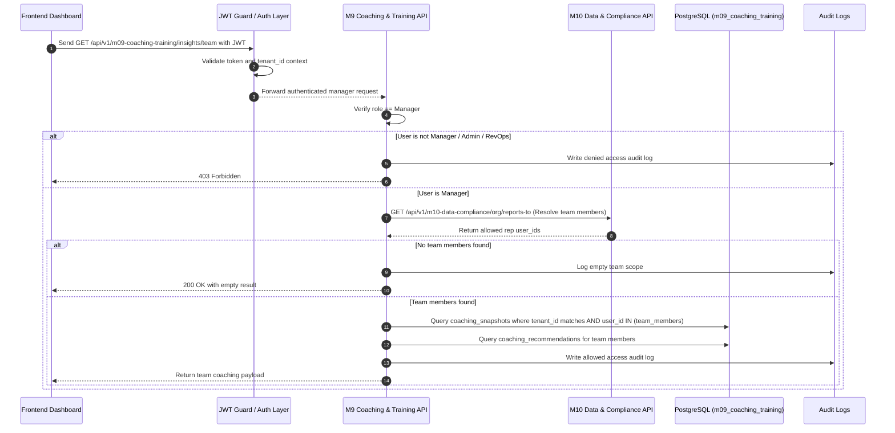
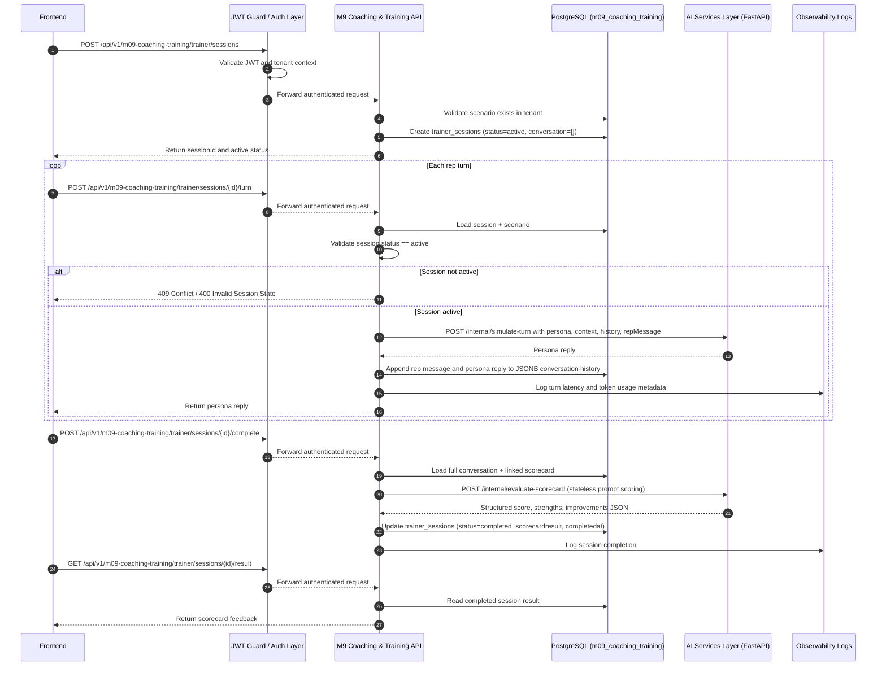
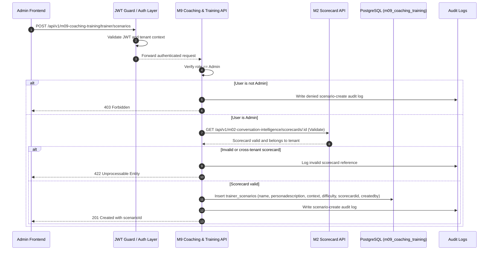

# Sequence Diagrams: M9 Flows

## 1. Document Control

| Field | Value |
|---|---|
| **Document Title** | Sequence Diagrams - M9 Flows |
| **Product Module Name** | M9 Coaching & Training |
| **Workspace Directory** | `modules/m09-coaching-training/` |
| **Lifecycle Stage** | Optimize |
| **Document Type** | Sequence Diagram Document |
| **Version** | v3.0 |
| **Status** | Approved |
| **Last Updated** | 2026-05-18 |
| **File Path** | `modules/m09-coaching-training/Sequence Diagrams: M9 flows.md` |
| **Covered Features** | Sales Coaching Insights, AI Trainer |

---

## 2. Purpose

This document captures the main runtime flows for **M9 Coaching & Training**. It focuses on the most important sequences for Sales Coaching Insights and AI Trainer so engineers can implement event handling, APIs, RBAC, persistence, and AI interactions correctly. 

These sequence diagrams are written in Mermaid so they can be rendered directly in Markdown-friendly documentation tools.

---

## 3. Covered Flows

This document includes:
- **Flow 1:** `call.scored` event consumption, snapshot compilation, low-sample guard check, and coaching recommendation generation.
- **Flow 2:** Manager team coaching view query with strict server-side RBAC and org structure resolution.
- **Flow 3:** AI Trainer session execution: starts session, processes stateless turns (passing history), and executes end-of-session scorecard evaluation.
- **Flow 4:** Admin scenario creation with linked scorecard validation.

---

## 4. Flow 1: Call Scored to Coaching Snapshot Update

### 4.1 What this flow shows
This flow shows how M9 consumes the `call.scored` event from **M2 Conversation Intelligence**, updates the rep coaching snapshot in the `m09_coaching_training` schema namespace, applies the low-sample guard, and generates coaching recommendations when the sample is reliable.

### 4.2 Mermaid diagram

### 4.3 Implementation notes
- `call.scored` is published by **M2** and consumed by **M9**.
- Snapshot writes must be idempotent and update the existing period row instead of inserting duplicates.
- Recommendation generation must be skipped when `callCount < 5`. The UI will display a friendly suppression message.

---

## 5. Flow 2: Manager Opens Team Coaching View

### 5.1 What this flow shows
This flow shows how a manager opens the team coaching page, how server-side RBAC is enforced, and how M9 returns only the coaching snapshots for reps on that manager’s team.

### 5.2 Mermaid diagram

### 5.3 Implementation notes
- The canonical endpoint is `GET /api/v1/m09-coaching-training/insights/team`.
- RBAC is enforced on the server. M9 calls the **M10** REST API to resolve organizational hierarchies.
- All database queries must remain tenant-scoped.

---

## 6. Flow 3: AI Trainer Session

### 6.1 What this flow shows
This flow shows a rep starting a trainer session, sending multiple turns, receiving persona replies, and completing the session for scorecard-based feedback.

### 6.2 Mermaid diagram

### 6.3 Implementation notes
- Endpoints are `/api/v1/m09-coaching-training/trainer/sessions`, `/api/v1/m09-coaching-training/trainer/sessions/:id/turn`, and `/api/v1/m09-coaching-training/trainer/sessions/:id/result`.
- The product service manages conversational state in PostgreSQL JSONB and sends the full thread history to the AI service on each turn to keep the AI stateless.

---

## 7. Flow 4: Admin Creates Trainer Scenario

### 7.1 What this flow shows
This flow shows how an admin creates a trainer scenario with a persona definition, context, difficulty, and a linked scorecard.

### 7.2 Mermaid diagram

### 7.3 Implementation notes
- The endpoint is `POST /api/v1/m09-coaching-training/trainer/scenarios` (Admin only).
- M9 validates that the linked scorecard exists in the same tenant by calling the **M2 Conversation Intelligence** REST API.
