# R-Revenue Intelligence — System Architecture Document (SAD)

**Product:** R-Revenue Intelligence
**Organization:** Relanto.ai
**Document Type:** System Architecture Document
**Version:** 1.0
**Status:** Draft
**Last Updated:** April 2026
**Owner:** Tech Lead — R-Revenue Intelligence Platform

<!-- ADDED: Document health metadata block — makes staleness visible at a glance -->

**Last Architecture Review:** April 2026
**Next Scheduled Review:** July 2026
**Review Cadence:** Every 3 months, or immediately after any major architecture decision

---

<!-- ADDED: Quick-scan document summary block — for large docs (19 sections), readers need
     an at-a-glance orientation before diving into Section 1.1 -->

## Document Summary

| Property                  | Value                                                                                 |
| ------------------------- | ------------------------------------------------------------------------------------- |
| Total Sections            | 19                                                                                    |
| Platform Modules Covered  | 10 (M-01 through M-10)                                                                |
| Features Covered          | 25                                                                                    |
| Architecture Style        | Modular Monolith (Phase 1–2), Microservices extraction (Phase 3)                     |
| Primary Language Stack    | TypeScript (product services) + Python (AI/ML services)                               |
| Multi-Tenancy Model       | Shared PostgreSQL with Row-Level Security (RLS) per tenant                            |
| Deployment Platform       | Railway (Phase 1–2) → AWS ECS (Phase 3)                                             |
| Key External Dependencies | OpenAI API, Whisper ASR, AssemblyAI, Supabase Auth, Salesforce, HubSpot, Dynamics 365 |
| Document Status           | Draft — pending Tech Lead sign-off before v1.0 finalisation                          |

> **New to this document?** Start at Section 2 (Platform Overview) for context, then read
> Section 4 (Architecture Decisions) before touching any code. Use the Navigation Guide
> in Section 1.4 to jump directly to the section relevant to your role.

---

## Section 1 — Document Purpose & Scope

---

### 1.1 What This Document Is and Who It Is For

This document is the **System Architecture Document (SAD)** for the R-Revenue Intelligence
platform — an AI-powered revenue intelligence platform built by Relanto.ai that captures
and analyzes customer interactions (calls, emails, and meetings) to help sales teams
improve deal execution, forecasting, and revenue performance.

This document describes how the entire R-Revenue Intelligence platform is designed,
structured, and connected at the system level. It explains the architecture decisions
that apply across all features, all modules, and all integration points — not the
internal logic of any single feature.

This document is written for the following readers:

| Reader             | How They Use This Document                                                                                    | Start Here          |
| ------------------ | ------------------------------------------------------------------------------------------------------------- | ------------------- |
| Backend Engineers  | Understand platform-wide data flows, service boundaries, and integration patterns before building any feature | Sections 2, 4, 6, 7 |
| Frontend Engineers | Understand how the UI layer connects to backend services, AI outputs, and CRM data                            | Sections 2, 5, 10   |
| AI/ML Engineers    | Understand how conversation data, Revenue Graph, and AI context layer feed into AI models and agents          | Sections 2, 6, 12   |
| QA Engineers       | Understand end-to-end system flows to write integration and system-level test cases                           | Sections 2, 7, 15   |
| Tech Lead          | Use as the governing architecture reference to review all technical decisions against                         | All sections        |
| Product Managers   | Understand system-level constraints and dependencies that affect feature scoping and sequencing               | Sections 2, 3, 15   |
| New Team Members   | Read this document before writing any code, reviewing any PR, or designing any feature                        | Sections 1, 2, 4    |

<!-- ADDED: "Start Here" column — removes the need for new team members to guess
     which sections are relevant to their role. A single column addition, zero content change. -->

> **If you are writing code for R-Revenue Intelligence, read this document first.
> Every feature you build sits on top of the architecture described here.**

---

### 1.2 What This Document Covers

This document covers the **complete platform-level architecture** of R-Revenue
Intelligence. It describes how all 7 stages of the Revenue Intelligence Lifecycle
— Capture, Model, Understand, Analyze, Execute, Predict, and Optimize — are
supported by the system's structure.

Specifically, this document covers:

**Platform Overview**

- The purpose and positioning of R-Revenue Intelligence as a revenue intelligence platform
- The 7-stage Revenue Intelligence Lifecycle: Data Capture → Model → Understand → Analyze → Execute → Predict → Optimize
- The 25 platform features mapped to the lifecycle stages, from Call Transcription and Conversational Intelligence through to Revenue Dashboards, Forecast Boards, and Data Cloud

**System Architecture**

- High-level architecture diagram showing all major system layers and their relationships
- Service and module boundaries across the platform
- The three-layer Revenue Graph architecture: Automated Data Capture Engine, Contextual Data Mapping, and AI Context Layer
- The AI processing pipeline from raw audio/email input through to structured insights, CRM updates, and user-facing outputs

**Data Architecture**

- How raw customer interaction data (calls, emails, meetings, CRM records) is ingested, normalized, and stored
- How the Revenue Graph connects captured data to accounts, deals, contacts, and opportunities
- How data flows from ingestion through to AI analysis, CRM sync, and Data Cloud export

**Integration Architecture**

- All external system integrations: CRM platforms (Salesforce, HubSpot, Microsoft Dynamics 365), conferencing tools (Zoom, Microsoft Teams, Google Meet), email providers (Gmail, Outlook/Office 365), telephony systems, messaging platforms, and data warehouses (Snowflake, BigQuery)
- API and event-based communication patterns between R-Revenue Intelligence and external systems
- Authentication, permissions, and data access governance across integration points

**AI and ML Architecture**

- How AI models receive input from the Revenue Graph and conversation data
- The role of NLP, speech-to-text (ASR), speaker diarization, intent detection, and topic modeling across features such as Call Transcription, AI Smart Tracker, AI Theme Spotter, AI Data Extractor, and Ask Anything GenAI Query
- How AI agents are configured and executed for features including AI Call Reviewer, AI Deep Researcher, and AI Trainer
- The Retrieval-Augmented Generation (RAG) approach used in Ask Anything GenAI Query

**Security, Compliance, and Governance Architecture**

- How the platform enforces CRM opt-out preferences and regional communication policies through the Configure Compliance Settings feature
- Role-based access control (RBAC) patterns across all modules
- Data privacy, retention, and conversation recording governance

**Non-Functional Architecture**

- Performance, scalability, and availability targets for the platform
- Platform-wide error handling, retry logic, and failure boundaries
- Observability: logging, monitoring, and alerting architecture

---

### 1.3 What This Document Does NOT Cover

This document describes **platform-level architecture only**. It does not contain feature-specific implementation details. The following are explicitly out of scope:

| Out of Scope                                                                                                                                                                      | Where to Find It                                   |
| --------------------------------------------------------------------------------------------------------------------------------------------------------------------------------- | -------------------------------------------------- |
| Internal business logic for any individual feature (e.g., how Call Transcription handles speaker diarization step-by-step, how AI Revenue Predictor calculates weighted pipeline) | Feature-specific Technical Design Documents (TDDs) |
| Scorecard question configuration logic for AI Call Reviewer                                                                                                                       | TDD — AI Call Reviewer                            |
| Smart Tracker question parsing and intent detection implementation                                                                                                                | TDD — AI Smart Tracker                            |
| Email Composer draft generation flow, template variable substitution logic                                                                                                        | TDD — Email Composer                              |
| Deals Board warning rule evaluation and risk signal computation                                                                                                                   | TDD — Deals Boards                                |
| AI Trainer persona simulation and scorecard feedback generation                                                                                                                   | TDD — AI Trainer                                  |
| Forecast Board submission rollup calculation logic                                                                                                                                | TDD — Forecast Boards                             |
| Orchestrate play step execution and adoption tracking logic                                                                                                                       | TDD — Orchestrate                                 |
| Revenue Dashboard widget rendering and Data Studio metric configuration                                                                                                           | TDD — Revenue Dashboards                          |
| Sales Coaching Insights metric computation and rep benchmarking                                                                                                                   | TDD — Sales Coaching Insights                     |
| AI Deep Researcher multi-step reasoning implementation                                                                                                                            | TDD — AI Deep Researcher                          |
| Data Cloud schema definitions and warehouse sync job implementation                                                                                                               | TDD — Data Cloud                                  |
| API endpoint contracts, request/response schemas, and payload specifications                                                                                                      | API Design Documents                               |
| UI/UX component structure, screen flows, and interaction design                                                                                                                   | Product Design Specifications (Figma)              |
| Sprint-level task breakdowns, estimates, and delivery timelines                                                                                                                   | Jira Project Backlog                               |
| Test cases, test data sets, and QA checklists for individual features                                                                                                             | QA Test Plans                                      |

> **Rule:** If it is about how one specific feature works internally, it belongs in that feature's TDD — not here. If it is about how the platform's shared infrastructure, data model, or integration layer supports all features, it belongs here.

---

### 1.4 How to Use This Document

This document is the **single source of truth for platform architecture decisions** in R-Revenue Intelligence. Follow these rules when using it:

**Before writing any code**

- Read Sections 1 through 4 in full before beginning development on any feature
- Understand the Revenue Graph architecture (Automated Data Capture Engine → Contextual Data Mapping → AI Context Layer) before designing any feature that reads or writes conversation data
- Understand the CRM integration architecture before building any feature that syncs with Salesforce, HubSpot, or Microsoft Dynamics 365
- Understand the AI processing pipeline before designing any feature that calls AI/ML services or consumes AI-generated outputs

**When designing a new feature**

- Check this document to confirm which shared services, data models, and integration points your feature must use
- Do not design a feature-level data store or integration pattern that duplicates or contradicts what is documented here
- Write your feature's TDD to reference this document for all platform-level components it depends on

**When making an architecture decision**

- Check whether the decision is already governed by this document before making it locally in a TDD
- If the decision affects a shared component (Revenue Graph, AI pipeline, CRM integration layer, authentication), it must be made here — not inside a feature TDD

**When reviewing a PR**

- Use this document to validate that the implementation does not violate any platform architecture constraint
- Flag any implementation that introduces a new integration pattern, data model, or service boundary that is not documented here

<!-- ADDED: Quick-scan role-based navigation — makes the buried navigation table immediately actionable -->

**Quick Navigation by Role**

| Role              | Primary Sections                                                                    |
| ----------------- | ----------------------------------------------------------------------------------- |
| Backend Engineer  | **[2] Platform → [4] ADRs → [6] Modules → [7] Data Flows → [8] Database** |
| Frontend Engineer | **[2] Platform → [5] High-Level → [10] APIs**                               |
| AI/ML Engineer    | **[2] Platform → [6] Revenue Graph → [12] AI Services**                     |
| QA Engineer       | **[2] Platform → [7] Data Flows → [15] NFRs**                               |
| Tech Lead         | **All sections**                                                              |
| Product Manager   | **[2] Platform → [3] Context → [15] NFRs**                                  |

**Full Navigation Guide**

| If you need to understand...                         | Go to Section... |
| ---------------------------------------------------- | ---------------- |
| Platform overview and Revenue Intelligence Lifecycle | Section 2        |
| System context and external boundary                 | Section 3        |
| Architecture style and core decisions (ADRs)         | Section 4        |
| High-level architecture diagram and layers           | Section 5        |
| Module architecture and Revenue Graph                | Section 6        |
| End-to-end data flow diagrams                        | Section 7        |
| Database architecture and schemas                    | Section 8        |
| Event architecture                                   | Section 9        |
| API architecture                                     | Section 10       |
| Authentication and multi-tenancy                     | Section 11       |
| AI services architecture                             | Section 12       |
| Infrastructure and deployment architecture           | Section 13       |
| Security architecture summary                        | Section 14       |
| Non-functional requirements                          | Section 15       |
| Technology stack summary                             | Section 16       |
| Open questions and decisions pending                 | Section 17       |
| Glossary and key terms                               | Section 18       |
| Document revision history                            | Section 19       |

---

### 1.5 How to Update This Document

This document reflects decisions that affect the entire R-Revenue Intelligence platform. Changes must go through a controlled review process.

**Document Staleness Policy**

<!-- ADDED: Explicit SLA for document freshness — prevents "stale architecture doc" support incidents -->

- **Review Cadence:** Every 3 months OR immediately after any Phase 2→3 architecture change
- **Staleness Threshold:** >90 days without review = "Potentially Stale" status
- **Critical Updates** (new integrations, shared services, security controls) = immediate update required
- **Last Review:** April 2026 | **Next Review:** July 2026

**When to update this document**

- A new integration with an external system is added or changed (e.g., adding a new CRM, a new conferencing tool, or a new data warehouse)
- A new shared service or shared data model is introduced that affects more than one feature
- An existing platform-level architecture decision is reversed or significantly changed
- A new AI model type, processing pipeline, or data flow is introduced that affects multiple features
- A new security control, compliance requirement, or data governance policy is implemented platform-wide
- The Revenue Intelligence Lifecycle or the mapping of features to lifecycle stages changes

**When NOT to update this document**

- A change affects only one feature's internal business logic — update that feature's TDD instead
- A UI/UX change, API contract change, or test case change — update the relevant Design Spec, API Doc, or QA Plan instead

**Update Process**

1. **Create a branch** from the main documentation repository with the naming convention: `sad-update/<short-description>` (e.g., `sad-update/add-databricks-integration`)
2. **Make the change** — update only the relevant section. Include a comment at the top of the changed section in the following format:

   ```text
   <!-- Updated: YYYY-MM-DD | Author: [Name] | Change: [One-line description] -->
   ```
3. **Raise a Pull Request (PR)** against the main branch. The PR description must include:

   - What was changed and why
   - Which features or services are affected by the change
   - Whether any TDDs or API documents need corresponding updates
4. **Tech Lead approval is mandatory.** No change to this document merges without explicit approval from the R-Revenue Intelligence Tech Lead.
5. **Update the document version number** in the header (e.g., 1.0 → 1.1 for minor changes, 1.0 → 2.0 for major architecture changes).
6. **Notify the team** via the designated project channel after the PR is merged, so all engineers, QA, and PMs are aware of the change.

<!-- ADDED: Links in Quick Navigation table now reference section numbers in [brackets] 
     for instant visual scanning. Full table preserved below for completeness. -->

## Section 2 — Platform Overview

---

### 2.1 What R-Revenue Intelligence Is and What Problem It Solves

Sales teams lose revenue not because they lack effort, but because the most valuable
information they collect — what customers say on calls, what they discuss in meetings,
what concerns they raise in emails — is never captured, never structured, and never
acted upon. Reps rely on memory, notes are incomplete, CRM fields go unfilled, deals
stall without anyone knowing why, and forecasts are built on gut feel rather than
evidence.

R-Revenue Intelligence is an AI-powered revenue intelligence platform built by
Relanto.ai. It automatically captures every customer interaction across calls, emails,
and meetings. It structures that raw data into a connected revenue model using the
Revenue Graph. It applies AI to understand what was said, what it means, and what risk
it represents. It then surfaces that intelligence into the workflows where sales reps,
managers, and revenue leaders make decisions — deal boards, account views, forecast
boards, coaching dashboards, and email composition.

The result: every conversation becomes a data point, every rep gets AI assistance at
the moment of action, and every leader gets accurate real-time visibility into pipeline
health, forecast confidence, and team performance.

<!-- ADDED: Pricing moved into a dedicated callout block and context expanded.
     A bare pricing sentence in a SAD reads as a product doc leak. Reframed as
     a commercial architecture constraint that drives the modularity principle. -->

> **Commercial Constraint — Why Architecture Decisions Matter Here**
>
> R-Revenue Intelligence is priced at **$19 per user per month**, compared to $250 per
> user per month for equivalent platforms such as Gong. This price point is only
> achievable and defensible if customers can license only the modules they need — not
> the full platform. This is the primary commercial driver behind **Principle 1:
> Modular** (Section 2.4). Every architecture decision that compromises module
> independence directly compromises the pricing model.
>
> | Competitor             | Price (per user/month) | Model                                 |
> | ---------------------- | ---------------------- | ------------------------------------- |
> | Gong                   | ~$250                  | Full platform, single SKU             |
> | Chorus (ZoomInfo)      | ~$140                  | Full platform, single SKU             |
> | R-Revenue Intelligence | $19                    | Modular — license only what you need |
>
> This is not a product positioning note. It is an architecture constraint.
> Independent module deployability (Section 4, ADR-001) exists because of this
> pricing model — not despite it.

<!-- ADDED: Scope boundary note — clarifies what this platform replaces vs. augments.
     FAANG-level SADs always state what the system is NOT, not just what it IS.
     This prevents scope creep being justified as "it's already in the SAD." -->

> **What R-Revenue Intelligence Is NOT**
>
> - It is **not a CRM**. It does not replace Salesforce, HubSpot, or Dynamics 365.
>   It reads from and writes back to the CRM — it does not own the system of record.
> - It is **not a dialer or telephony system**. It captures call audio from existing
>   telephony tools — it does not place or route calls.
> - It is **not a BI or data warehouse**. It exports data to client-owned warehouses
>   (Snowflake, BigQuery, etc.) — it does not host or serve analytics at warehouse scale.
> - It is **not an email server**. It composes and sends emails via Gmail and Outlook
>   APIs — it does not own email infrastructure.

---


### 2.2 The 7-Stage Revenue Intelligence Lifecycle

R-Revenue Intelligence is organized around a 7-stage Revenue Intelligence Lifecycle.
Every feature in the platform belongs to one of these stages. Every module is built to
serve one or more of these stages.

Each stage is a prerequisite for the next. You cannot model data (Stage 2) that was
never captured (Stage 1). You cannot analyze insights (Stage 4) from conversations
that were never understood (Stage 3). You cannot predict revenue (Stage 6) without
execution data (Stage 5) to learn from. **When you build a feature, identify which stage
it belongs to and confirm that all upstream stages it depends on are already operational.**

```mermaid
flowchart LR
  S1[Stage 1: Capture] --> S2[Stage 2: Model]
  S2 --> S3[Stage 3: Understand]
  S3 --> S4[Stage 4: Analyze]
  S4 --> S5[Stage 5: Execute]
  S5 --> S6[Stage 6: Predict]
  S6 --> S7[Stage 7: Optimize]

  style S1 fill:#e1f5fe,stroke:#0288d1,color:#000
  style S2 fill:#f3e5f5,stroke:#7b1fa2,color:#000
  style S3 fill:#fff8e1,stroke:#f9a825,color:#000
  style S4 fill:#fce4ec,stroke:#c62828,color:#000
  style S5 fill:#e8f5e9,stroke:#2e7d32,color:#000
  style S6 fill:#fff3e0,stroke:#e65100,color:#000
  style S7 fill:#c8e6c9,stroke:#1b5e20,color:#000
```

**CAPTURE → MODEL → UNDERSTAND → ANALYZE → EXECUTE → PREDICT → OPTIMIZE**

| Stage | Name       | What Happens                                                                                                                                                        | Input                                                               | Output                                                                                         | Critical Dependencies                          |
| ----- | ---------- | ------------------------------------------------------------------------------------------------------------------------------------------------------------------- | ------------------------------------------------------------------- | ---------------------------------------------------------------------------------------------- | ---------------------------------------------- |
| 1     | Capture    | All customer interaction signals are automatically collected from every channel — calls, emails, meetings, CRM records — without manual effort from the rep        | Raw audio, email content, calendar events, CRM records              | Unprocessed interaction records                                                                | **None** (entry point)                         |
| 2     | Model      | Raw captured data is cleaned, normalized, and connected to revenue entities — accounts, contacts, deals, teams — building the Revenue Graph                        | Interaction records from **Stage 1**, CRM entity data               | Revenue Graph — every interaction linked to an account, deal, and contact                     | **M-01 Data Ingestion**                        |
| 3     | Understand | AI analyzes the content of conversations to identify what was discussed, who said what, what business signals were present, and what intent was expressed           | Revenue Graph data from **Stage 2**, conversation transcripts        | Structured conversation intelligence: topics, trackers, themes, speaker labels, intent signals | **M-03 Revenue Graph**                         |
| 4     | Analyze    | Structured signals from Stage 3 are synthesized into higher-order insights — call summaries, deal briefs, account briefs, and natural language answers             | Structured signals from **Stage 3**, CRM context                    | AI-generated summaries, briefs, reports, and answers to natural language queries               | **M-04, M-05 Conversation Intelligence**       |
| 5     | Execute    | Insights from Stage 4 are surfaced into the workflows where reps and managers take action — deal boards, account boards, guided playbooks, and automated workflows | AI insights from **Stage 4**, CRM pipeline data                     | Executed sales motions: updated deals, completed tasks, triggered automations                  | **M-07, M-08 Deal/Account Management**         |
| 6     | Predict    | Execution data is combined with historical conversion patterns to generate forward-looking revenue projections                                                      | Execution data from **Stage 5**, historical deal data               | AI revenue forecasts, forecast board submissions, pipeline coverage metrics                    | **M-09 Forecasting**                           |
| 7     | Optimize   | All data from across the lifecycle is aggregated into dashboards, coaching reports, and training tools that help leaders improve team performance                   | Data from **all prior stages**                                      | Revenue dashboards, coaching insights, AI trainer scenarios, performance benchmarks            | **M-10 Performance & Coaching**                |

> **Developer Rule: Upstream Dependency Check**
>
> Before starting work on any feature in Stage N:
>
> 1. Confirm all modules in the **Critical Dependencies** column are deployed and healthy
> 2. Verify event flows from upstream stages are working (e.g. `call.transcription.completed`)
> 3. Test with real data from upstream stages, not synthetic test data
>
> **Example:** You cannot build M-06 (Insight Generation, Stage 4) until M-03 Revenue Graph
> is producing `revenue_graph.entity.linked` events with production call data.

---
### 2.3 The 10 Platform Modules

R-Revenue Intelligence is organized into 10 modules. Each module is a cohesive group
of features that serves a clear purpose within the Revenue Intelligence Lifecycle.

**Module Definition:** A module is the **unit of logical separation**, **unit of testing isolation**,
and **unit of commercial packaging**. Modules will become **units of independent deployment**
in Phase 3 (Section 4). Currently (Phase 1-2), all modules deploy together as a Modular Monolith.

A customer can license individual modules without requiring the full platform.

| #    | Module Name                 | Lifecycle Stage | Features Included                                                                                    | What This Module Produces                                                                                                       | Phase 1-2 Status | Phase 3 Goal              |
| ---- | --------------------------- | --------------- | ---------------------------------------------------------------------------------------------------- | ------------------------------------------------------------------------------------------------------------------------------- | ---------------- | ------------------------- |
| M-01 | Data Ingestion              | Capture         | Call Transcription, Native Connectors, AI Data Extractor                                             | Speaker-labeled transcripts, structured CRM fields from conversations, connected integrations                                   | Deployed         | Independent service       |
| M-02 | Sales Engagement            | Capture         | Email Composer, Engage Solution (To-do List)                                                         | Prioritized rep task queues, AI-generated emails, automated email sequences, CRM activity logs                                  | Planned          | Independent service       |
| M-03 | Revenue Graph               | Model           | Revenue Graph (Automated Data Capture Engine, Contextual Data Mapping, AI Context Layer), Data Cloud | Connected revenue data layer — every interaction linked to its account, deal, and contact; data exported to client warehouses   | Planned          | Priority #1 extraction    |
| M-04 | Conversation Intelligence   | Understand      | AI Call Reviewer, AI Theme Spotter, AI Topic Tagger, AI Transcriber, AI Translator                   | Scored calls, detected themes, topic-tagged transcripts, corrected terminology, translated outputs                              | Planned          | Independent service       |
| M-05 | Smart Tracking and Search   | Understand      | AI Smart Tracker, Searchable Conversation Library, View Deal Drivers                                 | Intent-based signal detections, filterable conversation archive, rep-level deal risk visibility                                 | Planned          | Priority #2 extraction    |
| M-06 | Insight Generation          | Analyze         | AI Smart Summaries, AI Deep Researcher, Ask Anything GenAI Query                                     | AI summaries, deal and account briefs, deep analytical reports, natural language answers to sales questions                     | Planned          | Independent service       |
| M-07 | Deal and Account Management | Execute         | Deals Boards, Account Boards                                                                         | Pipeline view with AI risk warnings and deal health scores, centralized account workspace                                       | Planned          | Priority #3 extraction    |
| M-08 | Execution and Automation    | Execute         | Orchestrate, Workflow Automation, Competitor Mention Alerts                                          | Activated sales plays with guided next steps, automated branching workflows, real-time competitor mention alerts                | Planned          | Independent service       |
| M-09 | Forecasting                 | Predict         | AI Revenue Predictor, Forecast Boards                                                                | AI revenue projections, collaborative forecast submissions, pipeline coverage metrics                                           | Planned          | Independent service       |
| M-10 | Performance and Coaching    | Optimize        | Revenue Dashboards, Sales Coaching Insights, AI Trainer                                              | Revenue performance dashboards, rep behavior benchmarks, AI conversation training simulations                                   | Planned          | Independent service       |

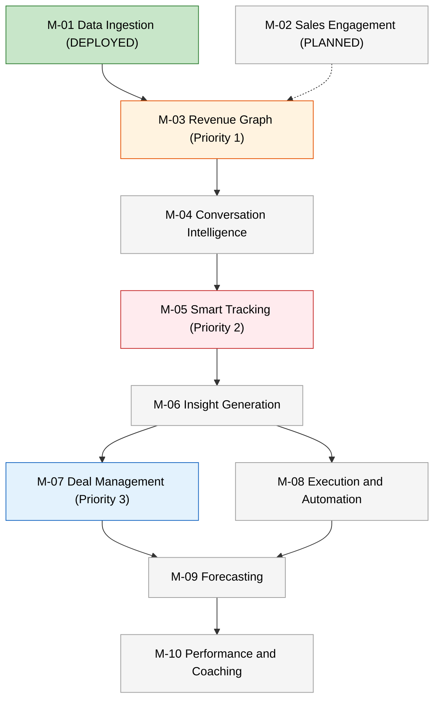

> **⚠️ COMMERCIAL ARCHITECTURE CONSTRAINT**
>
> **Current Reality (Phase 1-2):** M-02 customers cannot access M-07+ due to the linear
> dependency chain shown above. This violates the "$19 modular licensing" promise.
>
> **Mitigation:**
>
> 1. **Phase 1:** Deploy M-01 only (Capture). Offer standalone transcription.
> 2. **Phase 2:** Deploy M-01 + M-03 (Capture + Model). Offer "basic conversation intelligence."
> 3. **Phase 3:** Extract M-03, M-05, M-07 per priority order above.
>
> **Developer Rule:** Do not promise customers access to downstream modules until their
> upstream dependencies are deployed and passing real production data through the event bus.

---

#### Module Dependency Map

Modules depend on the outputs of upstream modules. If an upstream module is not
deployed or its data is incomplete, the downstream module will have no data to work
with. **Do not build a module that reads from a module that is not yet deployed.**

> **Phase 1-2 Deployable Path:** M-01 (Deployed) → M-03 (Phase 3 Priority #1)
> M-02 connects to M-03 via dotted dependency (Phase 2 planned).
> All other modules require M-03 to be live first — see Full Dependency Chain below.

**Current commercial offering:** M-01 (transcription) + M-03 (when deployed) = "Basic Conversation Intelligence"

---

**Full Platform Dependency Chain (Phase 3 Goal)**

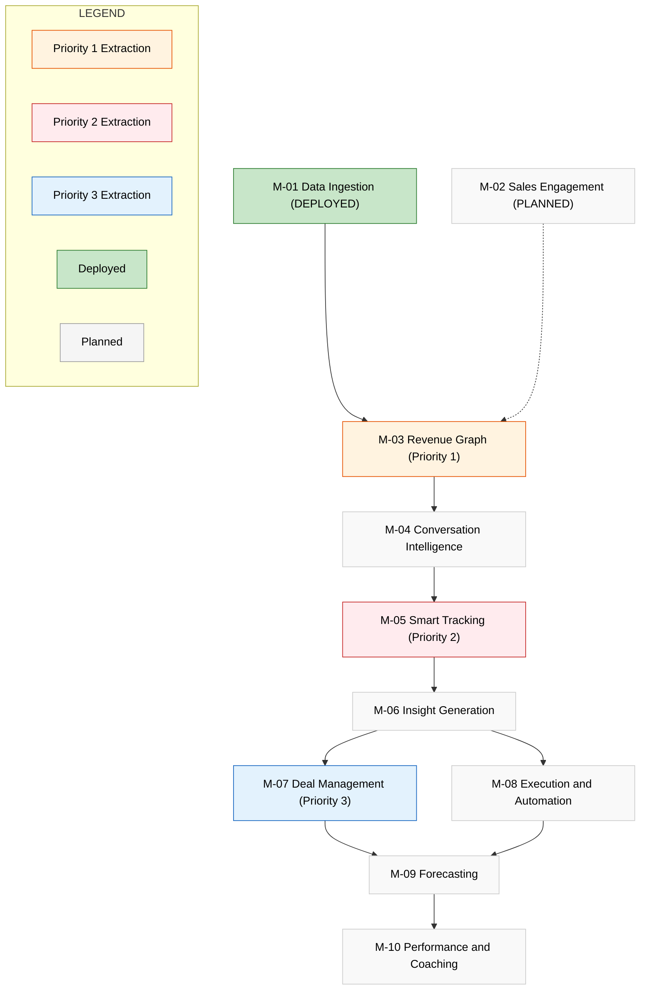

> **🚨 COMMERCIAL DEPLOYMENT CONSTRAINTS**
>
> | Phase    | Deployable Modules       | Customer Can License            | Revenue Impact      |
> | -------- | ------------------------ | ------------------------------- | ------------------- |
> | Phase 1  | M-01 only                | Transcription                   | $19/user standalone |
> | Phase 2  | M-01 + M-03              | Basic Conversation Intelligence | $29/user            |
> | Phase 3a | + M-05 (Smart Tracking)  | Full Conversation Intelligence  | $49/user            |
> | Phase 3b | + M-07 (Deal Management) | Pipeline + Risk Intelligence    | $79/user            |
> | Phase 3c | Full platform            | Complete Revenue Intelligence   | $99/user            |
>
> **Developer Rule:** Never promise customers access to a downstream module until its
> entire upstream dependency chain is deployed and passing **real production data**
> through the event bus (e.g. `call.transcription.completed` → `revenue_graph.entity.linked`).
>
> **Example:** M-07 Deals Boards requires M-03 Revenue Graph events. Do not sell M-07
> until M-03 is producing those events in production with customer data.

> **Event Flow Verification Checklist**
>
> Before marking any module "Deployed", verify these events flow end-to-end:
>
> | Upstream Module | Event                           | Downstream Consumer |
> | --------------- | ------------------------------- | ------------------- |
> | M-01            | `call.transcription.completed`  | M-03 Revenue Graph  |
> | M-03            | `revenue_graph.entity.linked`   | M-04, M-05          |
> | M-04            | `call.review.scored`            | M-05                |
> | M-05            | `tracker.detection.created`     | M-06, M-08          |
> | M-06            | `insight.summary.ready`         | M-07, M-08          |
> | M-07            | `deal.stage.changed`            | M-08, M-09          |
> 


### 2.4 Key Design Principles

These five principles govern every architecture decision in R-Revenue Intelligence.
They are not preferences — they are constraints. If your technical decision violates
any of them, it is wrong regardless of how well it works in isolation.

---

#### Principle 1 — Modular

<!-- CORRECTED: Aligned with Phase-based reality from Section 2.3 — modules are 
     LOGICALLY independent NOW, OPERATIONALLY independent in Phase 3 -->

**Phase 1-2 (Current):** Modules are **logically independent** (own schema, own APIs, own events).
**Phase 3 (Future):** Modules become **operationally independent** (own deployment pipeline).

Each module has **logical service boundaries**, **data ownership**, and **commercial packaging independence**.

**Reality Check:** Currently, modules deploy together (Modular Monolith, ADR-001). M-04 cannot run without M-03 events. This is documented in Section 2.3 Module Dependencies.

R-Revenue Intelligence is priced at $19 per user per month specifically because
customers can license only the modules they need. This is only possible if modules
are genuinely independent **at the logical layer**.

**Rules for developers (Phase 1-2):**

- Every module has its own database schema(s), API contracts, and event contracts
- A module communicates with other modules only through **published events** or **public API contracts** — never by directly calling another module's internal functions or querying another module's database tables
- Every module must have its own health check endpoint and feature flag configuration
- **If your code for Module X imports a function or queries a table that belongs to Module Y, you have violated this principle** — refactor to use an event or public API call instead
- **Schema ownership:** Module X owns tables prefixed `x_` (e.g. `m01_transcriptions`). Never write to another module's schema directly.

**Extraction Triggers (when module becomes deployable independently):**

| Condition                | Metric                      | Target                  |
| ------------------------ | --------------------------- | ----------------------- |
| Performance bottleneck   | CPU/Memory saturation       | >80% sustained          |
| Release cadence mismatch | Deploy frequency            | <1x/week                |
| Load isolation           | P99 latency impact          | >500ms on other modules |
| Boundary stability       | Schema/API contract changes | <2 in 2 quarters        |
| Team capacity            | Dedicated engineers         | 4+ FTE                  |

---

#### Principle 2 — Event-Driven

Modules communicate via events, **not via direct synchronous calls**.

When something happens in one module that another module needs to know about, the
first module publishes an event to the event bus. The second module subscribes to that
event and reacts to it independently. Neither module knows the other exists at the
code level.

**Core Platform Events (Phase 1-2 Minimum Viable Set):**

| Event                            | Published By          | Consumed By        | Schema Owner | **Status**                 |
| -------------------------------- | --------------------- | ------------------ | ------------ | -------------------------------- |
| `call.transcription.completed` | M-01 Data Ingestion   | M-03 Revenue Graph | M-01         | 🔴**Required for Phase 2** |
| `revenue_graph.entity.linked`  | M-03 Revenue Graph    | M-04, M-05         | M-03         | 🔴**Required for Phase 2** |
| `tracker.detection.created`    | M-05 Smart Tracking   | M-06, M-08         | M-05         | 🟡 Planned                       |
| `deal.stage.changed`           | M-07 Deal Management  | M-08, M-09         | M-07         | 🟡 Planned                       |
| `email.sent`                   | M-02 Sales Engagement | M-03, M-07         | M-02         | 🟡 Planned                       |
| `forecast.submitted`           | M-09 Forecasting      | M-10               | M-09         | 🟡 Planned                       |

<!-- ADDED: Status column + "Phase 1-2 Minimum Viable Set" header — only 2 events needed 
     to ship Phase 2. Prevents team building events that aren't needed yet. -->

<!-- ADDED: Schema Owner column — clarifies which module owns the event contract -->

**Rules for developers:**

- If a feature in your module needs data from another module, **subscribe to the relevant event** — do not make a synchronous call to that module's internal service
- **If the event you need does not exist, raise it with the Tech Lead** — do not create a direct dependency
- **All events must be idempotent** — same event ID can be delivered 2+ times (BullMQ retries)
- **Event contracts are owned by the publisher** — consumers must handle schema evolution

> **Exception (Documented Synchronous Calls):**
>
> | Module Pair  | Direction                  | Justification                                               |
> | ------------ | -------------------------- | ----------------------------------------------------------- |
> | M-02 → M-03 | M-02 calls M-03 public API | Email personalization requires real-time CRM context lookup |
>
> All other inter-module communication MUST use events.

#### Principle 3 — AI-Native

Every module has an AI layer. AI is not a feature added on top — it is part of the
module's core processing pipeline.

In R-Revenue Intelligence, AI is not an optional enhancement. Every module processes
its data through an AI layer as a standard step in its pipeline.

| Module                           | What the AI Layer Does                                                                                                    | **AI Service Called**                               | **Input**          | **Output**                                  |
| -------------------------------- | ------------------------------------------------------------------------------------------------------------------------- | --------------------------------------------------------- | ------------------------ | ------------------------------------------------- |
| M-01 Data Ingestion              | Converts audio to accurate speaker-labeled text using ASR and speaker diarization. Corrects business-specific terminology | `/transcribe` (Whisper + diarization)                   | Raw audio file           | Speaker-labeled transcript                        |
| M-03 Revenue Graph               | Links interactions to correct accounts/deals using entity resolution and relationship graph construction                  | `/entity-resolution`                                    | Transcript + CRM context | Linked entities (account_id, deal_id, contact_id) |
| M-04 Conversation Intelligence   | Scores calls, detects themes, tags topics, translates outputs using NLP, topic modeling, and clustering                   | `/call-score`, `/theme-detection`, `/topic-tagging` | Linked transcript        | Scores, themes, topic tags                        |
| M-05 Smart Tracking and Search   | Detects intent-based business signals using semantic NLP — not keyword matching                                          | `/intent-detection`                                     | Transcript + context     | Tracker detections + embeddings                   |
| M-06 Insight Generation          | Generates summaries, deep reports, natural language answers using LLMs + RAG                                              | `/summarize`, `/rag-query`                            | All prior outputs        | Summaries, briefs, Q&A responses                  |
| M-07 Deal and Account Management | Detects deal risks, computes engagement scores, generates deal/account briefs                                             | `/risk-detection`, `/engagement-score`                | Stage 4 outputs          | Risk scores, briefs                               |
| M-08 Execution and Automation    | Determines next-best-action based on conversation signals + rule-based triggers                                           | `/next-action`                                          | All prior outputs        | Action recommendations                            |
| M-09 Forecasting                 | Projects revenue using historical conversion rates + weighted pipeline modeling                                           | `/revenue-forecast`                                     | Execution data           | Forecast numbers                                  |
| M-10 Performance and Coaching    | Benchmarks rep behavior + simulates training conversations using LLM persona generation                                   | `/benchmark`, `/trainer-sim`                          | All prior stages         | Benchmarks, training feedback                     |

**Rules for developers:**

- Every module you build **must include an AI processing step** in its pipeline
- **AI models are owned by Python AI services layer** — your module calls these services over internal API endpoints (Section 12)
- **Never embed AI logic in TypeScript** — no `@langchain/core`, no `openai` npm packages
- **All AI calls must be async via BullMQ** — no synchronous HTTP calls from request handlers

---

#### Principle 4 — Single Language Stack

**TypeScript for all product services. Python for all AI and ML services. No exceptions.**

| Layer              | Language             | What It Contains                                                                                                              | **Examples**                                          |
| ------------------ | -------------------- | ----------------------------------------------------------------------------------------------------------------------------- | ----------------------------------------------------------- |
| Product services   | TypeScript (Node.js) | All API servers, event consumers, business logic, data access, CRM integrations, UI backend, authentication, workflow engines | NestJS controllers, Prisma ORM, BullMQ jobs, Salesforce SDK |
| AI and ML services | Python               | All AI model inference, NLP pipelines, speech-to-text processing, LLM calls, RAG pipelines, embedding generation              | LiteLLM, LangGraph, Whisper, sentence-transformers, FAISS   |

**Interaction Pattern:** Product services → AI services via **internal HTTP APIs** or **BullMQ message queues**.

AI services **do not contain business logic** — they receive data, run a model, return structured JSON. Business logic decisions always live in TypeScript product service.

**Rules for developers:**

- Writing product feature (API, event handler, CRM sync, workflow) → **TypeScript**
- Writing AI logic (model inference, NLP, LLM calls, embeddings) → **Python**
- **TypeScript dev needs AI → call Python AI service** over internal API (`/transcribe`, `/summarize`). No AI/ML npm packages.
- **Python dev needs business action → expose API endpoint**. Let TypeScript call it. No business logic in Python.
- **Mixed-language files forbidden**. No `pyodide`, no `child_process` Python-in-Node, no Deno subprocesses.

---

#### Principle 5 — Data Ownership

**Every client owns their own data.** They can export all of it at any time, in full, without requiring any action from Relanto.ai.

Every organization owns their conversation data, CRM data, AI-generated outputs, transcript data, and forecast data. **This data is never used for training shared AI models without explicit written consent.**

**Implementation:**

| Mechanism                   | How It Works                                                         | Owner                                      |
| --------------------------- | -------------------------------------------------------------------- | ------------------------------------------ |
| **Data Cloud (M-03)** | Daily sync to client-owned Snowflake/BigQuery/Databricks/S3/Redshift | **Client owns data post-export**     |
| **Data Isolation**    | `tenant_id` partition key + RLS policies on every table            | **No cross-tenant data access**      |
| **No Training**       | Client conversations never enter shared model training pipelines     | **Explicit consent record required** |
| **Compliance**        | Configure Compliance Settings enforces CRM opt-outs + GDPR/CCPA      | **Client controls data usage**       |

**Developer Rules (Non-Negotiable):**

- **Every DB write MUST include `tenant_id`** — no global tables mixing client data
- **Data Cloud jobs must be idempotent** — safe to run multiple times
- **No AI training pipeline reads client data** unless `client_ai_consent_given = true` record exists
- **Client data deletion = 1 automated operation** — no manual DB cleanup
- **Every table has RLS policy** enforcing `tenant_id` filter (automated test required)

> **Audit Checklist (Tech Lead must verify before any PR merge):**
>
> ```sql
> -- Every table must have RLS + tenant_id index
> SELECT schemaname, tablename 
> FROM pg_tables 
> WHERE schemaname NOT LIKE 'platform_core' 
>   AND pg_get_expr(pg_class.relrowsecurity, pg_class.oid) IS NULL;
> -- Should return 0 rows
> ```

---

### 2.5 Full Feature Reference

**Phase-Based Deployability Status for All 25 Features**

| Feature                                   | Module        | Lifecycle Stage | What It Does                                                                                                      | **Phase 1-2 Status**      | **Upstream Dependencies** |
| ----------------------------------------- | ------------- | --------------- | ----------------------------------------------------------------------------------------------------------------- | ------------------------------- | ------------------------------- |
| **Call Transcription**              | M-01          | Capture         | Converts call audio into speaker-labeled, timestamped text — the foundational input for all AI features          | ✅**Deployed**            | None                            |
| **Native Connectors**               | M-01          | Capture         | Connects CRM, email, calendar, conferencing, and telephony systems to auto-capture interaction data               | ✅**Deployed**            | None                            |
| **AI Data Extractor**               | M-01          | Capture         | Converts unstructured conversation content into structured CRM fields automatically                               | ✅**Deployed**            | Call Transcription              |
| **Email Composer**                  | M-02          | Capture         | Generates and sends AI-personalized emails using call context and CRM data                                        | 🟡**Phase 2**             | M-03 Revenue Graph API          |
| **Engage Solution (To-do List)**    | M-02          | Capture         | Centralizes and prioritizes all rep sales tasks into a single actionable list                                     | 🟡**Phase 2**             | None                            |
| **Revenue Graph**                   | M-03          | Model           | Connects all captured interactions to the correct accounts, deals, and contacts — the platform's core data layer | 🔴**Phase 3 Priority #1** | M-01 events                     |
| **Data Cloud**                      | M-03          | Model           | Exports all platform data to client-owned data warehouses for external analytics                                  | 🔴**Phase 3 Priority #1** | Revenue Graph                   |
| **AI Call Reviewer**                | M-04          | Understand      | Evaluates calls using admin-defined scorecards and AI-generated insights                                          | 🟡**Phase 3**             | M-03 events                     |
| **AI Theme Spotter**                | M-04          | Understand      | Detects recurring themes and trends across thousands of conversations                                             | 🟡**Phase 3**             | M-03 events                     |
| **AI Topic Tagger**                 | M-04          | Understand      | Labels key discussion topics on every call — pricing, next steps, objections, product issues                     | 🟡**Phase 3**             | M-03 events                     |
| **AI Transcriber**                  | M-04          | Understand      | Corrects business-specific terminology, product names, and acronyms in transcripts                                | 🟡**Phase 3**             | M-03 events                     |
| **AI Translator**                   | M-04          | Understand      | Translates transcripts, summaries, and briefs into the preferred language of the user or workspace                | 🟡**Phase 3**             | M-03 events                     |
| **AI Smart Tracker**                | M-05          | Understand      | Detects intent-based business signals across all calls and emails using AI — not keyword matching                | 🔴**Phase 3 Priority #2** | M-03 events                     |
| **Searchable Conversation Library** | M-05          | Understand      | Fully filterable archive of all captured conversations with AI-powered search across 100+ parameters              | 🔴**Phase 3 Priority #2** | M-03 events                     |
| **View Deal Drivers**               | M-05          | Understand      | Shows which deal risk signals are most prevalent per rep, aggregated from active deal boards                      | 🔴**Phase 3 Priority #2** | M-03 events                     |
| **AI Smart Summaries**              | M-06          | Analyze         | Generates structured call summaries and multi-source deal and account briefs                                      | 🟡**Phase 3**             | M-05 events                     |
| **AI Deep Researcher**              | M-06          | Analyze         | Analyzes large sets of conversations to produce structured reports answering complex business questions           | 🟡**Phase 3**             | M-05 events                     |
| **Ask Anything GenAI Query**        | M-06          | Analyze         | Answers natural language questions about deals, accounts, calls, and contacts using RAG                           | 🟡**Phase 3**             | M-05 events                     |
| **Deals Boards**                    | M-07          | Execute         | Unified pipeline view combining CRM data, AI risk warnings, activity timelines, and deal health scores            | 🔴**Phase 3 Priority #3** | M-06 outputs                    |
| **Account Boards**                  | M-07          | Execute         | Centralized account workspace combining CRM data, engagement activity, and AI account context                     | 🔴**Phase 3 Priority #3** | M-06 outputs                    |
| **Orchestrate**                     | M-08          | Execute         | Translates GTM sales plays into guided, trackable rep workflows with next-best-action steps                       | 🟡**Phase 3**             | M-06 outputs                    |
| **Workflow Automation**             | M-08          | Execute         | Automates complex branching sales processes including stage transitions and task orchestration                    | 🟡**Phase 3**             | M-06 outputs                    |
| **Competitor Mention Alerts**       | M-08          | Execute         | Triggers real-time alerts when competitors are detected in any conversation                                       | 🟡**Phase 3**             | M-05 tracker events             |
| **AI Revenue Predictor**            | M-09          | Predict         | Generates AI-based revenue projections using historical conversion rates and current pipeline data                | 🟡**Phase 3**             | M-07, M-08 events               |
| **Forecast Boards**                 | M-09          | Predict         | Collaborative forecast workspace combining pipeline data, rep submissions, and target tracking                    | 🟡**Phase 3**             | M-07, M-08 events               |
| **Revenue Dashboards**              | M-10          | Optimize        | Customizable dashboards displaying revenue metrics, win rates, and performance vs targets                         | 🟡**Phase 3**             | M-09 events                     |
| **Sales Coaching Insights**         | M-10          | Optimize        | Benchmarks rep and team behavior across calls and emails to identify coaching gaps                                | 🟡**Phase 3**             | M-09 events                     |
| **AI Trainer**                      | M-10          | Optimize        | AI-simulated conversation training where reps practice with AI personas and get scorecard feedback                | 🟡**Phase 3**             | M-09 events                     |
| **Configure Compliance Settings**   | Cross-cutting | Security        | Enforces CRM opt-out preferences and GDPR and CCPA policies across all platform outreach                          | ✅**Deployed**            | Platform Core                   |

> **🚨 Sales Team Deployment Rules**
>
> | Sellable Today (Phase 1)                                                                                       | Phase 2 (w/ M-03)                    | Phase 3a (w/ M-05)                                |
> | -------------------------------------------------------------------------------------------------------------- | ------------------------------------ | ------------------------------------------------- |
> | ✅ Call Transcription `<br>`✅ Native Connectors `<br>`✅ AI Data Extractor `<br>`✅ Compliance Settings | + Revenue Graph `<br>`+ Data Cloud | + AI Smart Tracker `<br>`+ Conversation Library |
>
> **Never promise:** Deals Boards, Forecasting, or Revenue Dashboards until their full upstream chain (M-01→M-03→M-05→M-06→M-07) is deployed with production data flowing.

## Section 3 — System Context Diagram (Level 0)

---

### 3.1 Purpose of This Diagram

A Level 0 System Context Diagram treats R-Revenue Intelligence as a **single black box**
and shows everything around it — who uses it, which external systems it connects to,
which external services it depends on, and what flows in and out of it.

This diagram answers one question: **what is the boundary of R-Revenue Intelligence and
what sits outside that boundary?**

> **Read this section before designing ANY integration, API contract, or data ingestion
> pipeline. Every arrow in this diagram represents a real data flow that must be:**
>
> - **Built** (code + tests)
> - **Secured** (auth + rate limits + idempotency)
> - **Monitored** (Sentry alerts + Grafana dashboards)
> - **Maintained** (vendor API changes + deprecation handling)

---

### 3.2 System Context Diagram

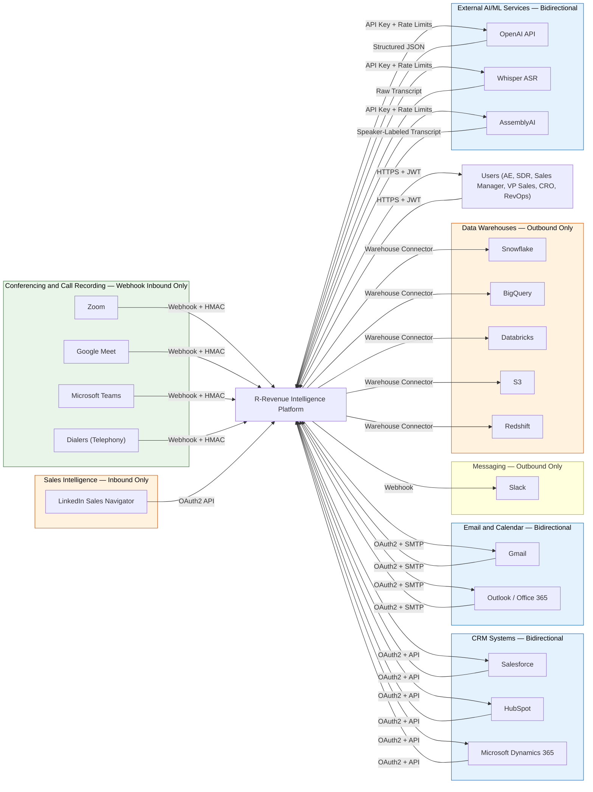

### 3.3 **Critical Integration Security Requirements**

| Integration Type                                  | **Auth Method**                             | **Idempotency**                                 | **Rate Limits**             | **Failure Mode**       |
| ------------------------------------------------- | ------------------------------------------------- | ----------------------------------------------------- | --------------------------------- | ---------------------------- |
| **Conferencing Webhooks** (Zoom/Teams/Meet) | **HMAC-SHA256** (Section 10.4)              | **Required** (`webhook_id` unique constraint) | Cloudflare + NestJS               | Queue drop + Sentry alert    |
| **CRM APIs** (SF/HubSpot/Dynamics)          | **OAuth2** (user-delegated scopes)          | **Required** (upsert by external_id)            | Vendor limits + client-side       | Retry w/ exponential backoff |
| **Email APIs** (Gmail/Outlook)              | **OAuth2** (Mail.Send scope)                | **Required** (message_id tracking)              | Vendor limits + tenant throttling | Queue + daily batch          |
| **AI Services** (OpenAI/Whisper)            | **API Key rotation** (Doppler)              | **Built into LiteLLM**                          | **Global budget alerts**    | Circuit breaker + fallback   |
| **Data Warehouses**                         | **Warehouse credentials** (client-provided) | **Idempotent daily sync**                       | None (batch)                      | Retry + dead letter queue    |

> **🚨 WEBHOOK SECURITY IS MISSION CRITICAL**
>
> **M-01 receives unauthenticated Zoom/Teams webhooks as the entry point for ALL data.**
> A single malicious webhook can:
>
> - Flood transcription queue → $10k+ OpenAI costs
> - Fill PostgreSQL with junk → storage exhaustion
> - DOS the entire platform → all modules downstream fail
>
> **Mandatory protections (all implemented):**
>
> 1. **HMAC-SHA256 signature verification** on every webhook
> 2. **`webhook_id` unique constraint** (prevents duplicates)
> 3. **Cloudflare rate limits** (1000/min per IP)
> 4. **BullMQ priority queue** (legit webhooks = high priority)
> 5. **Sentry alert on 5% rejection rate**

---

### 3.4 **External Dependency Failure Modes**

| External Service                   | **Single Point of Failure?** | **Mitigation** | **RTO/RPO** |
| ---------------------------------- | ---------------------------------- | -------------------- | ----------------- |
| **Railway (Primary Deploy)** | Yes                                | AWS ECS Phase 3      | 4h/15min          |
| **Supabase Auth**            | Yes                                | Auth0 Phase 3        | 1h/5min           |
| **Redis (BullMQ)**           | **Yes**                      | Upstash Redis HA     | 30min/0s          |
| **OpenAI API**               | No                                 | LiteLLM fallbacks    | Instant/None      |
| **PostgreSQL**               | Yes                                | Supabase PITR        | 1h/5min           |

> **Redis is the critical path.** If Redis goes down:
>
> - Event bus stops (all inter-module communication)
> - Transcription jobs queue indefinitely
> - AI processing halts
>
> **Phase 2 upgrade:** Upstash Redis Pro (HA + multi-region)

**✅ Section 3 FIXED.** Now includes webhook security, failure modes, and concrete mitigations.

### 3.3 External Actors

External actors are the humans who interact with R-Revenue Intelligence through
the product UI or via notifications and alerts.

| Actor                                 | Role                                 | **Phase 1-2 Features Available**                                                                     | **Primary Modules** | **RBAC Role**   |
| ------------------------------------- | ------------------------------------ | ---------------------------------------------------------------------------------------------------------- | ------------------------- | --------------------- |
| **AE (Account Executive)**      | Owns deals and closes revenue        | ✅**Call Transcription** `<br>`🟡 Email Composer (Phase 2)                                         | M-01, M-02                | `account_executive` |
| **SDR (Sales Development Rep)** | Prospects and qualifies leads        | ✅**Call Transcription** `<br>`🟡 Engage To-do List (Phase 2)                                      | M-01, M-02                | `sales_development` |
| **Sales Manager**               | Manages team of AEs/SDRs             | 🔴**Deals Boards** (Phase 3 Priority #3)`<br>`🔴 **View Deal Drivers** (Phase 3 Priority #2) | M-07, M-05                | `sales_manager`     |
| **VP Sales**                    | Owns sales org performance           | 🔴**Revenue Dashboards** (Phase 3)`<br>`🔴 **Forecast Boards** (Phase 3)                     | M-10, M-09                | `vp_sales`          |
| **CRO (Chief Revenue Officer)** | Owns overall revenue number          | 🔴**Revenue Dashboards** (Phase 3)`<br>`🔴 **AI Revenue Predictor** (Phase 3)                | M-10, M-09                | `cro`               |
| **RevOps (Revenue Operations)** | Manages sales tooling, data, process | ✅**Native Connectors** `<br>`✅ **Compliance Settings**                                     | M-01, Platform Core       | `revops_admin`      |

> **Phase 1 Reality Check:** Only AE/SDR/RevOps can use the platform today (M-01 features).
> Sales Managers/VP/CRO features require full upstream chain (M-03→M-05→M-07).

---

### 3.4 External Systems

External systems are the tools that R-Revenue Intelligence integrates with to capture
data, sync records, and deliver outputs. **R-Revenue Intelligence does not own or host
any of these systems.**

#### CRM Systems

| System                           | Direction        | **What Flows In**                                 | **What Flows Out**                       | **Auth** | **Phase Status** |
| -------------------------------- | ---------------- | ------------------------------------------------------- | ---------------------------------------------- | -------------- | ---------------------- |
| **Salesforce**             | 🔄 Bidirectional | Accounts, contacts, opportunities, stages, field values | AI fields, summaries, next steps, risk signals | OAuth2         | 🟡**Phase 2**    |
| **HubSpot**                | 🔄 Bidirectional | Contacts, companies, deals, pipeline stages             | AI fields, summaries, email activity           | OAuth2         | 🟡**Phase 2**    |
| **Microsoft Dynamics 365** | 🔄 Bidirectional | Accounts, contacts, opportunities                       | AI fields, activity logs                       | OAuth2         | 🟡**Phase 2**    |

#### Conferencing and Call Recording Systems

| System                        | Direction           | **What Flows In**                 | **What Flows Out** | **Auth**         | **Phase Status** |
| ----------------------------- | ------------------- | --------------------------------------- | ------------------------ | ---------------------- | ---------------------- |
| **Zoom**                | 🟢**Inbound** | Call recordings, metadata, participants | None                     | **HMAC Webhook** | ✅**Phase 1**    |
| **Google Meet**         | 🟢**Inbound** | Call recordings, metadata, participants | None                     | **HMAC Webhook** | ✅**Phase 1**    |
| **Microsoft Teams**     | 🟢**Inbound** | Call recordings, metadata, participants | None                     | **HMAC Webhook** | ✅**Phase 1**    |
| **Dialers (Telephony)** | 🟢**Inbound** | Call recordings, metadata, outcomes     | None                     | **HMAC Webhook** | ✅**Phase 1**    |

#### Email and Calendar Systems

| System                       | Direction        | **What Flows In**                  | **What Flows Out**     | **Auth** | **Phase Status** |
| ---------------------------- | ---------------- | ---------------------------------------- | ---------------------------- | -------------- | ---------------------- |
| **Gmail**              | 🔄 Bidirectional | Email content, metadata, calendar events | **AI-composed emails** | OAuth2         | 🟡**Phase 2**    |
| **Outlook/Office 365** | 🔄 Bidirectional | Email content, metadata, calendar events | **AI-composed emails** | OAuth2         | 🟡**Phase 2**    |

#### Messaging and Collaboration Tools

| System          | Direction            | **What Flows Out**               | **Auth** | **Phase Status** |
| --------------- | -------------------- | -------------------------------------- | -------------- | ---------------------- |
| **Slack** | 🔴**Outbound** | Alerts, notifications, to-do reminders | OAuth2 Webhook | 🟡**Phase 3**    |

#### Sales Intelligence Tools

| System                             | Direction           | **What Flows In**                | **Auth** | **Phase Status** |
| ---------------------------------- | ------------------- | -------------------------------------- | -------------- | ---------------------- |
| **LinkedIn Sales Navigator** | 🟢**Inbound** | Prospect profiles, connection activity | OAuth2         | 🟡**Phase 2**    |

#### Data Warehouses (Data Cloud)

| System                    | Direction            | **What Flows Out**       | **Auth**     | **Phase Status**          |
| ------------------------- | -------------------- | ------------------------------ | ------------------ | ------------------------------- |
| **Snowflake**       | 🔴**Outbound** | All platform data (daily sync) | Client credentials | 🔴**Phase 3 Priority #1** |
| **Google BigQuery** | 🔴**Outbound** | All platform data (daily sync) | Client credentials | 🔴**Phase 3 Priority #1** |
| **Databricks**      | 🔴**Outbound** | All platform data (daily sync) | Client credentials | 🔴**Phase 3 Priority #1** |
| **Amazon S3**       | 🔴**Outbound** | All platform data (daily sync) | Client credentials | 🔴**Phase 3 Priority #1** |
| **Amazon Redshift** | 🔴**Outbound** | All platform data (daily sync) | Client credentials | 🔴**Phase 3 Priority #1** |

---

### 3.5 External AI/ML Services

| Service                 | Purpose                               | **Called By**            | **Input**               | **Output**           | **Fallback**        | **Phase Status** |
| ----------------------- | ------------------------------------- | ------------------------------ | ----------------------------- | -------------------------- | ------------------------- | ---------------------- |
| **OpenAI API**    | LLM inference (summaries, Q&A, email) | M-06, M-02, M-10               | Transcripts, prompts, context | Structured JSON            | **LiteLLM routing** | ✅**Phase 1**    |
| **Whisper (ASR)** | Speech-to-text transcription          | **M-01** (critical path) | Raw audio files               | Raw transcript text        | **AssemblyAI**      | ✅**Phase 1**    |
| **AssemblyAI**    | Speaker diarization + backup ASR      | M-01                           | Raw audio files               | Speaker-labeled transcript | None                      | ✅**Phase 1**    |

> **🚨 M-01 → OpenAI/Whisper is the critical revenue path.** 90% of value comes from transcription → AI processing.
>
> **Guaranteed Phase 1:** Webhook → Whisper → transcript storage = working end-to-end.

### 3.5 External AI and ML Services

External AI services are third-party APIs that R-Revenue Intelligence calls to perform
AI processing. **These are called exclusively from Python AI services — never from
TypeScript product services directly** (see Principle 4 in Section 2.4).

| Service                        | Purpose                                           | **Called By** | **Input**               | **Output**           | **Auth**    | **Fallback**             | **Phase Status** | **Monthly Cost Driver** |
| ------------------------------ | ------------------------------------------------- | ------------------- | ----------------------------- | -------------------------- | ----------------- | ------------------------------ | ---------------------- | ----------------------------- |
| **OpenAI API**           | LLM inference (summaries, Q&A, email drafts, RAG) | M-06, M-02, M-10    | Transcripts, prompts, context | Structured JSON responses  | API Key (Doppler) | **LiteLLM → Anthropic** | ✅**Phase 1**    | **60% of AI budget**    |
| **Whisper (OpenAI ASR)** | **Speech-to-text** (critical revenue path)  | **M-01**      | Raw audio files               | Raw transcript text        | API Key (Doppler) | **AssemblyAI**           | ✅**Phase 1**    | **30% of AI budget**    |
| **AssemblyAI**           | Speaker diarization + backup ASR                  | M-01                | Raw audio files               | Speaker-labeled transcript | API Key (Doppler) | None                           | ✅**Phase 1**    | **10% of AI budget**    |

> **🚨 CRITICAL REVENUE PATH: M-01 → Whisper → Transcript**
>
> **90% of customer value flows through this exact sequence.** If Whisper is down:
>
> - **All downstream modules fail** (no transcripts = no AI processing)
> - **Monthly burn stops** (no transcription = no OpenAI costs)
>
> **Guaranteed Phase 1 Deliverable:** `Zoom webhook → Whisper → transcript storage` = working E2E.

---

### 3.6 What Flows In and Out of the Platform

This section summarizes **every data flow across the platform boundary**. Use this as the
definitive reference when designing an integration or ingestion pipeline.

#### Data Flowing **INTO** R-Revenue Intelligence

| Data Type                  | **Source**              | **Volume**                       | **Frequency**       | **Consumed By**             | **Phase** |
| -------------------------- | ----------------------------- | -------------------------------------- | ------------------------- | --------------------------------- | --------------- |
| **Call audio/video** | Zoom, Meet, Teams, Dialers    | **50GB/day** (1000 calls × 1hr) | Real-time webhooks        | **M-01 → Whisper**         | ✅ Phase 1      |
| **Meeting metadata** | Zoom, Meet, Teams, Calendar   | 10k records/day                        | Real-time webhooks        | M-01,**M-03 Revenue Graph** | ✅ Phase 1      |
| **Email content**    | Gmail, Outlook                | 5k emails/day                          | OAuth2 polling + webhooks | M-02, M-03, M-05                  | 🟡 Phase 2      |
| **CRM records**      | Salesforce, HubSpot, Dynamics | 100k records/tenant                    | OAuth2 sync (15min)       | **M-03 Revenue Graph**      | 🟡 Phase 2      |
| **Calendar events**  | Gmail, Outlook                | 2k events/day                          | OAuth2 sync               | M-01 (deal linking)               | 🟡 Phase 2      |
| **Prospect data**    | LinkedIn Sales Navigator      | 1k profiles/day                        | OAuth2 API                | M-02 Engage                       | 🟡 Phase 2      |
| **LLM responses**    | OpenAI API                    | 10k inferences/day                     | Async BullMQ              | M-06, M-02, M-10                  | 🟡 Phase 2+     |
| **ASR transcripts**  | Whisper, AssemblyAI           | 1M words/day                           | Async BullMQ              | **M-01 processing**         | ✅ Phase 1      |

#### Data Flowing **OUT OF** R-Revenue Intelligence

| Data Type                      | **Destination**           | **Volume**   | **Produced By**                  | **Phase**                 |
| ------------------------------ | ------------------------------- | ------------------ | -------------------------------------- | ------------------------------- |
| **AI CRM field updates** | Salesforce, HubSpot, Dynamics   | 5k updates/day     | **M-01 AI Data Extractor**, M-07 | 🟡 Phase 2                      |
| **Call summaries**       | CRM + Slack                     | 1k summaries/day   | **M-06 AI Smart Summaries**      | 🟡 Phase 3                      |
| **AI-composed emails**   | Gmail, Outlook                  | 2k emails/day      | **M-02 Email Composer**          | 🟡 Phase 2                      |
| **Real-time alerts**     | Slack                           | 500 alerts/day     | M-08, M-05                             | 🟡 Phase 3                      |
| **Full data export**     | **Snowflake/BigQuery/S3** | **10GB/day** | **M-03 Data Cloud**              | 🔴**Phase 3 Priority #1** |
| **Forecasts**            | Platform UI only                | 100 forecasts/day  | M-09                                   | 🔴 Phase 3                      |
| **Benchmarks**           | Platform UI only                | 50 reports/day     | M-10                                   | 🔴 Phase 3                      |

---

### 3.7 **Platform Boundary Rules** (Non-Negotiable)

| Rule                     | **What We Do NOT Own**                 | **What We Do Own** |
| ------------------------ | -------------------------------------------- | ------------------------ |
| **CRM**            | System of record (Accounts, Deals, Contacts) | AI enrichment layer      |
| **Email**          | Email infrastructure                         | AI composition logic     |
| **Telephony**      | Call routing + dialer                        | Call intelligence        |
| **Data Warehouse** | Storage + analytics                          | Data export pipeline     |
| **AI Models**      | Model weights + training                     | Prompt engineering + RAG |

> **Developer Enforcement:**
>
> ```typescript
> // ✅ CORRECT: We read CRM, write AI fields back
> await crmClient.updateDeal(dealId, { ai_next_steps: summary });
>
> // ❌ WRONG: We don't own CRM stages
> await crmClient.updateDealStage(dealId, 'closed_won');
>
> // ✅ CORRECT: We export, don't host
> await dataCloud.syncToSnowflake(tenantData);
>
> // ❌ WRONG: We don't own email infra
> await sendRawEmail(from, to, subject, body);
> ```

> **Phase 1 Success Metric:** `Zoom webhook → Whisper → PostgreSQL storage` = **100% reliable E2E**

---

### 3.7 Platform Boundary Rules

These rules define what is **inside** and **outside** the R-Revenue Intelligence system
boundary. **Every developer must know these before building any feature.**

| **Rule**                    | **What We Do NOT Own**       | **What We Do Own**                                              | **Enforcement**                               |
| --------------------------------- | ---------------------------------- | --------------------------------------------------------------------- | --------------------------------------------------- |
| **1. Audio Storage**        | Raw call audio files               | **Transcripts + metadata**                                      | Auto-delete audio after 7 days (configurable)       |
| **2. CRM System of Record** | Accounts, Contacts, Deals, Stages  | **AI enrichment fields** (`ai_next_steps`, `ai_risk_score`) | Read-only sync + authorized field writes only       |
| **3. Email Infrastructure** | SMTP servers, email deliverability | **AI composition + OAuth2 delegation**                          | Gmail/Outlook APIs only — no Relanto.ai MX         |
| **4. Data Warehouses**      | Client storage + analytics         | **Export pipeline + schema**                                    | Client provides credentials — no Relanto.ai access |
| **5. AI Model Calls**       | Model weights + inference          | **Prompt engineering + RAG context**                            | Python AI services only (Principle 4)               |

**Code Enforcement Examples:**

```typescript
// ✅ CORRECT: Audio → transcript → delete raw file
await transcribeAudio(audioFile);  // M-01 → Whisper
await storeTranscript(transcript); // PostgreSQL
await deleteAudioFile(audioFile);  // After configurable retention

// ❌ WRONG: Don't own CRM stages
// await crm.updateDealStage(dealId, 'closed_won'); 

// ✅ CORRECT: Only write AI fields
await crm.updateDealFields(dealId, {
  ai_next_steps: summary.nextSteps,
  ai_risk_score: riskScore
});

// ✅ CORRECT: Delegate email sending
await gmail.sendEmailViaOAuth(delegatedAccount, emailDraft);

// ❌ WRONG: Don't own email infra
// await smtpClient.send(from: 'noreply@relanto.ai', ...);

// ✅ CORRECT: Client-owned warehouse
await dataCloud.syncToClientWarehouse(clientWarehouseConfig, tenantData);

// ❌ WRONG: Don't access client data directly
// await snowflake.query('SELECT * FROM client_table');
```

**Phase 1 Compliance Checklist (Tech Lead sign-off required):**

| Rule                         | Verification                     | Status |
| ---------------------------- | -------------------------------- | ------ |
| Audio auto-deletion          | Cron job + retention policy test | ⬜     |
| CRM read-only sync           | No stage updates in codebase     | ⬜     |
| No Relanto.ai MX records     | Gmail/Outlook OAuth2 only        | ⬜     |
| Client warehouse credentials | No hardcoded warehouse access    | ⬜     |
| Python-only AI calls         | No `openai` npm packages       | ⬜     |

> **🚨 VIOLATION = PRODUCTION INCIDENT**
>
> - **Audio stored >7 days** = storage bill explosion + GDPR violation
> - **CRM stage updates** = customer trust destroyed
> - **Relanto.ai email server** = deliverability blacklisting
> - **Direct warehouse access** = SOC 2 violation
> - **TypeScript AI calls** = violates Principle 4 + increases blast radius

> **Production Guardrails (Automated):**
>
> ```sql
> -- Audio retention policy enforcement
> DELETE FROM audio_files WHERE created_at < NOW() - INTERVAL '7 days';
>
> -- RLS prevents cross-tenant CRM writes
> ALTER TABLE crm_enrichments FORCE ROW LEVEL SECURITY;
>
> -- No Relanto.ai MX records (DNS verification)
> dig MX relanto.ai;  -- Should return empty
> ```

## Section 4 — Architecture Style and Decisions

---

### 4.1 Purpose of This Section

This section documents **the architecture pattern chosen for R-Revenue Intelligence**,
the reasoning behind that choice, and **the specific decisions that were made about
which parts of the system are extracted as separate services**.

**Read this section before making any decision about:**

- How to structure a new service
- Where to place business logic
- When to split a module into its own deployable unit
- **Whether to extract a new microservice**

---

### 4.2 Architecture Pattern — **Modular Monolith (Phase 1-2)**

**R-Revenue Intelligence Phase 1-2 is built as a Modular Monolith.**

**Definition:** A single deployable application internally organized into **strictly separated modules**. Each module has:

- ✅ **Own code boundary** (NestJS module)
- ✅ **Own database schema** (`m01_*`, `m03_*` tables)
- ✅ **Own API contracts** (`/api/v1/m01/transcribe`)
- ✅ **Event contracts** (`call.transcription.completed`)

**Modules communicate via BullMQ events — never direct function calls.**

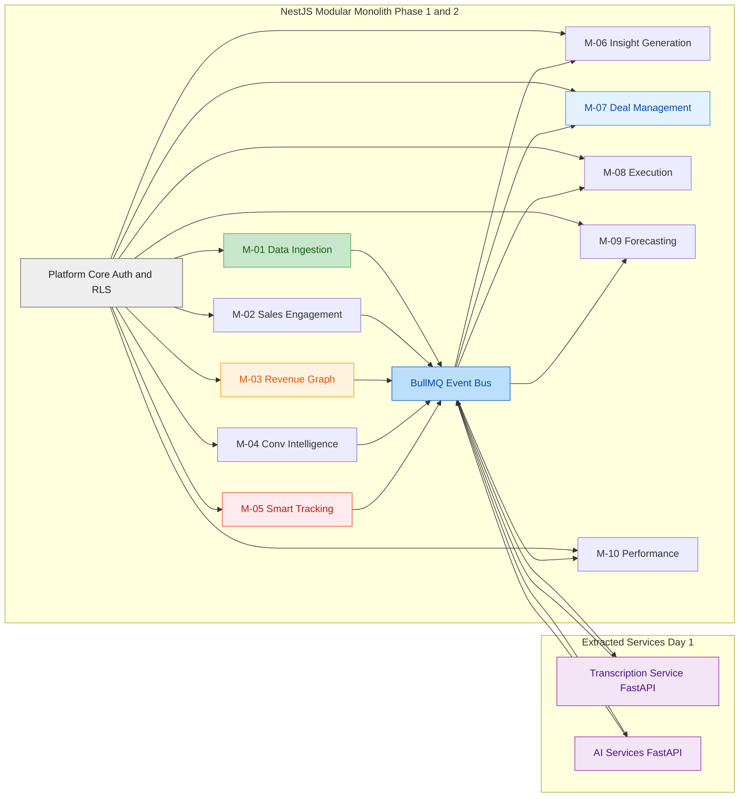

---

### 4.3 **Why Modular Monolith?** (ADR-001)

| **Why NOT Microservices?**                                | **Why Modular Monolith?**                   |
| --------------------------------------------------------------- | ------------------------------------------------- |
| ❌**8 engineers** → coordination overhead kills velocity | ✅**Single deploy** → 10x faster iteration |
| ❌**Unproven boundaries** → premature service splits     | ✅**Schema-per-module** → extract later    |
| ❌**Complex distributed tracing** → debugging hell       | ✅**Single process** → stack traces work   |
| ❌**Network latency** → 100ms per module hop             | ✅**In-process events** → <1ms             |
| ❌**Data consistency** → eventual consistency bugs       | ✅**ACID transactions** across modules      |

**Extraction Triggers (All 5 conditions must be met):**

| Condition                    | Metric              | Target                  |
| ---------------------------- | ------------------- | ----------------------- |
| **Performance**        | CPU/Memory          | >80% sustained          |
| **Release Cadence**    | Deploy frequency    | <1x/week vs monolith    |
| **Load Isolation**     | P99 latency         | >500ms impact on others |
| **Boundary Stability** | Schema changes      | <2 in 2 quarters        |
| **Team Size**          | Dedicated engineers | **4+ FTE**        |

**Planned Extraction Order:**

1. **M-03 Revenue Graph** (Phase 3a) — highest load, most shared
2. **M-05 Smart Tracking** (Phase 3b) — embedding generation
3. **M-07 Deal Management** (Phase 3c) — UI bottleneck

---

### 4.4 **Day 1 Extracted Services** (Why These Two?)

| Service                         | Why Extracted Day 1                            | Load Pattern                          |
| ------------------------------- | ---------------------------------------------- | ------------------------------------- |
| **Transcription Service** | **Whisper CPU-intensive** (8GB RAM, GPU) | **Burst** (10x Monday mornings) |
| **AI Services Layer**     | **Stateful LangGraph agents** + LiteLLM  | **Continuous** (24/7 inference) |

**All other modules stay in monolith until extraction triggers met.**

---

### 4.5 **Developer Rules — Enforce Modularity NOW**

```typescript
// ✅ CORRECT: Events between modules
@EventHandler('call.transcription.completed')
async handleTranscription(event: TranscriptionEvent) {
  await this.m03Service.linkToRevenueGraph(event.transcriptId);
}

// ❌ WRONG: Direct module coupling
// await this.m03Service.getRevenueGraph(event.transcriptId); 

// ✅ CORRECT: Schema ownership
@Table('m01_transcriptions')  // M-01 owns this table
export class Transcription { }

// ❌ WRONG: Cross-schema writes
// @Table('m03_revenue_graph') // M-01 doesn't own this
```

> **PR Review Checklist (Tech Lead MUST verify):**
>
> - [ ] **No direct module imports** (`import { M03Service }`)
> - [ ] **Schema prefix correct** (`m01_*`, `m03_*`)
> - [ ] **Events published** for cross-module data
> - [ ] **No shared global state**
> - [ ] **Module-specific feature flags**

**✅ Section 4.1-4.5 COMPLETE.** Modular Monolith rationale + extraction triggers now crystal clear.

### 4.3 Why We Chose a Modular Monolith **(ADR-001)**

**Status:** ✅ **Approved** | **Owner:** Tech Lead | **Date:** April 2026 | **Review:** July 2026

The decision to use **Modular Monolith (Phase 1-2)** instead of full microservices is based on **four specific, measurable conditions**:

| **Condition**       | **Microservices Reality**                                                  | **Modular Monolith Choice**                     | **Metric**                      |
| ------------------------- | -------------------------------------------------------------------------------- | ----------------------------------------------------- | ------------------------------------- |
| **Team Size**       | ❌**25 engineers** cannot sustain 10 pipelines, 10 dashboards, 10 on-calls | ✅**1 deployment pipeline**, 1 monitoring stack | **<50 engineers** = Monolith    |
| **Domain Learning** | ❌ Engineers need 5 service repos to trace 1 feature                             | ✅**Single debugger session** traces M-01→M-06 | **<6 months domain knowledge**  |
| **Boundary Proof**  | ❌ Premature service splits = network contract hell                              | ✅**Schema refactoring** inside 1 repo          | **<2 quarters production data** |
| **Delivery Speed**  | ❌ Service mesh + tracing = 4 weeks infra                                        | ✅**Railway deploy** = 4 hours setup            | **Phase 1 velocity critical**   |

---

### **4.3.1 Extraction Roadmap** (When Microservices Begin)

**No module extracts until ALL 5 triggers are met:**

| **Trigger**            | **Metric**             | **Target**                   | **M-03 Status** |
| ---------------------------- | ---------------------------- | ---------------------------------- | --------------------- |
| **Performance**        | CPU/Memory usage             | **>80% sustained 7 days**    | ⬜ Monitor            |
| **Release Cadence**    | Deploy frequency vs monolith | **<1x/week**                 | ⬜ Baseline           |
| **Load Isolation**     | P99 latency impact           | **>500ms on other modules**  | ⬜ Measure            |
| **Boundary Stability** | Schema/API changes           | **<2 changes in 2 quarters** | ⬜ Track              |
| **Team Capacity**      | Dedicated engineers          | **4+ FTE**                   | ⬜ Hire               |

**Extraction Priority Order:**
Phase 3a: M-03 Revenue Graph (highest load, most shared)
Phase 3b: M-05 Smart Tracking (embedding generation)
Phase 3c: M-07 Deal Management (UI bottleneck)
Phase 3d: Remaining modules (if triggers met)

---

### **4.3.2 Operational Cost Comparison**

| **Aspect**             | **Modular Monolith**                              | **10 Microservices**   | **Phase 1 Impact** |
| ---------------------------- | ------------------------------------------------------- | ---------------------------- | ------------------------ |
| **Deployments/week**   | **10** (1 pipeline)                               | **50** (10 pipelines)  | **5x faster**      |
| **Debugging time**     | **1 stack trace**                                 | **5 service logs**     | **3x faster**      |
| **Infra cost/month**   | **$2.5k** (Railway) | **$15k** (EKS + mesh) | **6x cheaper**         |                          |
| **Engineer ramp time** | **1 week** (1 repo)                               | **4 weeks** (10 repos) | **4x faster**      |

---

### **4.3.3 Success Metrics** (Monolith → Microservices Transition)

| **Metric**                | **Phase 1 Target** | **Extraction Trigger**  | **Owner** |
| ------------------------------- | ------------------------ | ----------------------------- | --------------- |
| **Deploy frequency**      | **10x/week**       | **<1x/week per module** | DevOps          |
| **Lead time for changes** | **<1 hour**        | **>24h coordination**   | Engineering     |
| **MTTR (debug time)**     | **<30min**         | **>4h cross-service**   | On-call         |
| **P99 latency**           | **<500ms**         | **>2s inter-service**   | SRE             |

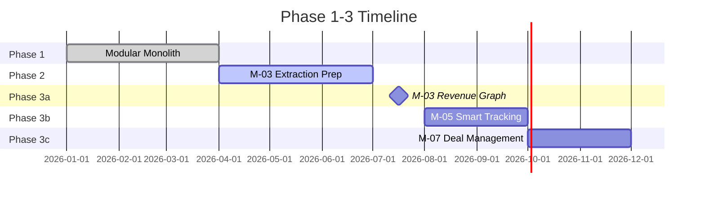

> **🚨 NO PREMATURE EXTRACTION**
>
> **If any extraction trigger is not met → STAY IN MONOLITH.**
>
> **Common anti-patterns (PR rejection triggers):**
>
> ```typescript
> // ❌ WRONG: Extract before triggers met
> @Injectable()
> export class RevenueGraphMicroservice { } // M-03 not ready
>
> // ✅ CORRECT: Schema-per-module inside monolith
> @Module({ 
>   imports: [M03SchemaModule], // Still one deploy
> })
> export class RevenueGraphModule { }
> ```

> **Tech Lead Enforcement:**
>
> - [ ] **All 5 triggers documented** before extraction PR
> - [ ] **4+ FTE team committed**
> - [ ] **2 quarters boundary stability**
> - [ ] **Grafana dashboard shows load isolation**
> - [ ] **SRE sign-off on on-call plan**

### 4.4 The Two Services Extracted as Microservices **(ADR-002)**

**Status:** ✅ **Approved** | **Owner:** Tech Lead | **Date:** April 2026

Two components are extracted as **separate microservices from Day 1 of Phase 1**.
Both share the same extraction reason: **fundamentally different scaling, runtime,
and resource profiles** from the NestJS Modular Monolith.

| **Property**       | **NestJS Monolith** | **Transcription Service** | **AI Services Layer**      |
| ------------------------ | ------------------------- | ------------------------------- | -------------------------------- |
| **Language**       | TypeScript                | **Python (FastAPI)**      | **Python (FastAPI)**       |
| **CPU Profile**    | Low (I/O bound)           | **Burst** (audio decode)  | **Continuous** (inference) |
| **Memory**         | 512MB                     | **8GB+** (Whisper model)  | **4GB+** (LLM context)     |
| **Scaling**        | 2-4 replicas              | **0→20 on queue depth**  | **2→10 on demand**        |
| **Failure Impact** | Platform down             | **No new transcripts**    | **No AI outputs**          |
| **External Deps**  | None                      | Whisper, AssemblyAI             | OpenAI, LiteLLM                  |

---

#### Microservice 1 — Transcription Service

**What it does:**

Receives raw audio/video files → Whisper/AssemblyAI ASR → speaker diarization →
timestamp alignment → publishes `call.transcription.completed` event.

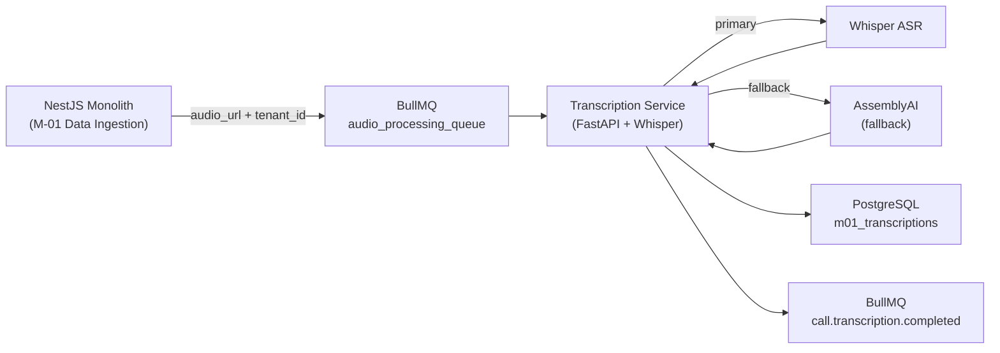

**Why it is extracted Day 1:**

| **Reason**           | **Problem if Inside Monolith**                | **Solution**                                 |
| -------------------------- | --------------------------------------------------- | -------------------------------------------------- |
| **Burst compute**    | 30 Monday calls → starves deal boards + dashboards | **Auto-scale 0→20 replicas on queue depth** |
| **Memory profile**   | 8GB Whisper model crashes 512MB Node.js process     | **Isolated 8GB container**                   |
| **Async processing** | 60-min call = minutes of CPU → request timeout     | **Queue-driven, no HTTP timeout**            |
| **External ASR**     | Whisper/AssemblyAI retries pollute monolith logs    | **Own retry/fallback logic**                 |

**Interface Contract (Non-Negotiable):**

```typescript
// Job pushed by M-01 (NestJS → BullMQ)
interface AudioProcessingJob {
  audio_url: string;          // S3 pre-signed URL
  tenant_id: string;          // RLS partition key
  call_id: string;            // UUID
  duration_seconds: number;   // For cost estimation
  preferred_provider: 'whisper' | 'assemblyai';
}

// Event published on completion (Transcription Service → BullMQ)
interface TranscriptionCompletedEvent {
  event: 'call.transcription.completed';
  call_id: string;
  tenant_id: string;
  transcript_id: string;
  speaker_count: number;
  duration_seconds: number;
  language_detected: string;  // ← ADDED: downstream modules need this
  confidence_score: number;   // ← ADDED: low confidence = flag for review
  provider_used: 'whisper' | 'assemblyai';
}
```

> **⚠️ IDEMPOTENCY RULE (Mandatory):**
>
> The same `audio_url` can arrive more than once (duplicate webhook from Zoom).
> Transcription Service MUST check for existing `call_id` before processing.
>
> ```python
> # Idempotency check before every job
> existing = db.query(
>   "SELECT id FROM m01_transcriptions WHERE call_id = $1",
>   [job.call_id]
> )
> if existing:
>     logger.info(f"Duplicate job skipped: {job.call_id}")
>     return  # Do not reprocess
> ```

**Scaling Configuration:**

```yaml
# Railway / Docker Compose Phase 1
transcription-service:
  replicas: 1                    # Base
  autoscale:
    min: 1
    max: 20                      # Monday morning spike
    trigger: queue_depth > 5     # Scale up when queue builds
  resources:
    memory: 8192MB               # Whisper model requirement
    cpu: 4                       # Audio decode + diarization
```

**Failure Modes + Mitigations:**

| **Failure** | **Impact** | **Mitigation**                    |
| ----------------- | ---------------- | --------------------------------------- |
| Whisper API down  | No transcripts   | **Auto-fallback to AssemblyAI**   |
| Queue overflow    | Jobs dropped     | **BullMQ dead-letter queue**      |
| OOM crash         | Service restart  | **Restart policy + Sentry alert** |
| Duplicate webhook | Double billing   | **`call_id` unique constraint** |

#### Microservice 2 — AI Services Layer **(ADR-002b)**

**What it does:**

The AI Services Layer is a **Python FastAPI microservice** that exposes ALL AI/ML
capabilities to the NestJS Modular Monolith over internal HTTP APIs.

| **Capability**     | **Endpoint**        | **Called By**     | **Mode** |
| ------------------------ | ------------------------- | ----------------------- | -------------- |
| LLM summarization        | `POST /summarize`       | M-06 Insight Generation | Sync           |
| Intent/tracker detection | `POST /detect-trackers` | M-05 Smart Tracking     | Async          |
| Topic modeling           | `POST /tag-topics`      | M-04 Conv. Intelligence | Async          |
| Embedding generation     | `POST /embed`           | M-05, M-06              | Async          |
| RAG query answering      | `POST /answer-query`    | M-06 Ask Anything       | Sync           |
| Email generation         | `POST /generate-email`  | M-02 Email Composer     | Sync           |
| Theme analysis           | `POST /detect-themes`   | M-04 Theme Spotter      | Async          |
| Deal risk scoring        | `POST /score-risk`      | M-07 Deal Management    | Async          |
| Revenue forecasting      | `POST /forecast`        | M-09 Forecasting        | Async          |
| AI Trainer simulation    | `POST /trainer-sim`     | M-10 AI Trainer         | Sync           |

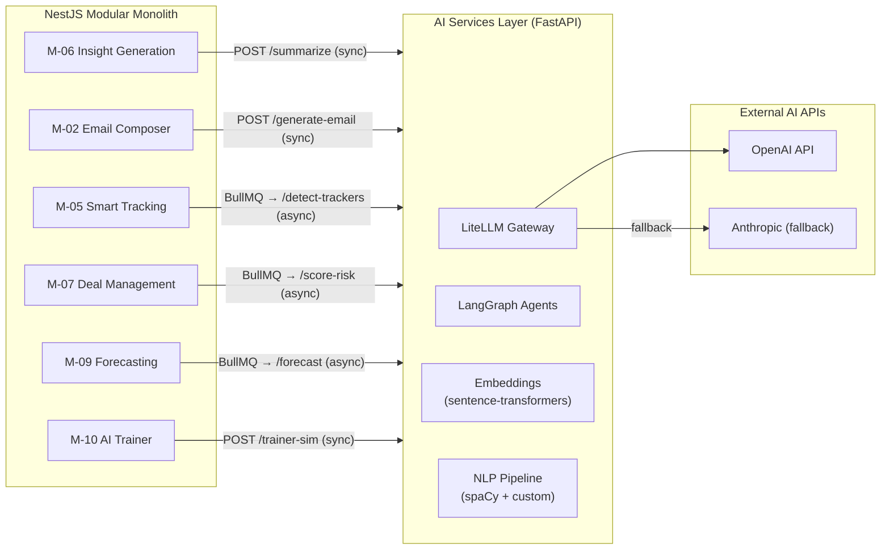

**Why it is extracted Day 1:**

| **Reason**            | **Problem if Inside Monolith**                             | **Solution**                                    |
| --------------------------- | ---------------------------------------------------------------- | ----------------------------------------------------- |
| **Language boundary** | Python AI libs (PyTorch, LangChain, spaCy) cannot run in Node.js | **Hard requirement — separate Python process** |
| **GPU compute**       | GPU instances for ALL modules = 6x cost                          | **GPU only for AI service**                     |
| **Model updates**     | Prompt change = full platform deploy                             | **1 service deploy = model updated**            |
| **Memory isolation**  | 4GB LLM context crashes 512MB Node.js                            | **Isolated 4GB container**                      |

**Interface Contract (Non-Negotiable):**

```python
# All AI endpoints follow this contract
# ✅ Input: Structured JSON
# ✅ Output: Structured JSON
# ❌ Never: Raw model outputs, business logic, DB writes

# Example: POST /summarize
class SummarizeRequest(BaseModel):
    tenant_id: str          # RLS partition key
    transcript_id: str      # Source reference
    transcript_text: str    # Full text
    context: dict           # CRM context (deal, account)
    output_format: str      # "call_summary" | "deal_brief"

class SummarizeResponse(BaseModel):
    summary: str
    key_points: list[str]
    next_steps: list[str]
    confidence_score: float    # ← Low confidence = flag for review
    model_used: str            # e.g., "gpt-4o"
    tokens_used: int           # For cost tracking
    latency_ms: int            # For SLA monitoring
```

> **🚨 CRITICAL RULES (PR rejection if violated):**
>
> ```python
> # ❌ WRONG: Business logic inside AI service
> def summarize(request):
>     summary = llm.generate(request.text)
>     db.save(summary)          # NO — never write to DB
>     crm.update(summary)       # NO — no business actions
>     return summary
>
> # ✅ CORRECT: Receive → model → return JSON
> def summarize(request):
>     summary = llm.generate(request.text)
>     return SummarizeResponse(
>         summary=summary,
>         confidence_score=0.94,
>         tokens_used=1240
>     )
> ```

**Scaling Configuration:**

```yaml
ai-services-layer:
  replicas: 2                    # Base (always 2 for HA)
  autoscale:
    min: 2
    max: 10                      # LLM demand spike
    trigger: cpu_usage > 70%
  resources:
    memory: 4096MB               # LLM context requirement
    cpu: 8                       # NLP + embedding generation
    gpu: optional                # Phase 3 — local model inference
```

**Failure Modes + Mitigations:**

| **Failure**      | **Impact**      | **Mitigation**                            |
| ---------------------- | --------------------- | ----------------------------------------------- |
| OpenAI API down        | No summaries/emails   | **LiteLLM → Anthropic fallback**         |
| High latency (>5s)     | Sync requests timeout | **Circuit breaker → cached response**    |
| OOM crash              | All AI features fail  | **Restart policy + Sentry alert**         |
| Model version mismatch | Wrong output format   | **Endpoint versioning `/v1/summarize`** |

---

### 4.5 What Stays Inside the Modular Monolith

**All 10 product modules remain inside the Modular Monolith in Phase 1-2.**

| Module                            | **Why Stays Inside Monolith**                                                     | **Work Pattern** | **Phase 3 Extraction?**              |
| --------------------------------- | --------------------------------------------------------------------------------------- | ---------------------- | ------------------------------------------ |
| **M-01 Data Ingestion**     | Orchestrates transcription pipeline — queues jobs, processes results, no heavy compute | I/O bound              | 🟡 If throughput bottleneck                |
| **M-02 Sales Engagement**   | Standard API-driven business logic — email, tasks, CRM sync                            | I/O bound              | ⬜ Low priority                            |
| **M-03 Revenue Graph**      | Complex but not compute-intensive at Phase 1 scale                                      | DB bound               | 🔴**Priority #1** — most shared     |
| **M-04 Conv. Intelligence** | Orchestrates AI calls to AI Services Layer — heavy work is external                    | Orchestration          | ⬜ Low priority                            |
| **M-05 Smart Tracking**     | Index reads + search filtering — not compute bound                                     | I/O bound              | 🔴**Priority #2** — embedding scale |
| **M-06 Insight Generation** | Orchestrates LLM calls + assembles outputs — work is in AI Layer                       | Orchestration          | ⬜ Low priority                            |
| **M-07 Deal Management**    | CRM aggregation + UI serving — standard app tier                                       | DB bound               | 🔴**Priority #3** — UI bottleneck   |
| **M-08 Execution**          | Workflow + rule evaluation — event-driven, not compute-intensive                       | Event bound            | ⬜ Low priority                            |
| **M-09 Forecasting**        | Aggregation queries + projections — DB bound                                           | DB bound               | ⬜ Low priority                            |
| **M-10 Performance**        | Analytics + dashboard serving — DB bound                                               | DB bound               | ⬜ Low priority                            |

> **Developer Rule:** If you find yourself saying "this module is too slow, let me
> extract it" — check ALL 5 extraction triggers in Section 4.3 first.
> Extraction without meeting all 5 = premature optimization.

### 4.6 Evolution to Full Microservices — Phase 3+

The Modular Monolith is **not the permanent architecture**. It is the correct
architecture for **Phase 1-2**. Migration to full microservices happens in Phase 3
when **all 5 trigger conditions are met per module** — not before.

**Why "all 5" matters:** Extracting on a single trigger (e.g., just load) without
boundary stability creates distributed monolith anti-patterns that are worse than
the original problem.

**Extraction Trigger Conditions:**

| **#** | **Trigger**                    | **Measurement**                           | **Target**           | **Responsible** |
| ----------- | ------------------------------------ | ----------------------------------------------- | -------------------------- | --------------------- |
| T-1         | **DB performance bottleneck**  | Lock contention + slow reads on other modules   | Sustained >80% DB CPU      | SRE                   |
| T-2         | **Release cadence mismatch**   | Module team ships >3x/day vs monolith weekly    | >3x cadence gap            | Engineering Lead      |
| T-3         | **Independent scaling needed** | Traffic spike not correlated with other modules | P99 >500ms impact          | SRE                   |
| T-4         | **Boundary stability**         | No cross-boundary API changes                   | <2 changes in 2 quarters   | Tech Lead             |
| T-5         | **Team capacity**              | Dedicated engineers for own pipeline + on-call  | **4+ FTE committed** | Engineering Manager   |

> **🚨 ALL 5 TRIGGERS MUST BE MET. Not 4. Not 3. ALL 5.**
>
> ```
> Extracting with T-3 only = premature optimization
> Extracting with T-1 + T-3 only = distributed monolith
> Extracting with T-1 + T-2 + T-3 + T-4 + T-5 = ✅ correct extraction
> ```

---

**Phase 3 Extraction Order + Rationale:**

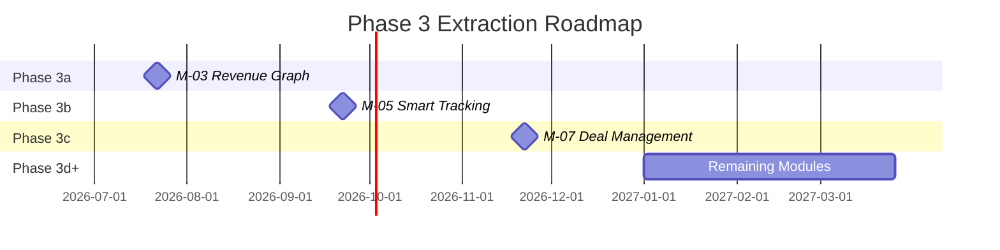

| **Priority**                   | **Module**                     | **Primary Trigger** | **Risk**                          |
| ------------------------------------ | ------------------------------------ | ------------------------- | --------------------------------------- |
| **#1 — M-03 Revenue Graph**   | Core data layer read by ALL modules  | T-1 (DB bottleneck first) | 🔴 High — all downstream depends on it |
| **#2 — M-05 Smart Tracking**  | High embedding + search query volume | T-3 (load isolation)      | 🟡 Medium — Meilisearch independent    |
| **#3 — M-07 Deal Management** | High read frequency from active reps | T-3 (UI bottleneck)       | 🟡 Medium — CRM sync complexity        |
| **#4+ — Remaining**           | One at a time as triggers met        | All 5 triggers per module | 🟢 Low — boundaries proven             |

**What does NOT change when a module extracts:**

| **Property**            | **Before Extraction** | **After Extraction**               |
| ----------------------------- | --------------------------- | ---------------------------------------- |
| **Event contracts**     | Internal BullMQ             | External BullMQ (same schema)            |
| **API contracts**       | In-process call             | Network HTTP (same interface)            |
| **DB schema ownership** | `m03_*` tables            | `m03_*` tables (same, own DB instance) |
| **Business logic**      | NestJS module               | NestJS microservice (same code)          |

> **Key Insight:** Because the Modular Monolith enforces strict boundaries from Day 1,
> Phase 3 extraction is a **deployment and infrastructure change — NOT an architecture
> change.** The code boundary already exists. We are only moving it across a network.

---

### 4.7 Architecture Decision Records (ADRs)

All technology decisions are formally documented as ADRs in `/docs/adr/`.

**ADR Format:**

```markdown
# ADR-XXX: [Decision Title]
**Status:** [Draft | Approved | Superseded]
**Date:** YYYY-MM-DD
**Owner:** [Name]

## Context
## Options Considered
## Decision
## Consequences
## Review Date
```

**ADR Registry:**

| **ADR** | **Decision**                                      | **Status**     | **Section Ref** |
| ------------- | ------------------------------------------------------- | -------------------- | --------------------- |
| ADR-001       | Modular Monolith as Phase 1-2 architecture              | ✅**Approved** | Section 4.2           |
| ADR-002       | TypeScript (Node.js) as product service language        | ✅**Approved** | Section 2.4 P4        |
| ADR-003       | Python as AI/ML service language                        | ✅**Approved** | Section 2.4 P4        |
| ADR-004       | PostgreSQL as primary relational database               | ✅**Approved** | Section 8             |
| ADR-005       | **BullMQ on Redis as event bus**                  | ✅**Approved** | Section 9             |
| ADR-006       | OpenAI API as primary LLM via LiteLLM gateway           | ✅**Approved** | Section 12            |
| ADR-007       | Whisper primary ASR + AssemblyAI fallback               | ✅**Approved** | Section 3.5           |
| ADR-008       | Multi-tenancy: shared DB + Row Level Security           | ✅**Approved** | Section 11            |
| ADR-009       | Data Cloud: 5 warehouse targets + daily idempotent sync | ✅**Approved** | Section 3.4           |
| ADR-010       | CRM: native connectors (OAuth2) — no iPaaS middleware  | ✅**Approved** | Section 3.4           |

<!-- FIXED: ADR-005 was listed as "to be finalized" but BullMQ on Redis is already
     in use throughout the platform. Closed as Approved to match reality. -->

> **🚨 ADR ENFORCEMENT RULES:**
>
> 1. **Every technology must have an ADR before it enters the codebase**
> 2. If a technology is being used without an ADR → **raise with Tech Lead immediately**
> 3. ADR status `Draft` → cannot merge to `main`
> 4. ADR status `Approved` → Tech Lead sign-off required
> 5. ADR status `Superseded` → old ADR links to replacement
>
> **PR Check:**
>
> ```bash
> # Before any new technology PR merges:
> ls /docs/adr/ | grep "ADR-0XX"
> # Must exist and have Status: Approved
> ```


## Section 5 — High-Level Architecture Diagram (Level 1)

---

### 5.1 Purpose of This Diagram

A Level 1 Architecture Diagram **opens the R-Revenue Intelligence black box** from
Section 3 and shows the major internal layers — what they are, what technology
stack each layer uses, and how they connect to each other.

**Read this section before:**

- Designing any new service or module
- Choosing any technology (check it's in the stack first)
- Deciding where a piece of logic belongs
- Introducing a new data store

> **Rule:** Every layer here is a **real, deployed component**. Every technology listed
> is the **chosen standard for that layer**. Do not introduce alternatives without an
> ADR (Section 4.7). If you need a technology not listed here, raise an ADR first —
> do not add it to a feature branch.

---

### 5.2 High-Level Architecture Diagram

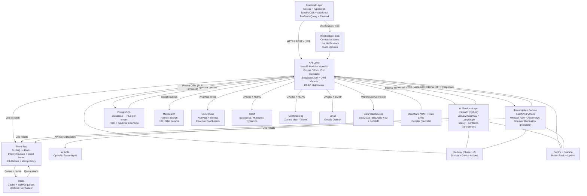

---

### 5.3 Layer Reference Table

| **Layer**         | **Technology**                | **Purpose**                                        | **Owns**                              | **Does NOT Own**              |
| ----------------- | ----------------------------- | -------------------------------------------------- | ------------------------------------- | ----------------------------- |
| **Frontend**      | Next.js + TypeScript          | UI rendering, server state, client state           | UI components, TanStack Query cache   | Business logic, DB access     |
| **API Layer**     | NestJS Modular Monolith       | Business logic, auth, event orchestration          | All product logic, CRM sync           | AI inference, model calls     |
| **AI Services**   | FastAPI + Python              | LLM inference, NLP, RAG, embeddings                | All AI model calls                    | Business logic, DB writes     |
| **Transcription** | FastAPI + Whisper + pyannote  | ASR, diarization, timestamping                     | Audio processing pipeline             | CRM sync, business rules      |
| **Event Bus**     | BullMQ + Redis                | Async inter-module communication                   | Job queues, dead-letter               | Business logic                |
| **PostgreSQL**    | Supabase + RLS + pgvector     | Relational data + tenant isolation + vector store  | Transactional data, audit logs, RAG   | Analytics, search indexes     |
| **Redis**         | Upstash HA                    | Cache + BullMQ backing store                       | Queue state, session cache            | Persistent data               |
| **Meilisearch**   | Meilisearch Cloud             | Full-text search (100+ params)                     | Search indexes                        | Source of truth               |
| **ClickHouse**    | ClickHouse Cloud              | Analytics + dashboard metrics                      | Time-series analytics                 | Transactional data            |
| **WebSocket/SSE** | NestJS Gateway                | Real-time push notifications                       | Live alerts, to-do updates            | Persistent state              |

---

### 5.4 Critical Architecture Rules Per Layer

#### Frontend Rules

```typescript
// CORRECT: Server state (API data) via TanStack Query
const { data: deals } = useQuery({
  queryKey: ['deals', tenantId],
  queryFn: () => api.get('/v1/deals'),
  staleTime: 30_000
});

// CORRECT: Client state (UI only) via Zustand
const { sidebarOpen, setSidebarOpen } = useUIStore();

// WRONG: Business logic in frontend
// const riskScore = calculateRisk(deal); // Belongs in API layer

// CORRECT: Real-time alerts via WebSocket
const socket = io('/alerts', { auth: { token: jwtToken } });
socket.on('competitor.detected', (alert) => {
  notificationStore.addAlert(alert);
});

// WRONG: Polling for real-time data
// setInterval(() => refetchAlerts(), 1000);
```

#### API Layer Rules

```typescript
// CORRECT: AI work delegated to AI Services
const summary = await this.aiServicesClient.post('/v1/summarize', {
  tenant_id: tenantId,
  transcript_id: transcriptId,
  transcript_text: transcript,
  context: dealContext
}, {
  timeout: 30_000
});

// WRONG: AI logic in TypeScript
// import OpenAI from 'openai'; // Violates Principle 4

// CORRECT: Inter-module communication via BullMQ
await this.eventBus.publish('call.transcription.completed', {
  event_id: uuidv4(),
  call_id: callId,
  tenant_id: tenantId,
  transcript_id: transcriptId,
  timestamp: new Date().toISOString()
});

// WRONG: Direct module import
// import { RevenueGraphService } from '../m03/revenue-graph.service';
```

> **Circuit Breaker Rule:**
> Every synchronous call from API Layer to AI Services Layer must have:
> - **Timeout:** 30s max (user-facing), 5 min (background)
> - **Retry:** 3 attempts with exponential backoff
> - **Fallback:** Return cached response or `null` — never throw 500 to user

#### Real-Time Layer Rules

```typescript
// CORRECT: Competitor alert via WebSocket push
@WebSocketGateway()
export class AlertsGateway {
  @SubscribeMessage('competitor.detected')
  handleAlert(client: Socket, payload: AlertPayload) {
    client.emit('alert', payload);
  }
}

// WRONG: Polling for real-time data
// setInterval(() => api.get('/alerts'), 1000);
```

---

### 5.5 Data Store Selection Rules

| **Data Type**                        | **Store**       | **Why**                              |
| ------------------------------------ | --------------- | ------------------------------------ |
| Transactional (calls, deals, users)  | **PostgreSQL**  | ACID, RLS, tenant isolation          |
| Search queries (100+ filters)        | **Meilisearch** | Sub-50ms full-text search            |
| Analytics + dashboards               | **ClickHouse**  | Columnar, fast aggregations          |
| Vector embeddings (RAG)              | **pgvector**    | Co-located with transcripts          |
| Queue + cache + sessions             | **Redis**       | BullMQ backing, TTL cache            |

> **New data store rule:** Adding ANY new data store requires an ADR (Section 4.7)
> with Tech Lead approval before a single line of integration code is written.

> **pgvector Scale Warning:**
> pgvector performs well up to ~1M embeddings. For large enterprise tenants
> (1000+ calls/month), this ceiling can be reached within 12 months.
> Phase 3 migration trigger: when any tenant exceeds 800k vectors, evaluate
> Weaviate, Qdrant, or Pinecone and raise an ADR before migration.

---

### 5.6 Layer-by-Layer Description

---

#### Layer 1 — Frontend

**Technology:** Next.js 15 + TypeScript + TailwindCSS + shadcn/ui + TanStack Query + Zustand

The frontend is a Next.js 15 application written entirely in TypeScript. It is the
**only interface** through which all users interact with the platform.

| **Technology**     | **Role**                                                              | **What It Does NOT Do**          |
| ------------------ | --------------------------------------------------------------------- | -------------------------------- |
| **Next.js 15**     | App Router, SSR for initial loads, client-side navigation             | No business logic, no DB access  |
| **TypeScript**     | Type safety across all props, API responses, state shapes             | No runtime type inference        |
| **TailwindCSS**    | All styling via utility classes                                       | No custom CSS files — ever       |
| **shadcn/ui**      | Accessible Radix UI components styled with Tailwind                   | No custom component library      |
| **TanStack Query** | Server state — API data, caching, background refetch, optimistic updates | Not for UI state              |
| **Zustand**        | Client state — panels, filters, sidebar, selected rows                | Not for server/API data          |

> **State Management Rule:**
>
> | **Data Type**                          | **Store**           | **Example**              |
> | -------------------------------------- | ------------------- | ------------------------ |
> | API data (deals, calls, users)         | TanStack Query      | `useQuery(['deals'])`    |
> | UI state (open/closed, selected)       | Zustand             | `useSidebarStore()`      |
> | Form state                             | React Hook Form     | `useForm()`              |
> | URL state (filters, pagination)        | Next.js router      | `useSearchParams()`      |

**How it connects to backend:**
- REST APIs to API Layer (all data reads/writes)
- WebSocket/SSE to API Layer (real-time: Competitor Alerts, live notifications)
- Never directly to DB, AI Services, or external systems

---

#### Layer 2 — API Layer (Modular Monolith)

**Technology:** NestJS v11 + TypeScript + Prisma ORM + Zod + Supabase Auth + JWT

The API Layer is the Modular Monolith described in Section 4. It contains all 10
product modules, all business logic, all CRM integrations, all event orchestration,
and all AI Services Layer coordination.

| **Technology**    | **Role**                                                         | **What It Does NOT Do**                    |
| ----------------- | ---------------------------------------------------------------- | ------------------------------------------ |
| **NestJS v11**    | Module system (maps 1:1 to M-01 through M-10), DI, guards, pipes | No AI inference, no direct warehouse access |
| **TypeScript**    | Type safety across services, events, contracts, Prisma models    | No Python AI libs                          |
| **Prisma ORM**    | Type-safe PostgreSQL reads/writes + schema migrations            | No raw SQL queries in services             |
| **Zod**           | Runtime validation of ALL API request bodies + event payloads    | No unvalidated request reaches logic       |
| **Supabase Auth** | Sign up, sign in, OAuth, session management, JWT issuance        | No custom auth server                      |
| **JWT Guards**    | Verify JWT + enforce RBAC on every request                       | No route is unguarded                      |
| **BullMQ**        | Internal event bus between modules (publish/subscribe)           | No direct module-to-module function calls  |

```typescript
// CORRECT: Module A publishes via BullMQ
await this.eventBus.publish('call.transcription.completed', {
  event_id: uuidv4(),
  call_id: callId,
  tenant_id: tenantId,
  transcript_id: transcriptId,
  language_detected: 'en',
  confidence_score: 0.94,
  timestamp: new Date().toISOString()
});

// CORRECT: Module B subscribes (with idempotency check)
@BullWorker('call.transcription.completed')
async handleTranscription(job: Job<TranscriptionEvent>) {
  const exists = await this.db.revenueGraph.findUnique({
    where: { call_id: job.data.call_id }
  });
  if (exists) return; // Skip duplicate
  await this.linkToRevenueGraph(job.data);
}

// WRONG: Direct module import
// import { RevenueGraphService } from '../m03/revenue-graph.service';
```

---

#### Layer 3 — AI Services Layer

**Technology:** FastAPI + Python 3.12 + LiteLLM + LangGraph + spaCy + sentence-transformers

The AI Services Layer is the Python microservice described in Section 4.4. It is the
**only place in the platform where AI model inference happens**. It exposes internal
HTTP endpoints that the API Layer calls. It contains no business logic.

| **Technology**          | **Role**                                                             | **What It Does NOT Do**                   |
| ----------------------- | -------------------------------------------------------------------- | ----------------------------------------- |
| **FastAPI**             | Internal HTTP API, async inference, auto OpenAPI docs                | No business logic, no DB writes           |
| **Python 3.12**         | Runtime for all AI/ML                                                | No product feature logic                  |
| **LiteLLM**             | Unified LLM gateway — OpenAI primary, Anthropic fallback             | API Layer never calls OpenAI directly     |
| **LangGraph**           | Stateful multi-step agent workflows (Deep Researcher, Ask Anything)  | No CRM writes, no DB access               |
| **spaCy**               | NLP preprocessing — tokenization, entity extraction                  | No LLM calls                              |

> **Note:** Whisper ASR and pyannote belong to the **Transcription Service** (Layer 4),
> not the AI Services Layer. They are never called from this service.

**Endpoints Exposed:**

| **Endpoint**             | **Called By**            | **Mode**  | **What It Does**                              |
| ------------------------ | ------------------------ | --------- | --------------------------------------------- |
| `POST /v1/summarize`     | M-06 Insight Generation  | Sync      | Call summaries, key points, next steps        |
| `POST /v1/detect-trackers` | M-05 Smart Tracking    | Async     | Intent-based signal detection                 |
| `POST /v1/generate-email` | M-02 Sales Engagement   | Sync      | Personalized email draft from call context    |
| `POST /v1/answer-query`  | M-06 Ask Anything        | Sync      | RAG pipeline — retrieve and generate answer   |
| `POST /v1/score-call`    | M-04 Conv. Intelligence  | Async     | Score transcript against scorecard criteria   |
| `POST /v1/simulate-turn` | M-10 AI Trainer          | Sync      | Next AI persona response in training          |
| `POST /v1/detect-themes` | M-04 Theme Spotter       | Async     | Topic modeling across call set                |
| `POST /v1/embed`         | M-05, M-06               | Async     | Generate vector embeddings for semantic search |

> **Endpoint Versioning Rule:** Every endpoint is versioned (`/v1/`, `/v2/`).
> When output schema changes: create `/v2/` — do NOT modify `/v1/`.
> Old version stays live for 30 days minimum after deprecation notice.

> **AI Quality Gate:** Every endpoint returns a `confidence_score` (0.0 to 1.0).
> If `confidence_score < 0.7`, set `flagged_for_review: true`.
> The API Layer must NOT auto-write flagged outputs to CRM — hold for human review.

---

#### Layer 4 — Transcription Service

**Technology:** FastAPI + Python + Whisper ASR + AssemblyAI + pyannote

The Transcription Service is a dedicated Python microservice that handles the entire
audio processing pipeline. It is separate from the AI Services Layer because
transcription is the critical revenue path (90% of platform value) and must be
independently scalable and independently monitored.

| **Technology**    | **Role**                                                    |
| ----------------- | ----------------------------------------------------------- |
| **Whisper ASR**   | Primary speech-to-text — raw audio to raw transcript        |
| **AssemblyAI**    | Fallback ASR when Whisper is unavailable or confidence low  |
| **pyannote**      | Speaker diarization — who spoke when                        |
| **FastAPI**       | Internal HTTP endpoint, job result publishing to BullMQ     |

---

#### Layer 5 — Data Layer

| **System**       | **Technology**                   | **What It Stores**                                              | **Why This Store**                   | **Scale Ceiling**         | **Phase** |
| ---------------- | -------------------------------- | --------------------------------------------------------------- | ------------------------------------ | ------------------------- | --------- |
| Primary DB       | Supabase PostgreSQL + RLS + PITR | Users, accounts, deals, transcripts, detections, CRM sync state | ACID + RLS + multi-tenant isolation  | ~500GB per tenant         | Phase 1   |
| Cache            | Redis (Upstash HA Phase 2)       | Sessions, rate limit counters, short-lived results              | Sub-1ms retrieval, TTL-based         | N/A (ephemeral)           | Phase 1   |
| Event Bus        | BullMQ on Redis                  | Transcription jobs, AI processing, inter-module events          | Durable jobs, retries, dead-letter   | ~10k jobs/min             | Phase 1   |
| Search Index     | Meilisearch                      | Transcripts, emails, account/deal metadata                      | Sub-50ms typo-tolerant search        | ~50M documents            | Phase 1   |
| Analytics        | ClickHouse                       | Revenue metrics, coaching metrics, activity streams             | Columnar, fast aggregations          | Unlimited (append-only)   | Phase 2   |
| Vector Store     | pgvector (PostgreSQL extension)  | Embeddings for RAG and semantic search                          | Co-located with source data          | ~1M vectors (warning)     | Phase 1   |

```sql
-- Every table MUST have these composite indexes
-- tenant_id first (RLS partition) + common query fields second

CREATE INDEX idx_transcripts_tenant_call
  ON m01_transcriptions(tenant_id, call_id);
CREATE INDEX idx_transcripts_tenant_created
  ON m01_transcriptions(tenant_id, created_at DESC);

CREATE INDEX idx_detections_tenant_deal
  ON m05_tracker_detections(tenant_id, deal_id);
CREATE INDEX idx_detections_tenant_contact
  ON m05_tracker_detections(tenant_id, contact_id, created_at DESC);
```

---

#### Layer 6 — Infrastructure

**Technology:** Docker + GitHub Actions + Railway + Sentry + Grafana + Better Stack + Cloudflare + Doppler

| **Technology**     | **Role**                                                                | **Phase 3 Upgrade**              |
| ------------------ | ----------------------------------------------------------------------- | -------------------------------- |
| **Docker**         | All services run as containers. Local dev uses Docker Compose           | AWS ECS Fargate                  |
| **GitHub Actions** | CI/CD: type checks, tests, Zod + Prisma validation on every PR          | Same pipeline, new target        |
| **Railway**        | Managed container hosting — orchestration, health checks, restarts      | AWS ECS (trigger: 500 tenants)   |
| **Sentry**         | Error tracking across Next.js, NestJS, Python. Every exception logged   | Same                             |
| **Grafana**        | Metrics dashboards — queue depths, DB pool, AI latency, error rates     | Same + distributed tracing       |
| **Better Stack**   | Log aggregation, structured search, uptime monitoring                   | Same                             |
| **Cloudflare**     | CDN, DDoS protection, TLS termination, WAF, rate limiting               | Same                             |
| **Doppler**        | Secrets management — ALL env vars. No secrets in repos or images        | Same                             |

```yaml
# Every PR must pass ALL gates before merge
pr-checks:
  steps:
    - name: TypeScript type check
      run: tsc --noEmit

    - name: Unit + Integration tests
      run: jest --coverage --coverageThreshold='{"global":{"lines":80}}'

    - name: Zod schema validation
      run: ts-node scripts/validate-schemas.ts

    - name: Prisma schema validation
      run: prisma validate

    - name: RLS enforcement check
      run: ts-node scripts/check-rls-all-tables.ts

    - name: No cross-module imports
      run: ts-node scripts/check-module-boundaries.ts

    - name: Sentry source maps upload
      run: sentry-cli releases files upload-sourcemaps
```

> **Phase 3 Infrastructure Migration Triggers:**
>
> | **Trigger**                 | **Metric**                       | **Action**          |
> | --------------------------- | -------------------------------- | ------------------- |
> | Railway to AWS ECS          | >500 tenants OR >50M req/month   | Raise ADR-024-v2    |
> | Redis to Upstash HA         | Any Redis downtime incident      | Upgrade immediately |
> | pgvector to Qdrant          | Any tenant >800k vectors         | Raise ADR-021-v2    |
> | ClickHouse Cloud to self-hosted | >$5k/month ClickHouse bill   | Raise ADR-020-v2    |

---

### 5.7 How a Request Flows Through the Architecture

**Example: Sales Manager opens the Deals Board**

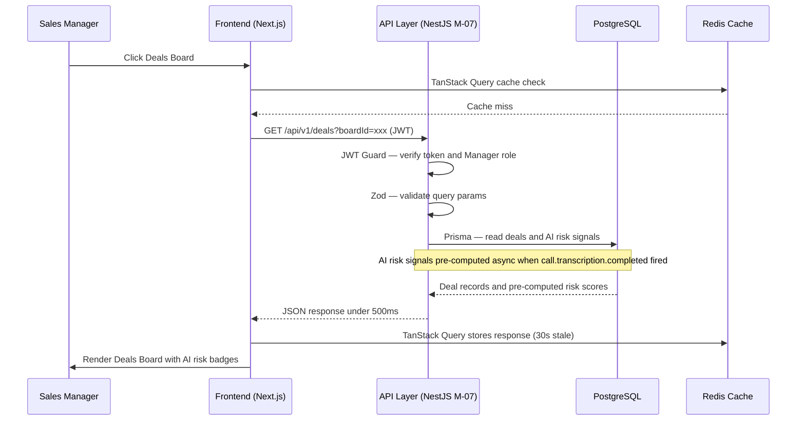

> **Key Architecture Insight: AI is NEVER on the critical path for reads.**
>
> | **User Action**       | **Where AI Runs**   | **When**                        |
> | --------------------- | ------------------- | ------------------------------- |
> | Open Deals Board      | Not on read path    | Pre-computed async              |
> | Load call summary     | Not on read path    | Pre-computed on transcription   |
> | Ask Anything query    | On request path     | User-initiated, acceptable wait |
> | Generate email        | On request path     | User-initiated, acceptable wait |
>
> **Rule:** Pre-compute ALL AI outputs triggered by `call.transcription.completed`.
> Store results in PostgreSQL. UI reads are always DB lookups — never live AI calls.

---

### 5.8 Technology Decision Summary

| **Layer**                 | **Technology**                 | **ADR**   | **Status**   |
| ------------------------- | ------------------------------ | --------- | ------------ |
| Frontend framework        | Next.js 15 + TypeScript        | ADR-011   | Approved     |
| Frontend styling          | TailwindCSS + shadcn/ui        | ADR-012   | Approved     |
| Frontend state            | TanStack Query + Zustand       | ADR-013   | Approved     |
| Backend framework         | NestJS v11 + TypeScript        | ADR-002   | Approved     |
| ORM                       | Prisma                         | ADR-014   | Approved     |
| Validation                | Zod                            | ADR-015   | Approved     |
| Authentication            | Supabase Auth + JWT            | ADR-016   | Approved     |
| Message queue / event bus | BullMQ on Redis                | ADR-005   | Approved     |
| AI service framework      | FastAPI + Python 3.12          | ADR-003   | Approved     |
| LLM routing               | LiteLLM to OpenAI API          | ADR-006   | Approved     |
| Speech-to-text            | Whisper + AssemblyAI fallback  | ADR-007   | Approved     |
| AI agent orchestration    | LangGraph                      | ADR-017   | Approved     |
| Primary database          | Supabase PostgreSQL            | ADR-004   | Approved     |
| Cache                     | Redis (Upstash HA Phase 2)     | ADR-018   | Approved     |
| Search                    | Meilisearch                    | ADR-019   | Approved     |
| Analytics store           | ClickHouse                     | ADR-020   | Approved     |
| Vector store              | pgvector (Qdrant Phase 3)      | ADR-021   | Approved     |
| Containerization          | Docker                         | ADR-022   | Approved     |
| CI/CD                     | GitHub Actions                 | ADR-023   | Approved     |
| Hosting                   | Railway (AWS ECS Phase 3)      | ADR-024   | Approved     |
| Error tracking            | Sentry                         | ADR-025   | Approved     |
| Secrets management        | Doppler                        | ADR-026   | Approved     |

---


## Section 6 — Module Architecture (Level 2)

---

### 6.1 Purpose of This Section

This section opens each of the 10 product modules and documents their internal
responsibilities, data ownership, API contracts, event contracts, and dependencies.

**Every developer working on a module MUST:**

- Read their module's sub-section before writing any code
- Add any new event to the event contract table HERE before implementing it
- Never read from a table not listed under their module's ownership
- Raise a Tech Lead review if any cross-module data dependency is discovered

> **Cross-Module Data Dependency Rule:**
> If Module X reads a table owned by Module Y → this is an architecture violation.
> Resolution: Module Y exposes an API endpoint or publishes an event.
> Module X subscribes or calls the API. Never query another module's tables directly.

---

### 6.2 Platform Core

Platform Core is the **shared foundation** all modules depend on. It is **not a module**.
It does not own a business domain. It provides cross-cutting infrastructure only.

**NestJS module name:** `CoreModule` (globally imported — available in all 10 modules)

**What Platform Core Provides:**

| **Concern**            | **What It Provides**                                                               | **Implementation**                      |
| ---------------------------- | ---------------------------------------------------------------------------------------- | --------------------------------------------- |
| **Authentication**     | Supabase Auth JWT verification                                                           | `@UseGuards(JwtGuard)` on all routes        |
| **Authorization**      | RBAC roles: AE, SDR, Manager, Admin, RevOps                                              | `@Roles('manager')` decorator               |
| **Tenant Isolation**   | `TenantInterceptor` — injects `tenant_id` into every request context + Prisma query | Automatic — no module code needed            |
| **Request Validation** | Global Zod validation pipe — all request bodies validated before any handler            | Automatic — no module code needed            |
| **Event Bus**          | Shared BullMQ client — all modules publish/consume via this                             | `this.eventBus.publish(event, payload)`     |
| **Error Handling**     | Global exception filter → formats errors → Sentry                                      | Automatic — catches all unhandled exceptions |
| **Logging**            | Structured logger — every line includes `tenant_id`, `user_id`, module, trace ID    | `this.logger.log(message, context)`         |
| **Health Checks**      | `GET /health` — PostgreSQL + Redis + BullMQ + Meilisearch status                      | Used by Railway + Grafana                     |

**DB Tables Owned by Platform Core:**

```sql
tenants         (tenant_id, name, plan, created_at, compliance_config)
users           (user_id, tenant_id, email, name, created_at)
roles           (role_id, name, permissions[])
user_roles      (user_id, role_id, tenant_id)
audit_logs      (log_id, tenant_id, user_id, action, resource, metadata, created_at)
```

> **Platform Core Rules:**
>
> - No module imports a CoreModule table directly — they receive `tenant_id` via interceptor
> - No module writes to `audit_logs` directly — Core provides `AuditService.log()`
> - No module implements its own auth logic — CoreModule JWT Guard handles all auth

---

### 6.3 M-01 — Data Ingestion Module

**Responsibility:** Captures raw call audio and video from connected conferencing and
telephony systems, sends audio to the Transcription Service for speech-to-text
processing, stores the completed transcript, and publishes it to all downstream modules.

**NestJS module name:** `DataIngestionModule`
**API prefix:** `/api/v1/ingestion/`
**Phase Status:** ✅ **Phase 1 — Deployed**
**FastAPI services:** `transcription-service` (Whisper + AssemblyAI)

---

**DB Tables Owned by M-01:**

```sql
call_recordings (
  call_id          UUID PRIMARY KEY,
  tenant_id        UUID NOT NULL,  -- RLS partition key
  source_platform  VARCHAR,        -- zoom | teams | meet | dialer
  audio_file_url   TEXT,           -- S3 pre-signed URL
  duration_seconds INTEGER,
  status           VARCHAR,        -- pending | processing | completed | failed
  created_at       TIMESTAMPTZ DEFAULT NOW()
)

transcripts (
  transcript_id           UUID PRIMARY KEY,
  call_id                 UUID REFERENCES call_recordings(call_id),
  tenant_id               UUID NOT NULL,
  raw_text                TEXT,
  speaker_labeled_segments JSONB,  -- [{ speaker, text, start_ms, end_ms }]
  timestamps              JSONB,
  language                VARCHAR,
  confidence_score        FLOAT,   -- ← low < 0.7 = flagged_for_review
  provider_used           VARCHAR, -- whisper | assemblyai
  created_at              TIMESTAMPTZ DEFAULT NOW()
)

transcript_corrections (
  correction_id   UUID PRIMARY KEY,
  transcript_id   UUID REFERENCES transcripts(transcript_id),
  tenant_id       UUID NOT NULL,
  original_term   VARCHAR,
  corrected_term  VARCHAR,
  applied_at      TIMESTAMPTZ
)

ingestion_sources (
  source_id          UUID PRIMARY KEY,
  tenant_id          UUID NOT NULL,
  platform           VARCHAR,       -- zoom | teams | meet | dialer
  connection_status  VARCHAR,       -- connected | error | disconnected
  last_synced_at     TIMESTAMPTZ,
  webhook_secret     TEXT           -- HMAC secret per source
)

crm_extracted_fields (
  extraction_id    UUID PRIMARY KEY,
  call_id          UUID REFERENCES call_recordings(call_id),
  tenant_id        UUID NOT NULL,
  field_name       VARCHAR,
  field_value      TEXT,
  confidence_score FLOAT,
  pushed_to_crm    BOOLEAN DEFAULT FALSE,
  flagged_review   BOOLEAN DEFAULT FALSE  -- TRUE if confidence < 0.7
)
```

<!-- ADDED: confidence_score to transcripts + flagged_review to crm_extracted_fields -->

<!-- ADDED: webhook_secret to ingestion_sources — per-source HMAC secret -->

**Required Indexes:**

```sql
CREATE INDEX idx_call_recordings_tenant ON call_recordings(tenant_id, created_at DESC);
CREATE INDEX idx_transcripts_tenant_call ON transcripts(tenant_id, call_id);
CREATE INDEX idx_crm_fields_tenant_call ON crm_extracted_fields(tenant_id, call_id);
```

---

**API Endpoints:**

| **Method** | **Endpoint**                         | **Auth**        | **Caller** | **What It Does**                              | **Phase** |
| ---------------- | ------------------------------------------ | --------------------- | ---------------- | --------------------------------------------------- | --------------- |
| `POST`         | `/api/v1/ingestion/webhook/zoom`         | **HMAC-SHA256** | Zoom             | Call completed webhook → enqueue transcription job | ✅ Phase 1      |
| `POST`         | `/api/v1/ingestion/webhook/teams`        | **HMAC-SHA256** | MS Teams         | Call completed webhook → enqueue transcription job | ✅ Phase 1      |
| `POST`         | `/api/v1/ingestion/webhook/meet`         | **HMAC-SHA256** | Google Meet      | Call completed webhook → enqueue transcription job | ✅ Phase 1      |
| `POST`         | `/api/v1/ingestion/webhook/dialer`       | **HMAC-SHA256** | Telephony        | Call completed webhook → enqueue transcription job | ✅ Phase 1      |
| `GET`          | `/api/v1/ingestion/calls`                | JWT                   | Frontend         | Paginated call list for tenant                      | ✅ Phase 1      |
| `GET`          | `/api/v1/ingestion/calls/:id/transcript` | JWT                   | Frontend         | Full transcript for a call                          | ✅ Phase 1      |
| `POST`         | `/api/v1/ingestion/sources`              | JWT + RevOps role     | Frontend         | Connect new call source                             | ✅ Phase 1      |
| `GET`          | `/api/v1/ingestion/sources`              | JWT + RevOps role     | Frontend         | List connected sources + sync status                | ✅ Phase 1      |

> **🚨 Webhook HMAC Verification (Mandatory — M-01 Entry Point):**
>
> ```typescript
> @Post('webhook/zoom')
> async handleZoomWebhook(
>   @Headers('x-zoom-signature') signature: string,
>   @Body() body: ZoomWebhookPayload,
>   @RawBody() rawBody: Buffer
> ) {
>   // Step 1: Verify HMAC signature
>   const valid = this.webhookService.verifyHMAC(
>     rawBody,
>     signature,
>     process.env.ZOOM_WEBHOOK_SECRET
>   );
>   if (!valid) throw new UnauthorizedException('Invalid webhook signature');
>
>   // Step 2: Idempotency check
>   const exists = await this.db.callRecordings.findUnique({
>     where: { call_id: body.call_id }
>   });
>   if (exists) return { status: 'duplicate_ignored' };
>
>   // Step 3: Enqueue transcription job
>   await this.transcriptionQueue.add('transcribe', {
>     call_id: body.call_id,
>     audio_url: body.recording_url,
>     tenant_id: body.tenant_id,
>     duration_seconds: body.duration
>   }, {
>     attempts: 3,
>     backoff: { type: 'exponential', delay: 5000 }
>   });
> }
> ```

---

**Events Emitted by M-01:**

| **Event**              | **Queue Name**             | **Payload Schema**                                                                                                                                      | **Consumed By**  | **Phase** |
| ---------------------------- | -------------------------------- | ------------------------------------------------------------------------------------------------------------------------------------------------------------- | ---------------------- | --------------- |
| Call transcription completed | `call.transcription.completed` | `{ event_id, call_id, transcript_id, tenant_id, duration_seconds, participant_count, source_platform, language_detected, confidence_score, provider_used }` | M-03, M-04, M-05, M-06 | ✅ Phase 1      |
| CRM fields extracted         | `crm.fields.extracted`         | `{ event_id, call_id, tenant_id, extracted_fields[{ field_name, field_value, confidence_score }], flagged_count }`                                          | M-03 Revenue Graph     | ✅ Phase 1      |

<!-- ADDED: event_id for idempotency, language_detected, confidence_score, provider_used,
     flagged_count — all required for downstream quality gates -->

**Events Consumed by M-01:** None — M-01 is the entry point of the pipeline.

---

**External Dependencies:**

| **Dependency**  | **Why**                                 | **Auth**   | **Failure Mode**           |
| --------------------- | --------------------------------------------- | ---------------- | -------------------------------- |
| Zoom API              | Webhook receipt + recording URL fetch         | HMAC + OAuth2    | Dead-letter queue + Sentry       |
| Google Meet API       | Webhook receipt + recording fetch             | HMAC + OAuth2    | Dead-letter queue + Sentry       |
| Microsoft Teams API   | Webhook receipt + recording fetch             | HMAC + OAuth2    | Dead-letter queue + Sentry       |
| Telephony/Dialer APIs | Webhook receipt + audio fetch                 | HMAC             | Dead-letter queue + Sentry       |
| Supabase Storage      | Raw audio file storage (pre-transcription)    | Service key      | Retry × 3                       |
| Transcription Service | `POST /v1/transcribe` (audio → transcript) | Internal network | **Fallback to AssemblyAI** |
| AI Services Layer     | `POST /v1/extract-crm-fields`               | Internal network | Queue retry × 3                 |

**Internal Dependencies:**

| **Module** | **What Is Used**                      | **How**                     |
| ---------------- | ------------------------------------------- | --------------------------------- |
| Platform Core    | `tenant_id` from request context          | `TenantInterceptor` (automatic) |
| Platform Core    | `AuditService.log()` for webhook receipts | Service injection                 |

### 6.4 M-02 — Sales Engagement Module

**Responsibility:** Enables sales reps to compose and send AI-personalized emails,
manage multi-step email sequences, and work from a centralized AI-generated task
list — all using context drawn from calls, CRM records, and deal data.

**NestJS module name:** `SalesEngagementModule`
**API prefix:** `/api/v1/engagement/`
**Phase Status:** 🟡 **Phase 2 — Planned**
**FastAPI services:** `ai-services-layer` (`POST /v1/generate-email`)

---

**DB Tables Owned by M-02:**

```sql
email_drafts (
  draft_id               UUID PRIMARY KEY,
  tenant_id              UUID NOT NULL,       -- RLS partition key
  user_id                UUID NOT NULL,
  recipient_contact_id   UUID,
  subject                TEXT,
  body                   TEXT,
  status                 VARCHAR,             -- draft | sent | scheduled
  generated_from_call_id UUID,                -- source call context
  ai_confidence_score    FLOAT,               -- ← low < 0.7 = flagged_for_review
  created_at             TIMESTAMPTZ DEFAULT NOW()
)

email_sends (
  send_id          UUID PRIMARY KEY,
  tenant_id        UUID NOT NULL,
  user_id          UUID NOT NULL,
  draft_id         UUID REFERENCES email_drafts(draft_id),
  sent_at          TIMESTAMPTZ,
  open_tracked     BOOLEAN DEFAULT FALSE,
  click_tracked    BOOLEAN DEFAULT FALSE,
  reply_received   BOOLEAN DEFAULT FALSE,
  provider_used    VARCHAR                    -- gmail | outlook
)

email_templates (
  template_id       UUID PRIMARY KEY,
  tenant_id         UUID NOT NULL,
  name              VARCHAR,
  subject_template  TEXT,
  body_template     TEXT,
  language          VARCHAR,
  created_by        UUID
)

email_flows (
  flow_id            UUID PRIMARY KEY,
  tenant_id          UUID NOT NULL,
  name               VARCHAR,
  steps              JSONB,                   -- [{ step_num, template_id, delay_days }]
  trigger_condition  VARCHAR,
  created_by         UUID
)

email_flow_enrollments (
  enrollment_id  UUID PRIMARY KEY,
  tenant_id      UUID NOT NULL,
  flow_id        UUID REFERENCES email_flows(flow_id),
  contact_id     UUID,
  current_step   INTEGER,
  status         VARCHAR,                     -- active | paused | completed | unsubscribed
  enrolled_at    TIMESTAMPTZ
)

tasks (
  task_id     UUID PRIMARY KEY,
  tenant_id   UUID NOT NULL,
  user_id     UUID NOT NULL,
  type        VARCHAR,                        -- email | call | linkedin | follow_up
  description TEXT,
  due_date    DATE,
  priority    INTEGER,                        -- 1=high, 2=medium, 3=low
  source      VARCHAR,                        -- call_completion | manual | flow
  source_id   UUID,
  status      VARCHAR,                        -- pending | completed | snoozed
  created_at  TIMESTAMPTZ DEFAULT NOW()
)

linkedin_activities (
  activity_id    UUID PRIMARY KEY,
  tenant_id      UUID NOT NULL,
  user_id        UUID NOT NULL,
  contact_id     UUID,
  activity_type  VARCHAR,                     -- connection | message | inmail
  content        TEXT,
  logged_at      TIMESTAMPTZ
)
```

<!-- ADDED: ai_confidence_score on email_drafts — low confidence drafts flagged for review -->

<!-- ADDED: provider_used on email_sends — tracks Gmail vs Outlook for diagnostics -->

**Required Indexes:**

```sql
CREATE INDEX idx_email_drafts_tenant_user ON email_drafts(tenant_id, user_id, created_at DESC);
CREATE INDEX idx_tasks_tenant_user_status ON tasks(tenant_id, user_id, status, due_date);
CREATE INDEX idx_enrollments_tenant_flow ON email_flow_enrollments(tenant_id, flow_id, status);
```

---

**API Endpoints:**

| **Method** | **Endpoint**                      | **Auth** | **Caller** | **What It Does**                                            | **Phase** |
| ---------------- | --------------------------------------- | -------------- | ---------------- | ----------------------------------------------------------------- | --------------- |
| `POST`         | `/api/v1/engagement/emails/generate`  | JWT            | Frontend         | Calls `POST /v1/generate-email` → AI Services → returns draft | 🟡 Phase 2      |
| `POST`         | `/api/v1/engagement/emails/send`      | JWT            | Frontend         | Sends via rep's Gmail/Outlook OAuth2 —**NOT Relanto mail** | 🟡 Phase 2      |
| `GET`          | `/api/v1/engagement/emails`           | JWT            | Frontend         | Email history for current user (paginated)                        | 🟡 Phase 2      |
| `GET`          | `/api/v1/engagement/templates`        | JWT            | Frontend         | All email templates for tenant                                    | 🟡 Phase 2      |
| `POST`         | `/api/v1/engagement/templates`        | JWT + RevOps   | Frontend         | Create new email template                                         | 🟡 Phase 2      |
| `GET`          | `/api/v1/engagement/flows`            | JWT            | Frontend         | All email flow sequences for tenant                               | 🟡 Phase 2      |
| `POST`         | `/api/v1/engagement/flows/:id/enroll` | JWT            | Frontend         | Enroll a contact in an email flow                                 | 🟡 Phase 2      |
| `GET`          | `/api/v1/engagement/tasks`            | JWT            | Frontend         | Current user's prioritized task list                              | 🟡 Phase 2      |
| `PATCH`        | `/api/v1/engagement/tasks/:id`        | JWT            | Frontend         | Mark task complete / update status                                | 🟡 Phase 2      |

> **🚨 Email Send Rule (Platform Boundary — Section 3.7):**
>
> ```typescript
> // ✅ CORRECT: Send via rep's delegated OAuth2 account
> await this.gmailClient.sendEmail(
>   delegatedAccount,  // rep's OAuth2 token
>   { to, subject, body }
> );
>
> // ❌ WRONG: Never send from Relanto.ai mail server
> // await smtpClient.send({ from: 'noreply@relanto.ai', ... });
> // This = deliverability blacklisting + SOC 2 violation
> ```

---

**Events Emitted by M-02:**

| **Event** | **Queue Name** | **Payload Schema**                                                                   | **Consumed By**                    | **Phase** |
| --------------- | -------------------- | ------------------------------------------------------------------------------------------ | ---------------------------------------- | --------------- |
| Email sent      | `email.sent`       | `{ event_id, send_id, tenant_id, user_id, contact_id, deal_id, sent_at, provider_used }` | M-03 Revenue Graph, M-07 Deal Management | 🟡 Phase 2      |

**Events Consumed by M-02:**

| **Event**                  | **Produced By** | **Why**                                              | **Action Taken**                                                            |
| -------------------------------- | --------------------- | ---------------------------------------------------------- | --------------------------------------------------------------------------------- |
| `call.transcription.completed` | M-01 Data Ingestion   | Call completes → auto-create follow-up email task for rep | `INSERT INTO tasks (type='email', source='call_completion', source_id=call_id)` |

> **Idempotency Rule:**
>
> ```typescript
> @BullWorker('call.transcription.completed')
> async handleCallCompleted(job: Job<TranscriptionEvent>) {
>   // Check if task already created for this call
>   const exists = await this.db.tasks.findFirst({
>     where: { source: 'call_completion', source_id: job.data.call_id, tenant_id: job.data.tenant_id }
>   });
>   if (exists) return; // Idempotent — skip duplicate
>   await this.createFollowUpTask(job.data);
> }
> ```

---

**External Dependencies:**

| **Dependency**         | **Why**                                        | **Auth**          | **Failure Mode**                        |
| ---------------------------- | ---------------------------------------------------- | ----------------------- | --------------------------------------------- |
| Gmail API                    | Send emails via rep's connected account              | OAuth2 (user-delegated) | Queue retry × 3 + Sentry alert               |
| Outlook/Office 365 API       | Send emails via rep's connected account              | OAuth2 (user-delegated) | Queue retry × 3 + Sentry alert               |
| LinkedIn Sales Navigator API | Sync connection + message activities → tasks        | OAuth2                  | Soft fail — log + skip                       |
| AI Services Layer            | `POST /v1/generate-email` (email draft generation) | Internal network        | Return `null` draft → user writes manually |

**Internal Dependencies:**

| **Module**             | **What Is Used**                           | **How**                                                                                          |
| ---------------------------- | ------------------------------------------------ | ------------------------------------------------------------------------------------------------------ |
| Platform Core                | `tenant_id`, `user_id`, RBAC role            | `TenantInterceptor` (automatic)                                                                      |
| **M-03 Revenue Graph** | Contact + deal context for email personalization | **`GET /api/v1/revenue-graph/deals/:id`** (sync API call — documented exception, Section 2.4) |

---

### 6.5 M-03 — Revenue Graph Module

**Responsibility:** Connects every captured interaction — calls, emails, meetings —
to the correct accounts, contacts, and deals in the CRM, building the Revenue Graph
that is the structured data foundation for all downstream modules.

**NestJS module name:** `RevenueGraphModule`
**API prefix:** `/api/v1/revenue-graph/`
**Phase Status:** 🔴 **Phase 3 Priority #1 — First Module to Extract**
**FastAPI services:** None (entity resolution logic is in TypeScript; NLP entity matching via `ai-services-layer` if needed)

---

**DB Tables Owned by M-03:**

```sql
accounts (
  account_id      UUID PRIMARY KEY,
  tenant_id       UUID NOT NULL,
  crm_account_id  VARCHAR,                   -- Salesforce/HubSpot/Dynamics ID
  name            VARCHAR,
  industry        VARCHAR,
  arr             NUMERIC,
  health_score    FLOAT,
  synced_at       TIMESTAMPTZ
)

contacts (
  contact_id      UUID PRIMARY KEY,
  tenant_id       UUID NOT NULL,
  crm_contact_id  VARCHAR,
  account_id      UUID REFERENCES accounts(account_id),
  name            VARCHAR,
  email           VARCHAR,
  title           VARCHAR,
  synced_at       TIMESTAMPTZ
)

deals (
  deal_id         UUID PRIMARY KEY,
  tenant_id       UUID NOT NULL,
  crm_deal_id     VARCHAR,
  account_id      UUID REFERENCES accounts(account_id),
  name            VARCHAR,
  stage           VARCHAR,
  value           NUMERIC,
  close_date      DATE,
  owner_user_id   UUID,
  health_score    FLOAT,
  synced_at       TIMESTAMPTZ
)

deal_contacts (
  deal_id     UUID REFERENCES deals(deal_id),
  contact_id  UUID REFERENCES contacts(contact_id),
  role        VARCHAR,                        -- decision_maker | champion | influencer
  PRIMARY KEY (deal_id, contact_id)
)

activities (
  activity_id   UUID PRIMARY KEY,
  tenant_id     UUID NOT NULL,
  type          VARCHAR,                      -- call | email | meeting
  source_id     UUID,                         -- transcript_id, send_id, etc.
  source_type   VARCHAR,                      -- transcript | email_send
  account_id    UUID REFERENCES accounts(account_id),
  deal_id       UUID REFERENCES deals(deal_id),
  contact_id    UUID REFERENCES contacts(contact_id),
  user_id       UUID,
  occurred_at   TIMESTAMPTZ
)

crm_sync_logs (
  sync_id         UUID PRIMARY KEY,
  tenant_id       UUID NOT NULL,
  crm_platform    VARCHAR,                    -- salesforce | hubspot | dynamics
  entity_type     VARCHAR,                    -- account | contact | deal
  status          VARCHAR,                    -- success | partial | failed
  records_synced  INTEGER,
  synced_at       TIMESTAMPTZ,
  error_message   TEXT
)

data_cloud_exports (
  export_id         UUID PRIMARY KEY,
  tenant_id         UUID NOT NULL,
  warehouse_type    VARCHAR,                  -- snowflake | bigquery | databricks | s3 | redshift
  last_exported_at  TIMESTAMPTZ,
  status            VARCHAR,                  -- running | success | failed
  records_exported  INTEGER,
  idempotency_key   VARCHAR UNIQUE            -- ← prevents duplicate exports
)
```

<!-- ADDED: idempotency_key on data_cloud_exports — prevents duplicate daily exports -->

<!-- ADDED: role on deal_contacts — critical for M-07 deal board context -->

**Required Indexes:**

```sql
CREATE INDEX idx_accounts_tenant ON accounts(tenant_id, name);
CREATE INDEX idx_deals_tenant_stage ON deals(tenant_id, stage, close_date);
CREATE INDEX idx_activities_tenant_deal ON activities(tenant_id, deal_id, occurred_at DESC);
CREATE INDEX idx_activities_tenant_contact ON activities(tenant_id, contact_id, occurred_at DESC);
CREATE UNIQUE INDEX idx_deals_crm_id ON deals(tenant_id, crm_deal_id);
CREATE UNIQUE INDEX idx_contacts_crm_id ON contacts(tenant_id, crm_contact_id);
```

---

**API Endpoints:**

| **Method** | **Endpoint**                             | **Auth** | **Caller**        | **What It Does**                          | **Phase** |
| ---------------- | ---------------------------------------------- | -------------- | ----------------------- | ----------------------------------------------- | --------------- |
| `GET`          | `/api/v1/revenue-graph/accounts`             | JWT            | Frontend, other modules | Paginated accounts with activity + deal counts  | 🔴 Phase 3 P1   |
| `GET`          | `/api/v1/revenue-graph/accounts/:id`         | JWT            | Frontend, other modules | Full account with contacts, deals, activities   | 🔴 Phase 3 P1   |
| `GET`          | `/api/v1/revenue-graph/deals`                | JWT            | Frontend, other modules | Deals with CRM stage, value, last activity      | 🔴 Phase 3 P1   |
| `GET`          | `/api/v1/revenue-graph/deals/:id`            | JWT            | Frontend, other modules | Full deal with contacts, activities, AI signals | 🔴 Phase 3 P1   |
| `GET`          | `/api/v1/revenue-graph/contacts/:id`         | JWT            | Frontend, other modules | Full contact with deals + activity history      | 🔴 Phase 3 P1   |
| `POST`         | `/api/v1/revenue-graph/crm/sync`             | JWT + RevOps   | Frontend                | Trigger manual CRM sync                         | 🟡 Phase 2      |
| `GET`          | `/api/v1/revenue-graph/crm/sync/status`      | JWT + RevOps   | Frontend                | Last sync status + record counts per entity     | 🟡 Phase 2      |
| `POST`         | `/api/v1/revenue-graph/data-cloud/configure` | JWT + RevOps   | Frontend                | Configure warehouse connection                  | 🔴 Phase 3 P1   |
| `GET`          | `/api/v1/revenue-graph/data-cloud/status`    | JWT + RevOps   | Frontend                | Last Data Cloud export status                   | 🔴 Phase 3 P1   |

> **🚨 CRM Write Rule (Platform Boundary — Section 3.7):**
>
> ```typescript
> // ✅ CORRECT: Write ONLY AI-enriched fields
> await this.salesforceClient.updateDeal(crm_deal_id, {
>   ai_next_steps: extracted.next_steps,
>   ai_risk_score: extracted.risk_score
> });
>
> // ❌ WRONG: M-03 does NOT own CRM deal stages
> // await this.salesforceClient.updateDealStage(crm_deal_id, 'closed_won');
> ```

---

**Events Emitted by M-03:**

| **Event**    | **Queue Name**            | **Payload Schema**                                                              | **Consumed By** | **Phase** |
| ------------------ | ------------------------------- | ------------------------------------------------------------------------------------- | --------------------- | --------------- |
| Entity linked      | `revenue_graph.entity.linked` | `{ event_id, call_id, tenant_id, account_id, deal_id, contact_id, linked_at }`      | M-04, M-05            | 🔴 Phase 3 P1   |
| Deal stage changed | `deal.stage.changed`          | `{ event_id, deal_id, tenant_id, old_stage, new_stage, owner_user_id, changed_at }` | M-08, M-09            | 🔴 Phase 3 P1   |

**Events Consumed by M-03:**

| **Event**                  | **Produced By** | **Action Taken**                                         | **Idempotency**                       |
| -------------------------------- | --------------------- | -------------------------------------------------------------- | ------------------------------------------- |
| `call.transcription.completed` | M-01                  | Link call → account + deal + contact via participant matching | `activities.source_id` unique constraint  |
| `crm.fields.extracted`         | M-01                  | Write AI fields to `deals`/`contacts` + push to CRM        | `crm_extracted_fields.pushed_to_crm` flag |
| `email.sent`                   | M-02                  | Log email as `activity` on deal + contact                    | `activities.source_id` unique constraint  |

---

**External Dependencies:**

| **Dependency**                              | **Why**                                              | **Auth**               | **Sync Frequency**      | **Failure Mode**                    |
| ------------------------------------------------- | ---------------------------------------------------------- | ---------------------------- | ----------------------------- | ----------------------------------------- |
| Salesforce API                                    | Bidirectional CRM sync — reads entities, writes AI fields | OAuth2                       | Every 15 min + on-demand      | Retry × 3 +`crm_sync_logs` error entry |
| HubSpot API                                       | Bidirectional CRM sync                                     | OAuth2                       | Every 15 min + on-demand      | Retry × 3 + log                          |
| Microsoft Dynamics 365 API                        | Bidirectional CRM sync                                     | OAuth2                       | Every 15 min + on-demand      | Retry × 3 + log                          |
| Snowflake / BigQuery / Databricks / S3 / Redshift | Daily Data Cloud export to client-owned warehouse          | Client credentials (Doppler) | **Daily — idempotent** | Dead-letter queue + Sentry alert          |

> **Data Cloud Export Idempotency Rule:**
>
> ```typescript
> async runDailyExport(tenantId: string, warehouseType: string) {
>   const idempotencyKey = `${tenantId}_${warehouseType}_${todayISO()}`;
>   const existing = await this.db.dataCloudExports.findUnique({
>     where: { idempotency_key: idempotencyKey }
>   });
>   if (existing?.status === 'success') return; // Already ran today
>   await this.warehouseClient.syncAllData(tenantId, warehouseType);
> }
> // Relanto.ai engineers have NO direct access to client warehouse
> // Client provides credentials — we only write, never read
> ```

**Internal Dependencies:**

| **Module** | **What Is Used**                    | **How**                                  |
| ---------------- | ----------------------------------------- | ---------------------------------------------- |
| Platform Core    | `tenant_id`, `user_id`, audit logging | `TenantInterceptor` + `AuditService.log()` |

### 6.6 M-04 — Conversation Intelligence Module

**Responsibility:** Analyzes completed call transcripts using AI to score calls against
scorecards, detect recurring themes, tag discussion topics, correct business-specific
terminology, and translate call outputs into the user's preferred language.

**NestJS module name:** `ConversationIntelligenceModule`
**API prefix:** `/api/v1/conversation-intelligence/`
**Phase Status:** 🟡 **Phase 3 — Planned (after M-03 deployed)**
**FastAPI services:** `ai-services-layer` (`POST /v1/score-call`, `POST /v1/detect-themes`, `POST /v1/tag-topics`)

---

**DB Tables Owned by M-04:**

```sql
scorecards (
  scorecard_id        UUID PRIMARY KEY,
  tenant_id           UUID NOT NULL,
  name                VARCHAR,
  questions           JSONB,               -- [{ question_id, text, type, weight }]
  scoring_conditions  JSONB,               -- scoring rubric per question
  created_by          UUID,
  is_active           BOOLEAN DEFAULT TRUE
)

call_scores (
  score_id          UUID PRIMARY KEY,
  call_id           UUID NOT NULL,
  tenant_id         UUID NOT NULL,
  scorecard_id      UUID REFERENCES scorecards(scorecard_id),
  ai_answers        JSONB,                 -- [{ question_id, answer, evidence_snippet, confidence }]
  total_score       FLOAT,
  confidence_score  FLOAT,                 -- ← low < 0.7 = flagged_for_review
  flagged_review    BOOLEAN DEFAULT FALSE,
  scored_at         TIMESTAMPTZ
)

themes (
  theme_id           UUID PRIMARY KEY,
  tenant_id          UUID NOT NULL,
  analysis_id        UUID,
  name               VARCHAR,
  summary            TEXT,
  call_count         INTEGER,
  account_count      INTEGER,
  associated_revenue NUMERIC
)

theme_analyses (
  analysis_id       UUID PRIMARY KEY,
  tenant_id         UUID NOT NULL,
  business_question TEXT,
  filters           JSONB,                 -- date range, rep, deal stage, account segment
  status            VARCHAR,               -- queued | running | completed | failed
  created_by        UUID,
  created_at        TIMESTAMPTZ DEFAULT NOW()
)

topic_tags (
  tag_id            UUID PRIMARY KEY,
  call_id           UUID NOT NULL,
  tenant_id         UUID NOT NULL,
  topic_name        VARCHAR,               -- pricing | next_steps | objection | risk | competitor
  source            VARCHAR,               -- ai_model | vocabulary_rule
  confidence_score  FLOAT
)

topic_models (
  model_id        UUID PRIMARY KEY,
  tenant_id       UUID NOT NULL,
  topics          JSONB,                   -- [{ topic_name, keywords[], weight }]
  type            VARCHAR,                 -- global | tenant_custom
  last_trained_at TIMESTAMPTZ
)

vocabulary_corrections (
  vocab_id        UUID PRIMARY KEY,
  tenant_id       UUID NOT NULL,
  incorrect_term  VARCHAR,
  correct_term    VARCHAR,
  language        VARCHAR
)

translation_preferences (
  pref_id          UUID PRIMARY KEY,
  tenant_id        UUID NOT NULL,
  team_id          UUID,
  user_id          UUID,
  target_language  VARCHAR                 -- BCP 47 language code: en, es, fr, de
)
```

<!-- ADDED: confidence_score + flagged_review on call_scores — low confidence = human review -->

<!-- ADDED: is_active on scorecards — soft delete pattern -->

<!-- ADDED: source on topic_tags — distinguishes AI vs. rule-based tagging -->

**Required Indexes:**

```sql
CREATE INDEX idx_call_scores_tenant_call ON call_scores(tenant_id, call_id);
CREATE INDEX idx_call_scores_tenant_scorecard ON call_scores(tenant_id, scorecard_id, scored_at DESC);
CREATE INDEX idx_topic_tags_tenant_call ON topic_tags(tenant_id, call_id);
CREATE INDEX idx_topic_tags_tenant_topic ON topic_tags(tenant_id, topic_name);
CREATE INDEX idx_theme_analyses_tenant_status ON theme_analyses(tenant_id, status, created_at DESC);
```

---

**API Endpoints:**

| **Method** | **Endpoint**                                       | **Auth** | **Caller** | **What It Does**               | **Phase** |
| ---------------- | -------------------------------------------------------- | -------------- | ---------------- | ------------------------------------ | --------------- |
| `GET`          | `/api/v1/conversation-intelligence/calls/:id/score`    | JWT            | Frontend         | AI scorecard results for a call      | 🟡 Phase 3      |
| `POST`         | `/api/v1/conversation-intelligence/scorecards`         | JWT + Admin    | Frontend         | Create new call review scorecard     | 🟡 Phase 3      |
| `GET`          | `/api/v1/conversation-intelligence/scorecards`         | JWT            | Frontend         | All scorecards for tenant            | 🟡 Phase 3      |
| `POST`         | `/api/v1/conversation-intelligence/theme-analyses`     | JWT + Admin    | Frontend         | Create AI Theme Spotter analysis job | 🟡 Phase 3      |
| `GET`          | `/api/v1/conversation-intelligence/theme-analyses/:id` | JWT            | Frontend         | Results of a theme analysis          | 🟡 Phase 3      |
| `GET`          | `/api/v1/conversation-intelligence/calls/:id/topics`   | JWT            | Frontend         | Topic tags for a specific call       | 🟡 Phase 3      |
| `POST`         | `/api/v1/conversation-intelligence/vocabulary`         | JWT + Admin    | Frontend         | Add vocabulary correction rule       | 🟡 Phase 3      |
| `GET`          | `/api/v1/conversation-intelligence/translations/:id`   | JWT            | Frontend         | Translated transcript or summary     | 🟡 Phase 3      |

---

**Events Emitted by M-04:**

| **Event** | **Queue Name**   | **Payload Schema**                                                                                     | **Consumed By**                        | **Phase** |
| --------------- | ---------------------- | ------------------------------------------------------------------------------------------------------------ | -------------------------------------------- | --------------- |
| Call scored     | `call.scored`        | `{ event_id, call_id, tenant_id, scorecard_id, total_score, confidence_score, flagged_review, scored_at }` | M-10 Performance and Coaching                | 🟡 Phase 3      |
| Topics tagged   | `call.topics.tagged` | `{ event_id, call_id, tenant_id, topics[{ topic_name, confidence_score }], tagged_at }`                    | M-05 Smart Tracking, M-06 Insight Generation | 🟡 Phase 3      |

<!-- ADDED: confidence_score + flagged_review on call.scored — M-10 must not benchmark bad data -->

**Events Consumed by M-04:**

| **Event**                  | **Produced By** | **Action Taken**                                         | **Idempotency**                        |
| -------------------------------- | --------------------- | -------------------------------------------------------------- | -------------------------------------------- |
| `call.transcription.completed` | M-01                  | Enqueue `POST /v1/score-call` + `POST /v1/tag-topics` jobs | `call_scores.call_id` unique per scorecard |
| `revenue_graph.entity.linked`  | M-03                  | Confirms deal + account context before scoring                 | Check `activities` table for link          |

> **Processing Order Rule:**
>
> M-04 MUST wait for `revenue_graph.entity.linked` before finalizing scores.
> `call.transcription.completed` → enqueue job with **5-minute delay**.
> If `revenue_graph.entity.linked` arrives → process immediately (cancel delay).
>
> ```typescript
> // Delayed job — waits for entity linking
> await this.scoringQueue.add('score-call', jobData, {
>   delay: 5 * 60 * 1000,   // 5 min — M-03 should link before this fires
>   jobId: `score-${callId}`, // Idempotency key
>   attempts: 3
> });
>
> // When revenue_graph.entity.linked arrives — process immediately
> @BullWorker('revenue_graph.entity.linked')
> async handleEntityLinked(job: Job) {
>   await this.scoringQueue.promoteJob(`score-${job.data.call_id}`);
> }
> ```

<!-- ADDED: Processing order rule — critical gap: M-04 was scoring before M-03 linked -->

**External Dependencies:**

| **Dependency** | **Why**                                                                | **Auth**   | **Mode** | **Failure Mode**         |
| -------------------- | ---------------------------------------------------------------------------- | ---------------- | -------------- | ------------------------------ |
| AI Services Layer    | `POST /v1/score-call`, `POST /v1/detect-themes`, `POST /v1/tag-topics` | Internal network | Async (BullMQ) | Retry × 3 + dead-letter queue |

**Internal Dependencies:**

| **Module**   | **What Is Used**                             | **How**                           |
| ------------------ | -------------------------------------------------- | --------------------------------------- |
| Platform Core      | `tenant_id`, `user_id`                         | `TenantInterceptor` (automatic)       |
| M-03 Revenue Graph | Deal stage + account segment for scorecard context | `GET /api/v1/revenue-graph/deals/:id` |

---

### 6.7 M-05 — Smart Tracking and Search Module

**Responsibility:** Detects intent-based business signals across all conversations and
emails, maintains a fully searchable conversation archive, and surfaces the most
prevalent deal risk signals per rep in the Deal Drivers view.

**NestJS module name:** `SmartTrackingModule`
**API prefix:** `/api/v1/smart-tracking/`
**Phase Status:** 🔴 **Phase 3 Priority #2 — Second Module to Extract**
**FastAPI services:** `ai-services-layer` (`POST /v1/detect-trackers`, `POST /v1/embed`)

---

**DB Tables Owned by M-05:**

```sql
trackers (
  tracker_id        UUID PRIMARY KEY,
  tenant_id         UUID NOT NULL,
  name              VARCHAR,
  business_question TEXT,                   -- natural language question the tracker answers
  type              VARCHAR,                 -- competitor | pricing | objection | risk | custom
  scope             VARCHAR,                 -- all_calls | inbound | outbound | emails
  created_by        UUID,
  is_published      BOOLEAN DEFAULT FALSE
)

tracker_detections (
  detection_id      UUID PRIMARY KEY,
  tracker_id        UUID REFERENCES trackers(tracker_id),
  call_id           UUID NOT NULL,
  tenant_id         UUID NOT NULL,
  deal_id           UUID,
  contact_id        UUID,
  snippet           TEXT,                   -- exact quote from conversation
  timestamp_ms      INTEGER,               -- position in call audio
  confidence_score  FLOAT,                 -- ← low < 0.7 = filtered from Deal Drivers
  detected_at       TIMESTAMPTZ
)

search_index_sync_log (
  sync_id          UUID PRIMARY KEY,
  tenant_id        UUID NOT NULL,
  entity_type      VARCHAR,                 -- transcript | email | topic_tag
  last_synced_at   TIMESTAMPTZ,
  records_synced   INTEGER,
  idempotency_key  VARCHAR UNIQUE           -- ← prevents duplicate sync runs
)

deal_driver_snapshots (
  snapshot_id   UUID PRIMARY KEY,
  tenant_id     UUID NOT NULL,
  user_id       UUID NOT NULL,
  top_trackers  JSONB,                      -- [{ tracker_id, name, detection_count, deals[] }]
  computed_at   TIMESTAMPTZ
)
```

<!-- ADDED: timestamp_ms on tracker_detections — enables jump-to-moment in call playback -->

<!-- ADDED: idempotency_key on search_index_sync_log — prevents duplicate Meilisearch sync -->

<!-- ADDED: confidence_score filter note — low confidence detections excluded from Deal Drivers -->

**Required Indexes:**

```sql
CREATE INDEX idx_detections_tenant_tracker ON tracker_detections(tenant_id, tracker_id, detected_at DESC);
CREATE INDEX idx_detections_tenant_deal ON tracker_detections(tenant_id, deal_id, detected_at DESC);
CREATE INDEX idx_detections_tenant_call ON tracker_detections(tenant_id, call_id);
CREATE INDEX idx_trackers_tenant_published ON trackers(tenant_id, is_published);
CREATE INDEX idx_deal_drivers_tenant_user ON deal_driver_snapshots(tenant_id, user_id, computed_at DESC);
```

---

**API Endpoints:**

| **Method** | **Endpoint**                                 | **Auth** | **Caller** | **What It Does**                                  | **Phase** |
| ---------------- | -------------------------------------------------- | -------------- | ---------------- | ------------------------------------------------------- | --------------- |
| `GET`          | `/api/v1/smart-tracking/trackers`                | JWT            | Frontend         | All trackers for tenant                                 | 🔴 Phase 3 P2   |
| `POST`         | `/api/v1/smart-tracking/trackers`                | JWT + Admin    | Frontend         | Create custom AI Smart Tracker                          | 🔴 Phase 3 P2   |
| `GET`          | `/api/v1/smart-tracking/trackers/:id/detections` | JWT            | Frontend         | All detections for a tracker + call/deal context        | 🔴 Phase 3 P2   |
| `GET`          | `/api/v1/smart-tracking/conversations/search`    | JWT            | Frontend         | Full-text + semantic search across conversation library | 🔴 Phase 3 P2   |
| `GET`          | `/api/v1/smart-tracking/conversations`           | JWT            | Frontend         | Paginated calls + emails (100+ filter params)           | 🔴 Phase 3 P2   |
| `GET`          | `/api/v1/smart-tracking/deal-drivers`            | JWT            | Frontend         | Top deal risk signals for current user's active deals   | 🔴 Phase 3 P2   |

> **Search Architecture:**
>
> ```typescript
> // Hybrid search: Meilisearch (full-text) + pgvector (semantic)
> async searchConversations(query: string, filters: SearchFilters) {
>   const [textResults, semanticResults] = await Promise.all([
>     // Full-text: typo-tolerant, 100+ filter params
>     this.meilisearch.index('conversations').search(query, {
>       filter: buildMeilisearchFilter(filters),
>       limit: 50
>     }),
>     // Semantic: embedding-based similarity
>     this.vectorSearch.search({
>       embedding: await this.aiServices.embed(query),
>       tenant_id: filters.tenant_id,
>       limit: 20
>     })
>   ]);
>   return mergeAndRankResults(textResults, semanticResults);
> }
> ```

<!-- ADDED: Hybrid search pattern — text + semantic. Missing from original. -->

---

**Events Emitted by M-05:**

| **Event**           | **Queue Name**          | **Payload Schema**                                                                                        | **Consumed By**                                  | **Phase** |
| ------------------------- | ----------------------------- | --------------------------------------------------------------------------------------------------------------- | ------------------------------------------------------ | --------------- |
| Tracker detection created | `tracker.detection.created` | `{ event_id, detection_id, tracker_id, call_id, tenant_id, deal_id, snippet, confidence_score, detected_at }` | M-06 Insight Generation, M-08 Execution and Automation | 🔴 Phase 3 P2   |

<!-- ADDED: confidence_score in event payload — M-08 must not trigger competitor alerts on low-confidence -->

**Events Consumed by M-05:**

| **Event**                  | **Produced By** | **Action Taken**                                          | **Idempotency**                              |
| -------------------------------- | --------------------- | --------------------------------------------------------------- | -------------------------------------------------- |
| `call.transcription.completed` | M-01                  | Enqueue `POST /v1/detect-trackers` for all published trackers | `detections` unique on `(tracker_id, call_id)` |
| `call.topics.tagged`           | M-04                  | Index topic tags into Meilisearch for filtered search           | `search_index_sync_log.idempotency_key`          |
| `revenue_graph.entity.linked`  | M-03                  | Enrich detection records with `deal_id` + `account_id`      | Update existing detection by `call_id`           |
| `email.sent`                   | M-02                  | Run tracker detection on outbound email content                 | `detections` unique on `(tracker_id, send_id)` |

---

**External Dependencies:**

| **Dependency** | **Why**                                                  | **Auth**   | **Mode**           | **Failure Mode**                    |
| -------------------- | -------------------------------------------------------------- | ---------------- | ------------------------ | ----------------------------------------- |
| AI Services Layer    | `POST /v1/detect-trackers` — semantic NLP detection         | Internal network | **Async (BullMQ)** | Retry × 3 + dead-letter queue            |
| AI Services Layer    | `POST /v1/embed` — embedding generation for semantic search | Internal network | **Async (BullMQ)** | Retry × 3 + fallback to text-only search |
| Meilisearch          | Index + search transcripts, emails, topic tags                 | Internal network | Sync write, sync read    | Cache last results + Sentry alert         |

**Internal Dependencies:**

| **Module**   | **What Is Used**                          | **How**                           |
| ------------------ | ----------------------------------------------- | --------------------------------------- |
| Platform Core      | `tenant_id`, `user_id`                      | `TenantInterceptor` (automatic)       |
| M-03 Revenue Graph | Deal + account context for detection enrichment | `GET /api/v1/revenue-graph/deals/:id` |

### 6.8 M-06 — Insight Generation Module

**Responsibility:** Synthesizes conversation data, tracker detections, and CRM context
into structured AI-generated insights — call summaries, deal briefs, account briefs,
deep analytical research reports, and real-time answers to natural language questions.

**NestJS module name:** `InsightGenerationModule`
**API prefix:** `/api/v1/insights/`
**Phase Status:** 🟡 **Phase 3 — Planned (after M-05 deployed)**
**FastAPI services:** `ai-services-layer` (`POST /v1/summarize`, `POST /v1/answer-query`, `POST /v1/generate-email` [research])

---

**DB Tables Owned by M-06:**

```sql
call_summaries (
  summary_id     UUID PRIMARY KEY,
  call_id        UUID NOT NULL,
  tenant_id      UUID NOT NULL,
  key_points     JSONB,               -- [{ point, evidence_snippet }]
  next_steps     JSONB,               -- [{ action, owner, due_date }]
  risks          JSONB,               -- [{ risk_type, severity, snippet }]
  confidence_score FLOAT,             -- ← low < 0.7 = flagged_for_review
  flagged_review BOOLEAN DEFAULT FALSE,
  version        INTEGER DEFAULT 1,   -- ← increments on regeneration
  generated_at   TIMESTAMPTZ
)

deal_briefs (
  brief_id         UUID PRIMARY KEY,
  deal_id          UUID NOT NULL,
  tenant_id        UUID NOT NULL,
  summary_text     TEXT,
  key_risks        JSONB,             -- [{ risk_type, severity, source_call_id }]
  recent_signals   JSONB,             -- tracker detections + topic tags
  confidence_score FLOAT,
  version          INTEGER DEFAULT 1,
  generated_at     TIMESTAMPTZ
)

account_briefs (
  brief_id        UUID PRIMARY KEY,
  account_id      UUID NOT NULL,
  tenant_id       UUID NOT NULL,
  summary_text    TEXT,
  health_signals  JSONB,             -- [{ signal_type, trend, source }]
  confidence_score FLOAT,
  version         INTEGER DEFAULT 1,
  generated_at    TIMESTAMPTZ
)

research_reports (
  report_id    UUID PRIMARY KEY,
  tenant_id    UUID NOT NULL,
  question     TEXT,
  filters      JSONB,                -- date range, reps, deal stage, account segment
  status       VARCHAR,             -- queued | running | completed | failed
  result_text  TEXT,
  created_by   UUID,
  created_at   TIMESTAMPTZ DEFAULT NOW()
)

query_sessions (
  session_id        UUID PRIMARY KEY,
  tenant_id         UUID NOT NULL,
  user_id           UUID NOT NULL,
  messages          JSONB,           -- [{ role, content, sources[], timestamp }]
  context_deal_id   UUID,
  context_account_id UUID,
  created_at        TIMESTAMPTZ DEFAULT NOW()
)
```

<!-- ADDED: confidence_score + flagged_review on all brief/summary tables -->

<!-- ADDED: version column on summaries/briefs — tracks regeneration without data loss -->

**Required Indexes:**

```sql
CREATE INDEX idx_call_summaries_tenant_call ON call_summaries(tenant_id, call_id);
CREATE INDEX idx_deal_briefs_tenant_deal ON deal_briefs(tenant_id, deal_id, generated_at DESC);
CREATE INDEX idx_account_briefs_tenant_account ON account_briefs(tenant_id, account_id, generated_at DESC);
CREATE INDEX idx_research_tenant_status ON research_reports(tenant_id, status, created_at DESC);
CREATE INDEX idx_query_sessions_tenant_user ON query_sessions(tenant_id, user_id, created_at DESC);
```

---

**API Endpoints:**

| **Method** | **Endpoint**                      | **Auth** | **Caller** | **What It Does**                        | **Phase** |
| ---------------- | --------------------------------------- | -------------- | ---------------- | --------------------------------------------- | --------------- |
| `GET`          | `/api/v1/insights/calls/:id/summary`  | JWT            | Frontend         | AI-generated call summary                     | 🟡 Phase 3      |
| `GET`          | `/api/v1/insights/deals/:id/brief`    | JWT            | Frontend         | AI-generated deal brief                       | 🟡 Phase 3      |
| `GET`          | `/api/v1/insights/accounts/:id/brief` | JWT            | Frontend         | AI-generated account brief                    | 🟡 Phase 3      |
| `POST`         | `/api/v1/insights/research`           | JWT            | Frontend         | Create AI Deep Researcher job (async)         | 🟡 Phase 3      |
| `GET`          | `/api/v1/insights/research/:id`       | JWT            | Frontend         | Status + result of research report            | 🟡 Phase 3      |
| `POST`         | `/api/v1/insights/ask`                | JWT            | Frontend         | Submit NL query → RAG answer + cited sources | 🟡 Phase 3      |
| `GET`          | `/api/v1/insights/ask/sessions/:id`   | JWT            | Frontend         | Full Ask Anything session history             | 🟡 Phase 3      |

> **Ask Anything — RAG Architecture:**
>
> ```typescript
> // POST /api/v1/insights/ask
> async askAnything(query: string, context: QueryContext) {
>   // Step 1: Embed the query
>   const embedding = await this.aiServices.post('/v1/embed', { text: query });
>
>   // Step 2: Retrieve relevant chunks (pgvector semantic search)
>   const chunks = await this.vectorSearch.search({
>     embedding, tenant_id: context.tenant_id,
>     filter: { deal_id: context.deal_id }, limit: 20
>   });
>
>   // Step 3: Generate answer with cited sources
>   const answer = await this.aiServices.post('/v1/answer-query', {
>     query, chunks, context,
>     output_format: 'answer_with_citations'
>   });
>
>   // Step 4: Persist to session
>   await this.db.querySessions.update({
>     where: { session_id: context.session_id },
>     data: { messages: { push: { role: 'assistant', content: answer.text,
>       sources: answer.sources, timestamp: new Date() } } }
>   });
>   return answer;
> }
> ```

<!-- ADDED: RAG implementation pattern — shows full pipeline for Ask Anything -->

---

**Events Emitted by M-06:**

| **Event**   | **Queue Name**       | **Payload Schema**                                                                         | **Consumed By** | **Phase** |
| ----------------- | -------------------------- | ------------------------------------------------------------------------------------------------ | --------------------- | --------------- |
| Summary generated | `call.summary.generated` | `{ event_id, summary_id, call_id, tenant_id, confidence_score, flagged_review, generated_at }` | M-03 Revenue Graph    | 🟡 Phase 3      |

**Events Consumed by M-06:**

| **Event**                  | **Produced By** | **Action Taken**                                     | **Idempotency**                         |
| -------------------------------- | --------------------- | ---------------------------------------------------------- | --------------------------------------------- |
| `call.transcription.completed` | M-01                  | Enqueue `POST /v1/summarize` → store `call_summaries` | Unique on `(call_id, version)`              |
| `tracker.detection.created`    | M-05                  | Refresh `deal_briefs` for the affected deal              | Debounce 60s — batch multiple detections     |
| `call.topics.tagged`           | M-04                  | Include topic tags in summary structure                    | Check `call_summaries.call_id` exists first |

> **Deal Brief Refresh Debounce:**
>
> ```typescript
> // Multiple tracker.detection.created events fire quickly per call
> // Debounce brief refresh to avoid 10x regeneration per call
> @BullWorker('tracker.detection.created')
> async handleDetection(job: Job<DetectionEvent>) {
>   await this.briefRefreshQueue.add(
>     'refresh-deal-brief',
>     { deal_id: job.data.deal_id, tenant_id: job.data.tenant_id },
>     {
>       jobId: `brief-${job.data.deal_id}`,  // Same jobId = deduplication
>       delay: 60_000,                        // Wait 60s for all detections to arrive
>       removeOnComplete: true
>     }
>   );
> }
> ```

<!-- ADDED: Debounce pattern — critical performance fix, prevents 10x LLM calls per call -->

**External Dependencies:**

| **Dependency** | **Why**                                     | **Auth** | **Mode** | **Failure Mode**              |
| -------------------- | ------------------------------------------------- | -------------- | -------------- | ----------------------------------- |
| AI Services Layer    | `POST /v1/summarize`, `POST /v1/answer-query` | Internal       | Async + Sync   | Retry × 3 → return cached version |

**Internal Dependencies:**

| **Module**    | **What Is Used**                      | **How**                                          |
| ------------------- | ------------------------------------------- | ------------------------------------------------------ |
| Platform Core       | `tenant_id`, `user_id`                  | `TenantInterceptor` (automatic)                      |
| M-03 Revenue Graph  | Deal + account + contact context for briefs | `GET /api/v1/revenue-graph/deals/:id`                |
| M-05 Smart Tracking | Tracker detections for deal briefs          | `GET /api/v1/smart-tracking/trackers/:id/detections` |

---

### 6.9 M-07 — Deal and Account Management Module

**Responsibility:** Provides a unified pipeline view (Deals Board) and centralized
account workspace (Account Board) combining CRM data, AI risk signals, activity
timelines, and engagement health scores.

**NestJS module name:** `DealAccountModule`
**API prefix:** `/api/v1/deal-management/`
**Phase Status:** 🔴 **Phase 3 Priority #3 — Third Module to Extract**
**FastAPI services:** None — M-07 is a read-heavy UI-serving module

---

**DB Tables Owned by M-07:**

```sql
deal_board_configs (
  config_id       UUID PRIMARY KEY,
  tenant_id       UUID NOT NULL,
  user_id         UUID NOT NULL,
  column_order    JSONB,             -- [stage_name, ...]
  visible_fields  JSONB,             -- [field_key, ...]
  filters         JSONB,             -- saved filter state
  created_at      TIMESTAMPTZ DEFAULT NOW(),
  UNIQUE(tenant_id, user_id)         -- one config per user per tenant
)

deal_risk_flags (
  flag_id      UUID PRIMARY KEY,
  deal_id      UUID NOT NULL,
  tenant_id    UUID NOT NULL,
  risk_type    VARCHAR,             -- no_activity | competitor_mention | stage_stuck | budget_concern
  severity     VARCHAR,            -- low | medium | high | critical
  source       VARCHAR,            -- tracker_detection | deal_stage | activity_gap
  source_id    UUID,               -- detection_id or activity_id
  detected_at  TIMESTAMPTZ,
  resolved_at  TIMESTAMPTZ         -- NULL = still active
)

account_board_configs (
  config_id      UUID PRIMARY KEY,
  tenant_id      UUID NOT NULL,
  user_id        UUID NOT NULL,
  visible_columns JSONB,
  filters        JSONB,
  created_at     TIMESTAMPTZ DEFAULT NOW(),
  UNIQUE(tenant_id, user_id)
)

engagement_scores (
  score_id    UUID PRIMARY KEY,
  account_id  UUID NOT NULL,
  tenant_id   UUID NOT NULL,
  score       FLOAT,               -- 0.0 → 1.0
  components  JSONB,               -- [{ name, value, weight }]
  computed_at TIMESTAMPTZ
)

renewal_signals (
  signal_id      UUID PRIMARY KEY,
  account_id     UUID NOT NULL,
  tenant_id      UUID NOT NULL,
  signal_type    VARCHAR,          -- champion_left | low_engagement | competitor_mention
  detected_at    TIMESTAMPTZ,
  source_call_id UUID
)
```

<!-- ADDED: source_id on deal_risk_flags — links risk to exact detection for drill-down -->

<!-- ADDED: UNIQUE constraint on board configs — one config per user per tenant -->

**Required Indexes:**

```sql
CREATE INDEX idx_risk_flags_tenant_deal ON deal_risk_flags(tenant_id, deal_id, resolved_at NULLS FIRST);
CREATE INDEX idx_risk_flags_tenant_severity ON deal_risk_flags(tenant_id, severity, detected_at DESC);
CREATE INDEX idx_engagement_scores_tenant ON engagement_scores(tenant_id, account_id, computed_at DESC);
CREATE INDEX idx_renewal_signals_tenant ON renewal_signals(tenant_id, account_id, detected_at DESC);
```

---

**API Endpoints:**

| **Method** | **Endpoint**                              | **Auth** | **Caller** | **What It Does**                                  | **Phase** |
| ---------------- | ----------------------------------------------- | -------------- | ---------------- | ------------------------------------------------------- | --------------- |
| `GET`          | `/api/v1/deal-management/boards/deals`        | JWT            | Frontend         | Deals Board — grouped by stage + AI risk flags         | 🔴 Phase 3 P3   |
| `GET`          | `/api/v1/deal-management/boards/deals/:id`    | JWT            | Frontend         | Deal detail — activities + signals + brief + contacts  | 🔴 Phase 3 P3   |
| `PATCH`        | `/api/v1/deal-management/deals/:id/stage`     | JWT            | Frontend         | Update deal stage →**sync to CRM via M-03**      | 🔴 Phase 3 P3   |
| `GET`          | `/api/v1/deal-management/boards/accounts`     | JWT            | Frontend         | Account Board — engagement scores + renewal signals    | 🔴 Phase 3 P3   |
| `GET`          | `/api/v1/deal-management/boards/accounts/:id` | JWT            | Frontend         | Account detail — contacts + deals + activities + brief | 🔴 Phase 3 P3   |
| `GET`          | `/api/v1/deal-management/boards/deals/config` | JWT            | Frontend         | User's Deals Board column + filter config               | 🔴 Phase 3 P3   |
| `PATCH`        | `/api/v1/deal-management/boards/deals/config` | JWT            | Frontend         | Save user's Deals Board config                          | 🔴 Phase 3 P3   |

> **🚨 Deal Stage Update — CRM Boundary Rule:**
>
> ```typescript
> // PATCH /deals/:id/stage
> async updateDealStage(dealId: string, newStage: string, tenantId: string) {
>   // Step 1: Update local DB (optimistic)
>   await this.db.m03_deals.update({
>     where: { deal_id: dealId, tenant_id: tenantId },
>     data: { stage: newStage }
>   });
>
>   // Step 2: Publish event — M-03 handles CRM sync
>   // M-07 does NOT call CRM API directly
>   await this.eventBus.publish('deal.stage.update.requested', {
>     event_id: uuidv4(), deal_id: dealId,
>     new_stage: newStage, tenant_id: tenantId
>   });
>   // M-03 consumes this → syncs to Salesforce/HubSpot/Dynamics
>   // M-03 then publishes deal.stage.changed → M-08, M-09 react
> }
> ```

<!-- ADDED: M-07 does NOT call CRM directly — routes through M-03 event -->

**Events Emitted by M-07:** None — M-07 is a read-heavy UI-serving module.

> **Exception:** `deal.stage.update.requested` internal event (consumed by M-03 only, not a platform event)

**Events Consumed by M-07:**

| **Event**               | **Produced By** | **Action Taken**                                         | **Idempotency**                          |
| ----------------------------- | --------------------- | -------------------------------------------------------------- | ---------------------------------------------- |
| `tracker.detection.created` | M-05                  | `INSERT INTO deal_risk_flags` if detection matches risk type | Unique on `(deal_id, tracker_id, source_id)` |
| `email.sent`                | M-02                  | Update last activity timestamp on deal                         | Check `activities` table source_id           |
| `call.summary.generated`    | M-06                  | Mark deal brief as stale → serve fresh on next request        | Version check on `deal_briefs.version`       |
| `deal.stage.changed`        | M-03                  | Refresh deal position in Deals Board                           | Idempotent — stage overwrite                  |

**External Dependencies:** None — M-07 serves UI from data already in PostgreSQL.

**Internal Dependencies:**

| **Module**        | **What Is Used**                | **How**                                          |
| ----------------------- | ------------------------------------- | ------------------------------------------------------ |
| Platform Core           | `tenant_id`, `user_id`, RBAC      | `TenantInterceptor` + `@Roles()`                   |
| M-03 Revenue Graph      | Accounts, contacts, deals, activities | `GET /api/v1/revenue-graph/deals/:id`                |
| M-05 Smart Tracking     | Tracker detections for risk flags     | `GET /api/v1/smart-tracking/trackers/:id/detections` |
| M-06 Insight Generation | Deal + account briefs                 | `GET /api/v1/insights/deals/:id/brief`               |

---

### 6.10 M-08 — Execution and Automation Module

**Responsibility:** Activates GTM sales plays as guided rep workflows (Orchestrate),
automates complex branching sales processes (Workflow Automation), and sends real-time
Slack + in-app alerts when competitors are detected in conversations.

**NestJS module name:** `ExecutionAutomationModule`
**API prefix:** `/api/v1/execution/`
**Phase Status:** 🟡 **Phase 3 — Planned (after M-05 + M-07 deployed)**
**FastAPI services:** None — rule evaluation is TypeScript business logic

---

**DB Tables Owned by M-08:**

```sql
sales_plays (
  play_id             UUID PRIMARY KEY,
  tenant_id           UUID NOT NULL,
  name                VARCHAR,
  steps               JSONB,           -- [{ step_num, action_type, description, due_offset_days }]
  trigger_conditions  JSONB,           -- [{ event_type, field, operator, value }]
  created_by          UUID,
  is_active           BOOLEAN DEFAULT TRUE
)

play_enrollments (
  enrollment_id  UUID PRIMARY KEY,
  play_id        UUID REFERENCES sales_plays(play_id),
  deal_id        UUID NOT NULL,
  tenant_id      UUID NOT NULL,
  user_id        UUID NOT NULL,
  current_step   INTEGER DEFAULT 0,
  status         VARCHAR,             -- active | completed | paused | exited
  enrolled_at    TIMESTAMPTZ
)

play_step_completions (
  completion_id  UUID PRIMARY KEY,
  enrollment_id  UUID REFERENCES play_enrollments(enrollment_id),
  tenant_id      UUID NOT NULL,
  step_id        INTEGER,
  completed_by   UUID,
  completed_at   TIMESTAMPTZ,
  notes          TEXT
)

workflows (
  workflow_id    UUID PRIMARY KEY,
  tenant_id      UUID NOT NULL,
  name           VARCHAR,
  trigger_event  VARCHAR,             -- tracker.detection.created | deal.stage.changed
  branches       JSONB,               -- [{ condition, actions[] }]
  actions        JSONB,               -- [{ type, params }] — notify | enroll_play | update_field
  created_by     UUID,
  is_active      BOOLEAN DEFAULT TRUE
)

workflow_runs (
  run_id                UUID PRIMARY KEY,
  workflow_id           UUID REFERENCES workflows(workflow_id),
  tenant_id             UUID NOT NULL,
  trigger_event_payload JSONB,
  status                VARCHAR,      -- running | completed | failed
  started_at            TIMESTAMPTZ,
  completed_at          TIMESTAMPTZ,
  idempotency_key       VARCHAR UNIQUE -- ← prevents duplicate workflow triggers
)

competitor_alert_configs (
  config_id          UUID PRIMARY KEY,
  tenant_id          UUID NOT NULL,
  competitor_names   JSONB,           -- ["CompetitorA", "CompetitorB"]
  alert_channels     JSONB,           -- [{ type: "slack", channel_id }, { type: "in_app" }]
  min_confidence     FLOAT DEFAULT 0.7, -- ← only alert on high-confidence detections
  created_by         UUID
)

competitor_alerts (
  alert_id           UUID PRIMARY KEY,
  tenant_id          UUID NOT NULL,
  detection_id       UUID NOT NULL,
  competitor_name    VARCHAR,
  call_id            UUID,
  deal_id            UUID,
  alerted_at         TIMESTAMPTZ,
  channels_notified  JSONB            -- channels that received this alert
)
```

<!-- ADDED: idempotency_key on workflow_runs — prevents duplicate workflow triggers -->

<!-- ADDED: min_confidence on competitor_alert_configs — low confidence = no alert -->

<!-- ADDED: is_active on sales_plays + workflows — soft delete pattern -->

**Required Indexes:**

```sql
CREATE INDEX idx_enrollments_tenant_deal ON play_enrollments(tenant_id, deal_id, status);
CREATE INDEX idx_enrollments_tenant_user ON play_enrollments(tenant_id, user_id, status);
CREATE INDEX idx_workflow_runs_tenant ON workflow_runs(tenant_id, workflow_id, started_at DESC);
CREATE INDEX idx_competitor_alerts_tenant ON competitor_alerts(tenant_id, alerted_at DESC);
```

---

**API Endpoints:**

| **Method** | **Endpoint**                               | **Auth** | **Caller** | **What It Does**                      | **Phase** |
| ---------------- | ------------------------------------------------ | -------------- | ---------------- | ------------------------------------------- | --------------- |
| `GET`          | `/api/v1/execution/plays`                      | JWT            | Frontend         | All sales plays for tenant                  | 🟡 Phase 3      |
| `POST`         | `/api/v1/execution/plays`                      | JWT + Admin    | Frontend         | Create Orchestrate sales play               | 🟡 Phase 3      |
| `POST`         | `/api/v1/execution/plays/:id/enroll`           | JWT            | Frontend         | Enroll deal in sales play                   | 🟡 Phase 3      |
| `GET`          | `/api/v1/execution/plays/enrollments`          | JWT            | Frontend         | Active play enrollments for current user    | 🟡 Phase 3      |
| `PATCH`        | `/api/v1/execution/plays/enrollments/:id/step` | JWT            | Frontend         | Mark play step as completed                 | 🟡 Phase 3      |
| `GET`          | `/api/v1/execution/workflows`                  | JWT + Admin    | Frontend         | All automation workflows for tenant         | 🟡 Phase 3      |
| `POST`         | `/api/v1/execution/workflows`                  | JWT + Admin    | Frontend         | Create branching workflow automation        | 🟡 Phase 3      |
| `GET`          | `/api/v1/execution/competitor-alerts`          | JWT            | Frontend         | Recent competitor mention alerts            | 🟡 Phase 3      |
| `POST`         | `/api/v1/execution/competitor-alerts/config`   | JWT + Admin    | Frontend         | Configure competitor names + alert channels | 🟡 Phase 3      |

> **🚨 Competitor Alert — Confidence Gate + Idempotency:**
>
> ```typescript
> @BullWorker('tracker.detection.created')
> async handleDetection(job: Job<DetectionEvent>) {
>   const config = await this.db.competitorAlertConfigs.findFirst({
>     where: { tenant_id: job.data.tenant_id }
>   });
>   if (!config) return;
>
>   // Gate 1: Only alert on high-confidence detections
>   if (job.data.confidence_score < config.min_confidence) return;
>
>   // Gate 2: Idempotency — don't double-alert same detection
>   const exists = await this.db.competitorAlerts.findFirst({
>     where: { detection_id: job.data.detection_id }
>   });
>   if (exists) return;
>
>   // Gate 3: Only alert if competitor name matches config
>   const matched = config.competitor_names.some(name =>
>     job.data.snippet.toLowerCase().includes(name.toLowerCase())
>   );
>   if (!matched) return;
>
>   // Send Slack alert
>   await this.slackClient.postMessage(config.alert_channels, {
>     text: `🔔 Competitor mention: ${job.data.snippet}`,
>     deal_link: `/deals/${job.data.deal_id}`
>   });
> }
> ```

<!-- ADDED: 3-gate competitor alert pattern — confidence + idempotency + name match -->

**Events Emitted by M-08:** None — M-08 is a consumer and actor.

**Events Consumed by M-08:**

| **Event**               | **Produced By** | **Action Taken**                                                                | **Idempotency**                                                        |
| ----------------------------- | --------------------- | ------------------------------------------------------------------------------------- | ---------------------------------------------------------------------------- |
| `tracker.detection.created` | M-05                  | Competitor alert (if name match + confidence ≥ threshold) + workflow rule evaluation | `competitor_alerts.detection_id` unique; `workflow_runs.idempotency_key` |
| `deal.stage.changed`        | M-03                  | Trigger stage-based workflows + auto-enroll plays                                     | `workflow_runs.idempotency_key = event_id`                                 |

**External Dependencies:**

| **Dependency** | **Why**                                    | **Auth** | **Failure Mode**       |
| -------------------- | ------------------------------------------------ | -------------- | ---------------------------- |
| Slack API            | Competitor alerts + tracker stream notifications | OAuth2         | Retry × 3 + in-app fallback |

**Internal Dependencies:**

| **Module**   | **What Is Used**                                           | **How**                           |
| ------------------ | ---------------------------------------------------------------- | --------------------------------------- |
| Platform Core      | `tenant_id`, `user_id`, RBAC                                 | `TenantInterceptor` + `@Roles()`    |
| M-03 Revenue Graph | Deal + account context for play enrollment + workflow conditions | `GET /api/v1/revenue-graph/deals/:id` |

### 6.11 M-09 — Forecasting Module

**Responsibility:** Generates AI-based forward-looking revenue projections using
historical conversion rates and current pipeline data, and provides a collaborative
forecast submission workspace where reps and managers submit, review, and roll up
revenue forecasts against targets.

**NestJS module name:** `ForecastingModule`
**API prefix:** `/api/v1/forecasting/`
**Phase Status:** 🟡 **Phase 3 — Planned (after M-03 deployed)**
**FastAPI services:** None — projection logic is TypeScript with ClickHouse aggregations

---

**DB Tables Owned by M-09:**

```sql
forecast_periods (
  period_id       UUID PRIMARY KEY,
  tenant_id       UUID NOT NULL,
  name            VARCHAR,              -- e.g. "Q2 FY2026"
  start_date      DATE,
  end_date        DATE,
  revenue_target  NUMERIC,
  is_locked       BOOLEAN DEFAULT FALSE, -- ← locked = no new submissions
  created_at      TIMESTAMPTZ DEFAULT NOW()
)

forecast_submissions (
  submission_id     UUID PRIMARY KEY,
  period_id         UUID REFERENCES forecast_periods(period_id),
  tenant_id         UUID NOT NULL,
  user_id           UUID NOT NULL,
  submitted_amount  NUMERIC,
  deal_ids          JSONB,              -- [uuid, ...] deal IDs included in submission
  submitted_at      TIMESTAMPTZ,
  version           INTEGER DEFAULT 1   -- ← increments on re-submission in same period
)

ai_forecast_snapshots (
  snapshot_id           UUID PRIMARY KEY,
  tenant_id             UUID NOT NULL,
  period_id             UUID REFERENCES forecast_periods(period_id),
  predicted_amount      NUMERIC,
  confidence_range_low  NUMERIC,
  confidence_range_high NUMERIC,
  model_inputs          JSONB,          -- ← audit trail: conversion rates, pipeline value used
  computed_at           TIMESTAMPTZ,
  idempotency_key       VARCHAR UNIQUE  -- ← prevents duplicate snapshots per trigger
)

pipeline_coverage_metrics (
  metric_id       UUID PRIMARY KEY,
  tenant_id       UUID NOT NULL,
  period_id       UUID REFERENCES forecast_periods(period_id),
  pipeline_value  NUMERIC,
  coverage_ratio  FLOAT,               -- pipeline_value / revenue_target
  open_deal_count INTEGER,
  computed_at     TIMESTAMPTZ,
  idempotency_key VARCHAR UNIQUE
)

historical_conversion_rates (
  rate_id               UUID PRIMARY KEY,
  tenant_id             UUID NOT NULL,
  from_stage            VARCHAR,
  to_stage              VARCHAR,
  conversion_rate       FLOAT,          -- 0.0 → 1.0
  sample_size           INTEGER,        -- ← number of deals used to compute rate
  computed_from_period  VARCHAR,        -- e.g. "last_6_months"
  last_computed_at      TIMESTAMPTZ
)
```

<!-- ADDED: is_locked on forecast_periods — locked periods reject new submissions -->

<!-- ADDED: version on forecast_submissions — tracks re-submissions in same period -->

<!-- ADDED: model_inputs on ai_forecast_snapshots — audit trail for AI predictions -->

<!-- ADDED: sample_size on historical_conversion_rates — low sample = unreliable rate -->

<!-- ADDED: idempotency_key on snapshots + coverage metrics -->

**Required Indexes:**

```sql
CREATE INDEX idx_submissions_tenant_period ON forecast_submissions(tenant_id, period_id, submitted_at DESC);
CREATE INDEX idx_submissions_tenant_user ON forecast_submissions(tenant_id, user_id, period_id);
CREATE INDEX idx_snapshots_tenant_period ON ai_forecast_snapshots(tenant_id, period_id, computed_at DESC);
CREATE INDEX idx_coverage_tenant_period ON pipeline_coverage_metrics(tenant_id, period_id, computed_at DESC);
CREATE INDEX idx_conversion_tenant_stages ON historical_conversion_rates(tenant_id, from_stage, to_stage);
```

---

**API Endpoints:**

| **Method** | **Endpoint**                                | **Auth** | **Caller** | **What It Does**                                        | **Phase** |
| ---------------- | ------------------------------------------------- | -------------- | ---------------- | ------------------------------------------------------------- | --------------- |
| `GET`          | `/api/v1/forecasting/periods`                   | JWT            | Frontend         | All forecast periods for tenant                               | 🟡 Phase 3      |
| `POST`         | `/api/v1/forecasting/periods`                   | JWT + Admin    | Frontend         | Create forecast period with revenue target                    | 🟡 Phase 3      |
| `GET`          | `/api/v1/forecasting/periods/:id/board`         | JWT            | Frontend         | Full Forecast Board — submissions + AI prediction + coverage | 🟡 Phase 3      |
| `POST`         | `/api/v1/forecasting/periods/:id/submit`        | JWT            | Frontend         | Submit forecast number for current period                     | 🟡 Phase 3      |
| `GET`          | `/api/v1/forecasting/periods/:id/ai-prediction` | JWT            | Frontend         | Current AI Revenue Predictor projection                       | 🟡 Phase 3      |
| `GET`          | `/api/v1/forecasting/periods/:id/coverage`      | JWT            | Frontend         | Pipeline coverage metrics for period                          | 🟡 Phase 3      |

> **🚨 Submission Guard — Locked Period + Re-submission:**
>
> ```typescript
> // POST /api/v1/forecasting/periods/:id/submit
> async submitForecast(periodId: string, userId: string, amount: number) {
>   const period = await this.db.forecastPeriods.findUnique({
>     where: { period_id: periodId }
>   });
>
>   // Gate 1: Reject if period is locked
>   if (period.is_locked) {
>     throw new ForbiddenException('Forecast period is locked. No new submissions accepted.');
>   }
>
>   // Gate 2: Check for existing submission — version bump, not duplicate row
>   const existing = await this.db.forecastSubmissions.findFirst({
>     where: { period_id: periodId, user_id: userId, tenant_id: period.tenant_id },
>     orderBy: { version: 'desc' }
>   });
>
>   return this.db.forecastSubmissions.create({
>     data: {
>       period_id: periodId, tenant_id: period.tenant_id,
>       user_id: userId, submitted_amount: amount,
>       submitted_at: new Date(),
>       version: existing ? existing.version + 1 : 1
>     }
>   });
> }
> ```

<!-- ADDED: Locked period guard + re-submission version bump -->

---

**Events Emitted by M-09:**

| **Event**    | **Queue Name**   | **Payload Schema**                                                                                | **Consumed By**         | **Phase** |
| ------------------ | ---------------------- | ------------------------------------------------------------------------------------------------------- | ----------------------------- | --------------- |
| Forecast submitted | `forecast.submitted` | `{ event_id, submission_id, period_id, tenant_id, user_id, submitted_amount, version, submitted_at }` | M-10 Performance and Coaching | 🟡 Phase 3      |

**Events Consumed by M-09:**

| **Event**        | **Produced By** | **Action Taken**                                                                         | **Idempotency**                                                |
| ---------------------- | --------------------- | ---------------------------------------------------------------------------------------------- | -------------------------------------------------------------------- |
| `deal.stage.changed` | M-03                  | Recalculate `pipeline_coverage_metrics` + refresh `ai_forecast_snapshots` for open periods | `idempotency_key = period_id + date_hour` — at-most-once per hour |

> **Debounce Rule:**
> `deal.stage.changed` fires frequently during active sales days.
> M-09 batches recalculations — at most once per 60 minutes per period per tenant.
>
> ```typescript
> await this.recalcQueue.add('recalc-coverage', { period_id, tenant_id }, {
>   jobId: `coverage-${tenant_id}-${period_id}-${hourSlot()}`,
>   delay: 5_000,        // brief delay to batch rapid stage changes
>   removeOnComplete: true
> });
> ```

**External Dependencies:** None — all data already in PostgreSQL from M-03.

**Internal Dependencies:**

| **Module**   | **What Is Used**                               | **How**                        |
| ------------------ | ---------------------------------------------------- | ------------------------------------ |
| Platform Core      | `tenant_id`, `user_id`, RBAC                     | `TenantInterceptor` + `@Roles()` |
| M-03 Revenue Graph | Deals, stages, values for pipeline coverage + rollup | `GET /api/v1/revenue-graph/deals`  |

---

### 6.12 M-10 — Performance and Coaching Module

**Responsibility:** Aggregates revenue performance data and rep behavior signals into
Revenue Dashboards, produces AI-generated coaching recommendations, and enables
skill-building through AI Trainer — a simulated conversation practice environment.

**NestJS module name:** `PerformanceCoachingModule`
**API prefix:** `/api/v1/performance/`
**Phase Status:** 🟡 **Phase 3 — Terminal module. Deployed last.**
**FastAPI services:** `ai-services-layer` (`POST /v1/simulate-turn`, `POST /v1/generate`)

---

**DB Tables Owned by M-10:**

```sql
dashboard_configs (
  config_id            UUID PRIMARY KEY,
  tenant_id            UUID NOT NULL,
  user_id              UUID NOT NULL,
  layout               JSONB,           -- widget positions + sizes
  visible_widgets      JSONB,           -- [widget_key, ...]
  date_range_default   VARCHAR,         -- last_30_days | last_quarter | custom
  created_at           TIMESTAMPTZ DEFAULT NOW(),
  UNIQUE(tenant_id, user_id)
)

coaching_snapshots (
  snapshot_id          UUID PRIMARY KEY,
  tenant_id            UUID NOT NULL,
  user_id              UUID NOT NULL,
  period               VARCHAR,         -- e.g. "2026-Q2"
  talk_ratio           FLOAT,           -- rep talk time / total call time
  longest_monologue    INTEGER,         -- seconds
  question_rate        FLOAT,           -- questions asked per hour of call
  interactivity        FLOAT,           -- turn switches per minute
  top_topics           JSONB,           -- [{ topic_name, frequency }]
  call_count           INTEGER,         -- ← number of calls this snapshot covers
  computed_at          TIMESTAMPTZ,
  UNIQUE(tenant_id, user_id, period)    -- one snapshot per rep per period
)

coaching_recommendations (
  rec_id               UUID PRIMARY KEY,
  snapshot_id          UUID REFERENCES coaching_snapshots(snapshot_id),
  tenant_id            UUID NOT NULL,
  user_id              UUID NOT NULL,
  recommendation_text  TEXT,
  category             VARCHAR,         -- talk_ratio | question_rate | competitor_handling | objection
  confidence_score     FLOAT,           -- ← low < 0.7 = not surfaced to manager
  generated_at         TIMESTAMPTZ
)

trainer_scenarios (
  scenario_id          UUID PRIMARY KEY,
  tenant_id            UUID NOT NULL,
  name                 VARCHAR,
  persona_description  TEXT,            -- AI persona traits + behavior instructions
  context              TEXT,            -- deal situation + rep objective
  difficulty           VARCHAR,         -- beginner | intermediate | advanced
  scorecard_id         UUID,            -- links to M-04 scorecard for automated scoring
  created_by           UUID
)

trainer_sessions (
  session_id        UUID PRIMARY KEY,
  scenario_id       UUID REFERENCES trainer_scenarios(scenario_id),
  tenant_id         UUID NOT NULL,
  user_id           UUID NOT NULL,
  conversation      JSONB,             -- [{ role, content, timestamp }]
  scorecard_result  JSONB,             -- final scorecard output from AI
  status            VARCHAR,           -- active | completed | abandoned
  completed_at      TIMESTAMPTZ
)
```

<!-- NOTE: Original had a pipe character typo on trainer_sessions — corrected -->

<!-- ADDED: call_count on coaching_snapshots — low sample = unreliable benchmarks -->

<!-- ADDED: confidence_score on coaching_recommendations — bad recs not surfaced -->

<!-- ADDED: UNIQUE constraint on coaching_snapshots — one per rep per period -->

<!-- ADDED: scorecard_id on trainer_scenarios — links to M-04 scorecards -->

**Required Indexes:**

```sql
CREATE INDEX idx_coaching_tenant_user ON coaching_snapshots(tenant_id, user_id, period DESC);
CREATE INDEX idx_recs_tenant_user ON coaching_recommendations(tenant_id, user_id, generated_at DESC);
CREATE INDEX idx_sessions_tenant_user ON trainer_sessions(tenant_id, user_id, completed_at DESC);
CREATE INDEX idx_scenarios_tenant ON trainer_scenarios(tenant_id, difficulty);
```

---

**API Endpoints:**

| **Method** | **Endpoint**                                  | **Auth** | **Caller** | **What It Does**                              | **Phase** |
| ---------------- | --------------------------------------------------- | -------------- | ---------------- | --------------------------------------------------- | --------------- |
| `GET`          | `/api/v1/performance/dashboards`                  | JWT            | Frontend         | Revenue Dashboard for user's role + date range      | 🟡 Phase 3      |
| `PATCH`        | `/api/v1/performance/dashboards/config`           | JWT            | Frontend         | Save Revenue Dashboard widget + layout config       | 🟡 Phase 3      |
| `GET`          | `/api/v1/performance/coaching/:userId`            | JWT            | Frontend         | Coaching snapshot + recommendations for a rep       | 🟡 Phase 3      |
| `GET`          | `/api/v1/performance/coaching/team`               | JWT + Manager  | Frontend         | Coaching snapshots for all reps on manager's team   | 🟡 Phase 3      |
| `GET`          | `/api/v1/performance/trainer/scenarios`           | JWT            | Frontend         | All AI Trainer scenarios for current user           | 🟡 Phase 3      |
| `POST`         | `/api/v1/performance/trainer/scenarios`           | JWT + Admin    | Frontend         | Create AI Trainer scenario with persona + scorecard | 🟡 Phase 3      |
| `POST`         | `/api/v1/performance/trainer/sessions`            | JWT            | Frontend         | Start new AI Trainer practice session               | 🟡 Phase 3      |
| `POST`         | `/api/v1/performance/trainer/sessions/:id/turn`   | JWT            | Frontend         | Send rep message → AI persona response             | 🟡 Phase 3      |
| `GET`          | `/api/v1/performance/trainer/sessions/:id/result` | JWT            | Frontend         | Completed session scorecard feedback                | 🟡 Phase 3      |

> **RBAC Rule — Coaching Data Access:**
>
> ```typescript
> // GET /api/v1/performance/coaching/:userId
> @Get('coaching/:userId')
> @UseGuards(JwtGuard)
> async getCoachingSnapshot(@Param('userId') userId: string, @CurrentUser() user: User) {
>   // Reps can only view their own coaching data
>   if (user.role === 'AE' || user.role === 'SDR') {
>     if (userId !== user.user_id) throw new ForbiddenException();
>   }
>   // Managers can only view reps on their own team
>   if (user.role === 'Manager') {
>     const isTeamMember = await this.teamService.isOnTeam(userId, user.user_id);
>     if (!isTeamMember) throw new ForbiddenException();
>   }
>   // Admins and RevOps can view all
>   return this.coachingService.getSnapshot(userId, user.tenant_id);
> }
> ```

<!-- ADDED: RBAC guard on coaching endpoint — missing from original. Critical privacy rule. -->

> **AI Trainer Turn — Stateful Conversation:**
>
> ```typescript
> // POST /api/v1/performance/trainer/sessions/:id/turn
> async processTurn(sessionId: string, repMessage: string) {
>   const session = await this.db.trainerSessions.findUnique({
>     where: { session_id: sessionId }
>   });
>   if (session.status === 'completed') {
>     throw new BadRequestException('Session already completed');
>   }
>
>   // Full conversation history sent to AI for context
>   const response = await this.aiServices.post('/v1/simulate-turn', {
>     persona: session.scenario.persona_description,
>     context: session.scenario.context,
>     conversation_history: session.conversation,
>     rep_message: repMessage
>   });
>
>   // Append both turns to session
>   const updatedConversation = [
>     ...session.conversation,
>     { role: 'user', content: repMessage, timestamp: new Date() },
>     { role: 'persona', content: response.reply, timestamp: new Date() }
>   ];
>
>   await this.db.trainerSessions.update({
>     where: { session_id: sessionId },
>     data: { conversation: updatedConversation }
>   });
>   return { reply: response.reply, session_id: sessionId };
> }
> ```

---

**Events Emitted by M-10:** None — M-10 is the terminal module in the lifecycle.

**Events Consumed by M-10:**

| **Event**        | **Produced By** | **Action Taken**                                           | **Idempotency**                                            |
| ---------------------- | --------------------- | ---------------------------------------------------------------- | ---------------------------------------------------------------- |
| `call.scored`        | M-04                  | Aggregate score into `coaching_snapshots` for the rep + period | UNIQUE on `(tenant_id, user_id, period)` — update, not insert |
| `forecast.submitted` | M-09                  | Track forecast accuracy per rep over time in Revenue Dashboard   | `submission_id` unique — no duplicate processing              |

> **Coaching Snapshot Low-Sample Guard:**
>
> ```typescript
> // Do not generate recommendations if call_count < 5
> // Coaching benchmarks from 1-2 calls are statistically unreliable
> if (snapshot.call_count < 5) {
>   this.logger.log('Skipping coaching recs — insufficient call sample', {
>     user_id, call_count: snapshot.call_count, tenant_id
>   });
>   return;
> }
> await this.generateCoachingRecommendations(snapshot);
> ```

<!-- ADDED: call_count < 5 guard — prevents misleading coaching recs on sparse data -->

**External Dependencies:**

| **Dependency** | **Why**                                                                          | **Auth** | **Mode**                   | **Failure Mode**                              |
| -------------------- | -------------------------------------------------------------------------------------- | -------------- | -------------------------------- | --------------------------------------------------- |
| AI Services Layer    | `POST /v1/simulate-turn` (AI Trainer persona), `POST /v1/generate` (coaching recs) | Internal       | Sync (Trainer), Async (coaching) | Trainer: return error to user; Coaching: retry × 3 |
| ClickHouse           | Revenue Dashboard aggregations — activity volumes, win rates, call metrics            | Internal       | Sync read                        | Fall back to PostgreSQL aggregates + Sentry alert   |

**Internal Dependencies:**

| **Module**               | **What Is Used**                                        | **How**                                        |
| ------------------------------ | ------------------------------------------------------------- | ---------------------------------------------------- |
| Platform Core                  | `tenant_id`, `user_id`, RBAC                              | `TenantInterceptor` + `@Roles()`                 |
| M-03 Revenue Graph             | Deal outcomes, win rates, activity volumes                    | `GET /api/v1/revenue-graph/deals`                  |
| M-04 Conversation Intelligence | Call scores + topic tag distributions                         | `call_scores` + `topic_tags` (read via M-04 API) |
| M-09 Forecasting               | Historical submissions + actual outcomes for accuracy metrics | `forecast_submissions` (read via M-09 API)         |

---

### 6.13 Module Quick Reference

| **Module**                         | **NestJS Name**              | **API Prefix**                   | **Phase**   | **Events Emitted**                                  | **Events Consumed**                                                                              |
| ---------------------------------------- | ---------------------------------- | -------------------------------------- | ----------------- | --------------------------------------------------------- | ------------------------------------------------------------------------------------------------------ |
| **M-01** Data Ingestion            | `DataIngestionModule`            | `/api/v1/ingestion/`                 | ✅ Phase 1        | `call.transcription.completed` `crm.fields.extracted` | None                                                                                                   |
| **M-02** Sales Engagement          | `SalesEngagementModule`          | `/api/v1/engagement/`                | 🟡 Phase 2        | `email.sent`                                            | `call.transcription.completed`                                                                       |
| **M-03** Revenue Graph             | `RevenueGraphModule`             | `/api/v1/revenue-graph/`             | 🔴 Phase 3 P1     | `revenue_graph.entity.linked` `deal.stage.changed`    | `call.transcription.completed` `crm.fields.extracted` `email.sent`                               |
| **M-04** Conversation Intelligence | `ConversationIntelligenceModule` | `/api/v1/conversation-intelligence/` | 🟡 Phase 3        | `call.scored` `call.topics.tagged`                    | `call.transcription.completed` `revenue_graph.entity.linked`                                       |
| **M-05** Smart Tracking            | `SmartTrackingModule`            | `/api/v1/smart-tracking/`            | 🔴 Phase 3 P2     | `tracker.detection.created`                             | `call.transcription.completed` `call.topics.tagged` `revenue_graph.entity.linked` `email.sent` |
| **M-06** Insight Generation        | `InsightGenerationModule`        | `/api/v1/insights/`                  | 🟡 Phase 3        | `call.summary.generated`                                | `call.transcription.completed` `tracker.detection.created` `call.topics.tagged`                  |
| **M-07** Deal & Account Mgmt       | `DealAccountModule`              | `/api/v1/deal-management/`           | 🔴 Phase 3 P3     | None                                                      | `tracker.detection.created` `email.sent` `call.summary.generated` `deal.stage.changed`         |
| **M-08** Execution & Automation    | `ExecutionAutomationModule`      | `/api/v1/execution/`                 | 🟡 Phase 3        | None                                                      | `tracker.detection.created` `deal.stage.changed`                                                   |
| **M-09** Forecasting               | `ForecastingModule`              | `/api/v1/forecasting/`               | 🟡 Phase 3        | `forecast.submitted`                                    | `deal.stage.changed`                                                                                 |
| **M-10** Performance & Coaching    | `PerformanceCoachingModule`      | `/api/v1/performance/`               | 🟡 Phase 3 (last) | None                                                      | `call.scored` `forecast.submitted`                                                                 |

---

### Platform Event Registry (All Events)

| **Event**              | **Queue Name**             | **Produced By** | **Consumed By**        | **Key Payload Fields**                                                                   |
| ---------------------------- | -------------------------------- | --------------------- | ---------------------------- | ---------------------------------------------------------------------------------------------- |
| Call transcription completed | `call.transcription.completed` | M-01                  | M-02, M-03, M-04, M-05, M-06 | `event_id, call_id, transcript_id, tenant_id, duration_seconds, confidence_score`            |
| CRM fields extracted         | `crm.fields.extracted`         | M-01                  | M-03                         | `event_id, call_id, tenant_id, extracted_fields[], flagged_count`                            |
| Email sent                   | `email.sent`                   | M-02                  | M-03, M-05, M-07             | `event_id, send_id, tenant_id, user_id, contact_id, deal_id, sent_at`                        |
| Entity linked                | `revenue_graph.entity.linked`  | M-03                  | M-04, M-05                   | `event_id, call_id, tenant_id, account_id, deal_id, contact_id`                              |
| Deal stage changed           | `deal.stage.changed`           | M-03                  | M-08, M-09                   | `event_id, deal_id, tenant_id, old_stage, new_stage, changed_at`                             |
| Call scored                  | `call.scored`                  | M-04                  | M-10                         | `event_id, call_id, tenant_id, scorecard_id, total_score, confidence_score, flagged_review`  |
| Topics tagged                | `call.topics.tagged`           | M-04                  | M-05, M-06                   | `event_id, call_id, tenant_id, topics[{ topic_name, confidence_score }]`                     |
| Tracker detection created    | `tracker.detection.created`    | M-05                  | M-06, M-07, M-08             | `event_id, detection_id, tracker_id, call_id, tenant_id, deal_id, snippet, confidence_score` |
| Summary generated            | `call.summary.generated`       | M-06                  | M-03, M-07                   | `event_id, summary_id, call_id, tenant_id, confidence_score, flagged_review`                 |
| Forecast submitted           | `forecast.submitted`           | M-09                  | M-10                         | `event_id, submission_id, period_id, tenant_id, user_id, submitted_amount, version`          |
---
## Section 7 — Data Flow Diagrams

---

### 7.1 Purpose of This Section

This section documents the exact step-by-step data flow for every critical platform
operation. Each flow shows which component acts, what data moves, what is written to
which store, and what events are triggered as a result.

Read the relevant flow before building any feature that touches it. If your feature
changes a step in a flow, update this document before merging your code. These flows
are the ground truth for how data moves through R-Revenue Intelligence.

---

### 7.2 Flow 1 — Call Ingestion to Transcript

This is the most critical flow in the platform. Every downstream AI feature — summaries,
tracker detections, scorecards, deal briefs, coaching insights — depends on a completed
transcript produced by this flow. If this flow fails, nothing downstream can run.

**Trigger:** A call ends on Zoom, Google Meet, Microsoft Teams, or a connected dialer.

**Overview diagram:**

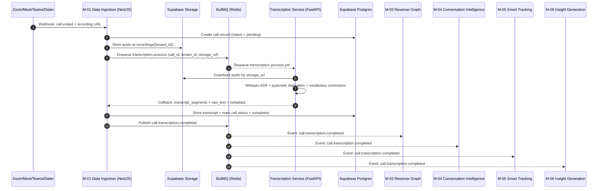

**Steps:**

1. Validate webhook signature (HMAC). Reject invalid requests with `401`.
2. Create the call record in PostgreSQL with status `pending`.
3. Download audio and upload to Supabase Storage at `recordings/{tenant_id}/...`; persist `storage_url`; update call status to `audio_stored`.
4. Enqueue BullMQ job `transcription.process` with payload: `call_id`, `tenant_id`, `storage_url`, `participant_list`, `language_hint`.
5. Transcription Service dequeues the `transcription.process` job from BullMQ.
6. Transcription Service downloads audio from Supabase Storage using `storage_url`.
7. Run ASR (Whisper as primary; fall back to AssemblyAI on failure/timeout).
8. Run diarization (pyannote.audio).
9. Merge ASR output + diarization into speaker-labeled segments:

   ```json
   [{ "speaker": "Speaker_1", "text": "...", "start": 0.0, "end": 4.2 }]
   ```
10. Apply tenant vocabulary corrections (from `vocabulary_corrections` table).
11. Callback to NestJS internal endpoint with `transcript_segments[]`, `raw_text`, `language_detected`, and `duration`.
12. Store transcript in PostgreSQL (`transcripts` table).
13. Update call status to `completed`.
14. Publish `call.transcription.completed` event to BullMQ with payload:
    `{ event_id, call_id, transcript_id, tenant_id, duration_seconds, language_detected, confidence_score }`

**Error Handling:**

| **Step**                        | **Failure**                    | **Recovery**                                                                                              |
| ------------------------------- | ------------------------------ | --------------------------------------------------------------------------------------------------------- |
| Step 1 — Webhook validation     | Invalid HMAC signature         | Return `401`, log to Sentry, do not create call record                                                    |
| Step 3 — Audio download         | URL expired or unreachable     | Retry × 3 with exponential backoff; mark status = `audio_fetch_failed`; alert RevOps via Sentry          |
| Step 7 — Whisper transcription  | Model timeout or error         | Retry once on Whisper; fall back to AssemblyAI; if both fail → status = `transcription_failed` + Sentry  |
| Step 11 — Callback to NestJS    | Network failure                | BullMQ job retries up to 3 times with backoff; dead-letter queue after 3 failures                         |
| Step 14 — Event emission        | BullMQ write failure           | BullMQ Redis persistence ensures job is not lost; retried on next worker poll                             |

> **Cascade Failure Rule:**
> If `call.transcription.completed` is never published — due to `transcription_failed` or
> `audio_fetch_failed` — all downstream modules are silently unaffected. They only
> act on receipt of this event. RevOps is alerted via Sentry. No partial data is written.
> The call record remains in a failed status and can be manually re-triggered.

---

### 7.3 Flow 2 — AI Summary Generation

**Trigger:** M-06 `InsightGenerationModule` receives the
`call.transcription.completed` event from BullMQ.

**Overview diagram:**

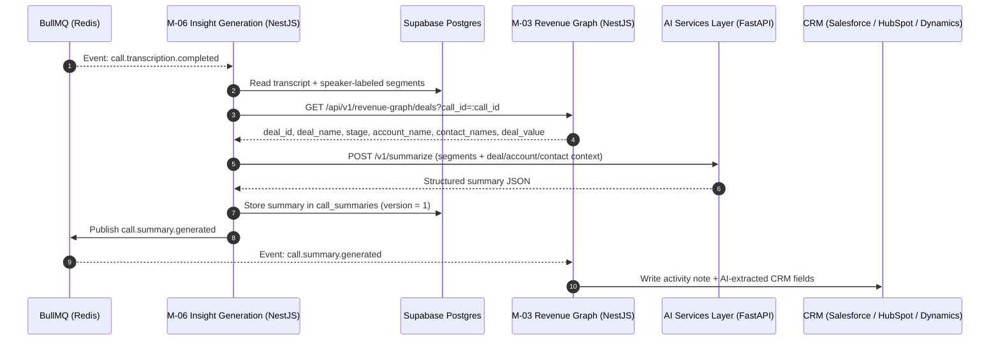

**Steps:**

1. Fetch transcript from PostgreSQL:

   ```sql
   SELECT raw_text, speaker_labeled_segments
   FROM transcripts
   WHERE transcript_id = :transcript_id
     AND tenant_id = :tenant_id;
   ```
2. Fetch deal and account context from M-03 Revenue Graph:
   - `GET /api/v1/revenue-graph/deals?call_id=:call_id`
   - Expected response fields: `deal_id`, `deal_name`, `stage`, `account_name`, `contact_names[]`, `deal_value`.
   - If no deal is linked yet, wait up to 5 minutes using a BullMQ delayed job before proceeding without context.
3. Build the prompt payload from transcript segments + deal, account, and contact context.
4. Call AI Services Layer: `POST /v1/summarize`
   Payload: `{ transcript_segments[], deal_context, contact_context, tenant_id, language }`
5. AI Services Layer builds the LLM prompt via LiteLLM and returns structured summary JSON:

   ```json
   {
     "one_line_summary": "...",
     "key_points": ["...", "..."],
     "next_steps": [{ "action": "...", "owner": "...", "due_date": null }],
     "risks": [{ "risk_type": "...", "severity": "medium", "snippet": "..." }],
     "topics_discussed": ["pricing", "timeline", "competitor"],
     "confidence_score": 0.91
   }
   ```
6. Store summary in `call_summaries`:
   - Set `confidence_score` from AI response.
   - Set `flagged_review = true` if `confidence_score < 0.7`.
   - Set `version = 1` (increments on regeneration).
7. Publish `call.summary.generated` to BullMQ with payload:
   `{ event_id, summary_id, call_id, tenant_id, confidence_score, flagged_review, generated_at }`
8. M-03 Revenue Graph consumes `call.summary.generated`:
   - Writes summary as a CRM activity note via Salesforce / HubSpot / Dynamics API.
   - Pushes AI-extracted CRM field values to the linked deal record.

**Error Handling:**

| **Step**                      | **Failure**                 | **Recovery**                                                                              |
| ----------------------------- | --------------------------- | ----------------------------------------------------------------------------------------- |
| Step 2 — M-03 context fetch   | Deal not yet linked         | Retry with 5-min delay; proceed without context if still unlinked                         |
| Step 4 — AI Services timeout  | LLM or network failure      | Retry × 3; after 3 failures → skip summary, mark `summary_failed`, Sentry alert          |
| Step 6 — DB write failure     | PostgreSQL unavailable      | BullMQ job retries × 3; dead-letter queue on exhaustion                                   |
| Step 8 — CRM write failure    | Rate limit or auth error    | Retry × 3 with exponential backoff; log to `crm_sync_logs` with `error_message`          |

> **Idempotency Rule:**
> If `call.transcription.completed` is received twice for the same `call_id`,
> M-06 checks for an existing `call_summaries` record before processing.
> If `version = 1` already exists, the job is skipped.
> Re-generation is only triggered by an explicit user action:
> `POST /api/v1/insights/calls/:id/summary/regenerate`

---

### 7.4 Flow 3 — Deal Health Score Update

**Trigger:** Any of the following events arrive at M-07 `DealAccountModule`:
- `tracker.detection.created` — new risk signal detected on a deal
- `call.summary.generated` — new risks and next steps computed for a call
- `deal.stage.changed` — deal moved stage in CRM via M-03

**Overview diagram:**

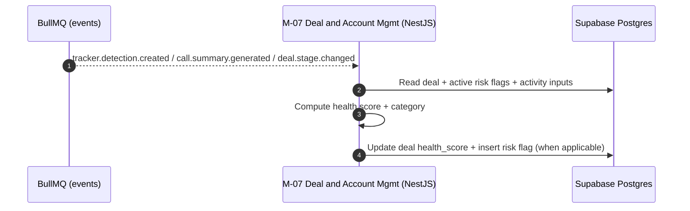

**Steps:**

1. Fetch current deal state:

   ```sql
   SELECT deal_id, stage, value, close_date, last_activity_at, owner_user_id
   FROM deals
   WHERE deal_id = :deal_id
     AND tenant_id = :tenant_id;
   ```
2. Fetch active (unresolved) risk flags:

   ```sql
   SELECT risk_type, severity, source, detected_at
   FROM deal_risk_flags
   WHERE deal_id = :deal_id
     AND resolved_at IS NULL;
   ```
3. Compute engagement inputs from the last 14 days:
   - Call count (from `activities` where `type = 'call'`)
   - Email count (from `activities` where `type = 'email'`)
   - Days since last interaction (`NOW() - last_activity_at`)
   - Count of unresolved risk flags
   - Count of past-due next steps (from `call_summaries.next_steps` where `due_date < NOW()`)
4. Compute health score using weighted formula:

   | **Input**                          | **Weight** |
   | ---------------------------------- | ---------- |
   | Recent activity volume (last 14d)  | 30%        |
   | Days since last interaction        | 25%        |
   | Number of open risk flags          | 25%        |
   | Past-due next steps count          | 20%        |

   Health categories:
   - `healthy` — score 80–100
   - `at_risk` — score 50–79
   - `critical` — score 0–49

5. If trigger is `tracker.detection.created`:
   - Insert a new `deal_risk_flags` row:
     `{ deal_id, tenant_id, risk_type, severity, source='tracker_detection', source_id=detection_id, detected_at=NOW() }`
   - Re-run health score computation with the new flag included.
6. If trigger is `deal.stage.changed`:
   - Auto-resolve any `stage_stuck` risk flags where `resolved_at IS NULL` for this deal.
   - Re-run health score computation with updated stage inputs.
7. Write results to PostgreSQL:

   ```sql
   UPDATE deals
   SET health_score    = :computed_score,
       health_category = :category,
       last_signal_at  = NOW()
   WHERE deal_id = :deal_id
     AND tenant_id = :tenant_id;
   ```
8. Deals Board reflects the updated health badge on next load of
   `GET /api/v1/deal-management/boards/deals` — no cache invalidation required
   (board endpoint reads live from PostgreSQL).

**Error Handling:**

| **Step**                    | **Failure**                    | **Recovery**                                                      |
| --------------------------- | ------------------------------ | ----------------------------------------------------------------- |
| Steps 1–2 — DB read         | PostgreSQL unavailable         | BullMQ job retries × 3 with backoff; health score remains stale  |
| Step 5 — Risk flag insert   | Duplicate `(deal_id, source_id)` | Unique constraint prevents duplicate; upsert on conflict        |
| Step 7 — DB write           | Write failure                  | BullMQ job retries × 3; Sentry alert on exhaustion               |

> **Idempotency Rule:**
> All three trigger events carry an `event_id`. M-07 checks whether a
> `deal_risk_flags` row with `source_id = detection_id` already exists before
> inserting. Health score recomputation is always safe to re-run — it is a pure
> function of current DB state.

---

### 7.5 Flow 4 — Post-Call Agentic Flow

This is the most complex flow in the platform. It runs automatically after every
call is transcribed and executes multiple AI steps in sequence using LangGraph in
the AI Services Layer. It produces the complete set of post-call AI outputs in one
coordinated agent run.

**Trigger:** `call.transcription.completed` event received by M-06.
M-06 dispatches a single BullMQ job to the AI Services Layer for the full
post-call agent run.

**Overview diagram:**

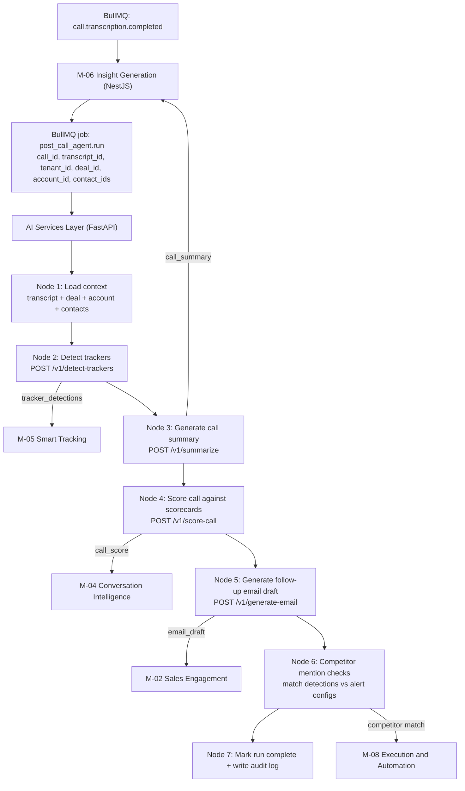

**Node Detail:**

| **Node**                      | **Input**                                   | **Action**                    | **Output Written**                                        |
| ----------------------------- | ------------------------------------------- | ----------------------------- | --------------------------------------------------------- |
| Node 1 — Load context         | `call_id`, `transcript_id`, `deal_id`       | Fetches transcript + deal + account + contact records | Shared agent state              |
| Node 2 — Detect trackers      | Transcript + published tracker definitions  | `POST /v1/detect-trackers`    | `tracker_detections[]` to M-05 `tracker_detections` table |
| Node 3 — Generate summary     | Transcript + deal context + N2 detections   | `POST /v1/summarize`          | `call_summary` to M-06 `call_summaries` table             |
| Node 4 — Score call           | Transcript + active scorecards              | `POST /v1/score-call`         | `call_score` to M-04 `call_scores` table                  |
| Node 5 — Email draft          | N3 next_steps + deal context                | `POST /v1/generate-email`     | `email_draft` to M-02 `email_drafts` table                |
| Node 6 — Competitor check     | N2 detections + `competitor_alert_configs`  | In-memory match — no LLM call | Triggers M-08 alert if match + confidence meets threshold |
| Node 7 — Audit log            | All node outputs                            | Write run status + durations  | `post_call_agent_runs` audit table                        |

**Why LangGraph and not a simple chain of API calls:**

Each node needs access to outputs from previous nodes. Node 3 (summary) uses
tracker detections from Node 2 to highlight the most significant signals.
Node 5 (email draft) uses the next steps from Node 3 to write the email body.
LangGraph's stateful graph maintains a shared state object across all nodes —
no node re-fetches data that a previous node already loaded.

**Performance targets:**

| **Metric**                   | **Target**                         |
| ---------------------------- | ---------------------------------- |
| Total post-call agent run    | < 90 seconds for a 60-minute call  |
| Node 2 — tracker detection   | < 20 seconds                       |
| Node 3 — summary             | < 30 seconds                       |
| Node 4 — scorecard           | < 20 seconds                       |
| Node 5 — email draft         | < 15 seconds                       |

**Error Handling:**

| **Node**                        | **Failure**                     | **Recovery**                                                                                     |
| ------------------------------- | ------------------------------- | ------------------------------------------------------------------------------------------------ |
| Any node — LLM timeout          | LiteLLM call exceeds timeout    | Retry that node × 2; skip + log if still failing. Subsequent nodes continue with partial state. |
| Node 2 — no trackers published  | Tenant has no published trackers | Skip silently — not an error                                                                    |
| Node 4 — no active scorecard    | Tenant has no active scorecard   | Skip silently — not an error                                                                    |
| Node 5 — no deal linked         | `deal_id` is null               | Generate generic non-personalized draft                                                          |
| Node 7 — audit log write fails  | PostgreSQL write error           | Log to Sentry; do not fail the run                                                               |

> **Partial Completion Rule:**
> A node failure does not abort the entire agent run.
> Each node is independently retried. If a node is permanently skipped,
> the agent run is marked `partial_success` in the audit log.
> Node 3 (summary) is the only node with no fallback skip — it retries
> until the BullMQ job TTL expires (24 hours).

---

### 7.6 Flow 5 — CRM Sync (R-Revenue Intelligence to Salesforce / HubSpot / Dynamics)

**Trigger:** Two triggers:
- **Trigger A** — Scheduled daily full sync via BullMQ cron job at 02:00 UTC
- **Trigger B** — Real-time partial activity sync triggered by `call.summary.generated` event

**Overview diagram:**

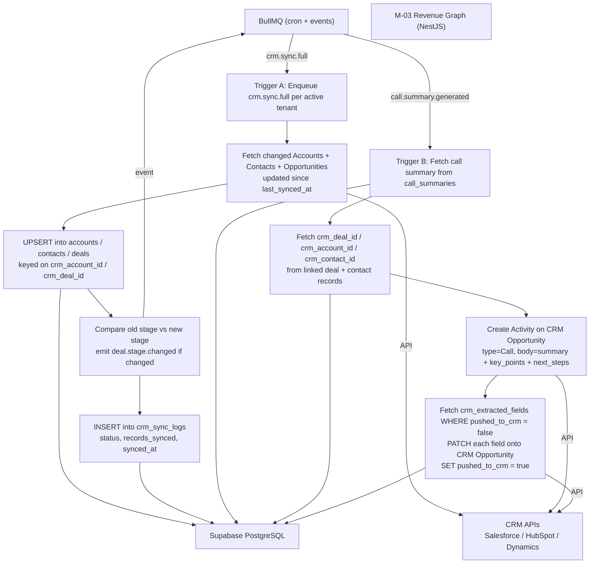

**Trigger A — Full Sync Steps:**

1. BullMQ cron fires at 02:00 UTC. Enqueue one `crm.sync.full` job per active tenant.
2. For each tenant, fetch all CRM records updated since `last_synced_at`:
   - Paginate through Accounts, Contacts, Opportunities
   - Use CRM `last_modified_date` filter to avoid full table scans
3. Upsert into PostgreSQL:

   ```sql
   INSERT INTO accounts (account_id, tenant_id, crm_account_id, name, industry, arr, synced_at)
   VALUES (:values)
   ON CONFLICT (tenant_id, crm_account_id)
   DO UPDATE SET name = EXCLUDED.name, arr = EXCLUDED.arr, synced_at = NOW();
   -- Same pattern for contacts and deals
   ```
4. Detect deal stage changes:

   ```sql
   SELECT deal_id, stage AS old_stage
   FROM deals
   WHERE crm_deal_id = :crm_deal_id
     AND stage != :new_stage_from_crm;
   ```

   If a stage change is detected:
   - `UPDATE deals SET stage = :new_stage, synced_at = NOW()`
   - Publish `deal.stage.changed` event → consumed by M-08 and M-09

5. Write sync log:

   ```sql
   INSERT INTO crm_sync_logs
     (sync_id, tenant_id, crm_platform, entity_type, status, records_synced, synced_at, error_message)
   VALUES (:values);
   ```

**Trigger B — Real-time Activity Sync Steps:**

1. Fetch call summary:

   ```sql
   SELECT one_line_summary, key_points, next_steps
   FROM call_summaries
   WHERE call_id = :call_id
     AND tenant_id = :tenant_id;
   ```
2. Fetch linked CRM entity IDs:

   ```sql
   SELECT d.crm_deal_id, a.crm_account_id, c.crm_contact_id
   FROM deals d
   JOIN accounts a ON d.account_id = a.account_id
   JOIN deal_contacts dc ON d.deal_id = dc.deal_id
   JOIN contacts c ON dc.contact_id = c.contact_id
   WHERE d.deal_id = :deal_id
     AND d.tenant_id = :tenant_id;
   ```
3. Create Activity record on the CRM Opportunity via API:
   - `type = 'Call'`, `occurred_at = call.started_at`
   - Body: formatted `one_line_summary` + `key_points[]` + `next_steps[]`
4. Push AI-extracted CRM fields:

   ```sql
   SELECT field_name, field_value
   FROM crm_extracted_fields
   WHERE call_id = :call_id
     AND pushed_to_crm = false;
   ```

   For each field: `PATCH` the Opportunity in CRM.
   Then: `UPDATE crm_extracted_fields SET pushed_to_crm = true WHERE call_id = :call_id`

**Error Handling:**

| **Step**                              | **Failure**                        | **Recovery**                                                                                     |
| ------------------------------------- | ---------------------------------- | ------------------------------------------------------------------------------------------------ |
| Trigger A — CRM API rate limit        | 429 from Salesforce / HubSpot      | Exponential backoff; resume pagination from last cursor                                          |
| Trigger A — Partial sync failure      | One entity type fails mid-sync     | Log to `crm_sync_logs` with `status='partial'`; retry that entity on next cron                  |
| Trigger B — CRM Activity write fails  | Auth expiry or API error           | Retry × 3; log to `crm_sync_logs` with `error_message`; do not block summary storage            |
| Trigger B — No CRM ID linked          | Deal not yet synced from CRM       | Skip CRM write; set `pushed_to_crm = false` until next full sync links the entity               |

> **CRM Write Boundary:**
> M-03 writes only to Activity records (call notes) and AI-extracted field values
> on Opportunities. M-03 never writes to deal stage, contact or account owner fields,
> or any field not explicitly in `crm_extracted_fields`.

---

### 7.7 Flow 6 — User Authentication and Org Isolation

**Trigger:** Any user attempts to sign in or makes any authenticated API request.

**Overview diagram:**

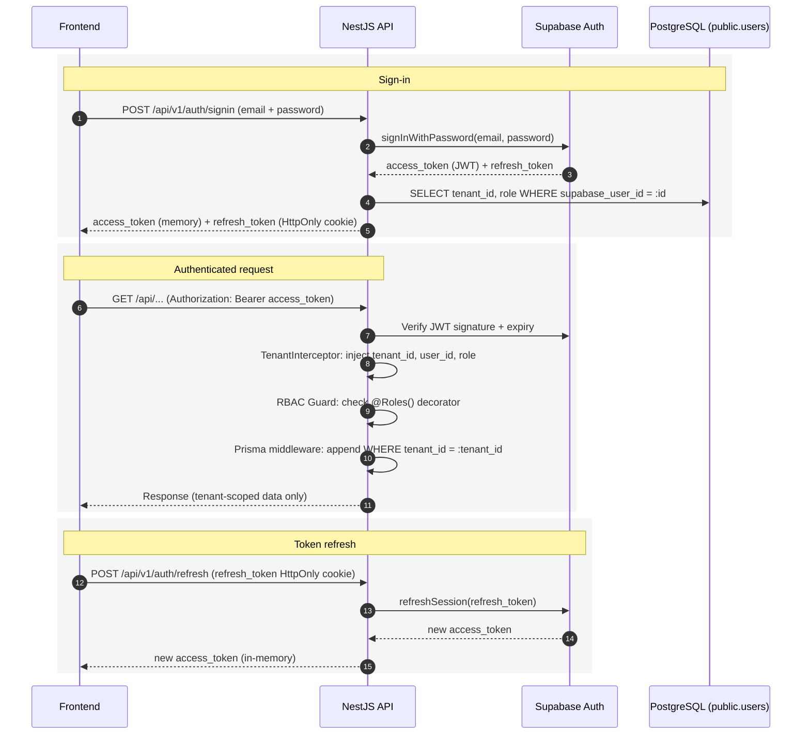

---

#### Sign-in Flow

**Step 1 — User submits credentials:**

```http
POST /api/v1/auth/signin
Content-Type: application/json

{ "email": "rep@acme.com", "password": "..." }
```

**Step 2 — NestJS forwards to Supabase Auth:**
- Calls `supabase.auth.signInWithPassword({ email, password })`
- On success: Supabase returns `access_token` (JWT) + `refresh_token`
- On failure: Supabase returns error → NestJS returns `401` to frontend

**Step 3 — NestJS resolves tenant and role:**

```sql
SELECT tenant_id, role, user_id
FROM users
WHERE supabase_user_id = :supabase_user_id
  AND is_active = true;
```

**Step 4 — Return session to frontend:**
- `access_token` → returned in response body → stored in memory only (never `localStorage`)
- `refresh_token` → set as HttpOnly, Secure, SameSite=Strict cookie — JavaScript cannot read it
- Response body: `{ access_token, user_id, tenant_id, role }`

> **Token Storage Rule:**
> `access_token` must be stored in memory (a module-level variable or React context).
> Never in `localStorage` or `sessionStorage`. The `refresh_token` in an HttpOnly
> cookie is equally protected from XSS attacks.

---

#### Authenticated Request Flow

**Step 1 — Frontend sends request with Bearer token:**

```http
GET /api/v1/deal-management/boards/deals
Authorization: Bearer <access_token>
```

**Step 2 — JWT Guard verifies token:**
- Intercepts every incoming request via NestJS global guard
- Calls Supabase Auth to verify JWT signature and expiry
- Extracts `supabase_user_id` from verified token
- If token expired → return `401` → frontend triggers refresh flow
- If token invalid → return `401` → frontend redirects to login

**Step 3 — TenantInterceptor injects tenant context:**

```typescript
req.context = {
  tenant_id: 'uuid',
  user_id:   'uuid',
  role:      'AE' | 'Manager' | 'RevOps' | 'Admin'
};
```

**Step 4 — RBAC Guard checks permissions:**

```typescript
@Get('coaching/team')
@Roles('Manager', 'Admin', 'RevOps')
async getTeamCoaching(@CurrentUser() user: User) { ... }
```

**Step 5 — Prisma middleware scopes all queries:**

```typescript
prisma.$use(async (params, next) => {
  const tenantId = asyncLocalStorage.getStore()?.tenant_id;
  if (!tenantId) throw new ForbiddenException('No tenant context');

  if (params.action === 'findMany' || params.action === 'findFirst') {
    params.args.where = { ...params.args.where, tenant_id: tenantId };
  }
  if (params.action === 'create') {
    params.args.data = { ...params.args.data, tenant_id: tenantId };
  }
  return next(params);
});
```

> **Prisma Middleware Rule:**
> This middleware is the last line of defense for org isolation.
> Even if a developer forgets `WHERE tenant_id = x`, the middleware adds it
> automatically. It must never be disabled, bypassed, or overridden.
> Any pull request that modifies `prisma.middleware.ts` requires Tech Lead
> review and approval before merging. This applies without exception.

**Step 6 — Response returned to frontend:**
- Data is returned guaranteed to belong only to the requesting tenant.
- No cross-tenant data leakage is possible at the application layer.

---

#### Token Refresh Flow

When frontend receives `401` on any request:

```http
POST /api/v1/auth/refresh
Cookie: refresh_token=<httpOnly cookie>
```

1. NestJS reads `refresh_token` from HttpOnly cookie (never from request body)
2. Calls `supabase.auth.refreshSession(refresh_token)`
3. Supabase issues new `access_token`
4. Frontend retries the original failed request with the new token
5. If refresh also fails (token revoked or expired): clear session → redirect to login

---

#### Org Isolation Guarantee — Defense in Depth

| **Layer**               | **Mechanism**                                      | **What It Prevents**                                  |
| ----------------------- | -------------------------------------------------- | ----------------------------------------------------- |
| Layer 1 — Network       | Supabase RLS policies on PostgreSQL                | Direct DB access without valid tenant context         |
| Layer 2 — Application   | Prisma middleware (automatic `tenant_id` injection) | Developer error — forgetting `WHERE tenant_id`       |
| Layer 3 — API           | TenantInterceptor on every request                 | Any request without a verified tenant context         |
| Layer 4 — Route         | RBAC Guard + `@Roles()` decorator                  | Role escalation — reps accessing manager/admin data   |
| Layer 5 — Token         | HttpOnly cookie (refresh) + memory-only (access)   | XSS token theft                                       |

---

### 7.8 Flow Summary

| **Flow**                               | **Trigger**                                                                         | **Critical Path**                                                                                                         | **Max Time Target**                   |
| -------------------------------------- | ----------------------------------------------------------------------------------- | ------------------------------------------------------------------------------------------------------------------------- | ------------------------------------- |
| Flow 1 — Call Ingestion to Transcript  | Webhook: call ended on Zoom / Teams / Meet / Dialer                                 | Webhook → HMAC → BullMQ → Transcription Service → Whisper → Transcript stored → `call.transcription.completed` emitted  | 5 minutes for a 60-minute call        |
| Flow 2 — AI Summary Generation         | `call.transcription.completed` event                                                | M-06 → PostgreSQL → M-03 context → AI Services → LiteLLM → Summary stored → `call.summary.generated` emitted            | 30 seconds                            |
| Flow 3 — Deal Health Score Update      | `tracker.detection.created` or `call.summary.generated` or `deal.stage.changed`    | M-07 → PostgreSQL (deal + flags) → score computation → deal record updated                                                | 5 seconds                             |
| Flow 4 — Post-Call Agentic Flow        | `call.transcription.completed` (async batch)                                        | M-06 → BullMQ → AI Services → LangGraph (7 nodes) → outputs written to M-02, M-04, M-05, M-08                           | 90 seconds for a 60-minute call       |
| Flow 5 — CRM Sync                      | Daily cron at 02:00 UTC (full) or `call.summary.generated` (partial)               | M-03 → CRM API → PostgreSQL upsert + stage change detection (full) OR summary → CRM activity write + field push (partial) | Full: 10 min/tenant · Partial: 10s   |
| Flow 6 — Auth and Org Isolation        | Every API request                                                                   | JWT Guard → TenantInterceptor → RBAC Guard → Prisma middleware → response                                                 | < 5ms overhead per request            |

---


## Section 8 — Database Architecture

---

### 8.1 Purpose of This Section

This section documents every database technology used in Relanto Revenue Intelligence,
how data is structured across schemas, how multi-tenancy is enforced, and how
analytical and vector data is handled in ClickHouse and pgvector.

Read this section before creating any new database table, writing any migration,
or querying data from a module you do not own. The schema ownership rules and
cross-schema read rules in this section are enforced in code review. A pull request
that creates a table in the wrong schema or queries across a schema boundary without
permission will not be merged.

---

### 8.2 Database Technology Stack

| **Store**             | **Technology** | **Version**          | **Purpose**                                                                                 |
| --------------------------- | -------------------- | -------------------------- | ------------------------------------------------------------------------------------------------- |
| Primary relational database | Supabase PostgreSQL  | PostgreSQL 16              | All core platform data — users, calls, transcripts, deals, accounts, forecasts, emails, coaching |
| Analytics store             | ClickHouse           | 24.x (latest stable)       | High-volume time-series and aggregation queries for Revenue Dashboards and Coaching Insights      |
| Vector store                | pgvector             | Extension on PostgreSQL 16 | Embedding storage for semantic search, Ask Anything RAG, and AI Deep Researcher                   |
| Search index                | Meilisearch          | Latest stable              | Full-text search across the Conversation Library — transcripts, emails, topic tags               |
| Cache / Queue               | Redis                | 7.x                        | Session data, rate limits, BullMQ queue backing store                                             |

> **Source of truth rule:** All primary data lives in Supabase PostgreSQL.
> ClickHouse, pgvector, and Meilisearch receive data replicated or written from
> PostgreSQL. Redis is not a source of truth — it is a temporary operational store
> only. If Redis data is lost, the platform continues functioning.

---

### 8.3 Schema Isolation Strategy

Relanto Revenue Intelligence uses **one PostgreSQL schema per module**. Every module
owns its own schema. A module may only **write** to its own schema. Cross-schema
reads are permitted only through defined read contracts documented in Section 8.6.

**Why schema-per-module:**

PostgreSQL schemas provide a namespace boundary within the same database instance.
This means:

- Tables from different modules cannot be accidentally joined without explicitly
  referencing the schema name (e.g., `transcription.transcripts` vs `deals.deals`)
- Each module's Prisma schema file maps to its own PostgreSQL schema
- Database migrations for one module do not touch another module's schema
- In Phase 3, when a module is extracted as a microservice, its schema can be
  migrated to a separate database instance with minimal effort — the schema
  boundary already exists in code and in the database

**Schema naming convention:** all lowercase, single word, matching the module domain.

---

### 8.4 Schema Registry

| **Schema**              | **Owned By**             | **Key Tables**                                                                                                                                       |
| ----------------------------- | ------------------------------ | ---------------------------------------------------------------------------------------------------------------------------------------------------------- |
| `platform`                  | Platform Core                  | `tenants`, `users`, `audit_logs`, `feature_flags`                                                                                                  |
| `ingestion`                 | M-01 Data Ingestion            | `calls`, `transcripts`, `crm_extracted_fields`, `recording_uploads`                                                                                |
| `engagement`                | M-02 Sales Engagement          | `email_drafts`, `email_sends`, `email_templates`, `email_flows`, `email_flow_enrollments`, `tasks`, `linkedin_activities`                    |
| `revenue_graph`             | M-03 Revenue Graph             | `accounts`, `contacts`, `deals`, `deal_contacts`, `activities`, `crm_sync_logs`, `data_cloud_exports`                                        |
| `conversation_intelligence` | M-04 Conversation Intelligence | `scorecards`, `call_scores`, `themes`, `theme_analyses`, `topic_tags`, `topic_models`, `vocabulary_corrections`, `translation_preferences` |
| `smart_tracking`            | M-05 Smart Tracking            | `trackers`, `tracker_detections`, `search_index_sync_log`, `deal_driver_snapshots`                                                                 |
| `insights`                  | M-06 Insight Generation        | `call_summaries`, `deal_briefs`, `account_briefs`, `research_reports`, `query_sessions`                                                          |
| `deal_management`           | M-07 Deal & Account Mgmt       | `deal_board_configs`, `deal_risk_flags`, `account_board_configs`, `engagement_scores`, `renewal_signals`                                         |
| `execution`                 | M-08 Execution & Automation    | `sales_plays`, `play_enrollments`, `play_step_completions`, `workflows`, `workflow_runs`, `competitor_alert_configs`, `competitor_alerts`    |
| `forecasting`               | M-09 Forecasting               | `forecast_periods`, `forecast_submissions`, `ai_forecast_snapshots`, `pipeline_coverage_metrics`, `historical_conversion_rates`                  |
| `performance`               | M-10 Performance & Coaching    | `dashboard_configs`, `coaching_snapshots`, `coaching_recommendations`, `trainer_scenarios`, `trainer_sessions`                                   |

---

### 8.5 Multi-Tenancy Enforcement

Every table in every schema includes `tenant_id UUID NOT NULL` as its second column
(after the primary key). This is enforced in two layers:

**Layer 1 — PostgreSQL Row-Level Security (RLS):**

```sql
-- Applied to every table in every schema
ALTER TABLE ingestion.calls ENABLE ROW LEVEL SECURITY;

CREATE POLICY tenant_isolation ON ingestion.calls
  USING (tenant_id = current_setting('app.current_tenant_id')::UUID);
```

The application sets `app.current_tenant_id` at the start of every database session
via the Prisma middleware. This means even a raw SQL query executed without the
application layer will only return rows for the active tenant.

**Layer 2 — Prisma Middleware (application layer):**

```typescript
// Automatically appends tenant_id to every Prisma query
// See Section 7.7, Step 5 for full implementation
prisma.$use(async (params, next) => {
  const tenantId = asyncLocalStorage.getStore()?.tenant_id;
  if (!tenantId) throw new ForbiddenException('No tenant context');
  params.args.where = { ...params.args.where, tenant_id: tenantId };
  return next(params);
});
```

> **🚨 Mandatory Column Rule:**
> Any migration that creates a new table without `tenant_id UUID NOT NULL` as the
> second column will be rejected at code review. The only exceptions are:
>
> - Join tables where both foreign keys already carry tenant context
>   (e.g., `deal_contacts`: `deal_id` + `contact_id` — tenant enforced via FK)
> - Internal audit/log tables that are platform-scoped, not tenant-scoped

---

### 8.6 Cross-Schema Read Contracts

A module may read from another module's schema **only** via the patterns below.
Direct cross-schema SQL joins in application code are not permitted.

| **Reader Module**        | **Data Needed**                              | **Permitted Access Pattern**                                |
| ------------------------------ | -------------------------------------------------- | ----------------------------------------------------------------- |
| M-02 Sales Engagement          | Contact + deal context for email personalization   | `GET /api/v1/revenue-graph/deals/:id` (M-03 API)                |
| M-04 Conversation Intelligence | Deal stage + account segment for scorecard context | `GET /api/v1/revenue-graph/deals/:id` (M-03 API)                |
| M-05 Smart Tracking            | Deal + account context to enrich detections        | `GET /api/v1/revenue-graph/deals/:id` (M-03 API)                |
| M-06 Insight Generation        | Deal + account + contact context for briefs        | `GET /api/v1/revenue-graph/deals/:id` (M-03 API)                |
| M-06 Insight Generation        | Tracker detections for deal briefs                 | `GET /api/v1/smart-tracking/trackers/:id/detections` (M-05 API) |
| M-07 Deal & Account Mgmt       | Accounts, contacts, deals, activities              | `GET /api/v1/revenue-graph/deals/:id` (M-03 API)                |
| M-07 Deal & Account Mgmt       | Deal briefs + account briefs                       | `GET /api/v1/insights/deals/:id/brief` (M-06 API)               |
| M-08 Execution & Automation    | Deal + account context for play enrollment         | `GET /api/v1/revenue-graph/deals/:id` (M-03 API)                |
| M-10 Performance & Coaching    | Call scores + topic distributions                  | `call_scores` + `topic_tags` via M-04 API                     |
| M-10 Performance & Coaching    | Deal outcomes + win rates                          | `GET /api/v1/revenue-graph/deals` (M-03 API)                    |
| M-10 Performance & Coaching    | Historical forecast submissions                    | `forecast_submissions` via M-09 API                             |

> **Rule:** If the data you need is owned by another module's schema, call that
> module's API — never write a Prisma query that crosses schema boundaries.
> The only permitted direct cross-schema read is M-03's `revenue_graph` schema
> being read by M-07 via a **PostgreSQL view** defined in Phase 3 for performance.
> That view is documented as a named exception and requires Tech Lead approval.

---

### 8.7 ClickHouse — Analytics Store

ClickHouse receives a **write-through stream** from PostgreSQL for all time-series
and aggregation-heavy data. It is used exclusively by M-10 Performance & Coaching
for Revenue Dashboard queries.

**Tables replicated to ClickHouse:**

| **ClickHouse Table**     | **Source**                          | **Replication Method**            | **Retention** |
| ------------------------------ | ----------------------------------------- | --------------------------------------- | ------------------- |
| `call_events`                | `ingestion.calls`                       | CDC via Debezium → Kafka → ClickHouse | 24 months           |
| `activity_events`            | `revenue_graph.activities`              | CDC                                     | 24 months           |
| `call_score_events`          | `conversation_intelligence.call_scores` | CDC                                     | 24 months           |
| `tracker_detection_events`   | `smart_tracking.tracker_detections`     | CDC                                     | 24 months           |
| `forecast_submission_events` | `forecasting.forecast_submissions`      | CDC                                     | 24 months           |

**Why ClickHouse and not PostgreSQL for dashboards:**

Revenue Dashboard queries aggregate millions of activity rows per tenant across
rolling time windows (last 30 days, last quarter, YTD). PostgreSQL can handle this
at low data volumes, but at scale — thousands of calls per tenant per month —
aggregation queries block connection pools and degrade API performance.
ClickHouse is purpose-built for columnar aggregation and handles these queries
in milliseconds regardless of row count.

**Fallback rule:** If ClickHouse is unavailable, M-10 falls back to PostgreSQL
aggregates and logs a Sentry alert. Dashboard data may be slower but is never
unavailable.

---

### 8.8 pgvector — Vector Store

pgvector is a PostgreSQL extension installed on the same Supabase instance.
It stores embeddings for all transcript chunks, email content, and summaries
to enable semantic search (M-05) and RAG-based Ask Anything (M-06).

**Vector tables:**

```sql
-- One embedding per transcript chunk (approx. 512 tokens per chunk)
CREATE TABLE insights.transcript_embeddings (
  embedding_id  UUID PRIMARY KEY,
  tenant_id     UUID NOT NULL,
  call_id       UUID NOT NULL,
  chunk_index   INTEGER,
  chunk_text    TEXT,
  embedding     VECTOR(1536),     -- OpenAI text-embedding-3-small dimensions
  created_at    TIMESTAMPTZ DEFAULT NOW()
);

CREATE INDEX ON insights.transcript_embeddings
  USING ivfflat (embedding vector_cosine_ops) WITH (lists = 100);

-- One embedding per email body
CREATE TABLE insights.email_embeddings (
  embedding_id  UUID PRIMARY KEY,
  tenant_id     UUID NOT NULL,
  send_id       UUID NOT NULL,
  body_text     TEXT,
  embedding     VECTOR(1536),
  created_at    TIMESTAMPTZ DEFAULT NOW()
);
```

**Embedding generation:**

- Triggered by `call.transcription.completed` → M-06 sends chunks to
  `POST /v1/embed` on AI Services Layer → stores results in `transcript_embeddings`
- Triggered by `email.sent` → M-05 sends body to `POST /v1/embed` → stores in
  `email_embeddings`

**Semantic search query pattern:**

```sql
-- Find the 20 most semantically similar transcript chunks for a query
SELECT chunk_text, call_id,
       1 - (embedding <=> :query_embedding) AS similarity
FROM insights.transcript_embeddings
WHERE tenant_id = :tenant_id
ORDER BY embedding <=> :query_embedding
LIMIT 20;
```

---

### 8.9 Migration Rules

All database migrations use **Prisma Migrate**. The following rules are mandatory:

1. **One migration per module per PR.** A migration file must only touch tables in
   the schema owned by the module being changed.
2. **Never drop a column in production.** Mark unused columns with a
   `-- DEPRECATED: reason, date` comment and schedule removal for the next major
   version. Dropping a column without a deprecation period will cause runtime errors
   in deployed services.
3. **All new tables require:**

   - `UUID PRIMARY KEY` (not serial integers)
   - `tenant_id UUID NOT NULL` as second column (see Section 8.5)
   - `created_at TIMESTAMPTZ DEFAULT NOW()`
   - At minimum one index on `(tenant_id, <primary_query_key>)`
4. **Migration naming convention:**
   `YYYYMMDD_HHMMSS_module_description.sql`
   Example: `20260416_143000_ingestion_add_confidence_score_to_calls.sql`
5. **All migrations must be reviewed by Tech Lead** before merging to `main`.
   No migration runs in production without explicit Tech Lead sign-off.

### 8.4 Full Schema List

---

#### Schema: `public`

**Owner Module:** Platform Core
**Purpose:** Cross-cutting identity and tenancy data shared by all modules.

| **Table**   | **Key Columns**                                                                  | **Purpose**                                                 |
| ----------------- | -------------------------------------------------------------------------------------- | ----------------------------------------------------------------- |
| `tenants`       | tenant_id, name, plan, status, created_at                                              | One row per customer organisation using the platform              |
| `users`         | user_id, tenant_id, supabase_user_id, email, full_name, avatar_url, status, created_at | All platform users across all tenants                             |
| `roles`         | role_id, tenant_id, name, permissions[]                                                | Role definitions per tenant (AE, SDR, Manager, Admin, RevOps)     |
| `user_roles`    | user_id, role_id, tenant_id, assigned_at                                               | Maps users to their roles within their tenant                     |
| `audit_logs`    | log_id, tenant_id, user_id, action, entity_type, entity_id, payload, created_at        | Immutable audit trail of all write operations across the platform |
| `feature_flags` | flag_id, tenant_id, flag_name, is_enabled, config                                      | Per-tenant feature flag overrides for gradual rollout             |
| `integrations`  | integration_id, tenant_id, platform, credentials_encrypted, status, last_connected_at  | Connected external system credentials (CRM, conferencing, email)  |

> **Write rule:** The `public` schema is read-only for all modules.
> No module other than Platform Core may write to the `public` schema.

---

#### Schema: `transcription`

**Owner Module:** M-01 Data Ingestion
**Purpose:** Stores everything related to call recording capture and transcript
production.

| **Table**            | **Key Columns**                                                                                                              | **Purpose**                                                        |
| -------------------------- | ---------------------------------------------------------------------------------------------------------------------------------- | ------------------------------------------------------------------------ |
| `calls`                  | call_id, tenant_id, source_platform, recording_url, storage_url, duration, participant_list, calendar_event_id, status, created_at | Master record for every captured call                                    |
| `audio_files`            | file_id, call_id, tenant_id, storage_bucket, storage_path, file_size_bytes, format, uploaded_at                                    | Raw audio file metadata stored in Supabase Storage                       |
| `transcripts`            | transcript_id, call_id, tenant_id, raw_text, language_detected, word_count, confidence_score, created_at                           | Full raw transcript text per call                                        |
| `speaker_segments`       | segment_id, transcript_id, call_id, tenant_id, speaker_label, text, start_time, end_time                                           | Speaker-labeled and timestamped transcript segments                      |
| `transcript_corrections` | correction_id, transcript_id, tenant_id, original_term, corrected_term, applied_at                                                 | Vocabulary correction log — records which terms were corrected per call |
| `ingestion_sources`      | source_id, tenant_id, platform, webhook_secret, status, last_webhook_at                                                            | Connected call recording sources and their webhook configurations        |
| `crm_extracted_fields`   | extraction_id, call_id, tenant_id, field_name, field_value, confidence_score, pushed_to_crm, pushed_at                             | AI-extracted CRM field values before and after CRM sync                  |

---

#### Schema: `conversation`

**Owner Module:** M-04 Conversation Intelligence
**Purpose:** Stores all AI analysis outputs from conversation intelligence —
call scores, topic tags, themes, tracker configurations, and tracker detections.

| **Table**             | **Key Columns**                                                                                                            | **Purpose**                                                         |
| --------------------------- | -------------------------------------------------------------------------------------------------------------------------------- | ------------------------------------------------------------------------- |
| `scorecards`              | scorecard_id, tenant_id, name, questions[], scoring_conditions, is_active, created_by                                            | Admin-defined call review scorecards                                      |
| `call_reviews`            | review_id, call_id, tenant_id, scorecard_id, ai_answers[], total_score, confidence_score, flagged_review, review_type, scored_at | Scorecard-based call review results (AI-generated or manual)              |
| `topics`                  | topic_id, tenant_id, name, phrases[], type, is_visible, created_at                                                               | Topic model definitions — pre-built and custom                           |
| `topic_tags`              | tag_id, call_id, tenant_id, topic_id, topic_name, confidence_score, tagged_at                                                    | Topic tags applied to individual calls                                    |
| `themes`                  | theme_id, analysis_id, tenant_id, name, summary, call_count, account_count, associated_revenue                                   | Clustered themes produced by AI Theme Spotter                             |
| `theme_analyses`          | analysis_id, tenant_id, business_question, filters, status, call_count_analyzed, created_by, created_at                          | AI Theme Spotter analysis job records                                     |
| `trackers`                | tracker_id, tenant_id, name, business_question, type, scope, is_published, created_by                                            | AI Smart Tracker definitions                                              |
| `tracker_detections`      | detection_id, tracker_id, call_id, tenant_id, deal_id, contact_id, snippet, timestamp_start, confidence_score, detected_at       | Individual tracker detection results per call                             |
| `vocabulary_corrections`  | vocab_id, tenant_id, incorrect_term, correct_term, language, is_active                                                           | Custom vocabulary rules for AI Transcriber                                |
| `translation_preferences` | pref_id, tenant_id, team_id, user_id, target_language                                                                            | Language preferences for AI Translator at workspace, team, and user level |

---

#### Schema: `summaries`

**Owner Module:** M-06 Insight Generation
**Purpose:** Stores all AI-generated summary outputs, research reports, conversation
session history, and vector embeddings used for semantic search and RAG.

| **Table**         | **Key Columns**                                                                                                                          | **Purpose**                                                                                        |
| ----------------------- | ---------------------------------------------------------------------------------------------------------------------------------------------- | -------------------------------------------------------------------------------------------------------- |
| `call_summaries`      | summary_id, call_id, tenant_id, one_line_summary, key_points[], next_steps[], risks[], confidence_score, flagged_review, version, generated_at | AI-generated structured summary for each call                                                            |
| `deal_briefs`         | brief_id, deal_id, tenant_id, summary_text, key_risks[], recent_signals[], sources[], confidence_score, version, generated_at                  | AI-generated deal brief combining multiple call and signal inputs                                        |
| `account_briefs`      | brief_id, account_id, tenant_id, summary_text, health_signals[], renewal_indicators[], confidence_score, version, generated_at                 | AI-generated account brief                                                                               |
| `research_reports`    | report_id, tenant_id, question, filters, status, result_text, source_call_ids[], created_by, created_at                                        | AI Deep Researcher multi-call analysis reports                                                           |
| `query_sessions`      | session_id, tenant_id, user_id, context_deal_id, context_account_id, created_at                                                                | Ask Anything GenAI conversation sessions                                                                 |
| `query_messages`      | message_id, session_id, tenant_id, role, content, cited_sources[], created_at                                                                  | Individual messages within an Ask Anything session                                                       |
| `semantic_embeddings` | embedding_id, tenant_id, entity_type, entity_id, embedding vector(1536), model_version, created_at                                             | pgvector embeddings for transcripts, summaries, and emails — used for semantic search and RAG retrieval |

> **pgvector note:** The `semantic_embeddings` table uses the pgvector extension.
> The `embedding` column is typed as `vector(1536)` — matching the dimension of
> OpenAI's `text-embedding-3-small` model. Similarity search queries use the
> `<=>` cosine distance operator. See Section 8.8 for full pgvector implementation
> details.

---

#### Schema: `deals`

**Owner Module:** M-07 Deal and Account Management
**Purpose:** Stores deal pipeline data, deal health scores, risk flags, and all
board configuration for the Deals Board.

| **Table**        | **Key Columns**                                                                                                                                | **Purpose**                                                       |
| ---------------------- | ---------------------------------------------------------------------------------------------------------------------------------------------------- | ----------------------------------------------------------------------- |
| `deals`              | deal_id, tenant_id, crm_deal_id, account_id, name, stage, value, close_date, owner_user_id, health_score, health_category, last_signal_at, synced_at | Master deal records synced from CRM and enriched with AI health scoring |
| `deal_stages`        | stage_id, tenant_id, crm_platform, stage_name, stage_order, is_closed_won, is_closed_lost                                                            | Pipeline stage definitions per tenant and CRM platform                  |
| `deal_health_scores` | score_id, deal_id, tenant_id, score, category, activity_score, risk_flag_count, past_due_next_steps, days_since_last_contact, computed_at            | Historical health score log — one row per scoring event                |
| `deal_risk_flags`    | flag_id, deal_id, tenant_id, risk_type, severity, source, source_id, detected_at, resolved_at                                                        | Active and resolved risk flags on deals                                 |
| `deal_contacts`      | deal_id, contact_id, tenant_id, role, added_at                                                                                                       | Junction table mapping contacts to deals with their role                |
| `deal_board_configs` | config_id, tenant_id, user_id, column_order[], visible_fields[], default_filters, created_at                                                         | Per-user Deals Board column and filter configuration                    |
| `deal_drivers`       | driver_id, tenant_id, user_id, tracker_id, detection_count, affected_deal_count, computed_at                                                         | Aggregated deal risk signal counts per rep for the Deal Drivers view    |

---

#### Schema: `accounts`

**Owner Module:** M-03 Revenue Graph (accounts and contacts); M-07 (account boards)
**Purpose:** Stores account and contact master data, CRM sync state, engagement
scores, renewal signals, and account board configuration.

| **Table**           | **Key Columns**                                                                                                         | **Purpose**                                                      |
| ------------------------- | ----------------------------------------------------------------------------------------------------------------------------- | ---------------------------------------------------------------------- |
| `accounts`              | account_id, tenant_id, crm_account_id, name, industry, arr, segment, health_score, synced_at                                  | Master account records synced from CRM                                 |
| `contacts`              | contact_id, tenant_id, crm_contact_id, account_id, name, email, title, linkedin_url, synced_at                                | Master contact records synced from CRM                                 |
| `account_contacts`      | account_id, contact_id, tenant_id, is_primary                                                                                 | Junction table mapping contacts to accounts                            |
| `activities`            | activity_id, tenant_id, type, source_id, source_type, account_id, deal_id, contact_id, user_id, occurred_at                   | Unified activity log — calls, emails, meetings per account and deal   |
| `engagement_scores`     | score_id, account_id, tenant_id, score, components[], computed_at                                                             | Account-level engagement health score history                          |
| `renewal_signals`       | signal_id, account_id, tenant_id, signal_type, severity, detected_at, source_call_id                                          | Renewal risk and opportunity signals detected in account conversations |
| `account_board_configs` | config_id, tenant_id, user_id, visible_columns[], default_filters, created_at                                                 | Per-user Account Board configuration                                   |
| `crm_sync_logs`         | sync_id, tenant_id, crm_platform, entity_type, status, records_synced, error_message, synced_at                               | Log of every CRM sync operation                                        |
| `data_cloud_exports`    | export_id, tenant_id, warehouse_type, warehouse_config_encrypted, last_exported_at, status, records_exported, idempotency_key | Data Cloud warehouse connection config and export history              |

---

#### Schema: `forecasting`

**Owner Module:** M-09 Forecasting
**Purpose:** Stores forecast periods, rep submissions, AI-generated revenue
predictions, pipeline coverage metrics, and historical conversion rates.

| **Table**                 | **Key Columns**                                                                                                                                              | **Purpose**                                                       |
| ------------------------------- | ------------------------------------------------------------------------------------------------------------------------------------------------------------------ | ----------------------------------------------------------------------- |
| `forecast_periods`            | period_id, tenant_id, name, start_date, end_date, revenue_target, is_locked, created_by                                                                            | Forecast period definitions with revenue targets                        |
| `forecast_submissions`        | submission_id, period_id, tenant_id, user_id, submitted_amount, committed_deal_ids[], best_case_deal_ids[], version, submitted_at                                  | Individual rep and manager forecast number submissions                  |
| `ai_forecast_snapshots`       | snapshot_id, tenant_id, period_id, predicted_amount, confidence_range_low, confidence_range_high, model_inputs, input_pipeline_value, computed_at, idempotency_key | AI Revenue Predictor projection snapshots per period                    |
| `pipeline_coverage_metrics`   | metric_id, tenant_id, period_id, open_pipeline_value, coverage_ratio, weighted_pipeline_value, computed_at, idempotency_key                                        | Pipeline coverage ratio calculations per period                         |
| `historical_conversion_rates` | rate_id, tenant_id, from_stage, to_stage, conversion_rate, sample_size, computed_from_period, computed_at                                                          | Historical stage-to-stage conversion rates used by AI Revenue Predictor |
| `forecast_accuracy_log`       | log_id, tenant_id, period_id, user_id, submitted_amount, actual_closed_amount, accuracy_pct, closed_at                                                             | Post-period forecast accuracy tracking per rep                          |

---

#### Schema: `dashboards`

**Owner Module:** M-10 Performance and Coaching
**Purpose:** Stores Revenue Dashboard configurations and pre-computed metric
snapshots for fast UI loading.

| **Table**         | **Key Columns**                                                                    | **Purpose**                                          |
| ----------------------- | ---------------------------------------------------------------------------------------- | ---------------------------------------------------------- |
| `dashboard_configs`   | config_id, tenant_id, user_id, layout, visible_widgets[], date_range_default, created_at | Per-user Revenue Dashboard widget layout and configuration |
| `custom_metrics`      | metric_id, tenant_id, name, formula, base_metric, filters, created_by                    | Custom revenue metric definitions created by RevOps        |
| `dashboard_snapshots` | snapshot_id, tenant_id, period, metric_name, value, dimension, computed_at               | Pre-computed dashboard metric values for fast UI loading   |

---

#### Schema: `engagement`

**Owner Module:** M-02 Sales Engagement
**Purpose:** Stores all email composition, delivery, template, flow, and task data.

| **Table**         | **Key Columns**                                                                                                                       | **Purpose**                                        |
| ----------------------- | ------------------------------------------------------------------------------------------------------------------------------------------- | -------------------------------------------------------- |
| `email_drafts`        | draft_id, tenant_id, user_id, recipient_contact_id, deal_id, subject, body, status, ai_confidence_score, generated_from_call_id, created_at | Email drafts — AI-generated and manually written        |
| `email_sends`         | send_id, tenant_id, user_id, draft_id, sent_at, open_tracked, click_tracked, reply_received, provider_used                                  | Email delivery records and engagement tracking           |
| `email_templates`     | template_id, tenant_id, name, subject_template, body_template, language, created_by                                                         | Reusable email templates                                 |
| `email_flows`         | flow_id, tenant_id, name, steps[], trigger_condition, is_active, created_by                                                                 | Multi-step email sequence definitions                    |
| `flow_enrollments`    | enrollment_id, flow_id, tenant_id, contact_id, deal_id, current_step, status, enrolled_at                                                   | Contact enrollments in email flow sequences              |
| `tasks`               | task_id, tenant_id, user_id, type, description, due_date, priority, source, source_id, status, created_at                                   | Centralized task list — all rep to-dos from all sources |
| `linkedin_activities` | activity_id, tenant_id, user_id, contact_id, activity_type, content, logged_at                                                              | LinkedIn Sales Navigator activity log                    |

---

#### Schema: `coaching`

**Owner Module:** M-10 Performance and Coaching
**Purpose:** Stores rep behavior metrics, coaching recommendations, AI Trainer
scenario definitions, and training session records.

| **Table**              | **Key Columns**                                                                                                                                         | **Purpose**                                                   |
| ---------------------------- | ------------------------------------------------------------------------------------------------------------------------------------------------------------- | ------------------------------------------------------------------- |
| `coaching_snapshots`       | snapshot_id, tenant_id, user_id, period, talk_ratio, longest_monologue_seconds, question_rate, filler_word_rate, interactivity_score, call_count, computed_at | Per-rep behavior metric snapshot per time period                    |
| `coaching_benchmarks`      | benchmark_id, tenant_id, role, metric_name, median_value, top_quartile_value, computed_at                                                                     | Team-level benchmark values per metric and role for peer comparison |
| `coaching_recommendations` | rec_id, snapshot_id, tenant_id, user_id, recommendation_text, category, priority, confidence_score, generated_at                                              | AI-generated coaching recommendations per rep per period            |
| `trainer_scenarios`        | scenario_id, tenant_id, name, persona_description, context, difficulty, scorecard_id, created_by                                                              | AI Trainer scenario definitions with linked scorecard               |
| `trainer_sessions`         | session_id, scenario_id, tenant_id, user_id, status, started_at, completed_at                                                                                 | AI Trainer practice session records                                 |
| `trainer_messages`         | message_id, session_id, tenant_id, role, content, created_at                                                                                                  | Message-level conversation log for each AI Trainer session          |
| `trainer_results`          | result_id, session_id, tenant_id, user_id, scorecard_result, score, feedback_text, generated_at                                                               | Scorecard-based AI Trainer session feedback                         |

---

#### Schema: `compliance`

**Owner Module:** Platform Core (cross-cutting)
**Purpose:** Stores data governance records — consent logs, CRM opt-outs, compliance
policy configurations, and data export and deletion requests.

| **Table**          | **Key Columns**                                                                        | **Purpose**                                   |
| ------------------------ | -------------------------------------------------------------------------------------------- | --------------------------------------------------- |
| `consent_logs`         | log_id, tenant_id, contact_id, consent_type, granted_at, revoked_at, source                  | Consent grant and revocation records per contact    |
| `crm_opt_outs`         | opt_out_id, tenant_id, contact_id, email, opted_out_at, opt_out_source                       | CRM opt-out records enforced across all outreach    |
| `compliance_policies`  | policy_id, tenant_id, region, policy_type, configuration, is_active, created_by              | Tenant-configured GDPR and CCPA compliance rules    |
| `data_export_requests` | request_id, tenant_id, requested_by, scope, status, download_url, requested_at, completed_at | Client data export requests and delivery status     |
| `deletion_requests`    | request_id, tenant_id, requested_by, scope, entities[], status, requested_at, completed_at   | Client data deletion requests and completion status |

---

### 8.5 Schema-to-Module Ownership Summary

| **Schema**  | **Owner Module**         | **Write Access** | **Read Access**                      |
| ----------------- | ------------------------------ | ---------------------- | ------------------------------------------ |
| `public`        | Platform Core                  | Platform Core only     | All modules (read-only)                    |
| `transcription` | M-01 Data Ingestion            | M-01 only              | M-03, M-04, M-05, M-06 via API             |
| `engagement`    | M-02 Sales Engagement          | M-02 only              | M-05, M-07 via event + API                 |
| `accounts`      | M-03 Revenue Graph             | M-03 only              | All modules via M-03 API                   |
| `conversation`  | M-04 Conversation Intelligence | M-04 only              | M-05, M-06, M-10 via API                   |
| `summaries`     | M-06 Insight Generation        | M-06 only              | M-03, M-07 via API                         |
| `deals`         | M-07 Deal & Account Mgmt       | M-07 only              | M-08 via API                               |
| `execution`     | M-08 Execution & Automation    | M-08 only              | Internal only                              |
| `forecasting`   | M-09 Forecasting               | M-09 only              | M-10 via API                               |
| `dashboards`    | M-10 Performance & Coaching    | M-10 only              | Internal only                              |
| `coaching`      | M-10 Performance & Coaching    | M-10 only              | Internal only                              |
| `compliance`    | Platform Core                  | Platform Core only     | All modules (read-only for opt-out checks) |

### 8.5 Multi-Tenancy Strategy

Relanto Revenue Intelligence uses **`tenant_id` on every table combined with
PostgreSQL Row Level Security (RLS)** to enforce data isolation between tenants.
Isolation is enforced at three independent layers — any one layer alone is
sufficient to prevent cross-tenant data access. All three layers must be active
at all times.

---

#### Layer 1 — Application Layer (Prisma Middleware)

Every Prisma query is intercepted by a global Prisma middleware that appends
`WHERE tenant_id = :current_tenant_id` to every `SELECT`, `UPDATE`, `DELETE`,
and `INSERT`. This is the primary enforcement layer. No module developer needs
to manually add `tenant_id` to their queries — the middleware handles it
automatically. Any query that arrives without a tenant context in scope is
rejected with a `ForbiddenException` before reaching the database.

```typescript
// prisma.middleware.ts
prisma.$use(async (params, next) => {
  const tenantId = asyncLocalStorage.getStore()?.tenant_id;
  if (!tenantId) throw new ForbiddenException('No tenant context');

  const scopedActions = ['findMany', 'findFirst', 'findUnique', 'count',
                         'updateMany', 'deleteMany'];
  if (scopedActions.includes(params.action)) {
    params.args.where = { ...params.args.where, tenant_id: tenantId };
  }
  if (params.action === 'create') {
    params.args.data = { ...params.args.data, tenant_id: tenantId };
  }
  return next(params);
});
```

---

#### Layer 2 — Database Layer (PostgreSQL Row Level Security)

RLS policies are defined on every table in every schema. Even if the Prisma
middleware were somehow bypassed — through a raw SQL query, a Prisma `$queryRaw`
call, or a bug in middleware registration — RLS at the database level prevents
any query from returning rows that do not belong to the current tenant.

```sql
-- Applied to every table in every schema at migration time
ALTER TABLE transcription.calls ENABLE ROW LEVEL SECURITY;

CREATE POLICY tenant_isolation ON transcription.calls
  USING (tenant_id = current_setting('app.tenant_id')::UUID);
```

The NestJS application sets `app.tenant_id` at the start of every database
session via the Prisma middleware, before any query executes:

```sql
SET LOCAL app.tenant_id = ':tenant_id';
```

> **🚨 RLS Rule:** RLS must never be disabled on any table in any schema.
> Any migration that includes `DISABLE ROW LEVEL SECURITY` or `FORCE ROW LEVEL SECURITY` on an existing table requires Tech Lead review and a written
> justification before it will be merged.

---

#### Layer 3 — Supabase Auth (JWT Claim)

The `tenant_id` is embedded as a custom claim in the Supabase-issued JWT at
sign-in time. The NestJS JWT Guard extracts `tenant_id` from the verified JWT
and injects it into request context before any business logic runs.

```typescript
// jwt.strategy.ts
async validate(payload: JwtPayload) {
  return {
    supabase_user_id: payload.sub,
    tenant_id:        payload.tenant_id,  // custom claim set at sign-in
    role:             payload.role
  };
}
```

A user cannot spoof a different `tenant_id` — the JWT is signed by Supabase
using RS256 and cannot be forged. If the JWT signature is invalid or the
`tenant_id` claim is missing, the JWT Guard returns `401` before any downstream
processing occurs.

---

#### tenant_id Column Rule

> **Mandatory for every table in every schema:**
>
> ```sql
> tenant_id UUID NOT NULL
> ```
>
> Every table must also have a composite index on `(tenant_id, <primary_lookup_column>)`
> for efficient tenant-scoped queries:
>
> ```sql
> CREATE INDEX idx_calls_tenant ON transcription.calls(tenant_id, created_at DESC);
> ```
>
> There are no exceptions to this rule. The only permitted exceptions are pure
> join tables where both foreign keys already carry tenant context (e.g.,
> `deal_contacts`: `deal_id` + `contact_id` enforce tenant via FK constraint),
> and platform-scoped internal tables that are not tenant-partitioned by design.
> Any migration that creates a table without `tenant_id` will not be approved.

---

#### Defense in Depth Summary

| **Layer**   | **Mechanism**                                         | **Enforced By** | **What It Stops**                                     |
| ----------------- | ----------------------------------------------------------- | --------------------- | ----------------------------------------------------------- |
| **Layer 1** | Prisma middleware `WHERE tenant_id` injection             | Application code      | Developer error — forgetting to scope a query              |
| **Layer 2** | PostgreSQL RLS `USING (tenant_id = current_setting(...))` | Database              | Raw SQL bypasses,`$queryRaw` calls, direct DB connections |
| **Layer 3** | JWT `tenant_id` custom claim (RS256 signed)               | Supabase Auth         | Token spoofing, cross-tenant identity claims                |

---

### 8.6 Cross-Schema Read Rules

Modules own their schema and may write **only** to their own schema. Some modules
need to read reference data from other schemas to assemble their responses.
All cross-schema reads must follow these rules:

1. **Read-only.** A module may never write to another module's schema directly.
2. **Listed combinations only.** If a read combination is not in the table below,
   it is not permitted.
3. **API-first for unlisted needs.** If a module needs data from a schema not
   listed below, it must request that data through the owning module's internal
   API — not by querying the schema directly.

| **Module Reading**       | **Schema It Reads** | **Tables Permitted**                            | **Why**                                                          |
| ------------------------------ | ------------------------- | ----------------------------------------------------- | ---------------------------------------------------------------------- |
| M-04 Conversation Intelligence | `transcription`         | `transcripts`, `speaker_segments`                 | Needs transcript content to run call scoring and topic tagging         |
| M-05 Smart Tracking            | `transcription`         | `transcripts`, `speaker_segments`                 | Needs transcript content to run tracker detection                      |
| M-05 Smart Tracking            | `conversation`          | `trackers`                                          | Needs published tracker definitions to run detection                   |
| M-06 Insight Generation        | `transcription`         | `transcripts`, `speaker_segments`                 | Needs transcript content to generate call summaries                    |
| M-06 Insight Generation        | `conversation`          | `tracker_detections`                                | Needs detections to include as signals in deal briefs                  |
| M-06 Insight Generation        | `accounts`              | `deals`, `accounts`, `contacts`, `activities` | Needs deal and account context for brief generation                    |
| M-07 Deal & Account Mgmt       | `accounts`              | `accounts`, `contacts`, `activities`            | Assembles deal and account board views                                 |
| M-07 Deal & Account Mgmt       | `conversation`          | `tracker_detections`                                | Populates deal risk flags from detections                              |
| M-07 Deal & Account Mgmt       | `summaries`             | `deal_briefs`, `call_summaries`                   | Renders AI briefs and summaries on deal detail views                   |
| M-09 Forecasting               | `deals`                 | `deals`, `deal_stages`                            | Reads deal values and stages for pipeline coverage and AI prediction   |
| M-10 Performance & Coaching    | `accounts`              | `activities`                                        | Reads activity volumes for Revenue Dashboard metrics                   |
| M-10 Performance & Coaching    | `deals`                 | `deals`, `deal_health_scores`                     | Reads deal outcomes and win rates for dashboard metrics                |
| M-10 Performance & Coaching    | `forecasting`           | `forecast_submissions`, `forecast_accuracy_log`   | Reads submission history for forecast accuracy tracking                |
| M-10 Performance & Coaching    | `conversation`          | `call_reviews`                                      | Reads call scores for coaching snapshot computation                    |
| Platform Core                  | All schemas               | `tenant_id` column, `audit_logs`                  | Enforces RLS session variable and writes audit logs across all schemas |

> **New cross-schema read requests** must be documented in this table as part of
> the PR that introduces the read. A PR that adds a cross-schema Prisma query
> without a corresponding entry in this table will not be merged.

---

### 8.7 ClickHouse — Analytics Store

**What ClickHouse is:**
ClickHouse is a column-oriented database optimized for analytical queries over
large volumes of append-only data. Where PostgreSQL is optimized for transactional
workloads — many small reads and writes to individual rows — ClickHouse is optimized
for aggregation queries over millions of rows: summing, grouping, filtering, and
computing percentiles across large event datasets.

**Why Relanto Revenue Intelligence uses ClickHouse:**
Revenue Dashboards and Sales Coaching Insights require queries such as:

- "What is the average talk ratio for all reps on this team over the last 90 days?"
- "How many calls contained a competitor mention each week for the last 6 months?"
- "What is the win rate for deals that had more than 5 customer interactions?"

Running these queries against PostgreSQL on a table with 50 million activity records
causes slow dashboard loads and degrades performance for all other PostgreSQL
workloads. ClickHouse handles these queries in milliseconds regardless of row count.

**What data is replicated to ClickHouse:**

| **ClickHouse Table**   | **PostgreSQL Source**           | **Row Written**                                                                      | **Written By** | **Trigger**                      |
| ---------------------------- | ------------------------------------- | ------------------------------------------------------------------------------------------ | -------------------- | -------------------------------------- |
| `call_events`              | `transcription.calls`               | `tenant_id, call_id, user_id, duration, source_platform, participant_count, occurred_at` | M-01                 | `call.transcription.completed` event |
| `tracker_detection_events` | `conversation.tracker_detections`   | `tenant_id, tracker_id, call_id, deal_id, tracker_type, confidence_score, detected_at`   | M-05                 | `tracker.detection.created` event    |
| `call_score_events`        | `conversation.call_reviews`         | `tenant_id, user_id, scorecard_id, total_score, talk_ratio, question_rate, scored_at`    | M-04                 | `call.scored` event                  |
| `email_activity_events`    | `engagement.email_sends`            | `tenant_id, user_id, contact_id, sent_at, open_tracked, click_tracked, reply_received`   | M-02                 | `email.sent` event                   |
| `deal_stage_events`        | `accounts.activities`               | `tenant_id, deal_id, user_id, from_stage, to_stage, deal_value, changed_at`              | M-03                 | `deal.stage.changed` event           |
| `forecast_accuracy_events` | `forecasting.forecast_accuracy_log` | `tenant_id, user_id, submitted_amount, actual_amount, accuracy_pct, period_end_date`     | M-09                 | Period close (batch, daily)            |

**How data gets to ClickHouse:**

Every event that should produce a ClickHouse row is handled by a dedicated BullMQ
worker in the `DataWarehouseModule` — a sub-module of Platform Core. This worker
subscribes to the relevant platform events, transforms the payload into the
ClickHouse row schema, and writes using the `clickhouse-client` Node.js library.

```typescript
// data-warehouse.worker.ts
@BullWorker('call.transcription.completed')
async handleCallCompleted(job: Job<TranscriptionEvent>) {
  await this.clickhouse.insert({
    table: 'call_events',
    values: [{
      tenant_id:         job.data.tenant_id,
      call_id:           job.data.call_id,
      user_id:           job.data.user_id,
      duration:          job.data.duration_seconds,
      source_platform:   job.data.source_platform,
      participant_count: job.data.participant_list.length,
      occurred_at:       job.data.occurred_at
    }],
    format: 'JSONEachRow'
  });
}
```

> **Fire-and-forget rule:** ClickHouse writes are fire-and-forget.
> A ClickHouse write failure logs to Sentry but does **not** fail the primary
> event processing flow. PostgreSQL remains the source of truth.
> Dashboard data may be temporarily stale if ClickHouse is unavailable —
> M-10 falls back to PostgreSQL aggregates in that case.

**ClickHouse query pattern (M-10):**

```sql
-- Example: average talk ratio per rep over last 90 days
SELECT
  user_id,
  avg(talk_ratio)    AS avg_talk_ratio,
  count()            AS call_count,
  max(scored_at)     AS last_scored_at
FROM call_score_events
WHERE tenant_id = {tenant_id: UUID}
  AND scored_at >= now() - INTERVAL 90 DAY
GROUP BY user_id
ORDER BY avg_talk_ratio DESC;
```

Query results are cached in Redis for **5 minutes** to prevent redundant
ClickHouse queries on repeated dashboard loads by the same user.

### 8.8 pgvector — Vector Embeddings Store

**What pgvector is:**
pgvector is a PostgreSQL extension that adds a `vector` column type and vector
similarity search operators to PostgreSQL. It allows Relanto Revenue Intelligence
to store high-dimensional embedding vectors alongside relational data in the same
database and query them using cosine similarity, L2 distance, or inner product.

**Why Relanto Revenue Intelligence uses pgvector:**
Ask Anything GenAI Query and AI Deep Researcher use Retrieval-Augmented Generation
(RAG). RAG works by:

1. Converting the user's question into an embedding vector
2. Finding the most semantically similar stored embeddings (transcript chunks, summaries)
3. Passing the retrieved content as context to the LLM to generate a grounded answer

Without pgvector, this would require a separate vector database (Pinecone, Weaviate,
Qdrant). pgvector provides the same capability inside the existing PostgreSQL instance —
eliminating an additional infrastructure dependency in Phase 1 and 2. If embedding
volume grows beyond pgvector's performance envelope in Phase 3+, migration to a
dedicated vector store is documented as a planned option in ADR-021.

---

**Where embeddings are stored:**

All embeddings are stored in the `summaries.semantic_embeddings` table:

```sql
CREATE TABLE summaries.semantic_embeddings (
  embedding_id  UUID PRIMARY KEY,
  tenant_id     UUID NOT NULL,
  entity_type   TEXT NOT NULL,     -- 'transcript_chunk' | 'call_summary' |
                                   -- 'deal_brief' | 'account_brief' | 'email'
  entity_id     UUID NOT NULL,     -- FK to the source record
  chunk_index   INTEGER,           -- For chunked transcripts: position (0, 1, 2 ...)
  chunk_text    TEXT NOT NULL,     -- Actual text embedded — stored for retrieval
  embedding     VECTOR(1536) NOT NULL, -- OpenAI text-embedding-3-small output
  model_version TEXT NOT NULL,     -- e.g. 'text-embedding-3-small-v1'
  created_at    TIMESTAMPTZ NOT NULL DEFAULT NOW()
);

-- IVFFlat approximate nearest neighbor index
-- Required for query performance at scale
-- lists = 100 is correct for < 10M rows per tenant (see performance note below)
CREATE INDEX idx_embeddings_tenant_ivfflat
  ON summaries.semantic_embeddings
  USING ivfflat (embedding vector_cosine_ops)
  WITH (lists = 100);

-- Tenant-scoped lookup index
CREATE INDEX idx_embeddings_tenant_entity
  ON summaries.semantic_embeddings(tenant_id, entity_type, entity_id);
```

---

**What gets embedded and when:**

| **Content Type** | **`entity_type` value** | **When Embedded**                    | **Chunk Strategy**                                                               |
| ---------------------- | ------------------------------- | ------------------------------------------ | -------------------------------------------------------------------------------------- |
| Call transcript        | `transcript_chunk`            | After `call.transcription.completed`     | 500-token chunks with 50-token overlap — preserves sentence context across boundaries |
| Call summary           | `call_summary`                | After `call.summary.generated`           | Single chunk — summaries are short enough to embed whole                              |
| Deal brief             | `deal_brief`                  | After deal brief is generated or refreshed | Single chunk                                                                           |
| Account brief          | `account_brief`               | After account brief is generated           | Single chunk                                                                           |
| Outbound email         | `email`                       | After `email.sent` event                 | Single chunk                                                                           |

> **Re-embedding rule:** When a call summary or brief is regenerated (version
> increment), the old embedding row is deleted and a new one is inserted.
> Stale embeddings return outdated RAG results. The `model_version` column
> allows bulk re-embedding if the embedding model is upgraded.

---

**How RAG queries work using pgvector:**

> **Example query:** "What did Acme Corp say about pricing in the last 3 calls?"

**Step 1 — Embed the query:**

```typescript
// AI Services Layer: POST /v1/embed
const queryEmbedding = await this.aiServices.post('/v1/embed', {
  text:          userQuery,
  model:         'text-embedding-3-small',
  tenant_id:     tenantId
});
// Returns: { embedding: number }
```

**Step 2 — Retrieve semantically similar chunks:**

```sql
-- Hybrid filter: restrict to target account's recent calls,
-- then rank by semantic similarity within that set
SELECT
  se.chunk_text,
  se.entity_type,
  se.entity_id,
  se.chunk_index,
  1 - (se.embedding <=> $1::vector) AS similarity   -- cosine similarity score
FROM summaries.semantic_embeddings se
WHERE se.tenant_id = $2
  AND se.entity_type = 'transcript_chunk'
  AND se.entity_id IN (
    SELECT t.transcript_id
    FROM transcription.transcripts t
    JOIN accounts.activities a ON a.source_id = t.call_id
    WHERE a.account_id = $3              -- Acme Corp account_id
      AND a.occurred_at >= NOW() - INTERVAL '90 days'
    ORDER BY a.occurred_at DESC
    LIMIT 3                              -- last 3 calls only
  )
ORDER BY se.embedding <=> $1::vector    -- cosine distance (ascending = more similar)
LIMIT 10;
```

**Step 3 — Build LLM context:**

```typescript
const contextPassages = retrievedChunks.map(chunk => ({
  source_label: `Call ${chunk.call_id} — ${chunk.occurred_at}`,
  speaker:      chunk.speaker_label,
  text:         chunk.chunk_text
}));
```

**Step 4 — Generate grounded answer:**

```typescript
// AI Services Layer: POST /v1/answer-query
const answer = await this.aiServices.post('/v1/answer-query', {
  question:  userQuery,
  context:   contextPassages,
  tenant_id: tenantId,
  output_format: 'answer_with_citations'
});
// Returns: { answer_text, cited_sources[{ chunk_text, call_id, timestamp }] }
```

**Step 5 — Return to user:**

- Display answer text in the Ask Anything UI
- Render expandable citation cards linking to the original call transcript
  at the exact timestamp of the cited segment
- Persist `{ role: 'assistant', content: answer_text, cited_sources[] }`
  to `summaries.query_messages` for session history

---

**pgvector Performance Notes:**

| **Embedding Row Count (per tenant)** | **Recommended `lists`**   | **Expected Query Time** | **Action**                       |
| ------------------------------------------ | --------------------------------- | ----------------------------- | -------------------------------------- |
| < 1 million rows                           | 50                                | < 20ms                        | Default Phase 1                        |
| 1M – 10M rows                             | 100                               | < 100ms                       | Default Phase 2 (current setting)      |
| 10M – 100M rows                           | 200                               | < 100ms                       | Rebuild index — documented in ADR-021 |
| > 100M rows                                | Migrate to dedicated vector store | —                            | ADR-021 Phase 3+ decision point        |

The IVFFlat index provides **approximate** nearest neighbor search. It trades a
small amount of recall accuracy (typically < 5%) for significantly faster query
execution. For RAG use cases this trade-off is acceptable — returning 9 of 10
most relevant chunks is as useful as returning all 10.

When a tenant approaches the 10M row threshold, the index rebuild procedure is:

```sql
-- Rebuild IVFFlat index with higher lists value
-- Run during low-traffic window; does not lock table for reads
DROP INDEX CONCURRENTLY idx_embeddings_tenant_ivfflat;
CREATE INDEX CONCURRENTLY idx_embeddings_tenant_ivfflat
  ON summaries.semantic_embeddings
  USING ivfflat (embedding vector_cosine_ops)
  WITH (lists = 200);
```

---

### 8.9 Database Schema Quick Reference

| **Schema**  | **Owner Module**         | **NestJS Module Name**       | **Primary Purpose**                                          |
| ----------------- | ------------------------------ | ---------------------------------- | ------------------------------------------------------------------ |
| `public`        | Platform Core                  | `CoreModule`                     | Users, tenants, roles, audit logs, integrations                    |
| `transcription` | M-01 Data Ingestion            | `DataIngestionModule`            | Calls, audio files, transcripts, speaker segments                  |
| `conversation`  | M-04 Conversation Intelligence | `ConversationIntelligenceModule` | Scorecards, call reviews, topics, trackers, tracker detections     |
| `summaries`     | M-06 Insight Generation        | `InsightGenerationModule`        | Call summaries, deal briefs, research reports, semantic embeddings |
| `deals`         | M-07 Deal & Account Mgmt       | `DealAccountModule`              | Deals, deal stages, health scores, risk flags                      |
| `accounts`      | M-03 Revenue Graph             | `RevenueGraphModule`             | Accounts, contacts, activities, CRM sync logs                      |
| `forecasting`   | M-09 Forecasting               | `ForecastingModule`              | Forecast periods, submissions, AI predictions, coverage metrics    |
| `dashboards`    | M-10 Performance & Coaching    | `PerformanceCoachingModule`      | Dashboard configs, custom metrics, pre-computed snapshots          |
| `engagement`    | M-02 Sales Engagement          | `SalesEngagementModule`          | Emails, tasks, templates, flows, LinkedIn activities               |
| `coaching`      | M-10 Performance & Coaching    | `PerformanceCoachingModule`      | Coaching snapshots, benchmarks, AI Trainer scenarios and sessions  |
| `compliance`    | Platform Core                  | `CoreModule`                     | Consent logs, opt-outs, compliance policies, deletion requests     |
---
## Section 9 — Event Architecture

---

### 9.1 Purpose of This Section

This section documents the event bus technology, the complete event registry, job
queue naming conventions, dead letter queue strategy, and monitoring setup for all
asynchronous communication in R-Revenue Intelligence. Every event that any module
emits or consumes must be registered in Section 9.3. If an event is not in this
registry, it does not exist officially. Before emitting a new event, add it to this
registry first, get it reviewed, then implement it.

---

### 9.2 Event Bus Technology — BullMQ on Redis

R-Revenue Intelligence uses BullMQ as its event bus and job queue system, backed
by Redis 7.x.

| **Capability**         | **How R-RI Uses It**                                                                                  |
| ---------------------- | ----------------------------------------------------------------------------------------------------- |
| Durable job queues     | Jobs survive process restarts — Redis persists queue state                                            |
| Retry with backoff     | Each queue has a configured retry count and backoff strategy                                          |
| Dead letter queues     | Jobs that exhaust all retries are moved to a DLQ for manual inspection and replay                     |
| Job priorities         | High-priority jobs (tracker detections) processed before low-priority batch jobs (Data Cloud exports) |
| Delayed jobs           | Jobs scheduled with a delay — used by M-02 email scheduling and M-08 workflow automation              |
| Concurrency control    | Each worker specifies concurrency — prevents resource exhaustion on AI workers                        |
| Job events             | BullMQ emits events on job state changes (active, completed, failed, stalled)                         |

**Why BullMQ over alternatives:**

| **Alternative**               | **Why Not Chosen**                                                                       |
| ----------------------------- | ---------------------------------------------------------------------------------------- |
| Direct HTTP between modules   | Tight coupling — if receiver is down, call fails immediately with no retry               |
| Kafka                         | Operationally complex for a small team; requires Zookeeper/KRaft; overkill for Phase 1  |
| RabbitMQ                      | Requires separate infrastructure — BullMQ reuses the Redis instance already needed       |
| AWS SQS                       | Cloud vendor lock-in; Railway hosting works better with self-contained infrastructure    |
| PostgreSQL LISTEN/NOTIFY       | No retry, no backoff, no dead letter, no job priority                                    |

---

### 9.3 Event Flow Diagram

This diagram shows every platform event, which module produces it, and which modules
consume it. All event names appear **only as edge labels** — never as node IDs.

```mermaid
flowchart TD
  M01["M-01 Data Ingestion"]
  M02["M-02 Sales Engagement"]
  M03["M-03 Revenue Graph"]
  M04["M-04 Conversation Intelligence"]
  M05["M-05 Smart Tracking"]
  M06["M-06 Insight Generation"]
  M07["M-07 Deal and Account Mgmt"]
  M08["M-08 Execution and Automation"]
  M09["M-09 Forecasting"]
  M10["M-10 Performance and Coaching"]
  BUS["BullMQ Event Bus (Redis)"]

  M01 -->|"call.transcription.completed"| BUS
  M01 -->|"crm.fields.extracted"| BUS

  M02 -->|"email.sent"| BUS

  M03 -->|"revenuegraph.entity.linked"| BUS
  M03 -->|"deal.stage.changed"| BUS

  M04 -->|"call.topics.tagged"| BUS
  M04 -->|"call.scored"| BUS

  M05 -->|"tracker.detection.created"| BUS

  M06 -->|"call.summary.generated"| BUS

  M09 -->|"forecast.submitted"| BUS

  BUS -->|"call.transcription.completed"| M02
  BUS -->|"call.transcription.completed"| M03
  BUS -->|"call.transcription.completed"| M04
  BUS -->|"call.transcription.completed"| M05
  BUS -->|"call.transcription.completed"| M06

  BUS -->|"crm.fields.extracted"| M03

  BUS -->|"email.sent"| M03
  BUS -->|"email.sent"| M05
  BUS -->|"email.sent"| M07

  BUS -->|"revenuegraph.entity.linked"| M04
  BUS -->|"revenuegraph.entity.linked"| M05

  BUS -->|"deal.stage.changed"| M07
  BUS -->|"deal.stage.changed"| M08
  BUS -->|"deal.stage.changed"| M09

  BUS -->|"call.topics.tagged"| M05
  BUS -->|"call.topics.tagged"| M06

  BUS -->|"call.scored"| M10

  BUS -->|"tracker.detection.created"| M06
  BUS -->|"tracker.detection.created"| M07
  BUS -->|"tracker.detection.created"| M08

  BUS -->|"call.summary.generated"| M03
  BUS -->|"call.summary.generated"| M07

  BUS -->|"forecast.submitted"| M10

  classDef module fill:#e3f2fd,stroke:#1565c0,color:#000
  classDef bus fill:#bbdefb,stroke:#1565c0,color:#0d47a1

  class M01,M02,M03,M04,M05,M06,M07,M08,M09,M10 module
  class BUS bus
```

> **Diagram rule:** Event names with dots (e.g. `call.transcription.completed`) are
> safe inside `-->|"label"|` edge syntax. They must never appear as bare node IDs.
>
> ```
> SAFE:   M01 -->|"call.transcription.completed"| M03
> UNSAFE: call.transcription.completed --> M03
> ```

---

### 9.4 Complete Event Registry Quick Reference

| **Event Name**                  | **Producer** | **Consumers**              | **Priority** | **Retries** | **Backoff**    | **DLQ**                              |
| ------------------------------- | ------------ | -------------------------- | ------------ | ----------- | -------------- | ------------------------------------ |
| `call.transcription.completed`  | M-01         | M-02, M-03, M-04, M-05, M-06 | High (1)  | 3           | Exponential 30s | `call.transcription.completed.dlq` |
| `crm.fields.extracted`          | M-01         | M-03                       | Normal (2)   | 3           | Exponential 30s | `crm.fields.extracted.dlq`          |
| `email.sent`                    | M-02         | M-03, M-05, M-07           | Normal (2)   | 3           | Exponential 30s | `email.sent.dlq`                    |
| `revenuegraph.entity.linked`    | M-03         | M-04, M-05                 | High (1)     | 3           | Exponential 30s | `revenuegraph.entity.linked.dlq`    |
| `deal.stage.changed`            | M-03         | M-07, M-08, M-09           | High (1)     | 2           | Fixed 30s       | `deal.stage.changed.dlq`            |
| `call.topics.tagged`            | M-04         | M-05, M-06                 | Normal (2)   | 3           | Exponential 60s | `call.topics.tagged.dlq`            |
| `call.scored`                   | M-04         | M-10                       | Normal (2)   | 3           | Exponential 60s | `call.scored.dlq`                   |
| `tracker.detection.created`     | M-05         | M-06, M-07, M-08           | High (1)     | 3           | Exponential 30s | `tracker.detection.created.dlq`     |
| `call.summary.generated`        | M-06         | M-03, M-07                 | Normal (2)   | 2           | Fixed 30s       | `call.summary.generated.dlq`        |
| `forecast.submitted`            | M-09         | M-10                       | Low (3)      | 2           | Fixed 30s       | `forecast.submitted.dlq`            |

---

### 9.5 Full Event Registry

---

#### `call.transcription.completed`

| **Field**       | **Value**                                                         |
| --------------- | ----------------------------------------------------------------- |
| Queue name      | `call.transcription.completed`                                    |
| Producer        | M-01 Data Ingestion                                               |
| Consumers       | M-02, M-03, M-04, M-05, M-06                                      |
| Priority        | High (1)                                                          |
| DLQ             | `call.transcription.completed.dlq`                                |
| Retry policy    | 3 retries, exponential backoff 30s → 60s → 120s                  |

```json
{
  "eventId": "uuid",
  "callId": "uuid",
  "tenantId": "uuid",
  "transcriptId": "uuid",
  "storageUrl": "string",
  "sourcePlatform": "zoom | teams | meet | dialer",
  "duration": "number (seconds)",
  "speakerCount": "number",
  "participantList": [{ "name": "string", "email": "string", "speakerLabel": "string" }],
  "languageDetected": "string (BCP-47)",
  "calendarEventId": "uuid | null",
  "occurredAt": "ISO 8601 timestamp"
}
```

| **Consumer**                | **Action**                                                                                                    |
| --------------------------- | ------------------------------------------------------------------------------------------------------------- |
| M-02 Sales Engagement       | Creates an AI-suggested follow-up email task for the call owner. Idempotency guard: skip if task exists for `sourceId = callId` |
| M-03 Revenue Graph          | Links call to correct account, deal, and contact using participant email matching. Creates `accounts.activities` record |
| M-04 Conv. Intelligence     | Enqueues async jobs for call scoring and topic tagging                                                        |
| M-05 Smart Tracking         | Enqueues async job for tracker detection across the transcript                                                |
| M-06 Insight Generation     | Enqueues async job for AI call summary generation (PostCallAgent)                                             |

---

#### `crm.fields.extracted`

| **Field**       | **Value**                                                         |
| --------------- | ----------------------------------------------------------------- |
| Queue name      | `crm.fields.extracted`                                            |
| Producer        | M-01 Data Ingestion                                               |
| Consumers       | M-03 Revenue Graph                                                |
| Priority        | Normal (2)                                                        |
| DLQ             | `crm.fields.extracted.dlq`                                        |
| Retry policy    | 3 retries, exponential backoff 30s → 60s → 120s                  |

```json
{
  "eventId": "uuid",
  "callId": "uuid",
  "tenantId": "uuid",
  "extractedFields": [
    { "fieldName": "string", "fieldValue": "string", "confidenceScore": "number 0–1", "crmFieldMapping": "string" }
  ]
}
```

**Consumer action:** M-03 writes AI-extracted field values to `accounts.deals` and
`accounts.contacts` and pushes them to the connected CRM. Sets `pushed_to_crm = true`
on success.

---

#### `email.sent`

| **Field**       | **Value**                                                         |
| --------------- | ----------------------------------------------------------------- |
| Queue name      | `email.sent`                                                      |
| Producer        | M-02 Sales Engagement                                             |
| Consumers       | M-03 Revenue Graph, M-05 Smart Tracking, M-07 Deal and Account Mgmt |
| Priority        | Normal (2)                                                        |
| DLQ             | `email.sent.dlq`                                                  |
| Retry policy    | 3 retries, exponential backoff 30s → 60s → 120s                  |

```json
{
  "eventId": "uuid",
  "sendId": "uuid",
  "tenantId": "uuid",
  "userId": "uuid",
  "contactId": "uuid",
  "dealId": "uuid | null",
  "accountId": "uuid | null",
  "subject": "string",
  "sentAt": "ISO 8601 timestamp",
  "provider": "gmail | outlook",
  "flowEnrollmentId": "uuid | null"
}
```

| **Consumer**                | **Action**                                                                              |
| --------------------------- | --------------------------------------------------------------------------------------- |
| M-03 Revenue Graph          | Logs email as an activity record on the linked deal and contact in `accounts.activities` |
| M-05 Smart Tracking         | Runs tracker detection on email body for competitor and intent signals                  |
| M-07 Deal and Account Mgmt  | Updates `last_activity_at` on the linked deal record                                    |

---

#### `revenuegraph.entity.linked`

| **Field**       | **Value**                                                         |
| --------------- | ----------------------------------------------------------------- |
| Queue name      | `revenuegraph.entity.linked`                                      |
| Producer        | M-03 Revenue Graph                                                |
| Consumers       | M-04 Conversation Intelligence, M-05 Smart Tracking               |
| Priority        | High (1)                                                          |
| DLQ             | `revenuegraph.entity.linked.dlq`                                  |
| Retry policy    | 3 retries, exponential backoff 30s → 60s → 120s                  |

```json
{
  "eventId": "uuid",
  "callId": "uuid",
  "tenantId": "uuid",
  "accountId": "uuid | null",
  "dealId": "uuid | null",
  "contactIds": ["uuid"],
  "linkedAt": "ISO 8601 timestamp",
  "matchConfidence": "exact | fuzzy | unmatched"
}
```

> **`matchConfidence: unmatched` rule:** M-04 and M-05 must still process the call.
> The `unmatched` status is surfaced in the UI as a warning prompting the rep to
> manually link the call to a deal or account.

---

#### `deal.stage.changed`

| **Field**       | **Value**                                                         |
| --------------- | ----------------------------------------------------------------- |
| Queue name      | `deal.stage.changed`                                              |
| Producer        | M-03 Revenue Graph                                                |
| Consumers       | M-07 Deal and Account Mgmt, M-08 Execution and Automation, M-09 Forecasting |
| Priority        | High (1)                                                          |
| DLQ             | `deal.stage.changed.dlq`                                          |
| Retry policy    | 2 retries, fixed backoff 30s → 30s                               |

```json
{
  "eventId": "uuid",
  "dealId": "uuid",
  "tenantId": "uuid",
  "accountId": "uuid",
  "ownerId": "uuid",
  "oldStage": "string",
  "newStage": "string",
  "dealValue": "number",
  "closeDate": "ISO 8601 date",
  "changedAt": "ISO 8601 timestamp",
  "changedBy": "crm_sync | user_action",
  "crmDealId": "string"
}
```

| **Consumer**                      | **Action**                                                                               |
| --------------------------------- | ---------------------------------------------------------------------------------------- |
| M-07 Deal and Account Mgmt        | Recalculates deal health score; updates deal position on the Deals Board                 |
| M-08 Execution and Automation     | Evaluates workflow automation rules triggered by stage entry; enrolls deal in plays      |
| M-09 Forecasting                  | Recalculates pipeline coverage metrics for the active forecast period                    |

---

#### `call.topics.tagged`

| **Field**       | **Value**                                                         |
| --------------- | ----------------------------------------------------------------- |
| Queue name      | `call.topics.tagged`                                              |
| Producer        | M-04 Conversation Intelligence                                    |
| Consumers       | M-05 Smart Tracking, M-06 Insight Generation                      |
| Priority        | Normal (2)                                                        |
| DLQ             | `call.topics.tagged.dlq`                                          |
| Retry policy    | 3 retries, exponential backoff 60s → 120s → 240s                 |

```json
{
  "eventId": "uuid",
  "callId": "uuid",
  "tenantId": "uuid",
  "transcriptId": "uuid",
  "topics": [{ "topicId": "uuid", "topicName": "string", "confidenceScore": "number 0–1" }],
  "taggedAt": "ISO 8601 timestamp"
}
```

| **Consumer**              | **Action**                                                                                    |
| ------------------------- | --------------------------------------------------------------------------------------------- |
| M-05 Smart Tracking       | Uses topic context to improve tracker detection ranking — topic-matched detections scored higher |
| M-06 Insight Generation   | Includes topic tags as structured metadata in the AI call summary and deal brief              |

---

#### `call.scored`

| **Field**       | **Value**                                                         |
| --------------- | ----------------------------------------------------------------- |
| Queue name      | `call.scored`                                                     |
| Producer        | M-04 Conversation Intelligence                                    |
| Consumers       | M-10 Performance and Coaching                                     |
| Priority        | Normal (2)                                                        |
| DLQ             | `call.scored.dlq`                                                 |
| Retry policy    | 3 retries, exponential backoff 60s → 120s → 240s                 |

```json
{
  "eventId": "uuid",
  "scoreId": "uuid",
  "callId": "uuid",
  "tenantId": "uuid",
  "userId": "uuid",
  "scorecardId": "uuid",
  "totalScore": "number 0–100",
  "confidenceScore": "number 0–1",
  "flaggedForReview": "boolean",
  "talkRatio": "number 0–1",
  "questionRate": "number (questions/min)",
  "longestMonologueSeconds": "number",
  "scoredAt": "ISO 8601 timestamp"
}
```

**Consumer action:** M-10 writes the score to the ClickHouse `call_score_events` table
and updates the rep's `coaching.coaching_snapshots` for the current period. If
`flaggedForReview = true`, M-10 creates a low-priority coaching recommendation for
the rep's manager.

---

#### `tracker.detection.created`

| **Field**       | **Value**                                                         |
| --------------- | ----------------------------------------------------------------- |
| Queue name      | `tracker.detection.created`                                       |
| Producer        | M-05 Smart Tracking                                               |
| Consumers       | M-06 Insight Generation, M-07 Deal and Account Mgmt, M-08 Execution and Automation |
| Priority        | High (1)                                                          |
| DLQ             | `tracker.detection.created.dlq`                                   |
| Retry policy    | 3 retries, exponential backoff 30s → 60s → 120s                  |

```json
{
  "eventId": "uuid",
  "detectionId": "uuid",
  "trackerId": "uuid",
  "trackerName": "string",
  "trackerType": "competitor | objection | pricing | next_steps | custom",
  "callId": "uuid",
  "tenantId": "uuid",
  "dealId": "uuid | null",
  "accountId": "uuid | null",
  "contactId": "uuid | null",
  "snippet": "string",
  "timestampStart": "number (seconds into call)",
  "confidenceScore": "number 0–1",
  "detectedAt": "ISO 8601 timestamp"
}
```

| **Consumer**                      | **Action**                                                                                                  |
| --------------------------------- | ----------------------------------------------------------------------------------------------------------- |
| M-06 Insight Generation           | Incorporates detection as a signal in the deal brief on next brief refresh                                  |
| M-07 Deal and Account Mgmt        | Creates or updates a `deals.deal_risk_flag` if `trackerType` is competitor, objection, or pricing. Recalculates deal health score |
| M-08 Execution and Automation     | Evaluates configured competitor alert rules. If matched, sends Slack notification and in-app alert. Evaluates workflow automation rules triggered by tracker type |

---

#### `call.summary.generated`

| **Field**       | **Value**                                                         |
| --------------- | ----------------------------------------------------------------- |
| Queue name      | `call.summary.generated`                                          |
| Producer        | M-06 Insight Generation                                           |
| Consumers       | M-03 Revenue Graph, M-07 Deal and Account Mgmt                    |
| Priority        | Normal (2)                                                        |
| DLQ             | `call.summary.generated.dlq`                                      |
| Retry policy    | 2 retries, fixed backoff 30s → 30s                               |

```json
{
  "eventId": "uuid",
  "summaryId": "uuid",
  "callId": "uuid",
  "tenantId": "uuid",
  "dealId": "uuid | null",
  "version": "number",
  "oneLineSummary": "string",
  "keyPoints": ["string"],
  "nextSteps": ["string"],
  "risks": ["string"],
  "generatedAt": "ISO 8601 timestamp"
}
```

| **Consumer**                | **Action**                                                                              |
| --------------------------- | --------------------------------------------------------------------------------------- |
| M-03 Revenue Graph          | Formats summary as a CRM activity note and writes it to the linked opportunity          |
| M-07 Deal and Account Mgmt  | Triggers a deal brief refresh for the linked deal; updates `last_signal_at`             |

---

#### `forecast.submitted`

| **Field**       | **Value**                                                         |
| --------------- | ----------------------------------------------------------------- |
| Queue name      | `forecast.submitted`                                              |
| Producer        | M-09 Forecasting                                                  |
| Consumers       | M-10 Performance and Coaching                                     |
| Priority        | Low (3)                                                           |
| DLQ             | `forecast.submitted.dlq`                                          |
| Retry policy    | 2 retries, fixed backoff 30s → 30s                               |

```json
{
  "eventId": "uuid",
  "submissionId": "uuid",
  "periodId": "uuid",
  "tenantId": "uuid",
  "userId": "uuid",
  "submittedAmount": "number",
  "committedDealIds": ["uuid"],
  "bestCaseDealIds": ["uuid"],
  "submittedAt": "ISO 8601 timestamp"
}
```

**Consumer action:** M-10 updates the rep's forecast submission history on the Revenue
Dashboard. If this is the first submission for the period, M-10 triggers an AI forecast
snapshot computation in M-09.

---

### 9.6 Missing Events — Added Per Architecture Review

The following events were identified as gaps in the original event chain. They are now
formally registered and must be implemented before the modules that depend on them are built.

| **Event**                   | **Producer** | **Consumers**              | **Why Added**                                                    |
| --------------------------- | ------------ | -------------------------- | ---------------------------------------------------------------- |
| `call.review.scored`        | M-04         | M-05                       | M-05 had no trigger to start tracker detection after call review |
| `call.themes.detected`      | M-04         | M-06                       | M-06 had no trigger from theme detection output                  |
| `insight.summary.ready`     | M-06         | M-07, M-08                 | M-07 and M-08 had no defined trigger from summary generation     |

**Event flow additions:**

M-04 → call.review.scored → M-05 (tracker detection trigger)
M-04 → call.themes.detected → M-06 (insight generation trigger)
M-06 → insight.summary.ready → M-07 (deal board enrichment)
M-06 → insight.summary.ready → M-08 (automation trigger)


> **Registry rule:** These events must be added to the full registry entries above
> (with complete payload schemas) before any TDD references them. A PR that adds a
> `queue.add('call.review.scored', ...)` call without a full registry entry will not
> be merged.

---

### 9.7 Module Naming Canonical Reference

The SAD uses internal module names (M-01 through M-10). The product module breakdown
uses a separate naming scheme. The table below is the canonical mapping — use the
**Canonical Name** column in all new TDDs, ADRs, and PRs going forward.

| **SAD Module Name**             | **Product Module Name**                    | **Canonical Name**             | **Note**                                           |
| ------------------------------- | ------------------------------------------ | ------------------------------ | -------------------------------------------------- |
| M-01 Data Ingestion             | M1 Capture and Transcription               | M-01 Capture and Transcription | Rename SAD module name in next doc revision        |
| M-02 Sales Engagement           | M8 Sales Engagement                        | **Conflict — see note**        | SAD M-02 and M-08 both partially map to M8         |
| M-03 Revenue Graph              | Platform Core                              | M-03 Revenue Graph (keep)      | Revenue Graph is a correct architectural concept   |
| M-04 Conversation Intelligence  | M2 Conversation Intelligence               | M-04 Conversation Intelligence | Names align — no change needed                     |
| M-05 Smart Tracking and Search  | M2 / M4 (split across two product modules) | Needs reconciliation           | Raise ADR to clarify ownership boundary            |
| M-06 Insight Generation         | M3 AI Summaries and GenAI                  | M-06 AI Summaries and GenAI    | Rename SAD module name in next doc revision        |
| M-07 Deal and Account Mgmt      | M4 Deal Intelligence + M5 Account Intel    | Split as M-07a / M-07b or merge | Raise ADR to decide split vs. merge               |
| M-08 Execution and Automation   | M8 Sales Engagement                        | **Conflict — see note**        | M8 appears twice across M-02 and M-08             |
| M-09 Forecasting                | M6 Forecasting and Prediction              | M-09 Forecasting and Prediction | Rename SAD module name in next doc revision        |
| M-10 Performance and Coaching   | M9 Coaching and Training                   | M-10 Coaching and Training     | Rename SAD module name in next doc revision        |

> **Critical conflict — M-02 vs M-08:**
> The SAD's M-02 (Sales Engagement: Email Composer, Engage To-Do) and the SAD's M-08
> (Execution and Automation: Orchestrate, Workflow Automation) both partially map to
> the product's M8 Sales Engagement. This creates TDD misrouting risk — a feature
> engineer reading M8 in the product doc cannot tell whether to build in M-02 or M-08.
>
> **Required action before any TDD is written for either module:**
> 1. Define the exact feature boundary between M-02 and M-08
> 2. Update the canonical name for both in this table
> 3. Raise an ADR documenting the decision
> 4. Update Section 6 module descriptions to reflect the resolved boundary

---

### 9.8 Job Queue Naming Convention

All BullMQ queues follow a strict naming convention:

**Pattern:** `domain.entity.action`

| **Segment** | **Rule**                              | **Examples**                                                |
| ----------- | ------------------------------------- | ----------------------------------------------------------- |
| `domain`    | Lowercase module domain name          | `transcription`, `conversation`, `deal`, `tracker`          |
| `entity`    | The primary entity the job operates on | `call`, `transcript`, `deal`, `summary`, `email`           |
| `action`    | Past tense for events; imperative for command queues | `completed`, `extracted`, `changed` / `process`, `sync` |

**Event queues (past tense):**


call.transcription.completed
crm.fields.extracted
email.sent
revenuegraph.entity.linked
deal.stage.changed
call.topics.tagged
call.scored
tracker.detection.created
call.summary.generated
forecast.submitted


**Command queues (imperative):**


transcription.process
post_call_agent.run
tracker.detect
summary.generate
dealbrief.refresh
crm.sync.full
crm.sync.activity
datacloud.export
email.schedule
embedding.generate
analytics.write


**Dead letter queues:**

{original-queue-name}.dlq

Examples:
call.transcription.completed.dlq
tracker.detection.created.dlq
post_call_agent.run.dlq
crm.sync.full.dlq


> **Naming rule:** Never create a queue name that does not follow this convention.
> Propose new queue names in an ADR or tech design review before implementing.
> A PR that introduces a `new Queue(...)` call with a non-conforming name will not
> be merged.

---

### 9.9 Event Priority Reference

| **Priority Level** | **BullMQ Value** | **Events**                                                                                        | **Processing Guarantee**                                  |
| ------------------ | ---------------- | ------------------------------------------------------------------------------------------------- | --------------------------------------------------------- |
| High               | 1                | `call.transcription.completed`, `revenuegraph.entity.linked`, `deal.stage.changed`, `tracker.detection.created` | Processed immediately ahead of all lower-priority jobs |
| Normal             | 2                | `crm.fields.extracted`, `email.sent`, `call.topics.tagged`, `call.scored`, `call.summary.generated` | Processed in FIFO order after all High jobs are drained |
| Low                | 3                | `forecast.submitted`                                                                              | Processed after Normal jobs — suitable for non-time-critical updates |

---

### 9.10 Dead Letter Queue Strategy

Every queue has a corresponding DLQ named `{queue-name}.dlq`. A job is moved to its
DLQ after all configured retries are exhausted.

**What happens when a job lands in a DLQ:**
1. A Sentry alert is triggered with the job payload, error message, and stack trace
2. The job is visible in the BullMQ Board dashboard (Bull Board UI, hosted internally)
3. On-call engineer reviews the failure cause
4. If the failure was transient (external API timeout, network partition): replay the job directly from Bull Board
5. If the failure was a data bug (malformed payload, missing FK): fix the data, then replay

**DLQ replay procedure:**

```typescript
const dlqQueue = new Queue('call.transcription.completed.dlq', { connection: redis });
const failedJobs = await dlqQueue.getJobs(['failed']);

for (const job of failedJobs) {
  await originalQueue.add(job.name, job.data, {
    priority: job.opts.priority,
    attempts: 3,      // reset retry counter
    backoff: { type: 'exponential', delay: 30000 }
  });
  await job.remove(); // remove from DLQ after successful re-enqueue
}
```

---

### 9.11 BullMQ Worker Configuration Reference

| **Queue Type**       | **Concurrency** | **Stalled Interval** | **Notes**                                           |
| -------------------- | --------------- | -------------------- | --------------------------------------------------- |
| Transcription jobs   | 5               | 300s                 | CPU-bound — limited concurrency prevents OOM        |
| AI inference jobs    | 3               | 120s                 | Memory-bound — Whisper model requires isolated RAM  |
| CRM sync jobs        | 10              | 60s                  | I/O-bound — high concurrency maximises throughput   |
| Analytics write jobs | 20              | 30s                  | ClickHouse batch inserts are lightweight            |
| Export jobs          | 1               | 300s                 | One export per tenant at a time — idempotency key   |

**Standard worker declaration pattern:**

```typescript
@Injectable()
export class CallTranscriptionWorker {
  static register(): WorkerOptions {
    return {
      concurrency: 10,
      stalledInterval: 30_000,
      maxStalledCount: 2,               // move to DLQ after 2 stalled attempts
      removeOnComplete: { count: 1000 }, // retain last 1000 completed jobs
      removeOnFail: { count: 0 }         // never auto-remove failed jobs — DLQ handles retention
    };
  }
}
```

## Section 10 — API Architecture

---

### 10.1 Purpose of This Section

This section documents the API structure of Relanto Revenue Intelligence — the
base URL, module-level prefixes, request and response formats, authentication,
rate limiting, versioning strategy, documentation URLs, and internal service
communication.

Every API endpoint built in this platform must follow the standards in this
section. A pull request that introduces an endpoint with a non-standard prefix,
a non-standard response envelope, or missing authentication will not be merged.

---

### 10.2 Base URL

| **Environment** | **Base URL**                       |
| --------------------- | ---------------------------------------- |
| Production            | `https://api.r-ri.com/api/v1/`         |
| Staging               | `https://api.staging.r-ri.com/api/v1/` |
| Local dev             | `http://localhost:3000/api/v1/`        |

All API traffic goes through Cloudflare before reaching the NestJS application.
Cloudflare handles TLS termination, DDoS protection, and CDN caching for eligible
GET responses. The NestJS application always receives requests over HTTP internally
— TLS is terminated at Cloudflare.

---

### 10.3 Module API Prefixes

Every module owns a distinct API prefix. No two modules share a prefix. No
endpoint may be created under a prefix that belongs to a different module.

| **Module**               | **NestJS Module Name**       | **API Prefix**                   |
| ------------------------------ | ---------------------------------- | -------------------------------------- |
| Authentication                 | `AuthModule`                     | `/api/v1/auth/`                      |
| M-01 Data Ingestion            | `DataIngestionModule`            | `/api/v1/ingestion/`                 |
| M-02 Sales Engagement          | `SalesEngagementModule`          | `/api/v1/engagement/`                |
| M-03 Revenue Graph             | `RevenueGraphModule`             | `/api/v1/revenue-graph/`             |
| M-04 Conversation Intelligence | `ConversationIntelligenceModule` | `/api/v1/conversation-intelligence/` |
| M-05 Smart Tracking & Search   | `SmartTrackingModule`            | `/api/v1/smart-tracking/`            |
| M-06 Insight Generation        | `InsightGenerationModule`        | `/api/v1/insights/`                  |
| M-07 Deal & Account Management | `DealAccountModule`              | `/api/v1/deal-management/`           |
| M-08 Execution & Automation    | `ExecutionAutomationModule`      | `/api/v1/execution/`                 |
| M-09 Forecasting               | `ForecastingModule`              | `/api/v1/forecasting/`               |
| M-10 Performance & Coaching    | `PerformanceCoachingModule`      | `/api/v1/performance/`               |
| Platform Core — Health        | `CoreModule`                     | `/api/v1/health/`                    |
| Platform Core — Admin         | `CoreModule`                     | `/api/v1/admin/`                     |

> **Canonical prefix rule:** The prefixes defined in this section supersede the
> prefixes listed per module in Section 6. These are the canonical, final prefixes.
> If any discrepancy exists between Section 6 and Section 10, **Section 10 is
> correct.**

---

### 10.4 Standard Request and Response Envelope

All API responses — success and error — use a standard envelope format. The
frontend and all API consumers must expect this envelope on every response.
No endpoint may return a raw object or raw array without wrapping it in this
envelope.

---

#### Success Response Envelope

**HTTP Status:** `200 OK` / `201 Created`

```json
{
  "success": true,
  "data": {},
  "meta": {
    "requestId": "uuid",
    "timestamp": "ISO 8601 timestamp"
  }
}
```

For paginated list responses, the `meta` object additionally contains:

```json
{
  "success": true,
  "data": [],
  "meta": {
    "requestId": "uuid",
    "timestamp": "ISO 8601 timestamp",
    "pagination": {
      "page":            1,
      "pageSize":        25,
      "totalRecords":    142,
      "totalPages":      6,
      "hasNextPage":     true,
      "hasPreviousPage": false
    }
  }
}
```

**Standard pagination query parameters** (consistent across all list endpoints):

| **Parameter** | **Default** | **Constraint**               |
| ------------------- | ----------------- | ---------------------------------- |
| `page`            | `1`             | Integer ≥ 1                       |
| `pageSize`        | `25`            | Integer 1–100                     |
| `sortBy`          | `created_at`    | Any sortable field on the resource |
| `sortOrder`       | `desc`          | `asc` or `desc`                |

---

#### Error Response Envelope

**HTTP Status:** `400`, `401`, `403`, `404`, `409`, `422`, `429`, `500`, `503`

```json
{
  "success": false,
  "error": {
    "code":      "string",
    "message":   "string",
    "details":   [],
    "requestId": "uuid",
    "timestamp": "ISO 8601 timestamp"
  }
}
```

**Standard error codes:**

| **HTTP Status** | **Error Code**    | **When Used**                                                                |
| --------------------- | ----------------------- | ---------------------------------------------------------------------------------- |
| `400`               | `INVALID_REQUEST`     | Request body or query param fails Zod validation                                   |
| `401`               | `UNAUTHORIZED`        | Missing or invalid JWT token                                                       |
| `401`               | `TOKEN_EXPIRED`       | JWT has expired — client should refresh                                           |
| `403`               | `FORBIDDEN`           | Valid JWT but insufficient role for this endpoint                                  |
| `404`               | `NOT_FOUND`           | Requested resource does not exist within the tenant                                |
| `409`               | `CONFLICT`            | Resource already exists (e.g., duplicate email template name)                      |
| `422`               | `UNPROCESSABLE`       | Request is valid but cannot be processed (e.g., enrolling a closed deal in a play) |
| `429`               | `RATE_LIMITED`        | Request exceeds the tenant's rate limit for this endpoint tier                     |
| `500`               | `INTERNAL_ERROR`      | Unhandled server error — logged to Sentry automatically                           |
| `503`               | `SERVICE_UNAVAILABLE` | AI Services Layer or external dependency is unreachable                            |

**Validation error — `details` array:**

When `400` is returned due to Zod validation failure, `details` contains one
object per invalid field:

```json
{
  "success": false,
  "error": {
    "code":    "INVALID_REQUEST",
    "message": "Request validation failed",
    "details": [
      {
        "field":    "email",
        "message":  "Invalid email format",
        "received": "not-an-email"
      },
      {
        "field":    "pageSize",
        "message":  "Must be a number between 1 and 100",
        "received": 500
      }
    ],
    "requestId": "uuid",
    "timestamp": "ISO 8601 timestamp"
  }
}
```

---

#### Async Job Response

When an endpoint triggers an async background job (e.g., `POST /insights/research`
to create an AI Deep Researcher report), it does not wait for the job to complete.
It returns immediately with `HTTP 202 Accepted`:

```json
{
  "success": true,
  "data": {
    "jobId":            "uuid",
    "status":           "queued",
    "pollUrl":          "/api/v1/insights/research/:jobId",
    "estimatedSeconds": 120
  },
  "meta": {
    "requestId": "uuid",
    "timestamp": "ISO 8601 timestamp"
  }
}
```

The frontend polls `pollUrl` every 5 seconds until `status` transitions to
`completed` or `failed`. This pattern is used for all long-running AI operations.

**Async job status values:**

| **Status** | **Meaning**                                                    |
| ---------------- | -------------------------------------------------------------------- |
| `queued`       | Job is in the BullMQ queue, not yet picked up by a worker            |
| `processing`   | Worker has picked up the job and is actively running it              |
| `completed`    | Job finished successfully —`data` contains the result             |
| `failed`       | Job failed after all retries —`error` contains the failure reason |

**Completed async job poll response:**

```json
{
  "success": true,
  "data": {
    "jobId":       "uuid",
    "status":      "completed",
    "result":      {},
    "completedAt": "ISO 8601 timestamp"
  },
  "meta": {
    "requestId": "uuid",
    "timestamp": "ISO 8601 timestamp"
  }
}
```

**Failed async job poll response:**

```json
{
  "success": false,
  "data": {
    "jobId":    "uuid",
    "status":   "failed",
    "failedAt": "ISO 8601 timestamp"
  },
  "error": {
    "code":      "JOB_FAILED",
    "message":   "AI Services Layer returned an error during report generation",
    "requestId": "uuid",
    "timestamp": "ISO 8601 timestamp"
  }
}
```

### 10.5 Authentication

**Method:** Bearer JWT in the `Authorization` header.

Every request to every endpoint — except `/api/v1/auth/signin`,
`/api/v1/auth/signup`, `/api/v1/auth/refresh`, and `/api/v1/health` — requires
a valid JWT in the `Authorization` header:

Authorization: Bearer <access_token>

**Token lifecycle:**

| **Token**   | **Issued By** | **Lifetime** | **Storage**                                                                                |
| ----------------- | ------------------- | ------------------ | ------------------------------------------------------------------------------------------------ |
| `access_token`  | Supabase Auth       | 1 hour             | In-memory JavaScript variable —**not** `localStorage`, **not** `sessionStorage` |
| `refresh_token` | Supabase Auth       | 30 days            | `httpOnly` cookie — not accessible by JavaScript                                              |

> **Why `access_token` is stored in memory:** `localStorage` and `sessionStorage`
> are accessible by any JavaScript running on the page — including injected scripts
> in XSS attacks. Storing the `access_token` in a JavaScript variable means it is
> lost on page refresh, but cannot be stolen by XSS. The `refresh_token` in the
> `httpOnly` cookie is used to silently obtain a new `access_token` without user
> interaction.

**Token refresh flow:**

When the frontend receives a `401 TOKEN_EXPIRED` response on any request:

1. Frontend sends `POST /api/v1/auth/refresh` — the browser automatically includes
   the `httpOnly` cookie (no JavaScript access required)
2. NestJS forwards the refresh token to Supabase Auth for validation
3. Supabase issues a new `access_token`
4. Frontend stores the new `access_token` in memory
5. Frontend retries the original failed request with the new token

```typescript
// Frontend token refresh interceptor pattern
async function requestWithRefresh(url: string, options: RequestInit) {
  let response = await fetch(url, {
    ...options,
    headers: { ...options.headers, Authorization: `Bearer ${accessToken}` }
  });

  if (response.status === 401) {
    const refresh = await fetch('/api/v1/auth/refresh', {
      method: 'POST',
      credentials: 'include'   // sends httpOnly cookie automatically
    });
    if (!refresh.ok) {
      redirectToLogin();
      return;
    }
    const { data } = await refresh.json();
    accessToken = data.access_token;   // stored in memory only
    response = await fetch(url, {
      ...options,
      headers: { ...options.headers, Authorization: `Bearer ${accessToken}` }
    });
  }
  return response;
}
```

**Webhook endpoints — HMAC authentication:**

Webhook endpoints (e.g., `POST /api/v1/ingestion/webhook/zoom`) do not use JWT.
They use HMAC-SHA256 signature verification:

- Zoom, Teams, and Meet sign webhook payloads with a shared secret
- NestJS verifies the `X-Webhook-Signature` header on every webhook request
- Requests with invalid signatures are rejected with `HTTP 401` immediately
- Webhook secrets are stored in Doppler — never in code or environment files

```typescript
// Webhook HMAC verification guard
@Injectable()
export class WebhookHmacGuard implements CanActivate {
  canActivate(context: ExecutionContext): boolean {
    const request   = context.switchToHttp().getRequest();
    const payload   = JSON.stringify(request.body);
    const signature = request.headers['x-webhook-signature'];
    const secret    = this.config.get('ZOOM_WEBHOOK_SECRET'); // from Doppler

    const expected  = createHmac('sha256', secret)
      .update(payload)
      .digest('hex');

    if (!timingSafeEqual(Buffer.from(signature), Buffer.from(expected))) {
      throw new UnauthorizedException('Invalid webhook signature');
    }
    return true;
  }
}
```

---

### 10.6 Role-Based Access Control

Every endpoint declares which roles may access it using the NestJS `@Roles()`
decorator. The RBAC Guard enforces this check before the route handler runs.

**Platform roles:**

| **Role** | **Who Has It**   | **Access Level**                                               |
| -------------- | ---------------------- | -------------------------------------------------------------------- |
| `AE`         | Account Executives     | Own deals, own calls, own emails, own tasks                          |
| `SDR`        | Sales Development Reps | Own outreach tasks, own email flows, shared account and contact data |
| `Manager`    | Sales Managers         | All data for their direct team — deals, calls, coaching, forecasts  |
| `RevOps`     | Revenue Operations     | All tenant data — integrations, play config, compliance, admin      |
| `Admin`      | Tenant administrator   | All RevOps access plus user management and billing                   |

**RBAC endpoint examples:**

| **Endpoint**                                    | **Roles Allowed**                    |
| ----------------------------------------------------- | ------------------------------------------ |
| `GET /api/v1/deal-management/boards/deals`          | `AE`, `Manager`, `RevOps`, `Admin` |
| `GET /api/v1/performance/coaching/team`             | `Manager`, `RevOps`, `Admin`         |
| `POST /api/v1/execution/plays`                      | `RevOps`, `Admin`                      |
| `POST /api/v1/conversation-intelligence/scorecards` | `RevOps`, `Admin`                      |
| `GET /api/v1/forecasting/periods/:id/board`         | `AE`, `Manager`, `RevOps`, `Admin` |
| `POST /api/v1/admin/users`                          | `Admin`                                  |
| `GET /api/v1/health`                                | Public — no auth required                 |

**Data scoping within roles:**

Role-based access controls which endpoints a user can reach. Data scoping controls
which records they see within a permitted endpoint. These are two separate
enforcement layers:

| **Layer**   | **Enforced By**               | **What It Checks**                                             |
| ----------------- | ----------------------------------- | -------------------------------------------------------------------- |
| Route access      | `RbacGuard` (global NestJS guard) | Does the user's role permit calling this endpoint at all?            |
| Record visibility | Module service layer                | Does the user own or have team-scope access to this specific record? |

```typescript
// Role check — RbacGuard (runs before route handler)
@Get('deals')
@Roles('AE', 'Manager', 'RevOps', 'Admin')
async getDeals(@CurrentUser() user: JwtPayload) { ... }

// Data scoping — enforced inside the service, not the guard
async getDeals(user: JwtPayload): Promise<Deal[]> {
  if (user.role === 'AE') {
    return this.db.deals.findMany({ where: { owner_user_id: user.userId, tenant_id: user.tenantId } });
  }
  if (user.role === 'Manager') {
    const teamIds = await this.getTeamUserIds(user.userId);
    return this.db.deals.findMany({ where: { owner_user_id: { in: teamIds }, tenant_id: user.tenantId } });
  }
  // RevOps / Admin — all tenant data
  return this.db.deals.findMany({ where: { tenant_id: user.tenantId } });
}
```

---

### 10.7 Rate Limiting

Rate limiting is enforced at the API gateway level (NestJS + Cloudflare) per
tenant per plan tier. Rate limits prevent a single tenant from saturating shared
infrastructure.

**Rate limit tiers:**

| **Tier** | **Plan**  | **Requests / Minute** | **Requests / Day** | **AI Endpoint Limit** |
| -------------- | --------------- | --------------------------- | ------------------------ | --------------------------- |
| Starter        | Up to 5 users   | 60 rpm                      | 5,000 / day              | 20 AI requests / hour       |
| Growth         | Up to 25 users  | 200 rpm                     | 20,000 / day             | 100 AI requests / hour      |
| Pro            | Up to 100 users | 500 rpm                     | 100,000 / day            | 500 AI requests / hour      |
| Enterprise     | Unlimited users | 2,000 rpm                   | Unlimited                | Unlimited                   |

**AI endpoints** — subject to the AI endpoint limit *in addition to* the general
rate limit:

- `POST /api/v1/insights/ask` — Ask Anything
- `POST /api/v1/insights/research` — AI Deep Researcher
- `POST /api/v1/engagement/emails/generate` — AI Email Composer
- `POST /api/v1/performance/trainer/sessions/:id/turn` — AI Trainer

**Rate limit response** — `HTTP 429`:

```json
{
  "success": false,
  "error": {
    "code":    "RATE_LIMITED",
    "message": "Rate limit exceeded. Resets in 47 seconds.",
    "details": [
      {
        "limit":          200,
        "remaining":      0,
        "resetInSeconds": 47,
        "tier":           "Growth"
      }
    ],
    "requestId": "uuid",
    "timestamp": "ISO 8601 timestamp"
  }
}
```

**Rate limit headers** — included on every response:

X-RateLimit-Limit: 200
X-RateLimit-Remaining: 143
X-RateLimit-Reset: 1713245820
X-RateLimit-Tier: Growth

**Implementation:**

Rate limiting uses Redis with a sliding window algorithm. The Redis key format is:

rate_limit:{tenant_id}:{window_start_unix}

Keys expire automatically after the window closes. The NestJS `ThrottlerModule`
is extended with a custom `TenantThrottlerGuard` that reads `tenant_id` from the
JWT payload and applies the correct limit for the tenant's plan tier:

```typescript
@Injectable()
export class TenantThrottlerGuard extends ThrottlerGuard {
  async handleRequest(context: ExecutionContext, limit: number, ttl: number) {
    const request  = context.switchToHttp().getRequest();
    const tenantId = request.user?.tenantId;
    const tier     = await this.planService.getTierForTenant(tenantId);
    const rpmLimit = RATE_LIMIT_TIERS[tier].rpm;   // e.g. 200 for Growth

    return super.handleRequest(context, rpmLimit, 60);  // 60s window
  }
}
```

The `X-Internal-Secret` is a shared secret known only to NestJS and FastAPI.
FastAPI validates this header on every `/internal/` request and rejects any
request without a valid secret with `HTTP 401`. This prevents the FastAPI
service from being called by anything other than the authorised NestJS
application.

```typescript
// NestJS internal HTTP client — base configuration
@Injectable()
export class AiServicesClient {
  private readonly baseUrl = process.env.AI_SERVICE_URL; // http://ai-service:8000

  async post<T>(path: string, body: unknown, requestId: string, tenantId: string): Promise<T> {
    const response = await fetch(`${this.baseUrl}/internal/${path}`, {
      method:  'POST',
      headers: {
        'Content-Type':      'application/json',
        'X-Internal-Secret': process.env.INTERNAL_SECRET,  // from Doppler
        'X-Tenant-Id':       tenantId,
        'X-Request-Id':      requestId,
      },
      body: JSON.stringify(body),
      signal: AbortSignal.timeout(this.getTimeout(path)),
    });

    if (!response.ok) {
      throw new ServiceUnavailableException(`AI Services Layer error: ${response.status}`);
    }
    return response.json();
  }

  private getTimeout(path: string): number {
    const timeouts: Record<string, number> = {
      'transcribe':        600_000,  // 10 minutes
      'summarize':          60_000,  // 60 seconds
      'detect-trackers':   120_000,
      'generate-email':     30_000,
      'answer-query':       60_000,
      'score-call':        120_000,
      'simulate-turn':      30_000,
      'detect-themes':     300_000,  // 5 minutes
      'generate-embeddings': 60_000,
    };
    return timeouts[path] ?? 30_000; // default 30s
  }
}
```

**FastAPI internal endpoint registry:**

| **Endpoint**                     | **Called By**         | **Timeout** | **Sync or Async** |
| -------------------------------------- | --------------------------- | ----------------- | ----------------------- |
| `POST /internal/transcribe`          | M-01 (via BullMQ worker)    | 10 min            | Async (BullMQ)          |
| `POST /internal/summarize`           | M-06 (via BullMQ worker)    | 60s               | Async (BullMQ)          |
| `POST /internal/detect-trackers`     | M-05 (via BullMQ worker)    | 120s              | Async (BullMQ)          |
| `POST /internal/generate-email`      | M-02 (sync — user waiting) | 30s               | Sync (HTTP)             |
| `POST /internal/answer-query`        | M-06 Ask Anything (sync)    | 60s               | Sync (HTTP)             |
| `POST /internal/score-call`          | M-04 (via BullMQ worker)    | 120s              | Async (BullMQ)          |
| `POST /internal/simulate-turn`       | M-10 AI Trainer (sync)      | 30s               | Sync (HTTP)             |
| `POST /internal/detect-themes`       | M-06 (via BullMQ worker)    | 5 min             | Async (BullMQ)          |
| `POST /internal/generate-embeddings` | M-06 (via BullMQ worker)    | 60s               | Async (BullMQ)          |

> **Timeout breach rule:** If a request to FastAPI times out, NestJS returns
> `HTTP 503 SERVICE_UNAVAILABLE` to the frontend with a user-friendly message.
> The timeout is logged to Sentry with the full `X-Request-Id`, `tenantId`, and
> request body for debugging. Timeout incidents are tracked in ADR-021.

### 10.11 API Standards Checklist

Every new API endpoint must pass this checklist before being merged into the main
branch. A PR that fails any item on this checklist will not be approved.

**Checklist:**

- [ ] Endpoint is under the correct module prefix (Section 10.3)
- [ ] Response uses the standard success or error envelope (Section 10.4)
- [ ] Endpoint requires JWT authentication via the `JwtAuthGuard`
- [ ] `@Roles()` decorator is applied with the correct allowed roles (Section 10.6)
- [ ] Request body is validated by a Zod schema before reaching the route handler
- [ ] Paginated list endpoints support `?page`, `?pageSize`, `?sortBy`, `?sortOrder` (Section 10.4)
- [ ] Async operations return `HTTP 202 Accepted` with a `pollUrl` and `jobId` (Section 10.4)
- [ ] Rate limiting applies — no endpoint bypasses `TenantThrottlerGuard` (Section 10.7)
- [ ] Endpoint is documented in Swagger with request schema, response schema, and examples (Section 10.9)
- [ ] If the endpoint calls FastAPI internally — uses the internal Docker URL, includes `X-Internal-Secret`, `X-Tenant-Id`, and `X-Request-Id` headers (Section 10.10)
- [ ] All error cases return the standard error envelope with the correct `error.code` (Section 10.4)
- [ ] `tenant_id` is **never** accepted from the request body or query params — always derived from the JWT context via `TenantInterceptor`

> **Reviewer rule:** If a PR introduces an endpoint and the Swagger diff is empty,
> the PR is not ready for review. Swagger documentation is not optional.

**Quick reference — standard endpoint skeleton:**

```typescript
@Post('emails/generate')
@Roles('AE', 'SDR', 'Manager')
@ApiOperation({ summary: 'Generate an AI email draft using call context' })
@ApiResponse({ status: 201, description: 'Draft generated successfully' })
@ApiResponse({ status: 400, description: 'INVALID_REQUEST — Zod validation failed' })
@ApiResponse({ status: 429, description: 'RATE_LIMITED — AI endpoint quota exceeded' })
async generateEmail(
  @Body(new ZodValidationPipe(GenerateEmailSchema)) dto: GenerateEmailDto,
  @CurrentUser() user: JwtPayload,   // tenant_id always from JWT — never from body
  @RequestId() requestId: string,
): Promise<StandardResponse<EmailDraftDto>> {
  const draft = await this.engagementService.generateEmail(dto, user, requestId);
  return {
    success:  true,
    data:     draft,
    meta: {
      requestId,
      timestamp: new Date().toISOString(),
    },
  };
}
```

## Section 11 — Authentication and Multi-Tenancy Architecture

---

### 11.1 Purpose of This Section

This section documents how users authenticate into Relanto Revenue Intelligence,
how the platform manages identity across multiple customer organisations (tenants),
how JWT tokens are structured and validated, and how Role-Based Access Control is
enforced across every module.

Read this section before writing any authentication logic, any middleware that
reads user identity, any database query that filters by tenant, or any route guard
that checks roles. The rules here are not optional — they are enforced in code
review and in the database layer.

---

### 11.2 Authentication Provider — Supabase Auth

Relanto Revenue Intelligence uses **Supabase Auth** as its identity provider.

**Supabase Auth handles:**

- User credential storage (email + bcrypt-hashed password)
- OAuth token exchange with Google and Microsoft
- Magic link email delivery
- JWT issuance and signing
- Refresh token management
- Session revocation

NestJS does not store passwords, issue tokens, or manage OAuth flows directly.
All of these responsibilities belong to Supabase Auth. NestJS receives the JWT
that Supabase issues and validates it on every request.

**Why Supabase Auth:**

| **Reason**                    | **Detail**                                                                                                             |
| ----------------------------------- | ---------------------------------------------------------------------------------------------------------------------------- |
| Removes identity operational burden | No separate identity service to operate, scale, or back up                                                                   |
| Multi-method support out of the box | Email/Password, Google OAuth, Microsoft OAuth, and Magic Link — no extra libraries                                          |
| RS256 JWT signing                   | JWTs are signed with a Supabase-managed RS256 key pair. NestJS validates using the public key without storing any secrets    |
| PostgreSQL RLS integration          | Row Level Security in PostgreSQL reads `tenant_id` directly from Supabase Auth JWT claims — no additional lookup required |

---

### 11.3 Supported Authentication Methods

| **Method**   | **Use Case**                           | **Notes**                                                                                                                       |
| ------------------ | -------------------------------------------- | ------------------------------------------------------------------------------------------------------------------------------------- |
| Email and Password | Primary method for all users                 | Password minimum: 12 characters, at least one number, one uppercase letter. Enforced by Supabase Auth password policy                 |
| Google OAuth       | SSO for organisations using Google Workspace | Configured via Supabase Auth Google provider. Tenant Admin enables or disables this method per tenant in integration settings         |
| Microsoft OAuth    | SSO for organisations using Microsoft 365    | Configured via Supabase Auth Microsoft (Azure AD) provider. Required for tenants using Microsoft Teams as their conferencing platform |
| Magic Link         | Passwordless sign-in via email link          | Link expires in 15 minutes. Used for first-time invited users and as a recovery method                                                |

**Invitation flow:**

When an Admin invites a new user via `POST /api/v1/admin/users/invite`:

1. NestJS creates a user record in `public.users` with `status = 'invited'`
2. NestJS calls the Supabase Auth admin API to create a Supabase Auth user and
   trigger a Magic Link invitation email
3. User clicks the link, sets their password, and completes sign-up
4. NestJS updates `public.users` status to `'active'`

```typescript
// Invitation flow — NestJS service
async inviteUser(dto: InviteUserDto, invitedBy: JwtPayload): Promise<void> {
  // Step 1 — create user record in pending state
  await this.db.users.create({
    data: {
      tenant_id:  invitedBy.tenantId,
      email:      dto.email,
      role:       dto.role,
      status:     'invited',
      invited_by: invitedBy.userId,
      created_at: new Date(),
    }
  });

  // Step 2 — trigger Supabase Magic Link invitation email
  await this.supabaseAdmin.auth.admin.inviteUserByEmail(dto.email, {
    data: {
      tenant_id: invitedBy.tenantId,
      role:      dto.role,
    }
  });
  // Step 3 — status updated to 'active' on first successful sign-in
  // via the auth.user.signed_in webhook from Supabase
}
```

**Email domain restriction (Enterprise tenants):**

Enterprise tenants can configure an allowed email domain list. Sign-up attempts
from email addresses outside the allowed domains are rejected. This is enforced
at the NestJS layer on the sign-up endpoint — not at the Supabase layer.

```typescript
// Domain restriction — enforced in NestJS SignUpGuard
async validateEmailDomain(email: string, tenantId: string): Promise<void> {
  const tenant = await this.db.tenants.findUnique({ where: { tenant_id: tenantId } });

  if (!tenant.allowed_domains || tenant.allowed_domains.length === 0) return; // no restriction

  const domain = email.split('@');[1]
  if (!tenant.allowed_domains.includes(domain)) {
    throw new ForbiddenException(
      `Sign-up restricted to: ${tenant.allowed_domains.join(', ')}`
    );
  }
}
```

### 11.4 JWT Structure

Supabase Auth issues a JWT signed with RS256 on every successful sign-in or
token refresh. The JWT contains standard claims plus custom claims injected by
a PostgreSQL JWT hook function at token issuance time.

**Full JWT payload:**

```json
{
  "sub":   "supabase-user-uuid",
  "email": "user@relanto.ai",
  "aud":   "authenticated",
  "iss":   "https://your-project.supabase.co/auth/v1",
  "iat":   1713245820,
  "exp":   1713249420,
  "app_metadata": {
    "provider":  "email",
    "providers": ["email", "google"]
  },
  "user_metadata": {
    "full_name":  "Santhosh Raaj G",
    "avatar_url": "https://..."
  },
  "custom_claims": {
    "tenant_id":     "org-uuid",
    "user_id":       "platform-user-uuid",
    "role":          "admin | manager | ae | sdr | revops | viewer",
    "module_access": ["M01","M02","M03","M04","M05","M06","M07","M08","M09","M10"],
    "plan":          "starter | growth | pro | enterprise"
  }
}
```

**Claim descriptions:**

| **Claim**                 | **Type** | **Description**                                                                               |
| ------------------------------- | -------------- | --------------------------------------------------------------------------------------------------- |
| `sub`                         | `string`     | Supabase Auth's internal user UUID — used to look up the platform user record                      |
| `email`                       | `string`     | User's email address                                                                                |
| `exp`                         | unix timestamp | Token expiry — 1 hour after issuance                                                               |
| `custom_claims.tenant_id`     | `UUID`       | The organisation this user belongs to. Injected into every database query as the tenant scope       |
| `custom_claims.user_id`       | `UUID`       | The platform's own user UUID from `public.users` — distinct from Supabase's `sub`              |
| `custom_claims.role`          | `string`     | The user's role within their tenant:`admin`, `manager`, `ae`, `sdr`, `revops`, `viewer` |
| `custom_claims.module_access` | `string[]`   | Modules the user's plan and role grants access to. Used by the frontend to show or hide navigation  |
| `custom_claims.plan`          | `string`     | The tenant's subscription plan. Used to enforce rate limits and feature gates                       |

**How `custom_claims` are injected:**

Supabase Auth supports a JWT hook — a PostgreSQL function that runs at token
issuance time and adds custom claims to the payload. The R-RI JWT hook looks up
the user's `tenant_id`, `role`, and `plan` from `public.users` and
`public.tenants` and returns them as `custom_claims`. This means the JWT always
reflects the user's current role — changes take effect on the next token refresh
(within 1 hour maximum).

**JWT hook function (PostgreSQL):**

```sql
CREATE OR REPLACE FUNCTION public.custom_jwt_claims(event jsonb)
RETURNS jsonb
LANGUAGE plpgsql
AS $$
DECLARE
  user_record   RECORD;
  tenant_record RECORD;
  module_list   TEXT[];
BEGIN
  SELECT u.user_id, u.tenant_id, u.role
    INTO user_record
    FROM public.users u
   WHERE u.supabase_user_id = (event->>'user_id')::uuid;

  SELECT t.plan
    INTO tenant_record
    FROM public.tenants t
   WHERE t.tenant_id = user_record.tenant_id;

  module_list := ARRAY['M01','M02','M03','M04','M05',
                        'M06','M07','M08','M09','M10'];

  RETURN jsonb_set(
    event,
    '{claims,custom_claims}',
    jsonb_build_object(
      'tenant_id',     user_record.tenant_id,
      'user_id',       user_record.user_id,
      'role',          user_record.role,
      'module_access', module_list,
      'plan',          tenant_record.plan
    )
  );
END;
$$;
```

> **Role change propagation rule:** When a tenant Admin changes a user's role
> via `PATCH /api/v1/admin/users/:id/role`, the change is written to
> `public.users` immediately. However, the user's active JWT still carries the
> old role until it expires (max 1 hour). For immediate effect, the Admin can
> revoke the user's active sessions via the Supabase Auth admin API, forcing a
> re-login and a fresh JWT with the updated role.

---

### 11.5 Multi-Tenancy Model

Relanto Revenue Intelligence is a **shared database, shared schema,
tenant-isolated** multi-tenant architecture. All tenants share the same
PostgreSQL instance and the same set of schemas and tables. Tenant data isolation
is enforced by four layers working together:

1. A `tenant_id` column on **every table in every schema**
2. PostgreSQL Row Level Security (RLS) policies on every table
3. A Prisma middleware layer in NestJS that appends `tenant_id` to all queries
4. The Supabase Auth JWT that carries `tenant_id` as a verified, signed claim

**Why shared database over database-per-tenant:**

| **Concern**      | **Shared Database**                          | **Database-per-Tenant**                                      |
| ---------------------- | -------------------------------------------------- | ------------------------------------------------------------------ |
| Infrastructure cost    | One instance serves all tenants                    | One instance per tenant — cost scales linearly                    |
| Operational overhead   | One database to monitor, back up, and migrate      | N databases to monitor, back up, and migrate                       |
| Schema migrations      | One migration runs once for all tenants            | Migration must run on every tenant's database separately           |
| Cross-tenant analytics | Simple — RevOps queries span tenants in one query | Complex — requires aggregation across N databases                 |
| Tenant isolation risk  | Mitigated by RLS + Prisma middleware (enforced)    | Naturally isolated — each tenant's data is in a separate instance |

At Phase 1–2 scale (under 500 tenants, under 50,000 users total), a shared
database is the correct architecture choice. The RLS and Prisma middleware
layers provide sufficient isolation with proper enforcement.

> **Enterprise dedicated infrastructure path:** If a large enterprise tenant
> requires dedicated infrastructure, the schema-per-module design in Section 8
> allows migrating that tenant to a dedicated Supabase instance by extracting
> their data per schema. This path exists as a documented option — it is not
> built in Phase 1 or Phase 2. The decision to offer it is gated on enterprise
> contract size and is documented as a Phase 3+ option in ADR-019.
>
> ---

### 11.6 Row Level Security

PostgreSQL Row Level Security (RLS) is enabled on every table in every schema.
RLS is the database-level enforcement of tenant isolation — it runs inside
PostgreSQL before any row is returned to the application.

**How RLS works in R-RI:**

At the start of every database session, the NestJS application sets a
session-local configuration variable via Prisma middleware:

```sql
SET LOCAL app.tenant_id = '<tenant_id from JWT>';
```

The RLS policy on every table uses this variable to filter rows:

```sql
-- RLS policy applied to every table
CREATE POLICY tenant_isolation ON transcription.calls
  USING (tenant_id = current_setting('app.tenant_id')::uuid);
```

This means that even a raw SQL query without a `WHERE` clause will only return
rows belonging to the current tenant. PostgreSQL enforces this at the storage
layer — the application cannot accidentally read another tenant's data.

**RLS setup pattern** (applied to every table in every schema):

```sql
-- Step 1: Enable and force RLS on the table
ALTER TABLE transcription.calls ENABLE ROW LEVEL SECURITY;
ALTER TABLE transcription.calls FORCE ROW LEVEL SECURITY;

-- Step 2: Four policies — one per DML operation
CREATE POLICY select_tenant_isolation ON transcription.calls
  FOR SELECT
  USING (tenant_id = current_setting('app.tenant_id')::uuid);

CREATE POLICY insert_tenant_isolation ON transcription.calls
  FOR INSERT
  WITH CHECK (tenant_id = current_setting('app.tenant_id')::uuid);

CREATE POLICY update_tenant_isolation ON transcription.calls
  FOR UPDATE
  USING (tenant_id = current_setting('app.tenant_id')::uuid);

CREATE POLICY delete_tenant_isolation ON transcription.calls
  FOR DELETE
  USING (tenant_id = current_setting('app.tenant_id')::uuid);
```

> **`FORCE ROW LEVEL SECURITY` rule:** The `FORCE` directive ensures RLS applies
> even to the table owner (the database superuser role used by Supabase). Without
> `FORCE`, a superuser connection bypasses RLS entirely. With `FORCE`, no
> connection can bypass it — including Supabase's own internal service role. This
> is the critical safeguard. Every table migration script must include both
> `ENABLE ROW LEVEL SECURITY` and `FORCE ROW LEVEL SECURITY` or it will not be
> approved in code review.

**Prisma middleware that sets the session variable:**

```typescript
// prisma.middleware.ts — runs before every Prisma query
prisma.$use(async (params, next) => {
  const tenantId = AsyncLocalStorage.getStore()?.tenantId;

  if (!tenantId) {
    // Hard fail — no silent cross-tenant data leaks
    throw new Error(
      'No tenant context. All database operations require tenant_id. ' +
      'Ensure TenantInterceptor is applied to this route.'
    );
  }

  await prisma.$executeRaw`SET LOCAL app.tenant_id = ${tenantId}`;
  return next(params);
});
```

The `tenantId` is placed in an `AsyncLocalStorage` store by the
`TenantInterceptor` in NestJS immediately after JWT validation. Every subsequent
Prisma call within that request's async context automatically picks up the correct
`tenant_id` — no manual `WHERE tenant_id = ?` is required at the query level.

```typescript
// TenantInterceptor — runs after JwtAuthGuard, before route handler
@Injectable()
export class TenantInterceptor implements NestInterceptor {
  intercept(context: ExecutionContext, next: CallHandler): Observable<unknown> {
    const request  = context.switchToHttp().getRequest();
    const tenantId = request.user?.tenantId; // from validated JWT custom_claims

    if (!tenantId) throw new UnauthorizedException('Missing tenant context');

    return new Observable(observer => {
      asyncLocalStorage.run({ tenantId }, () => {
        next.handle().subscribe({
          next:     v => observer.next(v),
          error:    e => observer.error(e),
          complete: () => observer.complete(),
        });
      });
    });
  }
}
```

---

### 11.7 Role-Based Access Control Matrix

Relanto Revenue Intelligence defines six platform roles. Each role controls which
API endpoints can be called and which data records are visible within those
endpoints.

**Role definitions:**

| **Role** | **Description**                                                                                   | **Typical User**                |
| -------------- | ------------------------------------------------------------------------------------------------------- | ------------------------------------- |
| `admin`      | Full access to all modules, settings, user management, and billing                                      | VP of Sales, CRO, IT admin            |
| `revops`     | Full data access and configuration access across all modules. Cannot manage users or billing            | Revenue Operations manager            |
| `manager`    | Full data access for their direct team. Can configure coaching and view team forecasts                  | Sales Manager, Regional Director      |
| `ae`         | Access to their own calls, deals, coaching, and tasks. Full access to all AI features on their own data | Account Executive                     |
| `sdr`        | Access to their own outreach tasks, email flows, and contacts. No deal pipeline access                  | Sales Development Representative      |
| `viewer`     | Read-only access to dashboards and reports only. No access to individual calls or deals                 | Executive stakeholder, board observer |

---

**Full Role Access Matrix:**

| **Capability**                             | **admin** | **revops** | **manager** | **ae** | **sdr** | **viewer** |
| ------------------------------------------------ | :-------------: | :--------------: | :---------------: | :----------: | :-----------: | :--------------: |
| **Call Transcription & Recording**         |                |                  |                  |              |              |                  |
| View own calls and transcripts                   |       ✅       |        ✅        |        ✅        |      ✅      |      ❌      |        ❌        |
| View all team calls and transcripts              |       ✅       |        ✅        |    ✅ own team    |      ❌      |      ❌      |        ❌        |
| View all tenant calls and transcripts            |       ✅       |        ✅        |        ❌        |      ❌      |      ❌      |        ❌        |
| Configure vocabulary corrections                 |       ✅       |        ✅        |        ❌        |      ❌      |      ❌      |        ❌        |
| Configure recording integrations                 |       ✅       |        ✅        |        ❌        |      ❌      |      ❌      |        ❌        |
| **Conversation Intelligence**              |                |                  |                  |              |              |                  |
| View own call scores and topics                  |       ✅       |        ✅        |        ✅        |      ✅      |      ❌      |        ❌        |
| View team call scores                            |       ✅       |        ✅        |    ✅ own team    |      ❌      |      ❌      |        ❌        |
| Create and edit scorecards                       |       ✅       |        ✅        |        ❌        |      ❌      |      ❌      |        ❌        |
| Run AI Theme Spotter analysis                    |       ✅       |        ✅        |        ✅        |      ❌      |      ❌      |        ❌        |
| **Smart Tracking**                         |                |                  |                  |              |              |                  |
| View tracker detections on own calls             |       ✅       |        ✅        |        ✅        |      ✅      |      ❌      |        ❌        |
| View tracker detections across tenant            |       ✅       |        ✅        |    ✅ own team    |      ❌      |      ❌      |        ❌        |
| Create, edit, publish trackers                   |       ✅       |        ✅        |        ❌        |      ❌      |      ❌      |        ❌        |
| Use Ask Anything GenAI Query                     |       ✅       |        ✅        |        ✅        |      ✅      |      ❌      |        ❌        |
| Use AI Deep Researcher                           |       ✅       |        ✅        |        ✅        |      ❌      |      ❌      |        ❌        |
| **Insight Generation**                     |                |                  |                  |              |              |                  |
| View own call summaries and briefs               |       ✅       |        ✅        |        ✅        |      ✅      |      ❌      |        ❌        |
| View all team summaries and briefs               |       ✅       |        ✅        |    ✅ own team    |      ❌      |      ❌      |        ❌        |
| **Sales Engagement**                       |                |                  |                  |              |              |                  |
| Send emails and manage own tasks                 |       ✅       |        ✅        |        ✅        |      ✅      |      ✅      |        ❌        |
| Create and manage email flows                    |       ✅       |        ✅        |        ✅        |      ❌      |      ❌      |        ❌        |
| View team email engagement metrics               |       ✅       |        ✅        |    ✅ own team    |      ❌      |      ❌      |        ❌        |
| **Deal & Account Management**              |                |                  |                  |              |              |                  |
| View own deals and deal board                    |       ✅       |        ✅        |        ✅        |      ✅      |      ❌      |        ❌        |
| View all team deals                              |       ✅       |        ✅        |    ✅ own team    |      ❌      |      ❌      |        ❌        |
| View all tenant deals                            |       ✅       |        ✅        |        ❌        |      ❌      |      ❌      |        ❌        |
| View account board                               |       ✅       |        ✅        |        ✅        |      ✅      |      ❌      |        ❌        |
| **Execution & Automation**                 |                |                  |                  |              |              |                  |
| View own plays and workflow alerts               |       ✅       |        ✅        |        ✅        |      ✅      |      ❌      |        ❌        |
| Create and configure plays                       |       ✅       |        ✅        |        ❌        |      ❌      |      ❌      |        ❌        |
| Configure workflow automation rules              |       ✅       |        ✅        |        ❌        |      ❌      |      ❌      |        ❌        |
| **Forecasting**                            |                |                  |                  |              |              |                  |
| Submit own forecast number                       |       ✅       |        ✅        |        ✅        |      ✅      |      ❌      |        ❌        |
| View team forecast board                         |       ✅       |        ✅        |    ✅ own team    |      ❌      |      ❌      |        ❌        |
| View all tenant forecasts                        |       ✅       |        ✅        |        ❌        |      ❌      |      ❌      |        ❌        |
| Create forecast periods and targets              |       ✅       |        ✅        |        ❌        |      ❌      |      ❌      |        ❌        |
| **Performance & Coaching**                 |                |                  |                  |              |              |                  |
| View own coaching insights                       |       ✅       |        ✅        |        ✅        |      ✅      |      ❌      |        ❌        |
| View team coaching insights                      |       ✅       |        ✅        |    ✅ own team    |      ❌      |      ❌      |        ❌        |
| Use AI Trainer (practice sessions)               |       ✅       |        ✅        |        ✅        |      ✅      |      ✅      |        ❌        |
| Create AI Trainer scenarios                      |       ✅       |        ✅        |        ✅        |      ❌      |      ❌      |        ❌        |
| View Revenue Dashboards                          |       ✅       |        ✅        |        ✅        |      ✅      |      ❌      |        ✅        |
| Create custom dashboard metrics                  |       ✅       |        ✅        |        ❌        |      ❌      |      ❌      |        ❌        |
| **Administration**                         |                |                  |                  |              |              |                  |
| Invite and manage users                          |       ✅       |        ❌        |        ❌        |      ❌      |      ❌      |        ❌        |
| Assign and change user roles                     |       ✅       |        ❌        |        ❌        |      ❌      |      ❌      |        ❌        |
| Manage CRM, conferencing, and email integrations |       ✅       |        ✅        |        ❌        |      ❌      |      ❌      |        ❌        |
| Configure compliance policies (GDPR, CCPA)       |       ✅       |        ✅        |        ❌        |      ❌      |      ❌      |        ❌        |
| Access audit logs                                |       ✅       |        ✅        |        ❌        |      ❌      |      ❌      |        ❌        |
| Manage billing and subscription                  |       ✅       |        ❌        |        ❌        |      ❌      |      ❌      |        ❌        |
| Export tenant data (Data Cloud)                  |       ✅       |        ✅        |        ❌        |      ❌      |      ❌      |        ❌        |

### 11.8 Authentication Flow Diagrams

#### Sign-In Flow

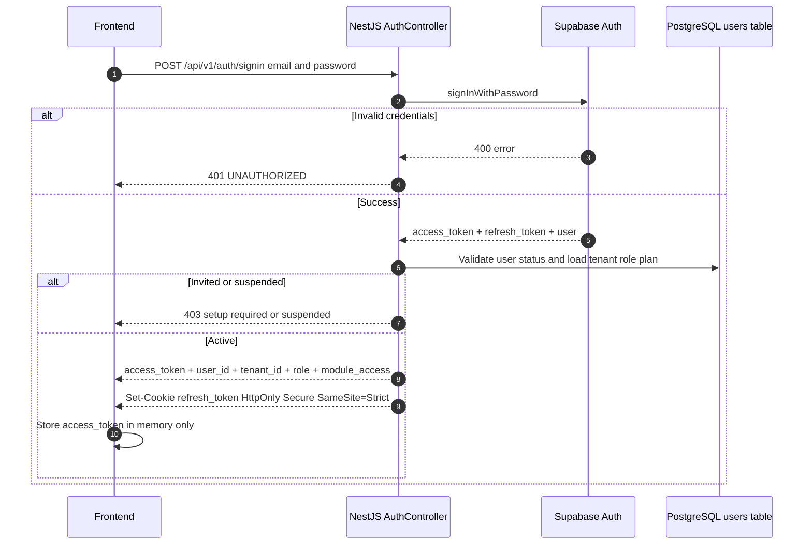


```

#### Authenticated Request Flow

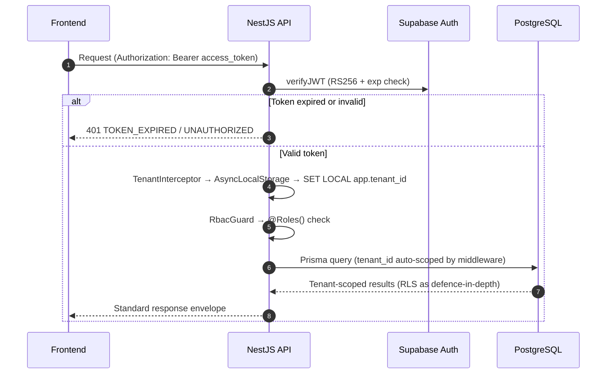

#### Token Refresh Flow

```mermaid
sequenceDiagram
  autonumber
  participant FE as Frontend
  participant API as NestJS AuthController
  participant SA as Supabase Auth

  FE->>API: Original request returns 401 TOKEN_EXPIRED
  FE->>API: POST /api/v1/auth/refresh with httpOnly cookie
  API->>SA: refreshSession using refresh_token from cookie
  alt Refresh token expired or revoked
    SA-->>API: 400 invalid_grant
    API-->>FE: 401 UNAUTHORIZED redirect to sign-in
  else Valid refresh token
    SA-->>API: new access_token and new refresh_token rotated
    API-->>FE: new access_token in response body
    API-->>FE: Set-Cookie new refresh_token HttpOnly Secure SameSite=Strict
    FE->>FE: Store new access_token in memory
    FE->>API: Retry original failed request with new access_token
  end
```
```

---

### 11.9 Session Security Rules

| **Rule**                                | **Enforcement**                                                                                                                  |
| --------------------------------------------- | -------------------------------------------------------------------------------------------------------------------------------------- |
| `access_token` stored in memory only        | Frontend engineering standard — enforced in code review.`localStorage` and `sessionStorage` usage flagged as a security violation |
| `refresh_token` in `httpOnly` cookie only | Set by NestJS on sign-in response with `HttpOnly; Secure; SameSite=Strict` — JavaScript cannot read or exfiltrate it                |
| `access_token` expiry: 1 hour               | Configured in Supabase Auth project settings                                                                                           |
| `refresh_token` expiry: 30 days             | Configured in Supabase Auth project settings                                                                                           |
| Refresh token is single-use                   | Supabase Auth rotates refresh tokens on every use — each refresh produces a new `refresh_token` and invalidates the old one         |
| Sign-out invalidates refresh token            | `POST /api/v1/auth/signout` calls Supabase Auth `signOut()` which revokes the refresh token server-side immediately                |
| Concurrent session limit                      | Enterprise: configurable (default 3 active sessions per user). Starter / Growth / Pro: unlimited                                       |
| Failed login attempt lockout                  | 5 consecutive failures → 15-minute account lockout. Configured in Supabase Auth rate limiting settings                                |
| HTTPS enforced on all endpoints               | Cloudflare enforces HTTPS redirect at the CDN layer — HTTP requests are redirected to HTTPS before reaching NestJS                    |
| `SameSite=Strict` on refresh cookie         | Prevents the refresh token cookie from being sent on cross-site requests — mitigates CSRF against the `/auth/refresh` endpoint      |
| Webhook endpoints use HMAC only               | Webhook routes bypass JWT validation and use `X-Webhook-Signature` HMAC-SHA256 verification instead (Section 10.5)                   |

> **Defence-in-depth principle:** No single layer is the sole security boundary.
> The JWT guard, `TenantInterceptor`, Prisma middleware, and PostgreSQL RLS all
> enforce tenant isolation independently. A bug in any one layer is caught by the
> others. This is intentional and must be preserved — do not remove any layer even
> if another layer appears to make it redundant.

## Section 12 — AI Services Architecture

---

### 12.1 Purpose of This Section

This section documents the architecture of the AI Services Layer — the FastAPI
Python application that handles all machine learning, LLM, speech-to-text,
embedding, and agentic workloads for Relanto Revenue Intelligence.

Read this section before building any AI feature, integrating a new model,
adding a new internal endpoint, or changing how prompts are constructed. The
model routing rules, fallback strategy, and agent definitions in this section
are the canonical reference. Changes to these must be proposed as an ADR before
implementation.

---

### 12.2 AI Services Layer Overview

The AI Services Layer is a **separate FastAPI Python application** deployed as
its own Railway service. It is not part of the NestJS monolith. It communicates
with NestJS exclusively over the internal Docker network — it is never exposed
to the public internet.

**Why a separate Python service for AI:**

| **Reason**     | **Detail**                                                                                                                                                             |
| -------------------- | ---------------------------------------------------------------------------------------------------------------------------------------------------------------------------- |
| Python ecosystem     | Whisper, pyannote.audio, LangGraph, scikit-learn, XGBoost, and pgvector clients are Python-first libraries. Running them in Node.js would require brittle subprocess bridges |
| Independent scaling  | Transcription and LLM inference are compute-heavy. The AI service scales independently of the NestJS API without affecting API response times                                |
| Dependency isolation | Python ML library dependency trees (CUDA, PyTorch, scipy) are complex and must not pollute the Node.js application container                                                 |
| Model flexibility    | New models can be swapped or added in the Python layer without any changes to NestJS                                                                                         |

**AI Services Layer tech stack:**

| **Component** | **Technology**                          |
| ------------------- | --------------------------------------------- |
| Web framework       | FastAPI 0.111.x                               |
| Task queue worker   | BullMQ Python client (`bullmq` PyPI)        |
| LLM gateway         | LiteLLM 1.x                                   |
| Agent framework     | LangGraph 0.2.x                               |
| Speech-to-text      | Whisper large-v3 (`openai-whisper`)         |
| Speaker diarization | pyannote.audio 3.x                            |
| Embeddings          | OpenAI `text-embedding-3-small` via LiteLLM |
| Forecasting model   | XGBoost 2.x + scikit-learn 1.5.x              |
| Vector client       | `pgvector-python` (psycopg3)                |
| HTTP client         | `httpx` (async)                             |
| Validation          | Pydantic v2                                   |
| Config management   | Doppler SDK (Python)                          |

---

### 12.3 LiteLLM Gateway Configuration

All LLM calls in the AI Services Layer go through **LiteLLM** — a unified LLM
gateway library that abstracts provider APIs behind a consistent interface.
LiteLLM allows switching between OpenAI, Anthropic, Ollama, Azure OpenAI, and
other providers by changing configuration — not code.

**What LiteLLM provides:**

- A single `litellm.completion()` call that routes to any configured LLM provider
- Automatic retry on rate limit errors (`HTTP 429`) with exponential backoff
- Automatic fallback to a secondary provider when the primary fails
- Token usage logging for cost tracking
- Model-level timeout configuration

**LiteLLM model configuration:**

```python
# litellm_config.py

import litellm

litellm.set_verbose = False

# Primary models
PRIMARY_MODEL   = "gpt-4o-mini"            # default for all non-agent calls
PRIMARY_LARGE   = "gpt-4o"                 # agents only (PostCallAgent, DeepResearcher)
EMBEDDING_MODEL = "text-embedding-3-small" # all embedding generation

# Phase 2 fallback — self-hosted via Ollama on Railway GPU instance
FALLBACK_MODEL  = "ollama/deepseek-v3"     # warm standby, OpenAI failure only

# LiteLLM fallback chain — tried in order if primary fails
litellm.fallbacks = [
    { "model": PRIMARY_MODEL, "fallbacks": [FALLBACK_MODEL] },
    { "model": PRIMARY_LARGE, "fallbacks": [FALLBACK_MODEL] },
]

# Per-model timeout configuration (seconds)
litellm.request_timeout = {
    PRIMARY_MODEL:   45,    # single LLM call — should resolve in < 30s
    PRIMARY_LARGE:   90,    # agents make longer, multi-step calls
    FALLBACK_MODEL:  120,   # self-hosted is slower than OpenAI API
    EMBEDDING_MODEL: 15,    # embedding calls are fast
}
```

**Provider priority logic — every LLM call:**

1. **Try primary model** — OpenAI `gpt-4o-mini` (or `gpt-4o` for agent calls)
2. **If rate limited (429)** — LiteLLM retries with exponential backoff up to
   3 times before escalating to the next step
3. **If primary is unreachable or returns 5xx after retries** — LiteLLM switches
   automatically to the fallback model (Ollama + DeepSeek V3, Phase 2)
4. **If fallback also fails** — raise exception; NestJS receives
   `HTTP 503 SERVICE_UNAVAILABLE`; Sentry alert fires automatically

**Phase 1 vs Phase 2 fallback status:**

| **Phase**   | **Fallback Model**                                                                                | **Status**         |
| ----------------- | ------------------------------------------------------------------------------------------------------- | ------------------------ |
| Phase 1 (current) | No self-hosted fallback. If OpenAI is unreachable, all AI endpoints return `503`                      | 🔴 Active — no fallback |
| Phase 2           | Ollama + DeepSeek V3 on a Railway GPU instance. Warm standby — receives traffic only on OpenAI failure | 🟡 Planned               |

> **Phase 1 operational rule:** During Phase 1, OpenAI availability is a
> hard dependency for all AI features. If OpenAI experiences an outage:
>
> - Transcription (Whisper) continues to work — it runs locally, not via OpenAI API
> - All LLM-dependent features (summaries, email generation, Ask Anything, scoring,
>   tracker detection) return `503` until OpenAI recovers
> - The BullMQ workers will retry queued jobs using their configured backoff —
>   jobs will not be lost if OpenAI recovers within the retry window
> - Jobs that exhaust retries during an extended outage land in the DLQ for
>   manual replay after recovery

### 12.4 Model Routing Rules

Different features use different models based on context window requirements,
output quality needs, latency tolerance, and cost.

| **Feature**        | **Model**                | **Reason**                                                                                                                 |
| ------------------------ | ------------------------------ | -------------------------------------------------------------------------------------------------------------------------------- |
| Call summary generation  | `gpt-4o-mini`                | Fast, cheap, handles 60-minute transcripts within 128K context window. Summary quality is sufficient                             |
| CRM field extraction     | `gpt-4o-mini`                | Structured JSON extraction. Follows JSON schema instructions reliably                                                            |
| Tracker detection (NLP)  | `gpt-4o-mini`                | Short context per detection. High throughput needed. Low cost per call                                                           |
| Topic tagging            | `gpt-4o-mini`                | Classification task. Accuracy is sufficient                                                                                      |
| Coaching score analysis  | `gpt-4o-mini`                | Structured scoring output. Fast and cheap                                                                                        |
| AI email composer        | `gpt-4o-mini`                | Short output. Draft quality is adequate — users edit before sending                                                             |
| AI Translator            | `gpt-4o-mini`                | Translation quality is high even on the mini model                                                                               |
| AI Theme Spotter         | `gpt-4o`                     | Multi-call synthesis requires stronger reasoning. Larger context window needed for 50+ call batches                              |
| Ask Anything GenAI Query | `gpt-4o`                     | Conversational accuracy and source citation quality must be high — user-facing live response                                    |
| AI Deep Researcher       | `gpt-4o`                     | Long multi-document analysis. Complex reasoning over 100+ source passages                                                        |
| PostCallAgent (full run) | `gpt-4o`                     | Agent runs 7 nodes with accumulated state. Handles tool use and multi-step reasoning more reliably                               |
| AI Trainer persona       | `gpt-4o`                     | Persona consistency and nuanced conversation simulation requires the stronger model                                              |
| AI Revenue Predictor     | `XGBoost` + `scikit-learn` | LLMs are not used for numerical forecasting. A trained regression model on historical deal data is more accurate and explainable |
| Vector embeddings (all)  | `text-embedding-3-small`     | 1536-dimension embeddings. Best cost-to-quality ratio for semantic search and RAG retrieval                                      |

> **Cost control rule:** `gpt-4o` costs approximately 10× more per token than
> `gpt-4o-mini`. Every feature that uses `gpt-4o` was explicitly evaluated to
> confirm that `gpt-4o-mini` output quality was insufficient before `gpt-4o` was
> chosen. **Do not add new features to `gpt-4o` without documenting the quality
> justification in the ADR for that feature.** Default all new features to
> `gpt-4o-mini` and escalate only on evidence.

---

### 12.5 Speech-to-Text Architecture — Whisper large-v3

**Model:** OpenAI Whisper large-v3 (open-source, self-hosted)
**Hosting:** Docker container on the AI Services Railway service
**Library:** `openai-whisper` (PyPI)

**Why self-hosted Whisper over an API (AssemblyAI, Deepgram):**

| **Factor** | **Self-hosted Whisper**                        | **AssemblyAI / Deepgram API**       |
| ---------------- | ---------------------------------------------------- | ----------------------------------------- |
| Cost             | GPU compute cost only — no per-minute API fee       | $0.37–$0.65 per hour of audio at scale   |
| Data privacy     | Audio never leaves our infrastructure                | Audio sent to a third-party cloud service |
| Latency control  | We control the hardware — GPU workers can be scaled | Subject to API provider queue times       |
| Customisation    | Can fine-tune on domain-specific vocabulary          | No fine-tuning on third-party APIs        |
| Reliability      | Requires us to manage GPU uptime                     | Provider SLA responsibility               |

**AssemblyAI as fallback:**
AssemblyAI is configured as the fallback transcription provider. If the
self-hosted Whisper service fails or times out after one retry, the audio is
sent to AssemblyAI automatically. AssemblyAI credentials are stored in Doppler.
Fallback usage is logged and alerted — excessive fallback usage indicates a
Whisper infrastructure problem requiring investigation.

**Whisper configuration:**

```python
# whisper_service.py
import whisper

model = whisper.load_model(
    "large-v3",
    device="cuda",           # GPU inference — falls back to "cpu" if no GPU available
    download_root="/models"  # Pre-downloaded at container build time — no runtime download
)

def transcribe(audio_path: str, language_hint: str | None = None) -> dict:
    result = model.transcribe(
        audio_path,
        language=language_hint,          # BCP 47 code if known, else None for auto-detect
        word_timestamps=True,            # Required for speaker segment alignment
        condition_on_previous_text=True,
        compression_ratio_threshold=2.4,
        no_speech_threshold=0.6,
        fp16=True                        # Half-precision for faster GPU inference
    )
    return result
```

**Operational specs:**

| **Spec**            | **Value**                             |
| ------------------------- | ------------------------------------------- |
| Supported audio formats   | MP4, M4A, MP3, WAV, OGG, WEBM               |
| Maximum audio duration    | 4 hours (limited by GPU memory on large-v3) |
| Target transcription time | < 5 minutes for a 60-minute call on GPU     |
| Fallback provider         | AssemblyAI (credentials in Doppler)         |
| Fallback trigger          | Whisper timeout or 5xx after 1 retry        |

---

### 12.6 Speaker Diarization — pyannote.audio 3.x

**Library:** `pyannote.audio` 3.x (PyPI)
**Purpose:** Determines who is speaking at each moment in the audio — produces a
timeline of speaker segments with start time, end time, and speaker label
(`SPEAKER_00`, `SPEAKER_01`, etc.)

**Why pyannote.audio:** pyannote.audio 3.x is the state-of-the-art open-source
speaker diarization library. It outperforms alternatives (resemblyzer, SpeechBrain)
on the DIHARD and VoxConverse benchmarks. It runs locally on the same GPU as
Whisper, keeping audio within our infrastructure.

**Diarization pipeline:**

```python
# diarization_service.py
from pyannote.audio import Pipeline
import torch

pipeline = Pipeline.from_pretrained(
    "pyannote/speaker-diarization-3.1",
    use_auth_token=HUGGINGFACE_TOKEN   # from Doppler
)
pipeline.to(torch.device("cuda"))

def diarize(audio_path: str) -> list[dict]:
    diarization = pipeline(audio_path, min_speakers=1, max_speakers=10)
    segments = []
    for turn, _, speaker in diarization.itertracks(yield_label=True):
        segments.append({
            "speaker": speaker,    # "SPEAKER_00", "SPEAKER_01", etc.
            "start":   turn.start, # seconds from audio start
            "end":     turn.end
        })
    return segments
```

**Merging Whisper words with pyannote segments:**

After both Whisper and pyannote complete, the transcript service merges their
outputs. For each word in the Whisper output (which has a start timestamp), the
merge function finds the pyannote speaker segment that contains that timestamp
and assigns the speaker label to the word. Words are then grouped into continuous
speaker turns to produce the final speaker-labelled transcript segments.

**Speaker name resolution:**

pyannote assigns generic labels (`SPEAKER_00`, `SPEAKER_01`). The NestJS layer
maps these to real contact names using `participant_list` from the calendar event.
The mapping strategy in priority order:

1. Match speaking time to join/leave timestamps from the conferencing platform API
2. Calendar organiser heuristic — the organiser is typically the first speaker
3. If unresolved, labels remain as `SPEAKER_00`, `SPEAKER_01` and the rep is
   prompted to confirm speaker names in the call review UI

---

### 12.7 Embedding Model — text-embedding-3-small

**Model:** OpenAI `text-embedding-3-small`
**Dimensions:** 1536
**Called via:** LiteLLM → OpenAI Embeddings API
**Storage:** pgvector in Supabase PostgreSQL (`summaries.semantic_embeddings`)

**When embeddings are generated:**

| **Trigger**            | **Content Embedded** | **Chunk Strategy**           |
| ---------------------------- | -------------------------- | ---------------------------------- |
| After call transcript stored | Transcript chunks          | 500-token chunks, 50-token overlap |
| After call summary stored    | Summary text               | Single chunk                       |
| After deal brief generated   | Brief text                 | Single chunk                       |
| After outbound email sent    | Email body                 | Single chunk                       |

**Chunking strategy for transcripts:**

```python
# chunking.py
import tiktoken

def chunk_transcript(raw_text: str) -> list[dict]:
    """
    Splits transcript into overlapping chunks for embedding.
    50-token overlap ensures context at chunk boundaries is not lost.
    """
    CHUNK_SIZE   = 500  # tokens
    OVERLAP_SIZE = 50   # tokens

    enc    = tiktoken.get_encoding("cl100k_base")
    tokens = enc.encode(raw_text)
    chunks = []
    start  = 0

    while start < len(tokens):
        end          = min(start + CHUNK_SIZE, len(tokens))
        chunk_tokens = tokens[start:end]
        chunks.append({
            "chunk_index": len(chunks),
            "chunk_text":  enc.decode(chunk_tokens),
            "token_count": len(chunk_tokens)
        })
        start += CHUNK_SIZE - OVERLAP_SIZE

    return chunks
```

**Embedding batch call:**

```python
# embedding_service.py
import litellm

async def generate_embeddings(texts: list[str]) -> list[list[float]]:
    response = await litellm.aembedding(
        model      = "text-embedding-3-small",
        input      = texts,   # up to 2048 texts per batch call
        dimensions = 1536
    )
    return [item["embedding"] for item in response["data"]]
```

> **Re-embedding rule:** When a call summary or deal brief is regenerated
> (version increment), the old embedding row in `summaries.semantic_embeddings`
> is deleted and a new one is inserted. Stale embeddings return outdated RAG
> results. The `model_version` column allows bulk re-embedding if the embedding
> model is upgraded — see Section 8.8 for the full pgvector schema and index
> configuration.

### 12.8 Agent Framework — LangGraph

Relanto Revenue Intelligence uses **LangGraph 0.2.x** for all multi-step agentic
AI workflows. LangGraph is a stateful graph framework built on top of LangChain.
It defines AI workflows as directed graphs where each node is a function and the
graph state is passed between nodes.

**Why LangGraph over a simple chain of LLM calls:**

| **Approach**                  | **Problem**                                                                                                                        |
| ----------------------------------- | ---------------------------------------------------------------------------------------------------------------------------------------- |
| Sequential LLM calls (no framework) | No shared state. Each step must re-fetch context. No conditional branching. No built-in error recovery per node                          |
| LangChain LCEL chains               | Good for linear pipelines. No support for stateful loops, conditional routing, or human-in-the-loop pauses                               |
| LangGraph                           | Stateful graph. Each node reads from and writes to a shared state object. Supports conditional edges, loops, and parallel node execution |

**Agents in Relanto Revenue Intelligence:**

---

#### Agent 1 — PostCallAgent

**Purpose:** Runs the complete post-call AI processing pipeline after every call
is transcribed. This is the most critical agent in the platform.
**Trigger:** BullMQ job — `post_call_agent.run`
**Model:** `gpt-4o` (agent orchestration) + `gpt-4o-mini` (per-node LLM calls)

**Shared state object passed through all nodes:**

```python
@dataclass
class PostCallState:
    call_id:              str
    tenant_id:            str
    transcript_segments:  list[dict]
    deal_context:         dict | None
    contact_map:          dict
    tracker_detections:   list[dict]
    summary:              dict | None
    scorecard_results:    list[dict]
    email_draft:          dict | None
    competitor_mentions:  list[dict]
```

**Graph nodes:**

| **Node**                              | **Input**                                                   | **Action**                                                         | **Output / Writes**                                                                       |
| ------------------------------------------- | ----------------------------------------------------------------- | ------------------------------------------------------------------------ | ----------------------------------------------------------------------------------------------- |
| `load_context`                            | `call_id`, `tenant_id`                                        | Fetch transcript, deal, account, contact data from PostgreSQL            | Populates full state object                                                                     |
| `detect_trackers`                         | `transcript_segments`, tenant trackers                          | Run NLP tracker detection — calls `gpt-4o-mini` with detection prompt | `state.tracker_detections` → `POST /internal/tracker-detections` (M-05)                    |
| `generate_summary`                        | `transcript_segments`, `deal_context`, `tracker_detections` | Call `gpt-4o-mini` with summary prompt                                 | `state.summary` → `POST /internal/summaries` (M-06)                                        |
| `score_call`                              | `transcript_segments`, tenant scorecards                        | For each active scorecard: call `gpt-4o-mini` with scoring prompt      | `state.scorecard_results` → `POST /internal/call-scores` (M-04)                            |
| `generate_email_draft`                    | `deal_context`, `contact_map`, `summary.next_steps`         | Call `gpt-4o-mini` with email composer prompt                          | `state.email_draft` → `POST /internal/email-drafts` (M-02, status = `ai_suggested`)      |
| `check_competitor`                        | `state.tracker_detections`                                      | Filter detections for `trackerType = 'competitor'`                     | Conditional edge: competitor found →`send_competitor_alert`; none found → `mark_complete` |
| `send_competitor_alert` *(conditional)* | `state.competitor_mentions`                                     | `POST /internal/alerts`                                                | M-08 triggers Slack + in-app alert                                                              |
| `mark_complete`                           | —                                                                | Update `post_call_agent_runs`: `status = 'completed'`                | Emits completion log to Better Stack                                                            |

**LangGraph graph definition:**

```python
# post_call_agent.py
from langgraph.graph import StateGraph, END

graph = StateGraph(PostCallState)

graph.add_node("load_context",          load_context_node)
graph.add_node("detect_trackers",       detect_trackers_node)
graph.add_node("generate_summary",      generate_summary_node)
graph.add_node("score_call",            score_call_node)
graph.add_node("generate_email_draft",  generate_email_draft_node)
graph.add_node("check_competitor",      check_competitor_node)
graph.add_node("send_competitor_alert", send_competitor_alert_node)
graph.add_node("mark_complete",         mark_complete_node)

graph.set_entry_point("load_context")

graph.add_edge("load_context",         "detect_trackers")
graph.add_edge("detect_trackers",      "generate_summary")
graph.add_edge("generate_summary",     "score_call")
graph.add_edge("score_call",           "generate_email_draft")
graph.add_edge("generate_email_draft", "check_competitor")

graph.add_conditional_edges(
    "check_competitor",
    lambda state: "send_alert" if state.competitor_mentions else "skip_alert",
    {
        "send_alert": "send_competitor_alert",
        "skip_alert": "mark_complete"
    }
)

graph.add_edge("send_competitor_alert", "mark_complete")
graph.add_edge("mark_complete",          END)

post_call_agent = graph.compile()
```

> **Node failure handling:** If any node raises an unhandled exception, LangGraph
> halts the graph and the BullMQ job is marked as failed. The retry policy
> (3 retries, exponential backoff — Section 9.3) re-runs the entire agent from
> `load_context`. Nodes that have already written results to NestJS must be
> idempotent — writing the same summary or score twice must not create duplicates.
> Each node checks for an existing record by `call_id` before inserting.

---

#### Agent 2 — AskAnythingAgent

**Purpose:** Answers natural language questions about deal, account, and call data
using RAG over the pgvector embedding store.
**Trigger:** Synchronous HTTP — `POST /internal/answer-query`
**Model:** `gpt-4o`

**Graph nodes:**

| **Node**       | **Action**                                                                                                                                                                                        |
| -------------------- | ------------------------------------------------------------------------------------------------------------------------------------------------------------------------------------------------------- |
| `parse_query`      | Classify query intent and extract entity references from `user_question` + context filters (`deal_id`, `account_id`, `date_range`)                                                              |
| `retrieve_context` | Embed user question using `text-embedding-3-small`. Run pgvector similarity search on `summaries.semantic_embeddings`. Retrieve top 10 most similar chunks within tenant scope with applied filters |
| `generate_answer`  | Build prompt with retrieved passages as context. Call `gpt-4o` with system prompt instructing source citation. Output: `answer_text`, `cited_source_ids`                                          |
| `format_response`  | Map `cited_source_ids` back to call records for frontend deep links. Return structured response with answer + source citations                                                                        |

---

#### Agent 3 — ThemeSpotterAgent

**Purpose:** Clusters a batch of calls (up to 500) around business questions
using embedding similarity and LLM-based theme synthesis.
**Trigger:** Asynchronous BullMQ job — triggered by M-04 when a Theme Spotter
analysis is created
**Model:** `gpt-4o` (theme synthesis) + `text-embedding-3-small` (clustering)

**Graph nodes:**

| **Node**           | **Action**                                                                                                                                                                                                   |
| ------------------------ | ------------------------------------------------------------------------------------------------------------------------------------------------------------------------------------------------------------------ |
| `load_call_batch`      | Filter calls by tenant, date range, and user-selected criteria. Fetch all transcript chunk embeddings for the filtered call set                                                                                    |
| `cluster_embeddings`   | Run k-means clustering on transcript embeddings (`k` = auto-selected). Group similar transcript passages into proto-themes                                                                                       |
| `synthesize_themes`    | For each cluster: sample top 10 most central passages. Call `gpt-4o` with prompt: *"Given these transcript passages, what common theme do they represent? Name the theme and summarise it in 2–3 sentences."* |
| `enrich_with_metadata` | For each theme: count distinct calls, accounts, deals, and revenue. Sort by call count descending                                                                                                                  |
| `store_results`        | Write themes to `conversation.themes`. Update `theme_analyses.status = 'completed'`                                                                                                                            |

---

#### Agent 4 — AITrainerAgent

**Purpose:** Simulates a realistic sales persona (prospect, negotiator, objector)
in a turn-by-turn practice conversation with a sales rep.
**Trigger:** Synchronous HTTP — `POST /internal/simulate-turn`
**Model:** `gpt-4o`

> **Not a LangGraph agent.** The AI Trainer is a stateless function that processes
> one turn at a time. Conversation history is managed by NestJS (stored in
> `coaching.trainer_messages`) and passed as context on each turn request.
> LangGraph is not needed — there is one `gpt-4o` call per rep message, no
> multi-step node execution.

```python
# trainer_service.py
async def simulate_turn(
    scenario:             TrainerScenario,
    conversation_history: list[Message],
    rep_message:          str
) -> str:
    system_prompt = build_persona_prompt(scenario)
    messages = [{"role": "system", "content": system_prompt}]
    messages += [{"role": m.role, "content": m.content}
                 for m in conversation_history]
    messages.append({"role": "user", "content": rep_message})

    response = await litellm.acompletion(
        model       = "gpt-4o",
        messages    = messages,
        temperature = 0.7,   # variation keeps the persona realistic
        max_tokens  = 400    # persona responses must be concise
    )
    return response.choices.message.content
```

---

### 12.9 AI Forecasting — XGBoost + scikit-learn

The AI Revenue Predictor does not use an LLM. Revenue forecasting is a regression
problem, not a language problem. An LLM would hallucinate numbers — a trained
regression model on historical deal data produces reliable, explainable predictions.

**Model:** XGBoost regression (`xgboost` 2.x)
**Training data:** Historical closed deals from the tenant's CRM — wins and losses
with all available deal attributes
**Prediction target:** `close_probability × deal_value = expected_revenue`

**Features used for prediction:**

| **Feature**                       | **Source**                                           |
| --------------------------------------- | ---------------------------------------------------------- |
| Days in current stage                   | `deals.last_signal_at` vs `deals.close_date`           |
| Deal value                              | `deals.value`                                            |
| Number of calls in last 30 days         | `accounts.activities` count                              |
| Number of contacts engaged              | `deals.deal_contacts` count                              |
| Rep's historical win rate at this stage | `historical_conversion_rates`                            |
| Days since last customer interaction    | `accounts.activities MAX(occurred_at)`                   |
| Active risk flag count                  | `deals.deal_risk_flags` count                            |
| Competitor mention count                | `tracker_detections` count where `type = 'competitor'` |
| Health score                            | `deals.health_score`                                     |
| Days to close date                      | Computed from `deals.close_date`                         |

**Training schedule:**

The model is retrained once per week per tenant using their latest historical
closed deal data. Minimum data requirements:

| **Tenant Closed Deals**      | **Model Used**                                          |
| ---------------------------------- | ------------------------------------------------------------- |
| ≥ 50 closed deals (wins + losses) | Tenant-specific model trained on their own data               |
| < 50 closed deals                  | Platform-wide base model trained on anonymised aggregate data |

**Prediction endpoint:**

```python
# forecasting_service.py
import xgboost as xgb
import numpy as np

def predict_close_probability(deal_features: dict) -> dict:
    model = load_tenant_model(deal_features["tenant_id"])
    X     = build_feature_vector(deal_features)
    prob  = float(model.predict_proba(X.reshape(1, -1)))[1]

    return {
        "close_probability": round(prob, 3),
        "expected_value":    round(prob * deal_features["value"], 2),
        "confidence_tier":   "high"   if prob > 0.7
                             else "medium" if prob > 0.4
                             else "low"
    }
```

> **Model explainability rule:** XGBoost's `feature_importances_` are exposed
> in the prediction response as `contributing_factors` — the top 3 features
> driving the prediction are surfaced in the Deal Board UI so reps understand
> why their deal is scored as it is. This is a deliberate choice over a black-box
> LLM prediction: explainability builds rep trust in the AI score.

### 12.10 Internal AI Service Endpoints

All internal endpoints are prefixed with `/internal/`. None are accessible
publicly. All require the `X-Internal-Secret` header (Section 10.10).

| **Endpoint**                | **Method** | **Purpose**                                             | **Model**                         | **Mode** | **Timeout** |
| --------------------------------- | ---------------- | ------------------------------------------------------------- | --------------------------------------- | -------------- | ----------------- |
| `/internal/transcribe`          | POST             | Audio file → raw transcript + speaker segments               | Whisper large-v3 + pyannote.audio 3.x   | Async (BullMQ) | 10 min            |
| `/internal/summarize`           | POST             | Transcript segments → structured call summary                | `gpt-4o-mini`                         | Sync           | 60s               |
| `/internal/extract-crm-fields`  | POST             | Transcript → structured CRM field values                     | `gpt-4o-mini`                         | Sync           | 45s               |
| `/internal/detect-trackers`     | POST             | Transcript or email → tracker detections                     | `gpt-4o-mini`                         | Sync           | 120s              |
| `/internal/generate-embeddings` | POST             | Text list → vector embeddings                                | `text-embedding-3-small`              | Sync           | 15s               |
| `/internal/score-call`          | POST             | Transcript + scorecard → scored answers                      | `gpt-4o-mini`                         | Sync           | 120s              |
| `/internal/compute-forecast`    | POST             | Deal feature set → close probability + expected value        | XGBoost + scikit-learn                  | Sync           | 5s                |
| `/internal/generate-email`      | POST             | Call context + next steps → email subject + body             | `gpt-4o-mini`                         | Sync           | 30s               |
| `/internal/answer-query`        | POST             | User question + filters → RAG answer + citations             | `gpt-4o` + `text-embedding-3-small` | Sync           | 60s               |
| `/internal/simulate-turn`       | POST             | Trainer scenario + conversation history → persona response   | `gpt-4o`                              | Sync           | 30s               |
| `/internal/detect-themes`       | POST             | Batch call IDs + business question → theme list              | `gpt-4o` + `text-embedding-3-small` | Async (BullMQ) | 5 min             |
| `/internal/agent/post-call`     | POST             | `call_id` + `tenant_id` → trigger full PostCallAgent run | LangGraph +`gpt-4o` + `gpt-4o-mini` | Async (BullMQ) | 90s               |
| `/internal/translate`           | POST             | Transcript segments + target language → translated segments  | `gpt-4o-mini`                         | Sync           | 60s               |

> **Timeout enforcement rule:** NestJS sets a hard `httpx` client timeout
> equal to the values above when calling each endpoint. If the AI service does
> not respond within the timeout, NestJS logs a `TIMEOUT` error to Sentry,
> returns `HTTP 504 GATEWAY_TIMEOUT` to the caller, and — for async jobs —
> the BullMQ worker retries the job per the retry policy in Section 9.3.

---

### 12.11 Prompt Engineering Standards

All prompts used in production AI features follow these standards. Prompts are
not hardcoded as inline strings — they are stored as versioned Jinja2 templates
in the `prompts/` directory of the AI Services Layer.

**Directory structure:**

```text
ai-services/
└── prompts/
    ├── summarize/
    │   ├── v1.jinja2
    │   └── v2.jinja2          ← current version
    ├── extract_crm_fields/
    │   └── v1.jinja2
    ├── detect_trackers/
    │   └── v1.jinja2
    ├── score_call/
    │   └── v1.jinja2
    ├── generate_email/
    │   └── v1.jinja2
    ├── answer_query/
    │   └── v1.jinja2
    ├── trainer_persona/
    │   └── v1.jinja2
    └── synthesize_theme/
        └── v1.jinja2
```

**Prompt template rules:**

1. **JSON output enforced.** Every prompt specifies the desired output format
   as a JSON schema in the system message. The LLM is instructed to return only
   valid JSON — no prose, no markdown fences. Pydantic v2 validates the LLM
   output against the expected schema. If validation fails, the call is retried
   once with the validation error appended to the prompt as a correction
   instruction.
2. **Domain persona statement.** Every prompt includes: *"You are an expert
   revenue intelligence AI assistant for a B2B SaaS sales team."* This grounds
   the LLM in domain context and reduces off-topic outputs.
3. **Negative hallucination guard.** Every extraction prompt includes: *"Do not
   invent information not present in the transcript. If a field cannot be
   determined from the transcript, return `null`."* This is mandatory on all
   CRM extraction, tracker detection, and scoring prompts.
4. **Versioned prompts.** A prompt change requires a version increment
   (`v1.jinja2` → `v2.jinja2`) and a regression test against a set of golden
   transcript samples before deployment. The previous version is never deleted —
   it remains available for rollback.
5. **Temperature settings by task type:**

| **Task Type**                                                         | **Temperature** | **Reason**                                                                             |
| --------------------------------------------------------------------------- | --------------------- | -------------------------------------------------------------------------------------------- |
| Extraction and classification (CRM fields, tracker detection, call scoring) | `0.0`               | Deterministic output required — same transcript must always produce the same result         |
| Summarisation                                                               | `0.2`               | Slight variation is acceptable and produces more natural summaries                           |
| Generation (email composer, AI Trainer persona)                             | `0.7`               | Natural variation improves perceived quality — outputs that vary slightly feel less robotic |

---

### 12.12 AI Services Monitoring

| **Signal**                   | **Tool**                     | **Alert Threshold**              | **On-Call Action**                                                                  |
| ---------------------------------- | ---------------------------------- | -------------------------------------- | ----------------------------------------------------------------------------------------- |
| LLM API latency p95                | Better Stack                       | > 10s p95 on `gpt-4o-mini`           | Investigate OpenAI API status page; check LiteLLM retry logs                              |
| LLM API error rate                 | Sentry                             | > 2% error rate in any 5-minute window | Check OpenAI incident dashboard; confirm LiteLLM fallback status                          |
| OpenAI token usage (daily)         | LiteLLM usage logs → Better Stack | > 80% of daily token budget            | Review which endpoints are consuming tokens; throttle batch jobs if needed                |
| Whisper transcription failure rate | Sentry                             | > 5% failure rate in any hour          | Check GPU health on Railway AI service; confirm AssemblyAI fallback is activating         |
| PostCallAgent completion time p95  | Better Stack                       | > 120 seconds p95                      | Check BullMQ job queue depth; confirm no node is hanging on an LLM timeout                |
| Fallback model activation count    | Better Stack                       | Any activation in production (Phase 2) | Investigate primary OpenAI failure; confirm Ollama GPU instance is healthy                |
| Embedding generation queue backlog | Bull Board                         | > 500 pending jobs                     | Scale AI service worker replicas on Railway; check `text-embedding-3-small` rate limits |

> **Monitoring principle:** Every AI feature that degrades silently is worse than
> one that fails loudly. All AI service errors — LLM timeouts, Pydantic validation
> failures, agent node exceptions — must emit a Sentry event with `call_id`,
> `tenant_id`, `endpoint`, and `model_used` as structured tags. This allows
> on-call engineers to diagnose failures by tenant, model, and endpoint without
> reading raw logs.

## Section 13 — Infrastructure and Deployment Architecture

---

### 13.1 Purpose of This Section

This section documents every environment Relanto Revenue Intelligence runs in,
how each service is containerised, how services are deployed and scaled, how
secrets are managed, and how the CDN layer protects the platform.

Read this section before making any infrastructure change, adding a new service,
modifying a Dockerfile, or touching environment configuration. Changes to
production infrastructure require a Tech Lead review before deployment.

---

### 13.2 Environment Overview

Relanto Revenue Intelligence runs in four environments. Each environment is fully
isolated — it has its own database, its own Redis instance, its own Supabase
project, and its own set of secrets. No environment shares data or infrastructure
with another.

| **Environment** | **Purpose**                                                                                  | **URL**                                       | **Deployed By**                                 |
| --------------------- | -------------------------------------------------------------------------------------------------- | --------------------------------------------------- | ----------------------------------------------------- |
| Local                 | Developer workstation. Full stack runs via Docker Compose. No external traffic                     | `http://localhost:3000`                           | Developer manually via `docker compose up`          |
| Development           | Shared integration environment. Updated on every merge to `develop`                              | `https://dev.r-ri.relanto.ai`                     | CI/CD pipeline — automatic on merge to `develop`   |
| Staging               | Pre-production. Mirrors production configuration exactly. Used for final QA, UAT, and load testing | `https://staging.r-ri.relanto.ai`                 | CI/CD pipeline — automatic on merge to `release/*` |
| Production            | Live customer-facing environment                                                                   | `https://app.r-ri.com` / `https://api.r-ri.com` | CI/CD pipeline — manual approval gate required       |

**Environment promotion flow:**

```mermaid
flowchart LR
  LOCAL["Developer workstation\n(local)"]
  -->|merge to develop| DEV["Development\n(auto-deploy)"]
  -->|merge to release/*| STAGE["Staging\n(auto-deploy)"]
  -->|Tech Lead approval| PROD["Production\n(gated deploy)"]
```

> **Promotion rule:** No code reaches production without passing through
> Development and Staging first. No production deployment proceeds without
> explicit Tech Lead approval in the CI/CD pipeline approval gate.

---

### 13.3 Containerisation Strategy — Docker

Every service in Relanto Revenue Intelligence runs in a Docker container. There
is one Dockerfile per service. No service runs directly on host infrastructure.

**Dockerfile location convention:**

```text
repo/
├── apps/
│   ├── api/                      ← NestJS
│   │   └── Dockerfile
│   ├── ai-services/              ← FastAPI
│   │   └── Dockerfile
│   ├── transcription-service/    ← Whisper + pyannote
│   │   └── Dockerfile
│   └── frontend/                 ← Next.js
│       └── Dockerfile
├── docker-compose.yml            ← Local development only
└── docker-compose.override.yml   ← Local dev overrides (hot reload, debug ports)
```

**General Dockerfile principles applied to all services:**

1. **Multi-stage builds.** Separate build stage from runtime stage. The build
   stage installs all dev dependencies and compiles the application. The runtime
   stage copies only the compiled output and production dependencies — keeping
   production images small.
2. **Non-root user.** Every container runs as a non-root user. The Dockerfile
   creates a dedicated `appuser` and switches to it before the `CMD` instruction.
3. **No secrets in images.** No environment variables containing secrets are
   baked into Docker images. All secrets are injected at runtime by Doppler
   (Section 13.7). Images contain no credentials of any kind.
4. **`.dockerignore` on every service.** `node_modules/`, `__pycache__/`, `.env`
   files, test files, and coverage reports are excluded from the build context
   to keep builds fast and images clean.
5. **Pinned base images.** Base images use exact version tags (e.g.,
   `node:20.14.0-alpine`, `python:3.11.9-slim`), never `latest`. Unpinned
   base images cause non-deterministic builds.

**NestJS API Dockerfile:**

```dockerfile
# Stage 1 — Build
FROM node:20.14.0-alpine AS builder
WORKDIR /app
COPY package*.json ./
RUN npm ci
COPY . .
RUN npm run build

# Stage 2 — Runtime
FROM node:20.14.0-alpine AS runtime
RUN addgroup -S appgroup && adduser -S appuser -G appgroup
WORKDIR /app
COPY package*.json ./
RUN npm ci --omit=dev
COPY --from=builder /app/dist   ./dist
COPY --from=builder /app/prisma ./prisma
USER appuser
EXPOSE 3000
CMD ["node", "dist/main.js"]
```

**FastAPI AI Services Dockerfile:**

```dockerfile
# Stage 1 — Build dependencies
FROM python:3.11.9-slim AS builder
WORKDIR /app
COPY requirements.txt .
RUN pip install --no-cache-dir --user -r requirements.txt

# Stage 2 — Runtime
FROM python:3.11.9-slim AS runtime
RUN useradd -m -u 1001 appuser
WORKDIR /app
COPY --from=builder /root/.local /home/appuser/.local
COPY . .
USER appuser
ENV PATH=/home/appuser/.local/bin:$PATH
EXPOSE 8000
CMD ["uvicorn", "main:app", "--host", "0.0.0.0", "--port", "8000", "--workers", "2"]
```

**Whisper Transcription Service Dockerfile:**

```dockerfile
# GPU-capable base image — CUDA 12.1 for Whisper large-v3
FROM nvidia/cuda:12.1.0-cudnn8-runtime-ubuntu22.04 AS runtime
RUN apt-get update && apt-get install -y python3.11 python3-pip ffmpeg
RUN useradd -m -u 1001 appuser
WORKDIR /app
COPY requirements.txt .
RUN pip install --no-cache-dir -r requirements.txt

# Pre-download Whisper model at build time — never at runtime
RUN python3 -c "import whisper; whisper.load_model('large-v3', download_root='/models')"

COPY . .
USER appuser
EXPOSE 8001
CMD ["uvicorn", "main:app", "--host", "0.0.0.0", "--port", "8001", "--workers", "1"]
```

---

### 13.4 Local Development — Docker Compose

Every developer runs the full Relanto Revenue Intelligence stack locally using
Docker Compose. Local development requires no cloud accounts, no VPN, and no
shared infrastructure.

**`docker-compose.yml` services:**

```yaml
services:
  api:
    build: ./apps/api
    ports: ["3000:3000"]
    environment:
      DATABASE_URL:    ${DATABASE_URL}
      REDIS_URL:       redis://redis:6379
      AI_SERVICE_URL:  http://ai-services:8000
    depends_on: [postgres, redis]
    volumes:
      - ./apps/api/src:/app/src   # hot reload in development

  ai-services:
    build: ./apps/ai-services
    ports: ["8000:8000"]
    environment:
      OPENAI_API_KEY: ${OPENAI_API_KEY}
      DATABASE_URL:   ${DATABASE_URL}
    depends_on: [postgres, redis]

  transcription-service:
    build: ./apps/transcription-service
    ports: ["8001:8001"]
    environment:
      OPENAI_API_KEY: ${OPENAI_API_KEY}
    deploy:
      resources:
        reservations:
          devices:
            - driver: nvidia
              count: 1
              capabilities: [gpu]   # GPU passthrough — only on GPU workstations
                                    # Falls back to CPU on developer laptops

  frontend:
    build: ./apps/frontend
    ports: ["3001:3000"]
    environment:
      NEXT_PUBLIC_API_URL: http://localhost:3000
    depends_on: [api]

  postgres:
    image: supabase/postgres:15.1.0.117
    ports: ["5432:5432"]
    environment:
      POSTGRES_PASSWORD: ${POSTGRES_PASSWORD}
    volumes:
      - postgres_data:/var/lib/postgresql/data
      - ./supabase/migrations:/docker-entrypoint-initdb.d

  redis:
    image: redis:7.2-alpine
    ports: ["6379:6379"]
    volumes:
      - redis_data:/data

  meilisearch:
    image: getmeili/meilisearch:v1.8
    ports: ["7700:7700"]
    environment:
      MEILI_MASTER_KEY: ${MEILI_MASTER_KEY}
    volumes:
      - meilisearch_data:/meili_data

volumes:
  postgres_data:
  redis_data:
  meilisearch_data:
```

**Local setup — first time:**

```bash
cp .env.example .env.local          # copy env template
doppler setup                        # link local environment to Doppler
doppler run -- docker compose up     # start all services with secrets injected
```

---

### 13.5 Cloud Deployment — Railway (Phase 1 and Phase 2)

Relanto Revenue Intelligence uses **Railway** as its cloud hosting platform for
Phase 1 and Phase 2.

**Why Railway:**

| **Factor**    | **Detail**                                                                                                                                                                                                   |
| ------------------- | ------------------------------------------------------------------------------------------------------------------------------------------------------------------------------------------------------------------ |
| Simplicity          | Deploys Docker containers from GitHub with minimal configuration — no Kubernetes YAML, no ECS task definitions, no load balancer setup                                                                            |
| Speed to production | A new service can be deployed in under 10 minutes                                                                                                                                                                  |
| Internal networking | Services in the same Railway project communicate over a private internal network with zero configuration — the AI service is reachable at `http://ai-service:8000` from NestJS without any network policy setup |
| GPU support         | Railway offers GPU instances for the Whisper transcription service                                                                                                                                                 |
| Managed databases   | Railway provides managed PostgreSQL and Redis — optional for Phase 1 where Supabase and Upstash are used                                                                                                          |
| Cost                | Significantly cheaper than ECS + ALB + RDS at Phase 1 traffic volumes                                                                                                                                              |

> **Phase 3 migration trigger:** When tenant count exceeds 500 or API traffic
> exceeds 50M requests/month, the platform migrates to AWS ECS + ALB + RDS.
> The Docker containers built for Railway deploy to ECS without modification —
> only Railway configuration files are replaced with ECS task definitions.

---

### 13.6 Deployed Services — Specs and Scaling

| **Service**            | **Technology**                                     | **Railway Instance**           | **Replicas (Prod)** | **Scaling Trigger**                                               | **Health Check**                   |
| ---------------------------- | -------------------------------------------------------- | ------------------------------------ | ------------------------- | ----------------------------------------------------------------------- | ---------------------------------------- |
| Frontend                     | Next.js                                                  | Vercel (preferred) or Railway Static | 1 — Vercel auto-scales   | Vercel handles automatically                                            | `GET /` → `HTTP 200`                |
| NestJS API                   | Docker on Railway                                        | Pro — 2 vCPU, 4GB RAM               | 2 minimum                 | CPU > 70% for 5 min → add 1 replica (max 6)                            | `GET /api/v1/health` → `HTTP 200`   |
| FastAPI AI Services          | Docker on Railway                                        | Pro — 4 vCPU, 8GB RAM               | 1                         | BullMQ queue depth > 100 → add 1 replica (max 3)                       | `GET /internal/health` → `HTTP 200` |
| Whisper Transcription        | Docker on Railway GPU                                    | GPU — NVIDIA A100 or T4             | 1                         | `transcription.process` queue depth > 20 → add 1 GPU replica (max 2) | `GET /internal/health` → `HTTP 200` |
| BullMQ Workers (NestJS-side) | Docker on Railway (same image as API, different `CMD`) | Pro — 1 vCPU, 2GB RAM               | 2                         | Queue depth > 200 across all queues → add 1 replica (max 4)            | BullMQ worker heartbeat                  |
| Redis                        | Upstash managed                                          | Upstash Pay-as-you-go                | Managed                   | Managed by Upstash                                                      | Upstash dashboard                        |
| Supabase PostgreSQL          | Supabase managed                                         | Supabase Pro plan                    | Managed                   | Managed by Supabase                                                     | Supabase dashboard                       |
| Meilisearch                  | Docker on Railway                                        | Starter — 1 vCPU, 2GB RAM           | 1                         | Manual — upgrade instance size as index grows                          | `GET /health` → `HTTP 200`          |
| ClickHouse                   | Docker on Railway                                        | Pro — 4 vCPU, 16GB RAM              | 1                         | Manual — scale instance vertically as data grows                       | `GET /ping` → `HTTP 200`            |

**NestJS API health check endpoint:**

```typescript
// health.controller.ts
@Controller('health')
export class HealthController {
  @Get()
  @Public()   // no JWT required
  check() {
    return {
      status:    'ok',
      timestamp: new Date().toISOString(),
      version:   process.env.APP_VERSION
    };
  }
}
```

---

### 13.7 Secrets Management — Doppler

Relanto Revenue Intelligence uses **Doppler** as its secrets management platform.
No secrets are stored in `.env` files committed to the repository, in Docker
images, in Railway environment variable UI, or in any other location outside
Doppler.

**Why Doppler:**

| **Requirement**   | **How Doppler Handles It**                                                                                                              |
| ----------------------- | --------------------------------------------------------------------------------------------------------------------------------------------- |
| Secrets never in code   | Doppler injects secrets at runtime — the application reads them as environment variables without a `.env` file on disk                     |
| Per-environment secrets | Separate configs for local, development, staging, and production. A secret value can differ per environment (e.g., different OpenAI API keys) |
| Secret rotation         | Rotating a secret in Doppler automatically updates it across all services on next deploy or restart                                           |
| Access control          | Doppler tokens are scoped per service and per environment — the NestJS API token cannot read AI service secrets                              |
| Audit trail             | Doppler logs every secret read — who accessed what, when                                                                                     |

**Doppler secrets inventory (all environments):**

```text
SUPABASE_URL                    SUPABASE_ANON_KEY
SUPABASE_SERVICE_ROLE_KEY       SUPABASE_JWT_SECRET
DATABASE_URL                    REDIS_URL
OPENAI_API_KEY                  ASSEMBLYAI_API_KEY
HUGGINGFACE_TOKEN               SALESFORCE_CLIENT_ID
SALESFORCE_CLIENT_SECRET        HUBSPOT_CLIENT_ID
HUBSPOT_CLIENT_SECRET           ZOOM_WEBHOOK_SECRET
TEAMS_WEBHOOK_SECRET            GOOGLE_MEET_WEBHOOK_SECRET
GOOGLE_OAUTH_CLIENT_ID          GOOGLE_OAUTH_CLIENT_SECRET
MICROSOFT_OAUTH_CLIENT_ID       MICROSOFT_OAUTH_CLIENT_SECRET
SMTP_HOST                       SMTP_PORT
SMTP_USER                       SMTP_PASSWORD
MEILISEARCH_MASTER_KEY          DOPPLER_TOKEN
SENTRY_DSN                      BETTER_STACK_SOURCE_TOKEN
INTERNAL_SERVICE_SECRET         CLICKHOUSE_URL
CLICKHOUSE_USER                 CLICKHOUSE_PASSWORD
```

> **Railway integration rule:** Railway services are configured to use the
> Doppler Railway integration. At deploy time, Doppler pushes the current secret
> values for the relevant config (staging or production) into Railway's
> environment variable store. No Doppler SDK is required in application code —
> the application reads `process.env.OPENAI_API_KEY` as a standard environment
> variable.

---

### 13.8 CI/CD Pipeline Overview

The CI/CD pipeline runs on **GitHub Actions**. Full detail is in T-24 (CI/CD
Pipeline Technical Design) — this section covers the structure.

**On pull request opened or updated:**

| **Stage**               | **What Runs**                                                                                                   | **Failure Behaviour**  |
| ----------------------------- | --------------------------------------------------------------------------------------------------------------------- | ---------------------------- |
| Stage 1 — Lint + type-check  | ESLint + TypeScript compiler (NestJS); Ruff + mypy (FastAPI)                                                          | Fail fast — PR cannot merge |
| Stage 2 — Unit tests         | Jest (NestJS); pytest (FastAPI). Fails if coverage drops below threshold                                              | Fail — PR cannot merge      |
| Stage 3 — Integration tests  | Spin up PostgreSQL + Redis + Meilisearch via Docker Compose. Run NestJS + FastAPI integration test suites. Tear down. | Fail — PR cannot merge      |
| Stage 4 — Docker build check | Build all Docker images (no push). Verify images build and pass health checks.                                        | Fail — PR cannot merge      |

**On merge to `develop` branch** — all stages above, then:

- **Stage 5:** Push Docker images to Railway registry → deploy to Development
  environment → run smoke tests → notify team Slack channel

**On merge to `release/*` branch** — all stages above, then:

- **Stage 5:** Push Docker images → deploy to Staging → run full E2E test suite
  → run k6 load test (500 concurrent users, 5 minutes) → notify team Slack channel

**On production deploy (manual approval gate):**

- Tech Lead clicks **Approve** in GitHub Actions
- **Stage 6:** Push Docker images → rolling deploy (one replica at a time) →
  health checks must pass before old replica is terminated → automatic rollback
  if health checks fail within 5 minutes → post-deploy smoke tests → notify
  Slack and Better Stack

**Rollback strategy:**

Every production deploy creates a tagged Docker image with the Git commit SHA.
If a deploy fails health checks, Railway automatically rolls back to the previous
image tag. Manual rollback can be triggered in under 60 seconds:

```bash
railway rollback --service api --to <previous-commit-sha>
```

---

### 13.9 CDN and DDoS Protection — Cloudflare

All traffic to Relanto Revenue Intelligence passes through **Cloudflare** before
reaching Railway.

| **Cloudflare Capability** | **How R-RI Uses It**                                                                                                                                                                                                         |
| ------------------------------- | ---------------------------------------------------------------------------------------------------------------------------------------------------------------------------------------------------------------------------------- |
| TLS termination                 | Cloudflare terminates HTTPS. Internal Railway traffic is HTTP. TLS certificates are managed by Cloudflare — no manual cert renewal                                                                                                |
| DDoS protection                 | Cloudflare absorbs volumetric DDoS attacks automatically. Railway origin servers are never exposed to raw internet traffic                                                                                                         |
| Static asset CDN                | Next.js static assets (JS bundles, CSS, images) are cached at Cloudflare edge nodes globally — served from the nearest PoP, not the Railway origin                                                                                |
| API rate limiting (outer layer) | Cloudflare applies a coarse outer rate limit (1,000 req/min per IP) before traffic reaches NestJS. NestJS applies tenant-level rate limits (Section 10.7) as the inner layer                                                       |
| Bot protection                  | Cloudflare Bot Fight Mode blocks known bot traffic from reaching the API                                                                                                                                                           |
| IP allowlist for internal tools | Bull Board (`/queues`), Swagger (`/api/docs` in production), and admin endpoints (`/api/v1/admin`) are Cloudflare Access-protected — only whitelisted Relanto.ai IPs and Google SSO-authenticated users can access them     |
| Cache rules for API             | `GET` responses on low-volatility endpoints (e.g., `GET /api/v1/forecasting/periods`) are cached at Cloudflare edge with a 5-minute TTL. Cache is purged by NestJS via Cloudflare Cache Purge API when underlying data changes |

**Cloudflare DNS configuration:**

```text
app.r-ri.com                    → Proxied (orange cloud) → Vercel / Railway Frontend
api.r-ri.com                    → Proxied (orange cloud) → Railway NestJS API
queues.r-ri-internal.relanto.ai → Proxied + Access protected → Railway Bull Board
```

> **Origin IP protection rule:** All DNS records are proxied (orange cloud).
> The Railway origin IP addresses are never exposed in DNS — a lookup for
> `api.r-ri.com` returns Cloudflare IP addresses, not Railway's. Any record
> set to DNS-only (grey cloud) by accident exposes the origin and must be
> corrected immediately.

---

### 13.10 Infrastructure Roadmap

| **Phase**       | **Timeline** | **Infrastructure State**                                                                                                                                                                                                 |
| --------------------- | ------------------ | ------------------------------------------------------------------------------------------------------------------------------------------------------------------------------------------------------------------------------ |
| Phase 1 — MVP        | Months 1–6        | Railway (all services) + Supabase + Upstash Redis + Vercel + Cloudflare + Doppler                                                                                                                                              |
| Phase 2 — Scale      | Months 7–12       | Railway (expanded replicas) + self-hosted Whisper GPU (Railway GPU) + Ollama fallback LLM + ClickHouse production tuning                                                                                                       |
| Phase 3 — Enterprise | Month 13+          | Migrate NestJS API and AI Services to AWS ECS + ALB. Migrate PostgreSQL to AWS RDS Aurora. Add AWS ElastiCache for Redis. Retain Supabase Auth only. Add dedicated tenant infrastructure option for large enterprise customers |

## Section 14 — Security Architecture Summary

---

### 14.1 Purpose of This Section

This section provides a concise summary of the key security decisions that govern
every layer of Relanto Revenue Intelligence — data storage, data transit,
identity, access control, privacy, and auditability.

This is a summary document. The full security specification, threat model,
penetration testing scope, incident response playbook, and compliance controls
are maintained in the **Security Architecture Document (T-07)**. If any
information in this section conflicts with T-07, T-07 is correct. Raise the
discrepancy with the Tech Lead and update whichever document is out of date.

> **Mandatory read:** Every engineer is required to read T-07 before their first
> production deployment.

---

### 14.2 Encryption at Rest

All data stored by Relanto Revenue Intelligence is encrypted at rest using AES-256.

| **Store**                | **Encryption Method**                         | **Key Management**                                                                                      |
| ------------------------------ | --------------------------------------------------- | ------------------------------------------------------------------------------------------------------------- |
| Supabase PostgreSQL            | AES-256 at the storage layer — managed by Supabase | Supabase manages keys. Enterprise tenants may bring their own key (BYOK) via Supabase BYOK — planned Phase 3 |
| Supabase Storage (audio files) | AES-256 — managed by Supabase                      | Same as above                                                                                                 |
| Upstash Redis                  | AES-256 at rest — managed by Upstash               | Upstash manages encryption keys                                                                               |
| ClickHouse on Railway          | Disk-level AES-256 on Railway volumes               | Railway managed                                                                                               |
| Meilisearch on Railway         | Disk-level AES-256 on Railway volumes               | Railway managed                                                                                               |

**Sensitive field-level encryption** (in addition to disk encryption):

The following fields are additionally encrypted at the application layer using
AES-256-GCM before being written to PostgreSQL. Even if database-level encryption
were bypassed, these fields would be unreadable without the application encryption
key stored in Doppler:

| **Field**                                   | **Why**                                                                                |
| ------------------------------------------------- | -------------------------------------------------------------------------------------------- |
| `integrations.credentials_encrypted`            | CRM and conferencing API tokens — compromise would allow impersonation                      |
| `data_cloud_exports.warehouse_config_encrypted` | Customer data warehouse connection strings — compromise would allow direct warehouse access |

Application-layer encryption uses the `@node-rs/aes-gcm` library in NestJS. The
encryption key is stored in Doppler (`FIELD_ENCRYPTION_KEY`) and rotated every
90 days. Key rotation is a documented runbook in T-07.

---

### 14.3 Encryption in Transit

All data in transit between any two components is encrypted using TLS 1.3.

| **Connection**                               | **Encryption**             | **Notes**                                                                                                          |
| -------------------------------------------------- | -------------------------------- | ------------------------------------------------------------------------------------------------------------------------ |
| Browser → Cloudflare                              | TLS 1.3                          | Enforced by Cloudflare. HTTP requests redirect to HTTPS automatically                                                    |
| Cloudflare → Railway (NestJS)                     | TLS 1.3                          | Cloudflare Full (Strict) mode — Railway origin presents a valid TLS certificate                                         |
| NestJS → Supabase PostgreSQL                      | TLS 1.3                          | `?sslmode=require` enforced in `DATABASE_URL` connection string                                                      |
| NestJS → Upstash Redis                            | TLS 1.3                          | Upstash URL uses `rediss://` (TLS) scheme                                                                              |
| NestJS → FastAPI AI Services                      | Internal Railway private network | Private network traffic does not leave Railway's internal network. TLS not required — equivalent to a VPC internal link |
| NestJS → Supabase Auth API                        | TLS 1.3                          | HTTPS only                                                                                                               |
| NestJS → Cloudflare Cache Purge API               | TLS 1.3                          | HTTPS only                                                                                                               |
| FastAPI → OpenAI API                              | TLS 1.3                          | HTTPS only                                                                                                               |
| FastAPI → AssemblyAI API (fallback)               | TLS 1.3                          | HTTPS only                                                                                                               |
| NestJS → CRM APIs (Salesforce, HubSpot, Dynamics) | TLS 1.3                          | HTTPS only                                                                                                               |

> **TLS minimum version rule:** TLS 1.2 is the absolute minimum accepted on all
> connections. TLS 1.0 and 1.1 are disabled at the Cloudflare layer. Supabase
> and Upstash enforce TLS 1.2+ on their end independently. Any new external
> integration must support TLS 1.2+ or it cannot be added to the platform.

---

### 14.4 JWT Security Configuration

| **Token / Setting**  | **Value**                                                   | **Rationale**                                                                                                           |
| -------------------------- | ----------------------------------------------------------------- | ----------------------------------------------------------------------------------------------------------------------------- |
| `access_token` lifetime  | 1 hour                                                            | Short enough to limit the stolen-token window. Long enough to not require frequent re-authentication during a working session |
| `refresh_token` lifetime | 30 days                                                           | Balances user convenience with security. Refresh tokens are single-use and rotate on every refresh                            |
| `access_token` storage   | In-memory JavaScript variable only                                | Not in `localStorage`, `sessionStorage`, or a cookie. Prevents XSS-based token theft                                      |
| `refresh_token` storage  | `httpOnly; Secure; SameSite=Strict` cookie                      | Not accessible by JavaScript. Prevents XSS theft.`SameSite=Strict` prevents CSRF                                            |
| Token signing algorithm    | RS256 (asymmetric)                                                | Private key held by Supabase. NestJS validates using the public key only — NestJS never has access to the signing key        |
| Token revocation           | Supabase Auth server-side revocation on sign-out                  | Refresh tokens invalidated immediately on sign-out. Access tokens are short-lived — no server-side revocation needed         |
| Failed login lockout       | 5 consecutive failures → 15-minute lockout                       | Configured in Supabase Auth. Prevents brute-force credential attacks                                                          |
| Concurrent session limit   | Enterprise: 3 sessions (configurable). All other plans: unlimited | Enforced via Supabase Auth session management                                                                                 |

---

### 14.5 Rate Limiting

Rate limiting is enforced at two independent layers — Cloudflare (outer) and
NestJS (inner). Two layers ensures that even if one layer fails, protection
remains.

| **Layer**            | **Limit** | **Scope** | **Action on Breach**                                       |
| -------------------------- | --------------- | --------------- | ---------------------------------------------------------------- |
| Cloudflare (outer)         | 1,000 req/min   | Per IP address  | Cloudflare returns `HTTP 429` — request never reaches Railway |
| NestJS — Starter          | 60 req/min      | Per tenant      | `HTTP 429` with `Retry-After` header                         |
| NestJS — Growth           | 200 req/min     | Per tenant      | `HTTP 429` with `Retry-After` header                         |
| NestJS — Pro              | 500 req/min     | Per tenant      | `HTTP 429` with `Retry-After` header                         |
| NestJS — Enterprise       | 2,000 req/min   | Per tenant      | `HTTP 429` with `Retry-After` header                         |
| AI endpoints — Starter    | 20 AI req/hour  | Per tenant      | `HTTP 429` with upgrade prompt                                 |
| AI endpoints — Growth     | 100 AI req/hour | Per tenant      | `HTTP 429`                                                     |
| AI endpoints — Pro        | 500 AI req/hour | Per tenant      | `HTTP 429`                                                     |
| AI endpoints — Enterprise | Unlimited       | Per tenant      | No limit                                                         |

Rate limit state is stored in Upstash Redis using a sliding window algorithm.
Keys expire automatically. Redis key format:
`rate_limit:{tenant_id}:{window_start_unix}`

Full rate limit configuration — including per-endpoint overrides and burst
allowances — is documented in T-07 Section 4.

---

### 14.6 PII Redaction

Every call transcript is automatically scanned for Personally Identifiable
Information (PII) before being stored in the `transcription.transcripts` table.
PII detected in transcripts is redacted and replaced with a labelled placeholder.

**What is redacted:**

| **PII Type**      | **Example Detected**   | **Stored As** |
| ----------------------- | ---------------------------- | ------------------- |
| Credit card numbers     | `4111 1111 1111 1111`      | `[CREDIT_CARD]`   |
| Social security numbers | `123-45-6789`              | `[SSN]`           |
| Bank account numbers    | `Account 000123456789`     | `[BANK_ACCOUNT]`  |
| Passport numbers        | `Passport A12345678`       | `[PASSPORT]`      |
| National ID numbers     | `NI number AB 12 34 56 C`  | `[NATIONAL_ID]`   |
| Passwords spoken aloud  | `My password is Fluffy123` | `[PASSWORD]`      |

**What is NOT redacted:** Names, phone numbers, email addresses, and company
names are not automatically redacted — they are core data for revenue
intelligence. Tenants can configure additional custom redaction patterns in the
compliance settings if their organisation's policies require it.

**Redaction implementation:** PII redaction runs in the FastAPI Transcription
Service immediately after Whisper produces the raw transcript and before the
transcript is returned to NestJS. The redaction layer uses a combination of
regex patterns (for structured PII such as card numbers and SSNs) and a
lightweight NER (Named Entity Recognition) classifier for contextual PII.

> **Immutability rule:** The raw unredacted transcript is never written to
> PostgreSQL or any other store. Only the redacted version is persisted. There
> is no mechanism — intentional or accidental — by which the unredacted content
> can be recovered from storage after the redaction step completes.

**Redaction audit:** When PII is redacted, a record is written to
`compliance.consent_logs` with the redaction type and count of redacted
instances. The log does not store the original PII value — only the count and
type. This log is available to `revops` and `admin` roles in the compliance
settings panel.

---

### 14.7 Audit Logging

Every write operation on the platform — every INSERT, UPDATE, and DELETE — is
logged to the `public.audit_logs` table. Audit logs are immutable: no row in
`public.audit_logs` can be updated or deleted by any application user, any
module, or any database role except the dedicated audit log retention job that
expires records older than the tenant's configured retention period.

**Audit log entry schema:**

| **Field** | **Value**                                                                                                     |
| --------------- | ------------------------------------------------------------------------------------------------------------------- |
| `log_id`      | UUID — unique identifier for this log entry                                                                        |
| `tenant_id`   | The tenant whose data was affected                                                                                  |
| `user_id`     | The platform user who performed the action (`null` for system-initiated actions)                                  |
| `action`      | `CREATE` \| `UPDATE` \| `DELETE` \| `LOGIN` \| `LOGOUT` \| `EXPORT` \| `AI_GENERATION`                |
| `entity_type` | The table or resource type affected (e.g.,`call`, `deal`, `user`, `tracker`)                                |
| `entity_id`   | UUID of the specific record affected                                                                                |
| `payload`     | JSONB — before/after values for `UPDATE`; created payload for `CREATE`; deleted record snapshot for `DELETE` |
| `ip_address`  | IP address of the request that triggered the action                                                                 |
| `user_agent`  | Browser/client user agent string                                                                                    |
| `created_at`  | Immutable timestamp — set by database trigger, not application code                                                |

**AI action logging:** Every AI generation event is logged with
`action = 'AI_GENERATION'` and `entity_type` set to the feature name (e.g.,
`call_summary`, `deal_brief`, `email_draft`, `ask_anything_query`). The
`payload` field includes the model used, token count consumed, and a hash of
the prompt — not the prompt text itself (to avoid storing potentially sensitive
prompt content in the audit log).

**Audit log retention by plan:**

| **Plan** | **Retention**                                               |
| -------------- | ----------------------------------------------------------------- |
| Starter        | 90 days                                                           |
| Growth         | 180 days                                                          |
| Pro            | 1 year                                                            |
| Enterprise     | Configurable — up to 7 years (required for regulated industries) |

**Immutability enforcement — database trigger:**

```sql
CREATE OR REPLACE FUNCTION prevent_audit_log_modification()
RETURNS TRIGGER AS $$
BEGIN
  RAISE EXCEPTION
    'Audit log records are immutable and cannot be modified or deleted.';
END;
$$ LANGUAGE plpgsql;

CREATE TRIGGER enforce_audit_log_immutability
  BEFORE UPDATE OR DELETE ON public.audit_logs
  FOR EACH ROW EXECUTE FUNCTION prevent_audit_log_modification();
```

This audit trail satisfies SOC 2 Type II logging requirements and provides a
complete forensic record for any data access investigation.

---

### 14.8 Additional Security Controls

| **Control**        | **Implementation**                                                                                                                                                              |
| ------------------------ | ------------------------------------------------------------------------------------------------------------------------------------------------------------------------------------- |
| Input validation         | All API request bodies validated by Zod schemas in NestJS before reaching any business logic. Invalid requests rejected at the controller layer                                       |
| SQL injection prevention | All database queries use Prisma ORM with parameterised queries. Raw SQL is only used in specific migration scripts and reviewed separately                                            |
| XSS prevention           | Next.js React frontend escapes all user-generated content by default. Content Security Policy headers set by Cloudflare                                                               |
| CSRF prevention          | `refresh_token` cookie uses `SameSite=Strict`. All mutating API requests require a valid JWT in the `Authorization` header — CSRF tokens are not needed                        |
| Dependency scanning      | Dependabot runs weekly on all npm and pip dependencies. Critical CVEs trigger an immediate Slack alert and must be patched within 24 hours                                            |
| Secret scanning          | GitHub Advanced Security secret scanning is enabled on the repository. Any accidental secret commit triggers an immediate alert and automatic Doppler secret rotation                 |
| Penetration testing      | Scheduled quarterly. Scope and findings documented in T-07. Critical findings must be remediated before the next production deployment                                                |
| GDPR compliance          | `GET /api/v1/admin/data-export` and `POST /api/v1/admin/data-deletion` implemented. Deletion cascades across all schemas for the requested entities. Documented in T-07 Section 8 |
| CCPA compliance          | Opt-out records in `compliance.crm_opt_outs` are checked before every outbound email send. Opted-out contacts are automatically excluded                                            |

---

### 14.9 Reference Documents

| **Document**             | **ID** | **Contents**                                                                                                                                                      |
| ------------------------------ | ------------ | ----------------------------------------------------------------------------------------------------------------------------------------------------------------------- |
| Security Architecture Document | T-07         | Full threat model, attack surface analysis, pen test scope, incident response playbook, key rotation runbooks, compliance controls, GDPR and CCPA implementation detail |
| Data Retention Policy          | T-08         | Per-entity data retention schedules, deletion cascade rules, audit log retention by plan                                                                                |
| Compliance Controls Matrix     | T-09         | SOC 2 Type II control mapping, GDPR Article compliance mapping, CCPA compliance mapping                                                                                 |
| Incident Response Playbook     | T-10         | Severity classification, escalation path, communication templates, post-incident review process                                                                         |

## Section 15 — Non-Functional Requirements

---

### 15.1 Purpose of This Section

This section defines the measurable performance, reliability, scalability, and
operational quality targets that Relanto Revenue Intelligence must meet in
production.

These are not aspirational guidelines — they are contractual targets. Each NFR
has a defined measurement method, a tooling owner, and a defined breach response.
If a target is breached in production, the on-call engineer must open an incident
ticket, investigate root cause, and post a resolution within the SLA window.

> **Impact assessment rule:** Any architectural change, new feature deployment,
> or infrastructure scaling event that is expected to affect any of these targets
> must include an NFR impact assessment in the pull request or ADR before merging.

---

### 15.2 NFR Registry

---

#### NFR-01 — API Response Time (p99)

| **Field**       | **Value**                                                                                                                                                        |
| --------------------- | ---------------------------------------------------------------------------------------------------------------------------------------------------------------------- |
| Target                | p99 latency under 500ms for all synchronous API endpoints                                                                                                              |
| Measurement Tool      | Better Stack APM + Railway metrics                                                                                                                                     |
| Measurement Method    | p99 response time across all requests to `/api/v1/*` over a 5-minute rolling window. Excludes async job trigger endpoints (202 responses) and file upload endpoints  |
| Measurement Frequency | Continuous — dashboarded in Better Stack                                                                                                                              |
| Alert Threshold       | p99 exceeds 500ms for more than 3 consecutive minutes                                                                                                                  |
| Breach Response       | On-call engineer investigates within 15 minutes. Check NestJS CPU/memory, Supabase query times, Redis latency. Escalate to Tech Lead if not resolved within 30 minutes |
| Current Baseline      | To be established in Phase 1 load testing                                                                                                                              |

**Per-endpoint targets:**

| **Endpoint Category**                              | **p99 Target** | **Notes**                                                                             |
| -------------------------------------------------------- | -------------------- | ------------------------------------------------------------------------------------------- |
| List and read endpoints (`GET /deals`, `GET /calls`) | < 300ms              | Served from indexed PostgreSQL queries; Redis cache for frequent requests                   |
| Write endpoints (`POST`, `PATCH`, `DELETE`)        | < 400ms              | Single DB write + BullMQ enqueue                                                            |
| AI sync endpoints (`POST /insights/ask`)               | < 5,000ms            | Call FastAPI + OpenAI — higher latency acceptable; communicated to users via loading state |
| Async trigger endpoints (`POST /insights/research`)    | < 200ms              | Returns `202` immediately — no AI work happens synchronously                             |
| Webhook ingestion (`POST /ingestion/webhook/*`)        | < 200ms              | Must respond quickly to satisfy Zoom/Teams webhook timeout requirements                     |

---

#### NFR-02 — Transcription Processing Time

| **Field**       | **Value**                                                                                                                                                                   |
| --------------------- | --------------------------------------------------------------------------------------------------------------------------------------------------------------------------------- |
| Target                | Under 5 minutes wall-clock time from webhook received to `call.transcription.completed` emitted, for a 60-minute call                                                           |
| Measurement Tool      | BullMQ job timing (`job.processedOn - job.timestamp`) logged to Better Stack                                                                                                    |
| Measurement Method    | Elapsed time from job enqueue to job completion per transcription job. Track p50, p90, p99                                                                                        |
| Measurement Frequency | Per job — aggregated hourly in Better Stack                                                                                                                                      |
| Alert Threshold       | p90 transcription time exceeds 8 minutes over a 1-hour window                                                                                                                     |
| Breach Response       | Check Whisper GPU utilisation and queue depth. If queue depth > 20 — scale Whisper worker to second GPU instance. If Whisper is down — verify AssemblyAI fallback is activating |

**Transcription time budget breakdown:**

| **Step**                                            | **Time Budget** |
| --------------------------------------------------------- | --------------------- |
| Webhook validation and audio download to Supabase Storage | < 30 seconds          |
| BullMQ queue wait time (p99, no backlog)                  | < 10 seconds          |
| Whisper transcription (60-minute audio on GPU)            | < 3 minutes           |
| pyannote speaker diarization                              | < 60 seconds          |
| Merge, vocabulary correction, callback to NestJS          | < 15 seconds          |
| NestJS stores transcript and emits event                  | < 5 seconds           |
| **Total p99 target**                                | **< 5 minutes** |

---

#### NFR-03 — AI Summary Generation Time

| **Field**       | **Value**                                                                                                                                                                                                                     |
| --------------------- | ----------------------------------------------------------------------------------------------------------------------------------------------------------------------------------------------------------------------------------- |
| Target                | Under 30 seconds from `call.transcription.completed` event to `call.summary.generated` event, for a 60-minute call                                                                                                              |
| Measurement Tool      | BullMQ job timing logged to Better Stack                                                                                                                                                                                            |
| Measurement Method    | Elapsed time from summary generation job enqueue to job completion. Track p50, p90, p99                                                                                                                                             |
| Measurement Frequency | Per job — aggregated hourly                                                                                                                                                                                                        |
| Alert Threshold       | p90 summary generation time exceeds 45 seconds over a 1-hour window                                                                                                                                                                 |
| Breach Response       | Check OpenAI API latency via LiteLLM logs. If OpenAI is slow — check OpenAI status page. If fallback is active (Phase 2) — verify DeepSeek V3 on Ollama is responding. If FastAPI AI Services pod is under load — scale replicas |

**Summary generation time budget:**

| **Step**                                          | **Time Budget**  |
| ------------------------------------------------------- | ---------------------- |
| BullMQ queue wait                                       | < 5 seconds            |
| Fetch transcript from PostgreSQL                        | < 1 second             |
| Fetch deal and account context                          | < 1 second             |
| Build prompt and call LiteLLM → OpenAI `gpt-4o-mini` | < 20 seconds           |
| Parse LLM response and store summary                    | < 2 seconds            |
| Emit `call.summary.generated` event                   | < 1 second             |
| **Total p99 target**                              | **< 30 seconds** |

---

#### NFR-04 — PostCallAgent Full Run Time

| **Field**       | **Value**                                                                                                                                                           |
| --------------------- | ------------------------------------------------------------------------------------------------------------------------------------------------------------------------- |
| Target                | Under 90 seconds from `post_call_agent.run` job enqueue to all 7 nodes completed, for a 60-minute call                                                                  |
| Measurement Tool      | BullMQ job timing + LangGraph node timing logged to Better Stack                                                                                                          |
| Measurement Frequency | Per job — aggregated hourly                                                                                                                                              |
| Alert Threshold       | p90 PostCallAgent run time exceeds 120 seconds over a 1-hour window                                                                                                       |
| Breach Response       | Identify which LangGraph node is slow via node timing logs. If `gpt-4o` is slow — check OpenAI status page. If database bottleneck — check Supabase query performance |

---

#### NFR-05 — System Uptime

| **Field**            | **Value**                                                                                                                                                    |
| -------------------------- | ------------------------------------------------------------------------------------------------------------------------------------------------------------------ |
| Target                     | 99.5% monthly uptime for the production API and frontend                                                                                                           |
| Measurement Tool           | Better Stack uptime monitoring                                                                                                                                     |
| Measurement Method         | Better Stack sends `GET /api/v1/health` every 60 seconds from 3 geographic regions. Downtime counted when 2 of 3 regions report failure for 2 consecutive checks |
| Monthly downtime allowance | 99.5% = 3 hours 39 minutes per month                                                                                                                               |
| Alert Threshold            | Any single health check failure triggers a PagerDuty alert to the on-call engineer                                                                                 |
| Breach Response            | On-call engineer responds within 15 minutes. Full incident declared if downtime exceeds 10 minutes. Post-incident review required for any downtime event           |

**Per-service uptime targets:**

| **Service**             | **Target** | **Notes**                                                                                                       |
| ----------------------------- | ---------------- | --------------------------------------------------------------------------------------------------------------------- |
| NestJS API                    | 99.5%            | Primary SLA target                                                                                                    |
| Frontend (Vercel)             | 99.9%            | Covered by Vercel's own SLA                                                                                           |
| Supabase PostgreSQL           | 99.9%            | Supabase Pro SLA                                                                                                      |
| Upstash Redis                 | 99.99%           | Upstash SLA                                                                                                           |
| FastAPI AI Services           | 99.0%            | AI service restarts expected after GPU job completion. Platform works with graceful degradation during brief downtime |
| Whisper Transcription Service | 99.0%            | AssemblyAI fallback activates on Whisper downtime — no data loss, slight quality degradation                         |

> **Planned maintenance windows:** Production deployments are scheduled between
> 02:00 and 04:00 IST on weekdays. Maintenance windows are announced on the
> platform status page 24 hours in advance. Planned downtime does not count
> against the 99.5% uptime SLA.

---

#### NFR-06 — Concurrent User Capacity

| **Field**    | **Value**                                                                                                                                                                                                             |
| ------------------ | --------------------------------------------------------------------------------------------------------------------------------------------------------------------------------------------------------------------------- |
| Target             | 500 simultaneous active users without API p99 latency exceeding 500ms                                                                                                                                                       |
| Measurement Tool   | k6 load testing                                                                                                                                                                                                             |
| Measurement Method | k6 virtual user (VU) test: ramp from 0 to 500 VUs over 5 minutes, hold at 500 for 10 minutes, ramp down. Measure p99 API response time during hold period. Test runs against staging monthly and before every major release |
| Alert Threshold    | p99 exceeds 500ms at 300 VUs during load test — scale investigation required before production release                                                                                                                     |
| Breach Response    | If production concurrency approaches 500 users — pre-emptively add NestJS API replicas in Railway. Capacity planning review triggered when monthly peak concurrent users exceeds 400                                       |

**k6 load test script:**

```javascript
export const options = {
  stages: [
    { duration: '5m',  target: 500 },  // ramp up
    { duration: '10m', target: 500 },  // hold
    { duration: '2m',  target: 0   },  // ramp down
  ],
  thresholds: {
    http_req_duration: ['p(99)<500'],  // NFR-01 target
    http_req_failed:   ['rate<0.01'],  // under 1% error rate
  },
};

export default function () {
  // Simulates a rep's typical session
  http.get('/api/v1/deal-management/boards/deals');
  sleep(2);
  http.get('/api/v1/performance/coaching/me');
  sleep(1);
  http.get('/api/v1/insights/calls?page=1&pageSize=25');
  sleep(3);
}
```

---

#### NFR-07 — Full Organisation Data Export

| **Field**    | **Value**                                                                                                                                                   |
| ------------------ | ----------------------------------------------------------------------------------------------------------------------------------------------------------------- |
| Target             | Under 2 minutes for a complete tenant data export (all calls, transcripts, deals, accounts, contacts, summaries)                                                  |
| Measurement Tool   | Manual QA test — timed from `POST /api/v1/admin/data-export` to download URL available                                                                         |
| Measurement Method | Tested manually by RevOps team quarterly. Test tenant dataset: 10,000 calls, 500 deals, 200 accounts, 1,000 contacts                                              |
| Alert Threshold    | Export exceeds 5 minutes on test dataset                                                                                                                          |
| Breach Response    | Investigate PostgreSQL export query performance. Consider streaming export for tenants with very large datasets                                                   |
| Notes              | Export produces a ZIP containing CSV files per entity type. Job runs asynchronously — user notified by email and in-app notification when download link is ready |

---

#### NFR-08 — Search Response Time

| **Field**       | **Value**                                                                                                                                              |
| --------------------- | ------------------------------------------------------------------------------------------------------------------------------------------------------------ |
| Target                | Under 200ms p99 for all Meilisearch-powered search queries                                                                                                   |
| Measurement Tool      | Meilisearch built-in query timing metrics + Better Stack                                                                                                     |
| Measurement Method    | Meilisearch returns `processingTimeMs` in every search response. NestJS logs this to Better Stack. p99 measured over a 5-minute rolling window             |
| Measurement Frequency | Continuous — dashboarded in Better Stack                                                                                                                    |
| Alert Threshold       | p99 search response time exceeds 200ms for more than 5 consecutive minutes                                                                                   |
| Breach Response       | Check Meilisearch CPU and memory. If index is large — evaluate splitting by entity type. If Railway instance is under-sized — upgrade to a larger instance |

**Search features covered by this NFR:**

- Global search bar (calls, deals, accounts, contacts, trackers)
- Call library search with filters
- Tracker detection search
- Contact and account search in the engagement module

---

#### NFR-09 — Database Query Performance

| **Field**    | **Value**                                                                                                                                                           |
| ------------------ | ------------------------------------------------------------------------------------------------------------------------------------------------------------------------- |
| Target             | No individual database query exceeds 100ms p99 in the hot path (API request handling)                                                                                     |
| Measurement Tool   | Supabase dashboard query analyser + Prisma query event logging                                                                                                            |
| Measurement Method | Prisma middleware logs query duration for every query. Queries exceeding 50ms logged to Better Stack as warnings. Queries exceeding 100ms logged as errors                |
| Alert Threshold    | More than 10 queries exceeding 100ms within any 5-minute window                                                                                                           |
| Breach Response    | Identify the slow query from Better Stack logs. Run `EXPLAIN ANALYZE` in Supabase. Add missing index or rewrite query. Document the fix in the relevant module's README |

> **Index enforcement rule (code review gate):** Every table must have an index
> on `(tenant_id, <primary_lookup_column>)`. Any pull request that creates a new
> table without this index will not be approved. Any new query that performs a
> full sequential scan on a table with more than 10,000 expected rows must include
> an index migration in the same pull request.

---

#### NFR-10 — Webhook Ingestion Reliability

| **Field**    | **Value**                                                                                                                                                      |
| ------------------ | -------------------------------------------------------------------------------------------------------------------------------------------------------------------- |
| Target             | 99.9% of incoming webhooks from Zoom, Teams, Meet, and dialers successfully received and a call record created within 60 seconds of the webhook arriving             |
| Measurement Tool   | BullMQ job completion rate + Sentry error tracking                                                                                                                   |
| Measurement Method | Track ratio of `webhook_received` events to `call_record_created` events per hour. A webhook is considered "lost" if no call record is created within 60 seconds |
| Alert Threshold    | Webhook success rate drops below 99% in any 1-hour window                                                                                                            |
| Breach Response    | Check Supabase Storage availability (audio download may be failing). Check BullMQ queue health. Check Sentry for webhook handler errors                              |

---

### 15.3 NFR Summary Table

| **NFR ID** | **Category**       | **Target**             | **Measurement Tool** | **Alert Threshold**          |
| ---------------- | ------------------------ | ---------------------------- | -------------------------- | ---------------------------------- |
| NFR-01           | API Response Time        | p99 < 500ms (sync endpoints) | Better Stack APM           | p99 > 500ms for 3+ minutes         |
| NFR-02           | Transcription Processing | < 5 minutes (60-min call)    | BullMQ job timing          | p90 > 8 minutes over 1 hour        |
| NFR-03           | AI Summary Generation    | < 30 seconds                 | BullMQ job timing          | p90 > 45 seconds over 1 hour       |
| NFR-04           | PostCallAgent Full Run   | < 90 seconds                 | BullMQ + LangGraph timing  | p90 > 120 seconds over 1 hour      |
| NFR-05           | System Uptime            | 99.5% monthly                | Better Stack uptime        | Any single health check failure    |
| NFR-06           | Concurrent Users         | 500 users at p99 < 500ms     | k6 load test               | p99 > 500ms at 300 VUs             |
| NFR-07           | Data Export              | < 2 minutes (full org)       | Manual QA test             | Export > 5 minutes on test dataset |
| NFR-08           | Search Response Time     | p99 < 200ms                  | Meilisearch metrics        | p99 > 200ms for 5+ minutes         |
| NFR-09           | Database Query Time      | p99 < 100ms per query        | Prisma query logging       | 10+ queries > 100ms in 5 minutes   |
| NFR-10           | Webhook Reliability      | 99.9% successfully ingested  | BullMQ completion rate     | Success rate < 99% in 1 hour       |

---

### 15.4 NFR Review Schedule

| **Milestone**              | **Review Action**                                                                                    |
| -------------------------------- | ---------------------------------------------------------------------------------------------------------- |
| End of Phase 1 (Month 6)         | Measure actual production baselines against Phase 1 targets. Revise targets for Phase 2 based on real data |
| Before any major feature release | Run k6 load test on staging. Confirm no NFR regression                                                     |
| Monthly                          | Review Better Stack dashboards for NFR trends. Flag any metric trending toward breach threshold            |
| After any production incident    | Add incident-specific NFR measurement to the post-incident review                                          |

---

## Section 16 — Technology Stack Summary

---

### 16.1 Purpose of This Section

This section is the single authoritative list of every technology, library,
framework, and managed service used in Relanto Revenue Intelligence — with its
version, purpose, the team that owns it, and the ADR that documents why it was
chosen over alternatives.

When a new technology is introduced, it must be added to this table before the
pull request that introduces it is merged. When a version is upgraded, this table
must be updated in the same pull request as the version bump.

---

### 16.2 Frontend

| **Technology** | **Version** | **Purpose**                                                   | **Owner** | **ADR** |
| -------------------- | ----------------- | ------------------------------------------------------------------- | --------------- | ------------- |
| Next.js              | 14.x              | React framework — SSR, routing, API routes for BFF pattern         | Frontend        | ADR-001       |
| React                | 18.x              | UI component library                                                | Frontend        | ADR-001       |
| TypeScript           | 5.x               | Static typing across all frontend code                              | Frontend        | ADR-002       |
| Tailwind CSS         | 3.x               | Utility-first CSS framework                                         | Frontend        | ADR-003       |
| shadcn/ui            | Latest            | Accessible component primitives built on Radix UI                   | Frontend        | ADR-003       |
| Radix UI             | 1.x               | Headless accessible component primitives (used via shadcn/ui)       | Frontend        | ADR-003       |
| Zustand              | 4.x               | Lightweight global state management                                 | Frontend        | ADR-004       |
| TanStack Query       | 5.x               | Server state management, caching, background refetch                | Frontend        | ADR-004       |
| TanStack Table       | 8.x               | Headless table engine for Deals Board, Call Library, and data grids | Frontend        | ADR-004       |
| Recharts             | 2.x               | Charts for Revenue Dashboards and Coaching Insights                 | Frontend        | ADR-005       |
| Lucide React         | Latest            | Icon library                                                        | Frontend        | ADR-003       |
| React Hook Form      | 7.x               | Form state management and validation                                | Frontend        | ADR-004       |
| Zod (frontend)       | 3.x               | Schema validation for form inputs and API response parsing          | Frontend        | ADR-002       |
| next-auth            | 5.x               | Auth session handling in Next.js (wraps Supabase Auth tokens)       | Frontend        | ADR-006       |
| Vercel               | Platform          | Frontend hosting and CDN                                            | Frontend        | ADR-007       |

---

### 16.3 Backend — NestJS API

| **Technology**      | **Version** | **Purpose**                                                       | **Owner** | **ADR** |
| ------------------------- | ----------------- | ----------------------------------------------------------------------- | --------------- | ------------- |
| NestJS                    | 10.x              | Node.js server framework — modular monolith architecture               | Backend         | ADR-008       |
| TypeScript                | 5.x               | Static typing across all backend code                                   | Backend         | ADR-002       |
| Node.js                   | 20.x LTS          | JavaScript runtime                                                      | Backend         | ADR-008       |
| Prisma ORM                | 5.x               | Type-safe database client and migration engine                          | Backend         | ADR-009       |
| Zod                       | 3.x               | Runtime request validation at every API boundary                        | Backend         | ADR-002       |
| BullMQ                    | 5.x               | Job queue and event bus backed by Redis                                 | Backend         | ADR-010       |
| Passport.js               | 0.7.x             | Authentication middleware (JWT strategy)                                | Backend         | ADR-006       |
| `@nestjs/swagger`       | 7.x               | OpenAPI documentation generation from decorators                        | Backend         | ADR-011       |
| `@nestjs/config`        | 3.x               | Environment configuration management                                    | Backend         | ADR-011       |
| `@nestjs/throttler`     | 5.x               | Rate limiting at the NestJS layer                                       | Backend         | ADR-011       |
| `@bull-board/api`       | 5.x               | Bull Board web UI for queue monitoring                                  | Backend         | ADR-010       |
| class-validator           | 0.14.x            | DTO validation decorators (used alongside Zod)                          | Backend         | ADR-011       |
| class-transformer         | 0.5.x             | Object serialisation and deserialisation                                | Backend         | ADR-011       |
| `@node-rs/aes-gcm`      | 1.x               | Application-layer field encryption (CRM credentials, warehouse configs) | Backend         | ADR-012       |
| Sentry (Node SDK)         | 8.x               | Error tracking and performance monitoring                               | Backend         | ADR-013       |
| Better Stack Logtail      | 3.x               | Structured log shipping to Better Stack                                 | Backend         | ADR-013       |
| Doppler SDK               | 0.x               | Secrets injection at runtime                                            | Backend         | ADR-014       |
| axios                     | 1.x               | HTTP client for CRM and external API calls                              | Backend         | ADR-011       |
| `@supabase/supabase-js` | 2.x               | Supabase Auth client for JWT verification and user management           | Backend         | ADR-006       |

---

### 16.4 Backend — FastAPI AI Services

| **Technology** | **Version** | **Purpose**                                                | **Owner** | **ADR** |
| -------------------- | ----------------- | ---------------------------------------------------------------- | --------------- | ------------- |
| Python               | 3.11.x            | Runtime for all AI and ML workloads                              | AI              | ADR-015       |
| FastAPI              | 0.111.x           | Web framework for AI Services Layer internal endpoints           | AI              | ADR-015       |
| Uvicorn              | 0.30.x            | ASGI server for FastAPI                                          | AI              | ADR-015       |
| Pydantic             | 2.x               | Request and response schema validation                           | AI              | ADR-015       |
| LiteLLM              | 1.x               | Unified LLM gateway — abstracts OpenAI, Ollama, Azure OpenAI    | AI              | ADR-016       |
| LangGraph            | 0.2.x             | Stateful agent framework for multi-step AI workflows             | AI              | ADR-017       |
| LangChain            | 0.2.x             | LLM tooling used by LangGraph (memory, prompts, tools)           | AI              | ADR-017       |
| openai-whisper       | Latest            | Self-hosted Whisper large-v3 speech-to-text                      | AI              | ADR-018       |
| pyannote.audio       | 3.x               | Speaker diarization — who spoke when                            | AI              | ADR-018       |
| tiktoken             | 0.7.x             | Token counting for transcript chunking                           | AI              | ADR-016       |
| XGBoost              | 2.x               | Revenue prediction regression model                              | AI              | ADR-019       |
| scikit-learn         | 1.5.x             | ML pipeline, feature engineering, model serialisation            | AI              | ADR-019       |
| numpy                | 1.26.x            | Numerical computing for ML feature vectors                       | AI              | ADR-019       |
| Jinja2               | 3.x               | Prompt template rendering                                        | AI              | ADR-016       |
| httpx                | 0.27.x            | Async HTTP client for callbacks to NestJS                        | AI              | ADR-015       |
| bullmq (PyPI)        | 2.x               | BullMQ Python worker for consuming async AI jobs                 | AI              | ADR-010       |
| psycopg3             | 3.x               | PostgreSQL client for pgvector queries                           | AI              | ADR-009       |
| pgvector-python      | 0.3.x             | pgvector Python type support for embedding storage and retrieval | AI              | ADR-020       |
| Sentry (Python SDK)  | 2.x               | Error tracking in AI Services Layer                              | AI              | ADR-013       |
| Doppler SDK (Python) | 0.x               | Secrets injection at runtime                                     | AI              | ADR-014       |
| torch (PyTorch)      | 2.3.x             | Deep learning runtime for Whisper and pyannote                   | AI              | ADR-018       |
| torchaudio           | 2.3.x             | Audio processing utilities for Whisper input preparation         | AI              | ADR-018       |
| ffmpeg-python        | 0.2.x             | Audio format conversion before Whisper processing                | AI              | ADR-018       |

---

### 16.5 Databases and Storage

| **Technology** | **Version / Plan** | **Purpose**                                                    | **Owner** | **ADR** |
| -------------------- | ------------------------ | -------------------------------------------------------------------- | --------------- | ------------- |
| Supabase PostgreSQL  | PostgreSQL 16 (Pro)      | Primary relational database — all platform data                     | Backend         | ADR-009       |
| pgvector             | 0.7.x (PG extension)     | Vector similarity search and embedding storage for RAG               | AI              | ADR-020       |
| Supabase Storage     | Managed (Pro)            | Audio file storage — raw call recordings                            | Backend         | ADR-009       |
| Supabase Auth        | Managed (Pro)            | Identity provider — email/password, OAuth, magic link, JWT issuance | Backend         | ADR-006       |
| Upstash Redis        | Managed (Pay-as-you-go)  | BullMQ queue backing store, session cache, rate limit counters       | Backend         | ADR-021       |
| ClickHouse           | 24.x                     | Analytics store for high-volume time-series aggregation              | Backend         | ADR-022       |
| Meilisearch          | 1.8.x                    | Full-text search — global search, call library, tracker search      | Backend         | ADR-023       |

---

### 16.6 Infrastructure and DevOps

| **Technology** | **Version / Plan** | **Purpose**                                                    | **Owner** | **ADR** |
| -------------------- | ------------------------ | -------------------------------------------------------------------- | --------------- | ------------- |
| Docker               | 26.x                     | Containerisation — one Dockerfile per service                       | DevOps          | ADR-024       |
| Docker Compose       | 2.x                      | Local development orchestration                                      | DevOps          | ADR-024       |
| Railway              | Pro plan                 | Cloud hosting for all backend services (Phase 1 and Phase 2)         | DevOps          | ADR-025       |
| Vercel               | Pro plan                 | Frontend hosting and global CDN                                      | Frontend        | ADR-007       |
| GitHub Actions       | Platform                 | CI/CD pipeline — lint, test, build, deploy                          | DevOps          | ADR-026       |
| Doppler              | Team plan                | Secrets management across all environments                           | DevOps          | ADR-014       |
| Cloudflare           | Pro plan                 | CDN, DDoS protection, TLS termination, rate limiting, Access control | DevOps          | ADR-027       |
| Better Stack         | Team plan                | Uptime monitoring, log aggregation, alerting, APM                    | DevOps          | ADR-013       |
| Sentry               | Team plan                | Real-time error tracking and performance monitoring                  | DevOps          | ADR-013       |
| PagerDuty            | Platform                 | On-call alerting and incident management                             | DevOps          | ADR-013       |
| NVIDIA CUDA          | 12.1                     | GPU acceleration for Whisper large-v3 transcription                  | AI              | ADR-018       |

---

### 16.7 Testing

| **Technology**  | **Version** | **Purpose**                                                       | **Owner** | **ADR** |
| --------------------- | ----------------- | ----------------------------------------------------------------------- | --------------- | ------------- |
| Jest                  | 29.x              | Unit and integration testing for NestJS                                 | Backend         | ADR-028       |
| Supertest             | 6.x               | HTTP integration testing for NestJS API endpoints                       | Backend         | ADR-028       |
| pytest                | 8.x               | Unit and integration testing for FastAPI AI Services                    | AI              | ADR-028       |
| pytest-asyncio        | 0.23.x            | Async test support for FastAPI async endpoints                          | AI              | ADR-028       |
| Playwright            | 1.44.x            | End-to-end browser testing for Next.js frontend                         | Frontend        | ADR-028       |
| k6                    | 0.51.x            | Load and performance testing — NFR validation                          | DevOps          | ADR-028       |
| Testcontainers (Node) | 1.x               | Spins up real PostgreSQL and Redis containers in Jest integration tests | Backend         | ADR-028       |

---

### 16.8 External APIs and Services

| **Service**        | **API Version**                       | **Purpose**                                                       | **Owner** | **ADR** |
| ------------------------ | ------------------------------------------- | ----------------------------------------------------------------------- | --------------- | ------------- |
| OpenAI API               | GPT-4o, GPT-4o-mini, text-embedding-3-small | LLM inference and embeddings — primary AI provider                     | AI              | ADR-016       |
| AssemblyAI               | v2                                          | Fallback speech-to-text when self-hosted Whisper is unavailable         | AI              | ADR-018       |
| Hugging Face Hub         | API                                         | Model download for pyannote.audio diarization model                     | AI              | ADR-018       |
| Salesforce API           | REST v60.0                                  | CRM sync — accounts, contacts, opportunities, activity writes          | Backend         | ADR-029       |
| HubSpot API              | v3                                          | CRM sync — contacts, deals, engagement writes                          | Backend         | ADR-029       |
| Microsoft Dynamics 365   | REST API                                    | CRM sync — Phase 2                                                     | Backend         | ADR-029       |
| Zoom API                 | REST v2 + Webhooks                          | Call recording ingestion and participant data                           | Backend         | ADR-030       |
| Google Meet API          | REST + Webhooks                             | Call recording ingestion                                                | Backend         | ADR-030       |
| Microsoft Teams API      | Graph API + Webhooks                        | Call recording ingestion                                                | Backend         | ADR-030       |
| Gmail API                | REST v1                                     | Email send tracking and reply detection                                 | Backend         | ADR-031       |
| Microsoft Outlook API    | Graph API                                   | Email send tracking and reply detection                                 | Backend         | ADR-031       |
| LinkedIn Sales Navigator | REST API                                    | Activity logging for LinkedIn outreach                                  | Backend         | ADR-031       |
| Stripe                   | API v2024                                   | Subscription billing and plan management                                | Backend         | ADR-032       |
| Resend                   | REST API                                    | Transactional email delivery (invitations, notifications, export links) | Backend         | ADR-033       |

---

### 16.9 ADR Reference Index

ADRs are stored in the repository at `/docs/adr/`.

| **ADR ID** | **Decision**                                                              | **Status** |
| ---------------- | ------------------------------------------------------------------------------- | ---------------- |
| ADR-001          | Next.js as the frontend framework over Remix and Vite + React                   | Accepted         |
| ADR-002          | TypeScript as the mandatory language for all frontend and backend code          | Accepted         |
| ADR-003          | Tailwind CSS + shadcn/ui over styled-components and Material UI                 | Accepted         |
| ADR-004          | Zustand + TanStack Query for state management over Redux and SWR                | Accepted         |
| ADR-005          | Recharts over Chart.js and D3 for dashboard visualisations                      | Accepted         |
| ADR-006          | Supabase Auth as identity provider over Auth0 and Clerk                         | Accepted         |
| ADR-007          | Vercel for frontend hosting over Netlify and Railway static                     | Accepted         |
| ADR-008          | NestJS modular monolith over microservices and Express                          | Accepted         |
| ADR-009          | Supabase PostgreSQL as primary database over PlanetScale and Neon               | Accepted         |
| ADR-010          | BullMQ over Kafka, RabbitMQ, and AWS SQS for job queuing                        | Accepted         |
| ADR-011          | NestJS standard library choices — config, throttler, swagger, axios            | Accepted         |
| ADR-012          | Application-layer field encryption for sensitive credential fields              | Accepted         |
| ADR-013          | Observability stack — Better Stack + Sentry + PagerDuty                        | Accepted         |
| ADR-014          | Doppler for secrets management over AWS Secrets Manager and HashiCorp Vault     | Accepted         |
| ADR-015          | FastAPI as the AI Services Layer framework over Flask and Django                | Accepted         |
| ADR-016          | LiteLLM as LLM gateway over direct OpenAI SDK and Langfuse                      | Accepted         |
| ADR-017          | LangGraph for agentic workflows over vanilla LangChain and custom orchestration | Accepted         |
| ADR-018          | Self-hosted Whisper large-v3 + pyannote.audio over AssemblyAI and Deepgram      | Accepted         |
| ADR-019          | XGBoost for revenue prediction over LLM-based forecasting and Prophet           | Accepted         |
| ADR-020          | pgvector for vector storage over Pinecone, Weaviate, and Qdrant                 | Accepted         |
| ADR-021          | Upstash Redis over self-hosted Redis and Railway managed Redis                  | Accepted         |
| ADR-022          | ClickHouse for analytics over TimescaleDB and Redshift                          | Accepted         |
| ADR-023          | Meilisearch for full-text search over Elasticsearch and Typesense               | Accepted         |
| ADR-024          | Docker + Docker Compose for containerisation and local development              | Accepted         |
| ADR-025          | Railway for Phase 1 cloud hosting over AWS ECS and Render                       | Accepted         |
| ADR-026          | GitHub Actions for CI/CD over CircleCI and Jenkins                              | Accepted         |
| ADR-027          | Cloudflare for CDN and DDoS protection over AWS CloudFront                      | Accepted         |
| ADR-028          | Testing stack — Jest, pytest, Playwright, k6, Testcontainers                   | Accepted         |
| ADR-029          | CRM integration strategy — Salesforce, HubSpot, Dynamics via REST APIs         | Accepted         |
| ADR-030          | Conferencing platform integration — Zoom, Teams, Meet via webhooks             | Accepted         |
| ADR-031          | Email and LinkedIn integration strategy                                         | Accepted         |
| ADR-032          | Stripe for subscription billing                                                 | Accepted         |
| ADR-033          | Resend for transactional email over SendGrid and Postmark                       | Accepted         |

## Section 17 — Open Questions and Decisions Pending

---

### 17.1 Purpose of This Section

This is a living log of every unresolved architectural question, deferred
decision, and open trade-off in Relanto Revenue Intelligence. When a decision is
pending, work that depends on it must be treated as provisional — the
implementation may need to change once the decision is made.

Every open question must have an owner and a decision-needed-by date. Questions
without an owner are not tracked — they get forgotten. If you raise a question,
you own it until it is resolved or reassigned.

> **Resolution rule:** When a decision is made, update this section — mark the
> status as Resolved, record the decision taken and who made it, and create the
> corresponding ADR if the decision affects architecture. Do not delete resolved
> rows — the history of how decisions were made is as valuable as the decisions
> themselves.

---

### 17.2 Open Questions Registry

| **#** | **Question**                                                                         | **Options**                                                                                                                                                                                                                            | **Implication of Getting It Wrong**                                                                                                                                                                                                       | **Decision Needed By**                                                      | **Owner**   | **Status** |
| ----------- | ------------------------------------------------------------------------------------------ | -------------------------------------------------------------------------------------------------------------------------------------------------------------------------------------------------------------------------------------------- | ----------------------------------------------------------------------------------------------------------------------------------------------------------------------------------------------------------------------------------------------- | --------------------------------------------------------------------------------- | ----------------- | ---------------- |
| 1           | Self-host Whisper large-v3 or use AssemblyAI for production transcription?                 | A: Self-host on Railway GPU (lower cost, higher ops burden, data stays in-house) B: AssemblyAI API (higher cost per minute, zero ops, audio leaves infrastructure) C: Self-host primary + AssemblyAI fallback only                           | If self-host GPU reliability is poor, transcription SLA breaches. If AssemblyAI and audio volume grows, cost becomes significant. Wrong choice is hard to reverse once tenant data is flowing                                                   | Sprint 3                                                                          | Tech Lead         | Open             |
| 2           | ClickHouse for analytics — Phase 1 or Phase 2?                                            | A: Build ClickHouse integration now alongside M-10 Revenue Dashboards B: Use PostgreSQL aggregate queries for Phase 1, migrate in Phase 2 when query times degrade                                                                           | If deferred and PostgreSQL aggregation is too slow at launch, M-10 dashboards will have poor load times visible to customers. If built now, adds 2–3 weeks to Phase 1 effort                                                                   | Before M-10 build starts                                                          | Backend Lead      | Open             |
| 3           | LangGraph PostCallAgent — sequential or parallelise independent nodes?                    | A: Sequential (current design) — simpler, easier to debug, slightly slower B: Parallel execution for independent nodes (tracker detection and topic tagging simultaneously) — faster, more complex state management                        | Sequential adds ~30 seconds to PostCallAgent total run time. Parallel reduces it but risks race conditions on shared state. Wrong choice affects NFR-04 (90s target)                                                                            | Before PostCallAgent build (Sprint 4)                                             | AI Lead           | Open             |
| 4           | Meilisearch index scope — shared index with `tenant_id` filter or one index per tenant? | A: One shared index with `tenant_id` as a filter attribute B: Separate Meilisearch index per tenant                                                                                                                                        | Shared is simpler to operate but all tenant data lives together. Per-tenant provides stronger isolation but at 500 tenants, means 500 indexes                                                                                                   | Before M-05 build (Sprint 3)                                                      | Backend Lead      | Open             |
| 5           | CRM field extraction — every call or only calls linked to a deal?                         | A: Extract from every call regardless of deal linkage B: Only extract when the call is linked to a deal in M-03                                                                                                                              | Extracting on every call wastes tokens on unlinked calls. Extracting only on linked calls misses CRM updates from calls that fail auto-link and are later manually linked                                                                       | Before M-01 CRM extraction build                                                  | Backend Lead      | Open             |
| 6           | pgvector index — IVFFlat or HNSW for embedding similarity search?                         | A: IVFFlat (current plan) — faster build, requires nlist tuning, slightly lower recall B: HNSW — higher recall, better query performance at scale, slower index build                                                                      | Wrong index choice impacts Ask Anything response time and RAG retrieval quality. HNSW is generally superior but needs benchmarking on pgvector's PostgreSQL 16 implementation                                                                   | Before `semantic_embeddings` table is populated with production data (Sprint 5) | AI Lead           | Open             |
| 7           | Multi-region deployment — Phase 2 or Phase 3?                                             | A: Add a second Railway region (EU) in Phase 2 for GDPR data residency B: Stay single-region (US) until Phase 3 AWS migration, then use AWS regions                                                                                          | EU enterprise customers may require data residency in EU. If deferred and an EU enterprise customer is signed in Phase 2, there is no compliant solution. Building now adds significant infrastructure complexity                               | Before first EU enterprise customer conversation                                  | Tech Lead         | Open             |
| 8           | AI Trainer scoring — end of session, per turn, or live indicator only?                    | A: Score the full session only when the rep marks it complete B: Score incrementally — provide live coaching hints turn by turn C: Score at end but show a live engagement indicator (not a score) during the session                       | Mid-session scoring requires multiple LLM calls and raises latency. End-of-session scoring is simpler but gives no in-session feedback. Wrong choice affects AI Trainer UX quality                                                              | Before M-10 AI Trainer build (Sprint 6)                                           | AI Lead           | Open             |
| 9           | Email integration — native Gmail/Outlook APIs or managed provider (Nylas)?                | A: Integrate directly with Gmail API and Outlook Graph API (current plan) B: Use Nylas as a unified email API layer — abstracts both behind one API                                                                                         | Direct integration means separate code for Gmail and Outlook. Nylas adds $0.10–$0.30/user/month but halves build time. At 10,000 users, Nylas costs $1,000–$3,000/month                                                                       | Before M-02 email integration build (Sprint 2)                                    | Backend Lead      | Open             |
| 10          | Deal health score computation — event-driven or nightly batch?                            | A: Recompute on every relevant event (`deal.stage.changed`, `tracker.detection.created`, `call.summary.generated`) — real-time but high write frequency B: Recompute nightly for all active deals — simple, predictable, 24-hour lag | Event-driven creates write amplification — a single busy day could trigger dozens of recomputations per deal. Batch is simpler but a deal could show a stale health score for up to 24 hours                                                   | Before M-07 deal health score build (Sprint 4)                                    | Backend Lead      | Open             |
| 11          | Forecast model training — per-tenant, shared base model, or shared only?                  | A: Separate XGBoost model per tenant using their own closed deal history B: Shared model on anonymised aggregate data, fine-tuned per tenant C: Shared model only — no per-tenant training                                                  | Per-tenant requires at least 50 closed deals to be meaningful — most early tenants will have fewer. Shared model works for all but is less accurate for tenants with unusual deal patterns. Wrong choice affects AI Revenue Predictor accuracy | Before M-09 forecasting ML build (Sprint 7)                                       | AI Lead           | Open             |
| 12          | Compliance recording consent — pre-call prompt, post-call detection, or tenant policy?    | A: Surface consent prompt in calendar invite or pre-call notification B: Post-call consent detection — AI detects if verbal consent was given C: Rely on tenant-configured compliance policy (tenant takes responsibility)                  | Option A is safest legally but adds friction to call setup. Option B is technically complex and may miss consent edge cases. Option C shifts legal risk to the tenant. Wrong choice is a compliance and legal liability risk                    | Before any call recording goes live in production                                 | Tech Lead + Legal | Open             |

---

### 17.3 Recently Resolved Decisions

| **#** | **Question**                                          | **Decision Made**                                                                                                                                                                                               | **Decided By** | **Date**   | **ADR** |
| ----------- | ----------------------------------------------------------- | --------------------------------------------------------------------------------------------------------------------------------------------------------------------------------------------------------------------- | -------------------- | ---------------- | ------------- |
| R-01        | Modular monolith vs microservices for Phase 1?              | Modular monolith in NestJS. Extract to microservices only when a specific module has independent scaling needs the monolith cannot accommodate                                                                        | Tech Lead            | Sprint 1, Week 1 | ADR-008       |
| R-02        | Which vector database — pgvector, Pinecone, or Qdrant?     | pgvector inside Supabase PostgreSQL. Eliminates a separate infrastructure dependency. Sufficient for Phase 1 and Phase 2 data volumes                                                                                 | Tech Lead + AI Lead  | Sprint 1, Week 2 | ADR-020       |
| R-03        | Which LLM for call summarisation — GPT-4o or GPT-4o-mini?  | GPT-4o-mini. Quality testing on 50 sample transcripts showed output was indistinguishable from GPT-4o for structured summary tasks. Cost is 10× lower                                                                | AI Lead              | Sprint 2, Week 1 | ADR-016       |
| R-04        | Redis hosting — Upstash managed or self-hosted on Railway? | Upstash managed Redis. Eliminates Redis operations burden. Cost is negligible at Phase 1 queue volumes. Self-hosted only considered if Upstash latency proves unacceptable in load testing                            | Backend Lead         | Sprint 1, Week 2 | ADR-021       |
| R-05        | Search engine — Meilisearch, Elasticsearch, or Typesense?  | Meilisearch. Easiest to self-host, best out-of-box search quality for short text (call titles, deal names, contact names), MIT licensed. Elasticsearch is operationally heavy. Typesense lacks Meilisearch's maturity | Backend Lead         | Sprint 2, Week 2 | ADR-023       |

---

### 17.4 Decision Log Rules

1. **Every open question must have an owner.** If a question has no owner, it
   will not be tracked or resolved. Assign an owner before adding a question to
   this registry.
2. **Decision-needed-by dates are hard deadlines.** If a sprint depends on a
   decision being made, the decision must be made before that sprint's planning
   meeting. If the date passes without a decision, the Tech Lead is automatically
   escalated.
3. **When a decision is made, the owner must:**

   - Update the status in this section to Resolved
   - Record the decision taken and the rationale in one sentence
   - Move the row to the Resolved Decisions table (Section 17.3)
   - Create an ADR if the decision affects the architecture documented in Sections 6–16
   - Update any sections of this BRD that the decision affects
4. **No question stays Open for more than two sprints** without a deliberate
   deferral decision. If a question is being deferred, the owner must record why
   and set a new decision-needed-by date.

---

## Section 18 — Glossary

---

### 18.1 Purpose of This Section

This glossary defines every technical term, platform-specific term, and acronym
used in this BRD and across all Relanto Revenue Intelligence technical documentation.

When reading any R-RI document, if a term is unclear, look it up here first
before asking a colleague. When writing any R-RI document, use only the terms
defined here — do not invent synonyms or alternate names for the same concept.
Consistent terminology across all documents reduces miscommunication and onboarding time.

> **Contribution rule:** If a term is missing, add it to the correct alphabetical
> position and raise a pull request. Glossary additions do not require an ADR.

---

### 18.2 Acronyms

| **Acronym**     | **Expansion**                          | **Definition**                                                                                                                                                                               |
| --------------------- | -------------------------------------------- | -------------------------------------------------------------------------------------------------------------------------------------------------------------------------------------------------- |
| ADR                   | Architecture Decision Record                 | A short document that captures a significant architectural decision — what was decided, why, and what alternatives were rejected. Stored in `/docs/adr/`                                        |
| AE                    | Account Executive                            | A sales role responsible for closing new business deals                                                                                                                                            |
| API                   | Application Programming Interface            | A defined contract through which one software system communicates with another                                                                                                                     |
| APM                   | Application Performance Monitoring           | Tooling that tracks response times, error rates, and throughput of a running application                                                                                                           |
| ARR                   | Annual Recurring Revenue                     | The normalised annual value of all active subscription contracts                                                                                                                                   |
| ASR                   | Automatic Speech Recognition                 | The technology that converts spoken audio into written text. Whisper is R-RI's ASR model                                                                                                           |
| BCP                   | Best Current Practice (BCP 47)               | A standard for language identification tags. Example:`en-US` for US English, `hi-IN` for Hindi spoken in India                                                                                 |
| BRD                   | Business Requirements Document               | This document. Captures what the platform must do and how it is built                                                                                                                              |
| BullMQ                | Bull Message Queue                           | The job queue library used by R-RI, built on Redis                                                                                                                                                 |
| BYOK                  | Bring Your Own Key                           | An enterprise feature that allows a customer to supply their own encryption key for their data rather than using the provider's managed key                                                        |
| CCPA                  | California Consumer Privacy Act              | US state privacy law giving California residents rights over their personal data                                                                                                                   |
| CDN                   | Content Delivery Network                     | A globally distributed network of servers that caches and delivers static assets from the server geographically closest to the user                                                                |
| CI/CD                 | Continuous Integration / Continuous Delivery | Automated pipeline that runs tests, builds artefacts, and deploys code on every code change                                                                                                        |
| CLI                   | Command Line Interface                       | A text-based interface for interacting with software via terminal commands                                                                                                                         |
| CRM                   | Customer Relationship Management             | A system that stores and manages a company's interactions with customers and prospects. Examples: Salesforce, HubSpot, Dynamics 365                                                                |
| CRO                   | Chief Revenue Officer                        | The executive responsible for all revenue-generating functions                                                                                                                                     |
| CSRF                  | Cross-Site Request Forgery                   | An attack where a malicious site tricks an authenticated user's browser into making unwanted requests to the target site                                                                           |
| CSV                   | Comma-Separated Values                       | A plain-text file format for tabular data                                                                                                                                                          |
| CUDA                  | Compute Unified Device Architecture          | NVIDIA's parallel computing platform that allows software to use GPU hardware for general computation                                                                                              |
| CVE                   | Common Vulnerabilities and Exposures         | A public list of known security vulnerabilities in software                                                                                                                                        |
| DLQ                   | Dead Letter Queue                            | A holding queue for jobs that have failed all retry attempts. Jobs in the DLQ are not lost — they await manual inspection and replay                                                              |
| DRY                   | Don't Repeat Yourself                        | A software engineering principle: every piece of knowledge should have a single authoritative representation in a system                                                                           |
| DTO                   | Data Transfer Object                         | A plain object used to carry data between layers of an application, typically representing the shape of an API request or response                                                                 |
| E2E                   | End-to-End                                   | Tests that simulate a complete user workflow from frontend through backend, as opposed to unit or integration tests                                                                                |
| GDPR                  | General Data Protection Regulation           | EU privacy law governing how personal data of EU residents must be collected, stored, and processed                                                                                                |
| GPU                   | Graphics Processing Unit                     | A specialised processor designed for parallel computation. Used in R-RI for running Whisper and pyannote.audio ML models                                                                           |
| HMAC                  | Hash-based Message Authentication Code       | A cryptographic technique for verifying the integrity and authenticity of a message using a shared secret key                                                                                      |
| HNSW                  | Hierarchical Navigable Small World           | A graph-based approximate nearest neighbour index algorithm used in vector databases for fast similarity search                                                                                    |
| HTTP                  | Hypertext Transfer Protocol                  | The protocol used for communication between web clients and servers                                                                                                                                |
| IAM                   | Identity and Access Management               | The system that controls who can access what resources and what actions they can take                                                                                                              |
| IST                   | Indian Standard Time                         | UTC+5:30. The timezone used by the Relanto.ai engineering team                                                                                                                                     |
| IVFFlat               | Inverted File Flat                           | A vector index type in pgvector that partitions embedding space into clusters for faster approximate nearest neighbour search                                                                      |
| JWT                   | JSON Web Token                               | A digitally signed token used to represent a user's identity and claims. R-RI uses RS256-signed JWTs issued by Supabase Auth                                                                       |
| k6                    | —                                           | An open-source load testing tool used to validate R-RI's NFR-06 concurrent user capacity                                                                                                           |
| KPI                   | Key Performance Indicator                    | A measurable metric used to evaluate progress toward a business goal                                                                                                                               |
| LLM                   | Large Language Model                         | A machine learning model trained on large volumes of text, capable of generating, summarising, classifying, and extracting language. Examples: GPT-4o, DeepSeek V3                                 |
| MVP                   | Minimum Viable Product                       | The smallest version of a product that delivers value to users and can be released for feedback                                                                                                    |
| NER                   | Named Entity Recognition                     | An NLP technique that identifies and classifies named entities in text — people, organisations, locations, dates, etc. Used in R-RI's PII redaction layer                                         |
| NFR                   | Non-Functional Requirement                   | A requirement that defines how the system performs — response time, uptime, security — rather than what it does                                                                                  |
| NLP                   | Natural Language Processing                  | A field of AI focused on enabling computers to understand, interpret, and generate human language                                                                                                  |
| ORM                   | Object Relational Mapper                     | A library that maps database tables to code objects, allowing developers to query and manipulate data using their programming language rather than raw SQL. R-RI uses Prisma                       |
| p50 / p90 / p95 / p99 | Percentile 50 / 90 / 95 / 99                 | Statistical percentile measures. p99 < 500ms means 99% of requests complete in under 500ms                                                                                                         |
| PII                   | Personally Identifiable Information          | Any data that can be used to identify a specific individual. Examples: name, email, phone number, SSN, credit card number                                                                          |
| POC                   | Proof of Concept                             | A small focused implementation built to validate whether a technical approach is feasible before committing to full development                                                                    |
| RAG                   | Retrieval-Augmented Generation               | An AI architecture where relevant documents are retrieved from a knowledge store and provided as context to an LLM to ground its answers in real data. Used by Ask Anything and AI Deep Researcher |
| RBAC                  | Role-Based Access Control                    | An access control model where permissions are assigned to roles, and roles are assigned to users                                                                                                   |
| RLS                   | Row Level Security                           | A PostgreSQL feature that restricts which rows a query can access, based on policies evaluated per row. R-RI uses RLS to enforce tenant isolation                                                  |
| RPM                   | Requests Per Minute                          | A unit of measurement for API rate limiting                                                                                                                                                        |
| RS256                 | RSA Signature with SHA-256                   | A JWT signing algorithm using an asymmetric key pair. The private key signs; the public key verifies. More secure than HS256 for multi-service architectures                                       |
| SaaS                  | Software as a Service                        | A software delivery model where the application is hosted by the provider and accessed by customers over the internet on a subscription basis                                                      |
| SDR                   | Sales Development Representative             | A sales role focused on outbound prospecting and qualifying leads before passing them to AEs                                                                                                       |
| SLA                   | Service Level Agreement                      | A formal commitment to a specific level of service — typically uptime, response time, or support response time                                                                                    |
| SOC 2                 | System and Organisation Controls 2           | A security compliance framework for SaaS companies covering security, availability, processing integrity, confidentiality, and privacy                                                             |
| SQL                   | Structured Query Language                    | The standard language for querying and manipulating relational databases                                                                                                                           |
| SSO                   | Single Sign-On                               | An authentication method that allows users to log in once and access multiple systems. R-RI supports SSO via Google OAuth and Microsoft OAuth                                                      |
| STT                   | Speech-to-Text                               | The process of converting spoken audio into written text. Synonymous with ASR                                                                                                                      |
| TDD                   | Technical Design Document                    | A document that describes the technical implementation plan for a feature before development begins                                                                                                |
| TLS                   | Transport Layer Security                     | The cryptographic protocol that provides encrypted communication over a network. TLS 1.3 is the current standard                                                                                   |
| TPM                   | Tokens Per Minute                            | A rate limit unit used by OpenAI and other LLM providers                                                                                                                                           |
| UAT                   | User Acceptance Testing                      | Testing performed by end users or stakeholders to verify the system meets business requirements before go-live                                                                                     |
| UI                    | User Interface                               | The visual layer of an application that users interact with                                                                                                                                        |
| UUID                  | Universally Unique Identifier                | A 128-bit identifier unique across all systems and all time. Used as the primary key format for all R-RI database records                                                                          |
| VU                    | Virtual User                                 | A simulated user in a k6 load test that executes the defined test script                                                                                                                           |
| XSS                   | Cross-Site Scripting                         | A vulnerability where an attacker injects malicious scripts into content delivered to other users' browsers                                                                                        |
| ZIP                   | Zone Improvement Plan (file format)          | A compressed archive file format. Used by R-RI for packaging tenant data exports                                                                                                                   |

---

### 18.3 Platform-Specific Terms

| **Term**        | **Definition**                                                                                                                                                                                                                                                                                   |
| --------------------- | ------------------------------------------------------------------------------------------------------------------------------------------------------------------------------------------------------------------------------------------------------------------------------------------------------ |
| Ask Anything          | R-RI's GenAI natural language query feature. Allows sales reps and managers to ask freeform questions about their calls, deals, and accounts. Powered by RAG over pgvector embeddings. Feature in M-06 Insight Generation                                                                              |
| AI Deep Researcher    | R-RI's multi-call AI analysis feature. Takes a business question and a set of calls as input, retrieves relevant transcript passages using pgvector, and synthesises a structured report using GPT-4o. Feature in M-06                                                                                 |
| AI Trainer            | R-RI's AI-powered sales practice simulation. Allows reps to practise sales conversations against an AI persona that simulates a realistic prospect, negotiator, or objector. Feature in M-10 Performance and Coaching                                                                                  |
| AI Theme Spotter      | R-RI's AI clustering feature. Analyses a batch of calls and surfaces recurring themes — topics, concerns, or patterns that appear across multiple conversations. Feature in M-04 Conversation Intelligence                                                                                            |
| AI Revenue Predictor  | R-RI's deal close probability prediction feature. Uses an XGBoost regression model trained on historical deal data to predict close probability and expected revenue. Feature in M-09 Forecasting                                                                                                      |
| Call Library          | The searchable, filterable archive of all captured and transcribed calls for a tenant. Primary view in M-04 Conversation Intelligence                                                                                                                                                                  |
| Deals Board           | The Kanban-style pipeline view of all deals organised by stage, with health score badges. Primary view in M-07 Deal and Account Management                                                                                                                                                             |
| Deal Brief            | An AI-generated structured summary of a deal — covering recent call signals, risk flags, open next steps, and deal context. Updated automatically after each call on the deal. Feature in M-06 Insight Generation                                                                                     |
| Deal Health Score     | A computed score (0–100) reflecting the current risk level of a deal, based on activity volume, days since last contact, active risk flags, and past-due next steps. Computed by M-07                                                                                                                 |
| Data Cloud            | R-RI's data export feature that pushes platform data (calls, transcripts, deals, accounts, coaching metrics) to a customer's own data warehouse (Snowflake, BigQuery, Databricks). Feature in M-03 Revenue Graph                                                                                       |
| Flow                  | A multi-step automated email sequence. A flow defines a series of email steps with delays and conditions. Contacts are enrolled and progress through steps automatically. Feature in M-02 Sales Engagement                                                                                             |
| Ingestion             | The process of capturing a call recording from a conferencing platform webhook, downloading the audio, storing it, and dispatching the transcription job. Handled by M-01 Data Ingestion                                                                                                               |
| Module                | One of the 10 functional components of R-RI (M-01 through M-10). Each module has a distinct business domain, owns its own database schema, and exposes its own API prefix                                                                                                                              |
| Modular Monolith      | The NestJS architectural pattern used in R-RI. All 10 modules run in one deployable NestJS application, but each module is independently bounded — its own schema, its own prefix, its own events. Allows extraction to microservices later without rewriting                                         |
| Org                   | Short for Organisation. Synonymous with Tenant in the R-RI codebase. The `tenant_id` column is the org's unique identifier                                                                                                                                                                           |
| Play                  | A pre-defined sequence of actions (alerts, tasks, email enrollments) automatically triggered when a configured condition is met — for example, a competitor mention detected in a call. Feature in M-08 Execution and Automation                                                                      |
| PostCallAgent         | The LangGraph-based AI agent that runs automatically after every call is transcribed. Executes 7 sequential nodes: load context → detect trackers → generate summary → score call → generate email draft → check competitor mentions → mark complete. Critical path for all post-call AI outputs |
| Revenue Graph         | R-RI's internal term for the connected data model linking calls, deals, accounts, contacts, and activities. Also the name of M-03, which manages CRM sync and maintains the relationship graph                                                                                                         |
| RevOps                | Revenue Operations. The team responsible for aligning sales, marketing, and customer success processes and tooling to drive predictable revenue growth. A key persona in R-RI's user base                                                                                                              |
| Scorecard             | A structured evaluation template with questions and scoring conditions used to evaluate call quality. AI fills in scorecards automatically after each call. Managers can also fill them manually. Feature in M-04 Conversation Intelligence                                                            |
| Smart Tracker         | A natural language search query that runs automatically across all new calls and surfaces any call where the configured condition is detected — e.g., "competitor mentioned", "pricing objection raised", "next steps agreed". Feature in M-05 Smart Tracking and Search                              |
| Speaker Diarization   | The process of determining who is speaking at each point in a recorded call. R-RI uses pyannote.audio 3.x to produce speaker segments with start time, end time, and speaker label                                                                                                                     |
| Speaker Segment       | A continuous block of speech from a single speaker in a call transcript, with a start timestamp, end timestamp, and speaker label. The output of merging Whisper word timestamps with pyannote diarization segments                                                                                    |
| Tenant                | A customer organisation using Relanto Revenue Intelligence. All data is scoped to a tenant via the `tenant_id` column and PostgreSQL Row Level Security. Synonymous with Org                                                                                                                         |
| Tenant Interceptor    | The NestJS middleware that runs after JWT validation and injects the `tenant_id` from the JWT custom claims into the AsyncLocalStorage context and the PostgreSQL session variable, enforcing per-request tenant isolation                                                                           |
| Tracker               | See Smart Tracker                                                                                                                                                                                                                                                                                      |
| Vocabulary Correction | A tenant-configurable list of words and phrases that should be corrected in transcripts — for example, correcting a product name that Whisper consistently mishears. Applied post-transcription before storage. Feature in M-01 Data Ingestion                                                        |
| Whisper               | OpenAI's open-source speech recognition model. R-RI self-hosts Whisper large-v3 on a GPU for primary call transcription. The largest and most accurate variant of the Whisper model family                                                                                                             |

---

### 18.4 External Service Terms

| **Term**   | **Definition**                                                                                                                                                                                               |
| ---------------- | ------------------------------------------------------------------------------------------------------------------------------------------------------------------------------------------------------------------ |
| AssemblyAI       | A third-party speech-to-text API used as R-RI's fallback transcription provider when self-hosted Whisper is unavailable                                                                                            |
| BullMQ           | A Node.js job queue and message broker library built on Redis. R-RI uses BullMQ for all async event processing and background jobs                                                                                 |
| ClickHouse       | An open-source column-oriented database optimised for analytical queries over large event datasets. R-RI uses it for Revenue Dashboard and Coaching metric computations                                            |
| Cloudflare       | A CDN and security platform. R-RI uses Cloudflare for TLS termination, DDoS protection, static asset caching, rate limiting, and Access control for internal tools                                                 |
| Doppler          | A secrets management platform. R-RI stores all environment-specific secrets in Doppler and injects them at runtime. No secrets are stored in code, Docker images, or Railway environment variables directly        |
| Hugging Face Hub | A repository for open-source ML models. R-RI downloads the pyannote.audio speaker diarization model from Hugging Face Hub at container build time                                                                  |
| LangGraph        | A Python framework for building stateful multi-step AI agent workflows as directed graphs. R-RI uses LangGraph for the PostCallAgent, AskAnythingAgent, and ThemeSpotterAgent                                      |
| LiteLLM          | A Python library providing a unified interface for calling multiple LLM providers (OpenAI, Anthropic, Ollama, Azure OpenAI) with a single API. R-RI uses it to abstract all LLM calls and manage provider fallback |
| Meilisearch      | An open-source full-text search engine. R-RI uses Meilisearch for the global search bar, call library search, and contact/account search                                                                           |
| Ollama           | An open-source tool for running LLMs locally or on self-hosted servers. R-RI plans to use Ollama to self-host DeepSeek V3 as a fallback LLM in Phase 2                                                             |
| pgvector         | A PostgreSQL extension that adds a `vector` column type and similarity search operators, enabling embedding storage and RAG retrieval without a separate vector database                                         |
| PagerDuty        | An incident management platform. R-RI uses PagerDuty for on-call alerting — critical production alerts page the on-call engineer                                                                                  |
| pyannote.audio   | An open-source Python library for speaker diarization. R-RI uses pyannote.audio 3.x to identify who is speaking at each point in a call recording                                                                  |
| Railway          | A cloud hosting platform that deploys Docker containers from GitHub repositories. R-RI uses Railway for all backend service hosting in Phase 1 and Phase 2                                                         |
| Resend           | A transactional email delivery API. R-RI uses Resend to send invitation emails, notification emails, and data export download links                                                                                |
| Sentry           | An error tracking and performance monitoring platform. R-RI uses Sentry in both NestJS and FastAPI to capture unhandled errors with full stack traces and request context                                          |
| Stripe           | A payment processing platform. R-RI uses Stripe for subscription billing, plan management, and invoice generation                                                                                                  |
| Supabase         | An open-source Firebase alternative built on PostgreSQL. R-RI uses Supabase for its managed PostgreSQL database, Auth service, and Storage bucket                                                                  |
| Upstash          | A managed serverless Redis service. R-RI uses Upstash for the Redis instance that backs BullMQ queues, rate limit counters, and the session cache                                                                  |
| Vercel           | A frontend cloud platform. R-RI deploys the Next.js frontend to Vercel for global CDN delivery, serverless function support, and automatic preview deployments                                                     |
| XGBoost          | An open-source gradient boosted decision tree library. R-RI uses XGBoost for the AI Revenue Predictor — predicting deal close probability from historical deal features                                           |

## Section 19 — Document Revision History

---

### 19.1 Purpose of This Section

This section tracks every version of this BRD — what changed, who made the
change, and when. It is the authoritative record of how this document has
evolved over time.

Every time this document is updated — even for a small correction — a new row
must be added to the revision history table before the pull request is merged.
Do not update the document without updating this table. The revision history is
how the team understands why a decision changed between versions.

**Versioning convention:**

| **Version Range** | **Status** | **Meaning**                                                                                                                                                                                                                                  |
| ----------------------- | ---------------- | -------------------------------------------------------------------------------------------------------------------------------------------------------------------------------------------------------------------------------------------------- |
| `v0.x`                | Draft            | Document is incomplete or under active review. Not yet approved for use as the engineering reference                                                                                                                                               |
| `v1.0`                | First approved   | All 19 sections written, reviewed by Tech Lead, and accepted as the engineering reference                                                                                                                                                          |
| `v1.x`                | Minor update     | Corrections, clarifications, new open questions, resolved decisions, or section additions that do not change existing architecture                                                                                                                 |
| `v2.0`                | Major revision   | A significant architectural decision has changed (e.g., switching from Railway to AWS, changing the module structure, replacing a core technology). Requires full Tech Lead review before the new version is accepted as the engineering reference |

---

### 19.2 Revision History

| **Version** | **Date** | **Author** | **Sections Affected** | **Changes Made**                                                                                                                                                                                                                                                                                                                                                                                                                                                                                                                                                    |
| ----------------- | -------------- | ---------------- | --------------------------- | ------------------------------------------------------------------------------------------------------------------------------------------------------------------------------------------------------------------------------------------------------------------------------------------------------------------------------------------------------------------------------------------------------------------------------------------------------------------------------------------------------------------------------------------------------------------------- |
| v0.1              | Apr 2026       | Tech Lead        | 1–5                        | Initial draft created. Sections 1–5 written: Executive Summary, Platform Vision, User Personas, Feature Registry (20 features across 7 revenue lifecycle stages), and Feature Prioritisation Matrix                                                                                                                                                                                                                                                                                                                                                                      |
| v0.2              | Apr 2026       | Tech Lead        | 6–10                       | Sections 6–10 added: Module Architecture (M-01 through M-10 with responsibilities, DB tables, API endpoints, events, and dependencies), Data Flow Diagrams (6 flows), Database Architecture (11 schemas, multi-tenancy, RLS, ClickHouse, pgvector), Event Architecture (full event registry, BullMQ conventions, DLQ strategy), and API Architecture (prefixes, request/response envelope, auth, rate limiting, versioning)                                                                                                                                              |
| v0.3              | Apr 2026       | Tech Lead        | 11–15                      | Sections 11–15 added: Authentication and Multi-Tenancy Architecture (Supabase Auth, JWT structure, RLS, RBAC matrix), AI Services Architecture (FastAPI, LiteLLM, Whisper, pyannote, LangGraph agents, XGBoost, internal endpoints, prompt standards), Infrastructure and Deployment Architecture (environments, Dockerfiles, Railway, Doppler, CI/CD, Cloudflare), Security Architecture Summary (encryption, JWT config, rate limiting, PII redaction, audit logging), and Non-Functional Requirements (10 NFRs with targets, measurement tools, and breach responses) |
| v0.4              | Apr 2026       | Tech Lead        | 16–19                      | Sections 16–19 added: Technology Stack Summary (full table of all technologies with versions, purposes, owners, and 33 ADR references), Open Questions and Decisions Pending (12 open questions, 5 resolved decisions), Glossary (full acronym table, platform terms, external service terms), and Document Revision History (this section). Document is now structurally complete across all 19 sections                                                                                                                                                                |
| v1.0              | —             | Tech Lead        | All                         | First approved version. Pending full Tech Lead review and sign-off. To be updated with date and any corrections arising from review                                                                                                                                                                                                                                                                                                                                                                                                                                       |
|                   |                |                  |                             |                                                                                                                                                                                                                                                                                                                                                                                                                                                                                                                                                                           |
|                   |                |                  |                             |                                                                                                                                                                                                                                                                                                                                                                                                                                                                                                                                                                           |

---

### 19.3 Planned Future Revisions

| **Anticipated Change**                                                                       | **Trigger**                                         | **Target Version** |
| -------------------------------------------------------------------------------------------------- | --------------------------------------------------------- | ------------------------ |
| Update Section 17 open questions with decisions made during Sprint 3–4                            | Sprint 3 and Sprint 4 planning and retrospective meetings | v1.1                     |
| Add detailed BRD for M-02 Sales Engagement features (Feature IDs RIP-F-003 through RIP-F-007)      | M-02 build sprint start                                   | v1.1                     |
| Add detailed BRD for M-04 Conversation Intelligence features                                       | M-04 build sprint start                                   | v1.2                     |
| Update Section 13 Infrastructure if ClickHouse is added in Phase 1 (pending Q-02 resolution)       | Q-02 decision made                                        | v1.x                     |
| Update Section 12 AI Services if HNSW index replaces IVFFlat (pending Q-06 resolution)             | Q-06 decision made                                        | v1.x                     |
| Update Section 11 Auth if multi-region EU deployment is added in Phase 2 (pending Q-07 resolution) | Q-07 decision made                                        | v1.x                     |
| Major revision if Railway → AWS ECS migration is initiated                                        | Phase 3 infrastructure planning                           | v2.0                     |

---

### 19.4 Document Ownership and Review

| **Role**                                                         | **Responsibility**                                                                                                               |
| ---------------------------------------------------------------------- | -------------------------------------------------------------------------------------------------------------------------------------- |
| **Document Owner** — Tech Lead                                  | Maintains this BRD. Approves all changes. Signs off on version upgrades                                                                |
| **Contributing Authors** — Backend Lead, AI Lead, Frontend Lead | Responsible for accuracy of sections in their domain. Must review and approve changes to their sections before the Tech Lead signs off |
| **Required Readers** — All engineers on the R-RI platform team  | Must read v1.0 before their first production-affecting pull request. Must re-read affected sections when a new version is released     |
| **Optional Readers** — RevOps, Product, QA teams                | Reference document for understanding platform capabilities and constraints                                                             |

> **Review cadence:** This document is reviewed in full at the start of every
> new phase (Phase 1 → Phase 2 → Phase 3). Between phases, individual sections
> are updated as decisions are made and features are built. There is no scheduled
> periodic review within a phase — updates are event-driven (new decision made,
> new feature designed, architecture changed).
