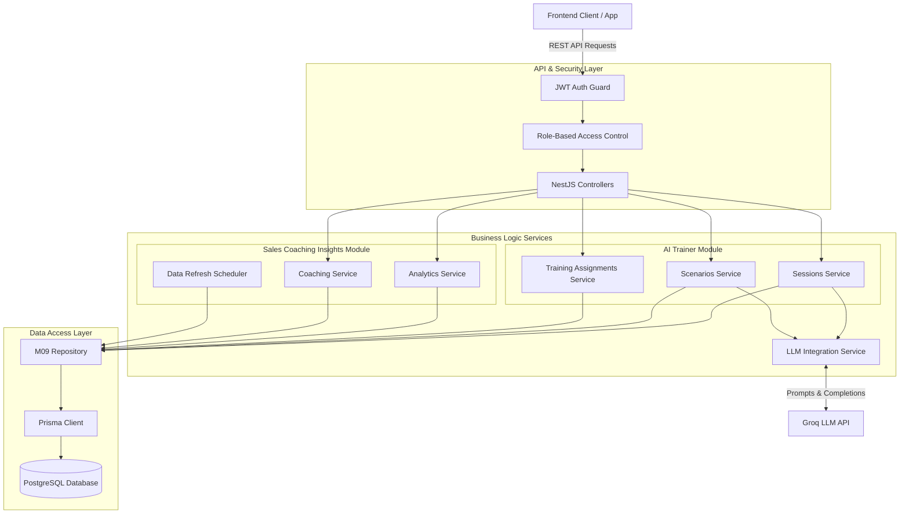

# High-Level Design (HLD)
## SalesAI Coaching & Training Module

This document outlines the high-level architecture of the backend services supporting the **AI Trainer** and **Sales Coaching Insights** functionalities.

### System Architecture Overview

The backend follows a layered, modular architecture built with **NestJS**, utilizing **Prisma** for ORM and **PostgreSQL** as the primary datastore. It integrates with an external **LLM Provider (Groq)** to power AI personas and session evaluations.

### Key Modules Description

1. **API & Security Layer:**
   - **JWT Auth & RBAC:** Secures endpoints and restricts access (e.g., Reps vs. Managers vs. Org Admins). Maps to features F009 and F020.
   - **Controllers:** Expose RESTful endpoints (`/sessions`, `/scenarios`, `/analytics`, etc.).

2. **AI Trainer Module:**
   - **Sessions Service:** Manages active AI roleplay sessions, tracking turn-by-turn history, and orchestrating scorecard evaluation upon session end.
   - **Scenarios Service:** Handles creation of AI personas, including extracting personas from uploaded audio transcripts.
   - **Training Service:** Manages training assignments mapped to scenarios, including attempt tracking and deadlines.

3. **Sales Coaching Insights Module:**
   - **Analytics Service:** Aggregates feedback scorecards to calculate team performance, topics/trackers, interaction analytics, and rep comparisons.
   - **Coaching Service:** Manages manual and automated coaching recommendations and notes.
   - **Scheduler Service:** A cron-based service running twice daily to update assignment statuses (e.g., marking them overdue) and refreshing coaching data.

4. **Data Access Layer:**
   - Centralized repository pattern to ensure business services do not write raw queries, keeping code decoupled and testable.
