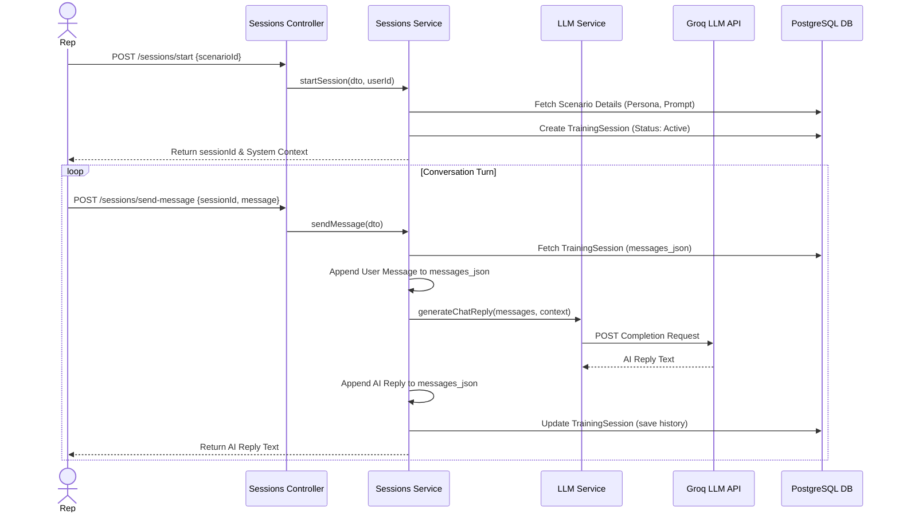
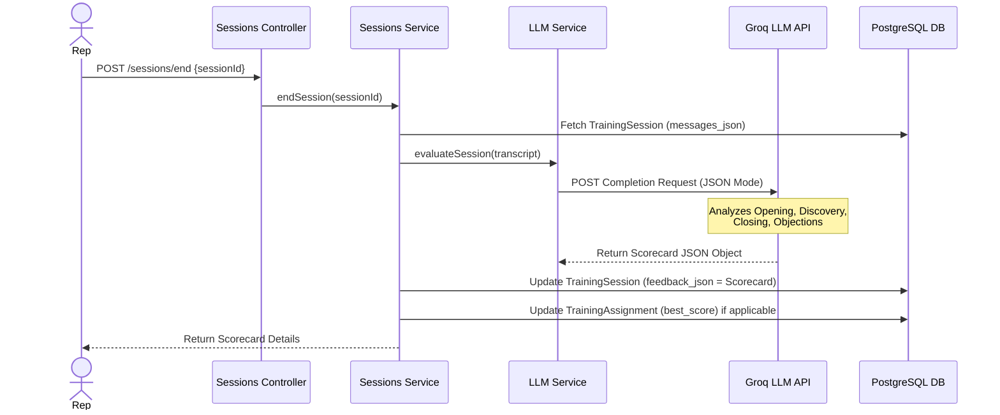
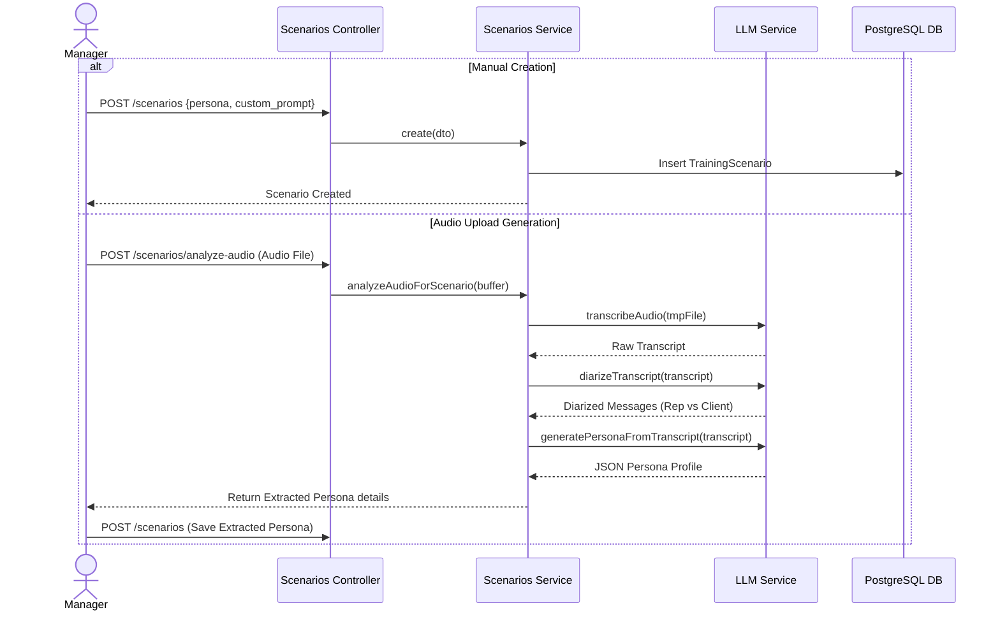
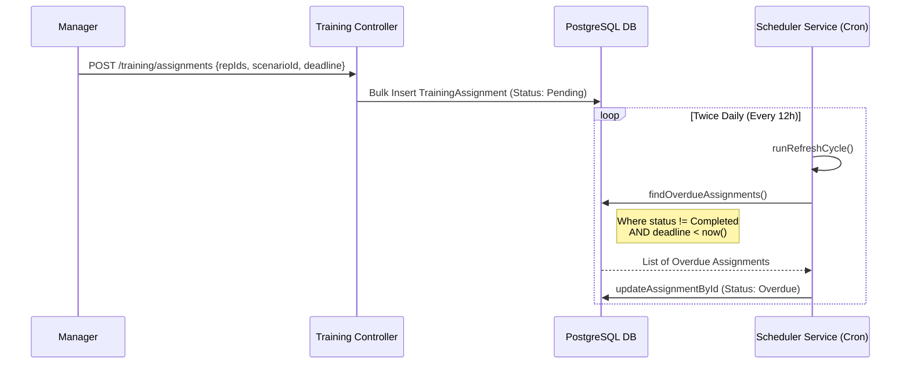

# Low-Level Design (LLD): AI Trainer Module

This document provides detailed sequence diagrams and flows for the core functionalities within the **AI Trainer** module.

## 1. AI Practice Sessions & Turn-by-Turn Conversation (F013, F014)

This flow describes how a Sales Rep initiates and participates in a mock training session with an AI persona.

## 2. Session Scorecard Evaluation (F015)

When a rep concludes a session, the backend evaluates the full transcript to generate a comprehensive scorecard.

## 3. Persona Configuration & Scenario Builder (F011, F012)

Managers can create scenarios manually or generate them dynamically from real call audio.

## 4. Training Assignments & Completion Tracking (F017, F018)

Managers assign scenarios, and a background process tracks overdue assignments.

