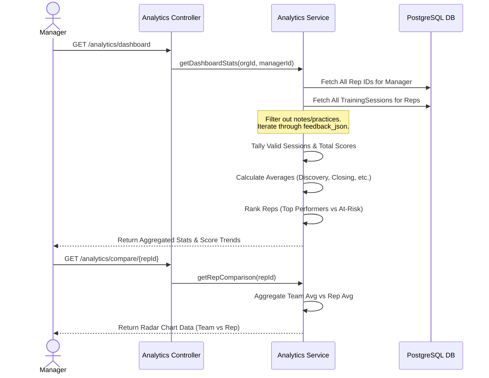
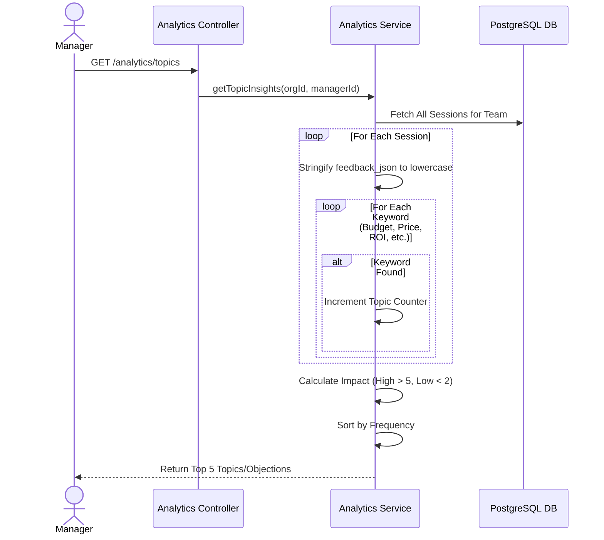
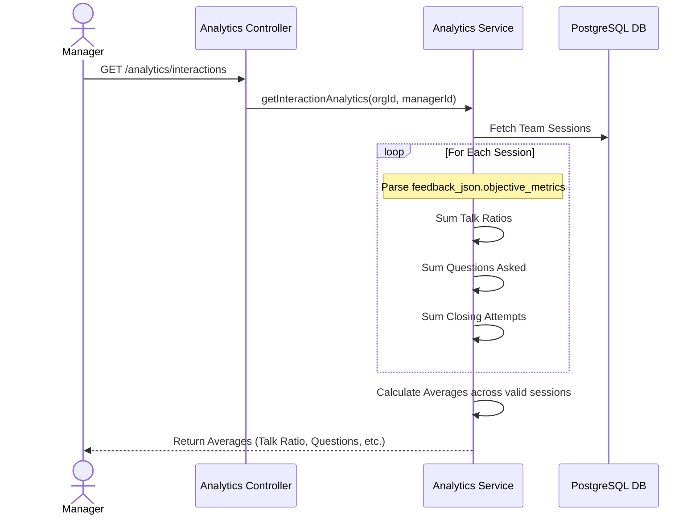
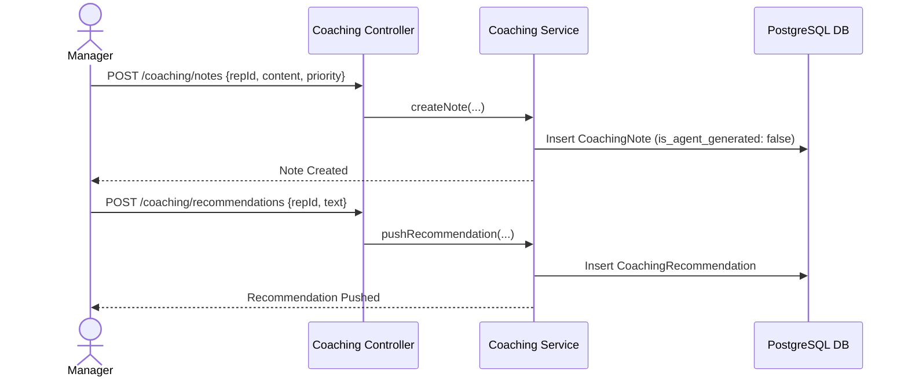
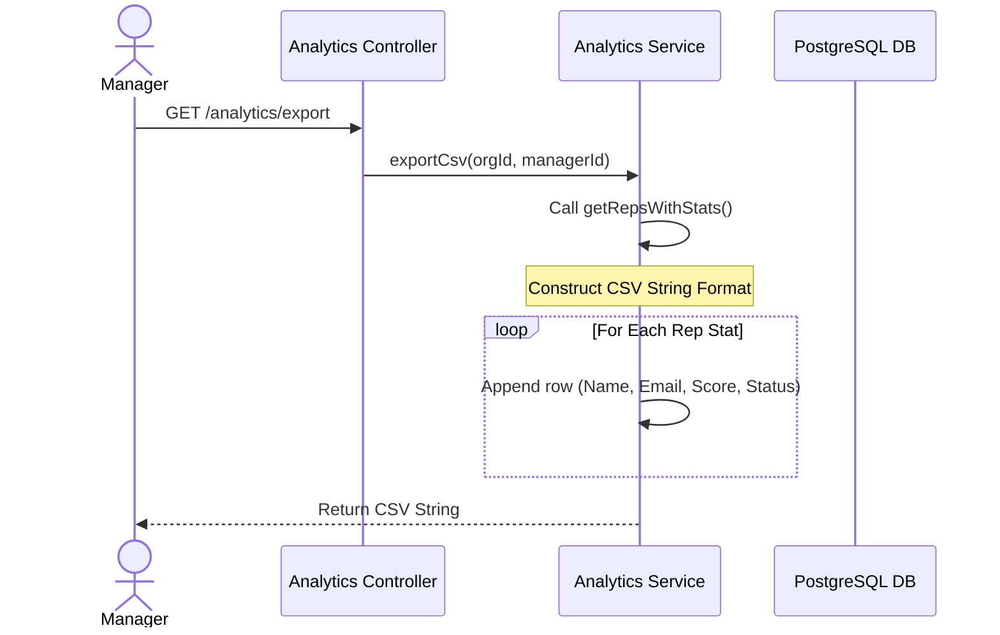

# Low-Level Design (LLD): Sales Coaching Insights Module

This document details the sequence diagrams and data flows for the core functionalities within the **Sales Coaching Insights** module.

## 1. Team Coaching Dashboard & Radar Charts (F001, F002)

Generates the high-level team metrics, radar charts comparing skills (Discovery, Objections, etc.), and identifies at-risk reps.

## 2. Topic & Tracker Insights (F005)

Scans the feedback data across the team to identify which objections (e.g., Price, Competitor) are most common.

## 3. Interaction Analytics (F004)

Extracts objective metrics from the LLM scorecard (Talk Ratio, Questions Asked).

## 4. Manager Coaching Notes & Recommendations (F007, Manual Feedback)

Allows managers to push manual feedback or system to generate automated recommendations.

## 5. CSV Export (F010)

Generates downloadable reports of rep performance.

