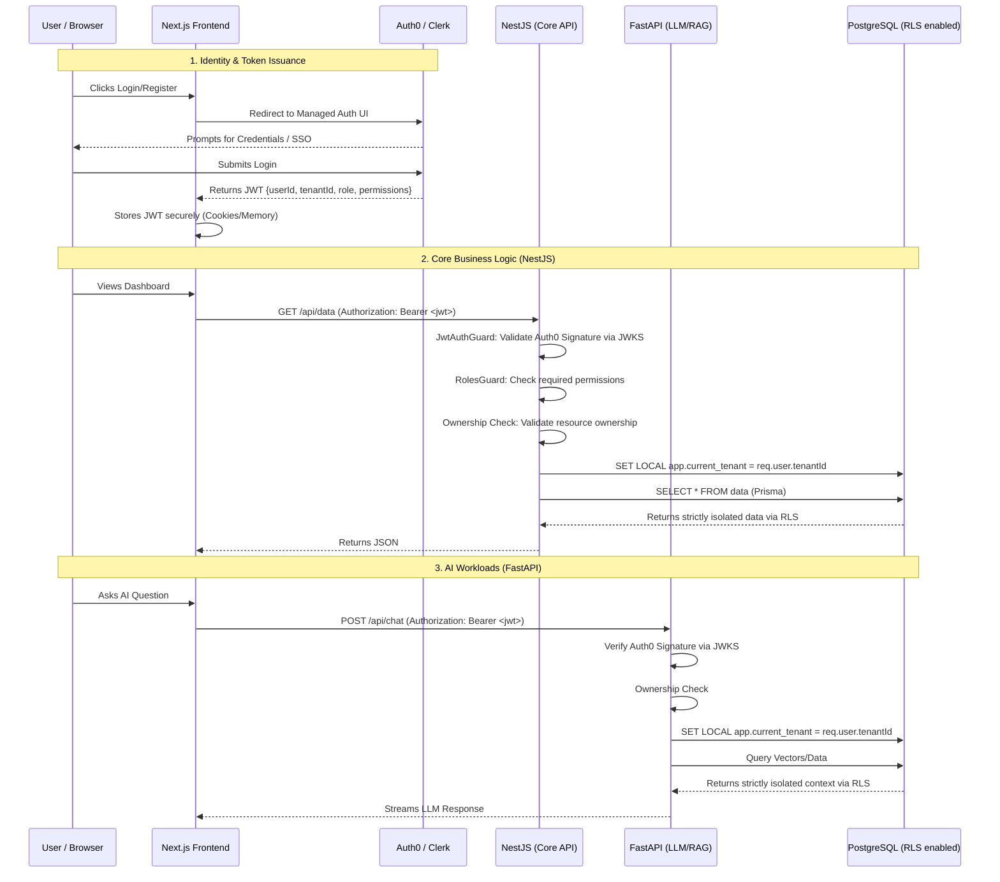

# Enterprise Authentication & RLS Architecture Plan

This document outlines the updated implementation plan for a highly scalable, secure, enterprise-grade architecture. It replaces custom authentication with a Managed Identity Provider (Auth0/Clerk), distributes backend workloads across NestJS and FastAPI, and enforces strict data isolation using PostgreSQL Row Level Security (RLS).

---

## 1. System Architecture Flowchart



---

## 2. Implementation Steps

### Step 1: External Identity Provider Setup (Auth0 / Clerk)
Remove all custom `/auth/login` and `/auth/register` endpoints from your NestJS application. 
1. **Configure Provider**: Create an account on Auth0 or Clerk.
2. **Custom Claims**: Configure the provider to inject custom claims into the JWT. Every issued token **must** contain:
   * `userId` (Standard `sub` claim)
   * `tenantId` (e.g., `https://yourapp.com/tenantId`)
   * `role` (e.g., `https://yourapp.com/role`)
3. **Next.js Integration**: Use the official SDK (e.g., `@auth0/nextjs-auth0` or `@clerk/nextjs`) to wrap your application and handle the login/register redirects. Next.js will use `getAccessToken()` to attach the JWT to outbound backend requests.

---

### Step 2: Backend JWT Validation (NestJS & FastAPI)
Since the backends did not create the token, they must verify it using the Identity Provider's public keys (JWKS).

**NestJS Setup (`JwtAuthGuard`)**
Install `passport-jwt` and `jwks-rsa`. Configure the `JwtStrategy` to pull the public keys from your Auth0/Clerk domain.
```typescript
// NestJS JwtStrategy
import { passportJwtSecret } from 'jwks-rsa';

@Injectable()
export class JwtStrategy extends PassportStrategy(Strategy) {
  constructor() {
    super({
      secretOrKeyProvider: passportJwtSecret({
        cache: true,
        rateLimit: true,
        jwksRequestsPerMinute: 5,
        jwksUri: 'https://YOUR_DOMAIN/.well-known/jwks.json',
      }),
      jwtFromRequest: ExtractJwt.fromAuthHeaderAsBearerToken(),
      issuer: 'https://YOUR_DOMAIN/',
      algorithms: ['RS256'],
    });
  }

  async validate(payload: any) {
    // Return the mapped claims to be attached to req.user
    return {
      userId: payload.sub,
      tenantId: payload['https://yourapp.com/tenantId'],
      role: payload['https://yourapp.com/role'],
    };
  }
}
```

**FastAPI Setup**
Similarly, use a library like `python-jose` to fetch the JWKS and validate the `Bearer` token in a FastAPI dependency (`Depends()`).

---

### Step 3: Granular Authorization (NestJS)
With authentication handled, implement authorization guards.

1. **`RolesGuard`**: Creates decorators to protect routes based on the role in the JWT.
```typescript
@UseGuards(JwtAuthGuard, RolesGuard)
@Roles('manager') // Only managers can access this endpoint
@Post('/tasks')
createTask() { ... }
```
2. **Ownership Checks**: Implemented inside the Service layer. If a user tries to edit Task ID `123`, the service must first verify that `req.user.userId === task.assigneeId`.

---

### Step 4: PostgreSQL Row Level Security (RLS)
Instead of relying on developers to write `where: { tenantId }` in Prisma or SQLAlchemy, secure data directly at the database level.

**1. Enable RLS in PostgreSQL**
For every tenant-specific table, enable RLS and create a policy:
```sql
ALTER TABLE "Task" ENABLE ROW LEVEL SECURITY;

CREATE POLICY tenant_isolation_policy ON "Task"
    FOR ALL
    USING ("tenant_id" = current_setting('app.current_tenant')::text);
```

**2. Inject the Context via Prisma Middleware (NestJS)**
Before Prisma executes a query, it must tell PostgreSQL *who* is asking for the data. You do this by setting a local database variable.
```typescript
// Example Prisma Extension / Middleware
const prisma = new PrismaClient().$extends({
  query: {
    $allModels: {
      async $allOperations({ args, query }) {
        // Assuming you have access to req.user.tenantId via AsyncLocalStorage or similar
        const tenantId = getContextTenantId(); 
        
        return prisma.$transaction(async (tx) => {
          // 1. Set the PostgreSQL context for this transaction ONLY
          await tx.$executeRaw`SET LOCAL app.current_tenant = ${tenantId}`;
          // 2. Execute the actual query. RLS will automatically filter the results!
          return query(args);
        });
      },
    },
  },
});
```

*(You must implement equivalent context injection in FastAPI using SQLAlchemy or asyncpg).*

---

### Summary of the Enterprise Flow
1. **Authentication**: Auth0/Clerk handles the complex UI, MFA, and token issuance.
2. **Validation**: NestJS and FastAPI mathematically verify the token via JWKS.
3. **Authorization**: Guards check the roles inside the validated JWT.
4. **Data Isolation**: The verified `tenantId` is passed directly to PostgreSQL, where **Row Level Security** physically prevents cross-tenant data leaks, regardless of backend query logic.
