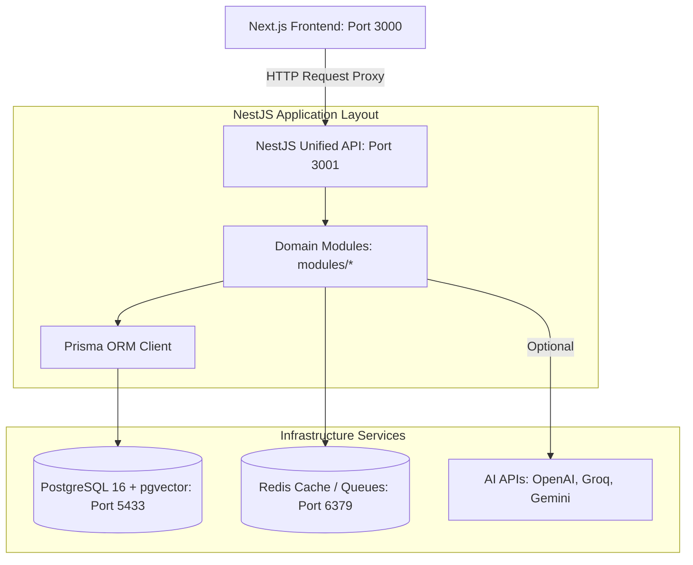

# Architectural Overview — Revenue Intelligence Monorepo

This monorepo contains the end-to-end codebase for the **Revenue Intelligence Platform**. It is structured to support clean separation of concerns, modularized domain backends, and a unified responsive Next.js frontend.

---

## 1. High-Level Architecture Diagram



---

## 2. Technology Stack

| Layer | Component | Details / Tech |
| :--- | :--- | :--- |
| **Frontend** | Next.js UI | Next.js `15.x` / `16.x`, React `19.x`, Lucide Icons, Vanilla CSS / TailwindCSS, Recharts |
| **Backend** | NestJS API | NestJS modular API backend with TypeScript |
| **Database** | PostgreSQL | PostgreSQL v16 with `pgvector` extension for semantic embedding storage |
| **ORM** | Prisma | Centralized database schema and client generator at `packages/database` |
| **Cache & Queue** | Redis | Redis v7 for caching and queues (used in sales engagement modules) |
| **Orchestration** | Docker & Scripts | Docker Compose for DB/Cache setup, PowerShell script orchestration |

---

## 3. Monorepo Layout & Conventions

The codebase consists of:
1. **Frontend App**: `apps/web/` - Next.js UI frontend.
2. **Backend App**: `apps/unified-api/` - NestJS monolithic backend bootstrapping core and feature modules.
3. **Internal Modules**: `modules/` - NestJS backend feature domain packages (Capture, CI, Forecast, etc.).
4. **Internal Packages**: `packages/database/` - Prisma schemas & migrations database client package.

```text
r-revenue-intelligence-monorepo/
├── docker-compose.yml              # Infrastructure (Postgres:5433, Redis:6379, Meilisearch:7700)
├── start-demo.ps1, stop-demo.ps1   # Demo orchestration scripts
├── apps/
│   ├── web/                        # Next.js Frontend UI (:3000)
│   │   └── src/features/           # Feature UI modules (engage, calls, forecasting, etc.)
│   └── unified-api/                # NestJS Backend Bootstrap Entrypoint (:3001)
├── modules/                        # Domain-specific backend packages
│   ├── m01-capture-transcription/  # Transcript upload, processing
│   ├── m02-conversation-intelligence/ # Conversation review, tracker logic
│   ├── m06-forecasting-prediction/ # Revenue predictor, forecast boards backend
│   ├── m08-sales-engagement/       # Tasks list, emails, phone integration, snooze
│   └── m09-coaching-training/      # AI trainer review modules
└── packages/                       # Shared packages
    └── database/                   # Prisma Schema and migrations
```

---

## 4. Logical Flow & Authentication

1. **User Request & Roles**:
   - The user opens the frontend which serves a multi-tenant client.
   - Roles are managed via user session cookies (`sales_manager` or `sales_rep`). Switching a role updates the view states.
2. **Next.js Proxy Routing**:
   - Requests made to `/api/v1/...` in Next.js are proxied directly to the NestJS Unified API running at port `3001`.
   - Tenant headers (`x-tenant-id` and `x-user-id`) are automatically injected by the Next.js middleware for local developer convenience when JWT is bypassed.
3. **Domain & Data Access**:
   - The controllers in NestJS delegate database queries to domain-level services.
   - Data access is handled by the shared `@rri/database` package containing the single Prisma client configuration.

---

## 5. Domain Modules Breakdown

- **M01 Capture & Transcription**: Extracts speaker segments and logs transcripts. Uses `pgvector` to enable semantic searches over conversations.
- **M02 Conversation CI**: Extracts business trackers (pricing objections, timeline comments) using keywords and regex engines.
- **M06 Forecasting & Prediction**: Tracks forecast boards (reps submitting estimates) and runs prediction calculations for manager overrides.
- **M08 Sales Engagement (Engage)**: Supports multi-channel tasks (Calls, Emails, LinkedIn, Custom ToDos) for sales reps, and performance monitoring dashboards for managers.
- **M09 Coaching & Training**: Allows managers to audit calls, insert coaching notes, and compile AI Trainer reports.
- **M10 Data & Compliance**: Audits data access logs and registers PII masking patterns.
