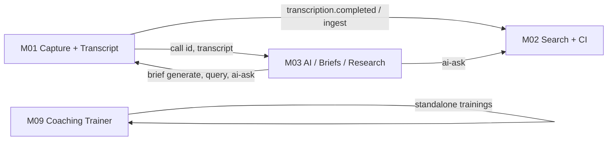

# M01 + M02 + M03 + M09 — completion plan (initial scope)

**Goal:** Finish these four modules end-to-end for the **new frontend** (`/api/...` bridge) while keeping **legacy** routes (`/api/v1/...`) working until migration ends.

**Locked rules:** [INTEGRATION-DECISIONS-LOCKED.md](./INTEGRATION-DECISIONS-LOCKED.md)  
**Bridge pattern:** [FRONTEND-BRIDGE-API-MASTER.md](./FRONTEND-BRIDGE-API-MASTER.md)

---

## What “complete” means (per module)

| Layer | Definition of done |
|-------|-------------------|
| **Legacy backend** | All existing Nest routes smoke-tested; Prisma/Redis/workers stable on standalone port |
| **Bridge API** | Every Figma-documented `/api/...` route: Zod input → service → exact JSON out |
| **Cross-module** | Documented data flows work (e.g. M01 transcription → M02 ingest; M03 AI for briefs/ask) |
| **Auth** | JWT on bridge; `x-tenant-id` dev-only |
| **New UI ready** | Frontend can point at module API port without shape mismatches |

---

## Standalone ports (dev)

| Module | API | Web | Legacy base |
|--------|-----|-----|-------------|
| **M01** | 3001 | 5174 | `/api/v1/capture-transcription` |
| **M02** | 3002 | 5175 | `/api/v1/conversation-intelligence` + `/api/v1/m02-conversation-intelligence` |
| **M03** | 4010 | 5177 | `/api/v1/ai-summaries-genai` |
| **M09** | 4009 | 5176 | `/api/v1/coaching-training` |

New frontend bridge routes use **`/api`** on the same ports (no gateway prefix yet).

---

## Cross-module dependencies



| From | To | Flow |
|------|-----|------|
| M01 | M02 | Post-transcription ingest → conversations index/search |
| M01 | M03 | Call/deal entity IDs for briefs; transcript text for summaries |
| M03 | M01 | `POST .../briefs/generate` powers M01 Briefs tab (Phase C) |
| M03 | M02 | `POST /api/calls/ai-ask` backend abstraction |
| M01 | M01 | Smart Call sessions + WS + backend AI proxy (same app or M02 host) |

**Build order implication:** Stabilize **M01 transcript + upload** before M02 drawer; wire **shared AI proxy (M03)** before M01 briefs, M02 ai-ask, and Smart Call live AI.

---

## Current status snapshot

| Module | Legacy backend | Bridge `/api` | Figma / contract doc | ~Complete |
|--------|----------------|---------------|----------------------|-----------|
| **M01** | ~32 routes, workers, S3 upload | **6 / 35** FE routes (list + metadata) | `Call_List Sales_Rep.txt`, `smartcall_Figma_breakdown 2.txt` | **~25%** |
| **M02** | ~57 routes (2 prefixes) | **6 scaffold** (search/filters/export) | `callsearch_screen_breakdown_v2.txt`; Reviewer/Translator **missing** | **~15%** bridge / **~70%** legacy |
| **M03** | Workspace, briefs, research, query | **0** (old UI uses `/api/v1/...`) | No new Figma txt in `final_product/` yet | **~80%** legacy / **TBD** new FE |
| **M09** | ~40 legacy coaching routes | **0** | `Figma_Coaching-AI-Trainer 1.txt` (9 routes) | **~60%** legacy / **0%** bridge |

---

# M01 — Call Transcription

**Screens (roster):** Calls List (SR), Smart Call (Aakrithi)

### Bridge APIs (new frontend)

| Phase | Routes | Count | Status |
|-------|--------|------:|--------|
| A Calls List | `/api/calls`, search, accounts, participants, `:callId` | 5 | Done (harden DB filters) |
| B Metadata | `/api/calls/:id/metadata` | 1 | Done |
| C Briefs | `/api/calls/.../briefs*`, `/api/brief-templates`, `/api/brief-periods` | 15 | **TODO** — use M03 generate + new `call_briefs` store |
| D Transcript | transcript, summary, talk-ratio, audio, topics, next-steps | 7 | **TODO** — mapper + stable `stepId` schema |
| E Smart Call | `/api/smart-call/*` × 6 + WS | 6 | **TODO** — backend AI proxy, demo contacts |
| Upload | `POST /api/calls/upload`, S3 import | 2 | Partial (legacy only) |

**Contract:** [M01-NEW-FRONTEND-FULL-CONTRACT.md](./M01-NEW-FRONTEND-FULL-CONTRACT.md)

### M01 work packages

1. **Harden Phase A** — Prisma `where` for filters; correct `totalCount`; `pending` → `processing`.
2. **Phase D — Transcript** — Map utterances, summary, talk-ratio, audio URL, topics; next-steps with `{ id, description, completed }[]`.
3. **Phase C — Briefs** — Persist briefs; fat GET; POST generate → call M03 `briefs/:type/:entityId/generate`; share/export PDF stubs if needed for v1.
4. **Upload bridge** — `POST /api/calls/upload` → existing multipart handler.
5. **Phase E — Smart Call** — Sessions, `wsEndpoint`, end/summary/transcript; **AI proxy service** (no browser keys).
6. **JWT** on `frontend-api` controllers.

### M01 “done” checklist

- [ ] All 28 Call List/Briefs/Transcript bridge routes return contract JSON
- [ ] Smart Call 6 backend routes + WS + AI proxy
- [ ] Legacy `/api/v1/capture-transcription/*` unchanged and smoke-green
- [ ] M02 ingest receives completed transcriptions

---

# M02 — Conversation Intelligence

**Screens (roster):** Call Search (SM), AI Call Reviewer (SM/SR), AI Translator (SM)

### Bridge APIs (new frontend)

| Route | Status | Notes |
|-------|--------|-------|
| `GET /api/filters/options` | Scaffold | Wire tenant teams/reps from DB |
| `GET /api/search/calls` | Scaffold | HybridSearch + scorecard service |
| `GET /api/search/calls/:callId` | Stub | Drawer payload from M01+M02 data |
| `POST /api/calls/ai-ask` | Stub | → M03 query or shared AI proxy |
| `POST /api/calls/export` | Stub | Async job + notification |
| `POST /api/streams` | Stub | Saved searches / streams persistence |
| Reviewer / Translator | **Blocked** | Waiting on Figma API txt |

**Code:** `modules/m02-conversation-intelligence/frontend-api/`

### M02 work packages

1. **Call Search (full)** — Implement search, chart aggregation, tab counts (`emailsCount: 0` stub).
2. **Drawer** — Merge call record, recording, highlights, timeline from M01 transcript + M02 topics/trackers.
3. **Scorecard** — Dedicated service for row `score` / `scoreLabel` (not duplicated on `call_records`).
4. **AI ask** — Backend proxy → M03 or OpenRouter/Groq.
5. **Export + streams** — Job table, poll status, optional in-app notification hook.
6. **Legacy parity** — Trackers, topics, translate, vocabulary, ingest (old UI on 5175).
7. **Reviewer + Translator bridge** — When design docs arrive.

### M02 “done” checklist

- [ ] 6 Call Search bridge routes fully implemented
- [ ] Legacy conversation-intelligence smoke-green
- [ ] M01 ingest path verified
- [ ] Reviewer/Translator bridge (when specs land) OR explicitly deferred with sign-off

---

# M03 — AI Summaries & GenAI

**Screens:** Deep Research, Ask Anything, Smart Summaries (existing standalone UI — 5177)

### Situation

- **Legacy backend is largely built** (workspace, briefs, research jobs, query, feedback).
- **No new Figma API txt** in `final_product/` for the external new frontend yet.
- M01 Briefs and M02 `ai-ask` **depend on M03** as the AI engine.

### M03 roles in this plan

| Role | Consumer | Endpoints (internal/legacy) |
|------|----------|----------------------------|
| Call brief generation | M01 Phase C | `POST /api/v1/ai-summaries-genai/briefs/:briefType/:entityId/generate` |
| Ask / Q&A | M02 ai-ask, M01 future | `POST /api/v1/ai-summaries-genai/query` |
| Deep Research | M03 UI | research jobs + reports |
| Smart Summaries | M03 UI | workspace + briefs |

### M03 work packages

1. **Stabilize standalone** — `dev:m03-api` + `dev:m03-web`; Postgres seed path; ai-services optional.
2. **Shared AI proxy module** — Thin Nest service in `platform-core` or M03 exported for M01/M02 bridge (keys server-side).
3. **Service-to-service auth** — M01/M02 call M03 with tenant context (header or internal JWT).
4. **Bridge `/api` (later)** — Only when new frontend sends M03 Figma contracts; until then M03 “complete” = legacy + consumed by M01/M02 bridges.
5. **Smoke + docs** — Single “M03 integration” section in this doc’s test plan.

### M03 “done” checklist

- [ ] All routes in [API-M03.md](../api-docs/API-M03.md) smoke-green on 4010
- [ ] M01 brief generate path works end-to-end
- [ ] M02 ai-ask uses M03/query or shared proxy
- [ ] `M03_USE_LOCAL_FALLBACK` documented for dev vs production AI
- [ ] New FE bridge spec captured when design provides it

---

# M09 — Coaching AI Trainer

**Screens:** Training Dashboard, Setup, Live Session, Results (`Figma_Coaching-AI-Trainer 1.txt`)

### Bridge APIs (9 routes → `/api/trainings`)

| # | New route | Maps from legacy (examples) |
|---|-----------|----------------------------|
| 1 | `GET /api/trainings` | `GET .../my`, dashboard assignments |
| 2 | `GET /api/trainings/:trainingId` | `GET .../:id` + hint/playbook reshape |
| 3 | `POST /api/trainings/:trainingId/sessions` | `POST .../start` |
| 4 | `GET .../sessions/:sessionId` | session state |
| 5 | `POST .../messages` | `send-message` / `message` |
| 6–8 | pause / resume / end | session lifecycle |
| 9 | `GET .../results` | post-session evaluation (poll) |

**Do not expose** `/api/v1/coaching-training` to new UI.

### M09 work packages

1. **`frontend-api/` bridge** — `m09-frontend-trainings.controller.ts` + mapper from `m09.service`.
2. **Session model** — Align with Figma lifecycle (active/paused/completed); block duplicate active session.
3. **Results polling** — Async evaluation job after `POST .../end`; `GET .../results` until `ready`.
4. **TTS** — ElevenLabs or Azure (pending vendor); store `selectedVoiceId` on session.
5. **v2 defer** — `missedInLastAttempt` playbook flags.
6. **JWT** — Replace demo-only auth for production new UI (legacy login can remain for 5176).

### M09 “done” checklist

- [ ] All 9 `/api/trainings` routes match Figma JSON (`repObjective` spelling)
- [ ] Legacy `/api/v1/coaching-training` unchanged for old UI
- [ ] Polling results flow documented for frontend
- [ ] TTS integrated or stubbed with clear FE message

---

# Recommended execution order (sprints)

## Sprint 0 — Platform (all modules)

| Task | Blocks |
|------|--------|
| Shared **JWT** module for M01/M02/M09 bridge guards | All bridge routes |
| **`FrontendApiExceptionFilter`** on M03/M09 apps | Consistent errors |
| **`AiProxyService`** (M03-backed, Groq/OpenRouter env) | M01 Smart Call, M02 ai-ask, M01 briefs |
| **Next-steps schema** (`{ id, description, completed }`) | M01 PATCH stepId |

## Sprint 1 — M01 core (unblocks M02)

| # | Task | Est. |
|---|------|------|
| 1.1 | Harden list/search filters (DB) | S |
| 1.2 | Transcript bridge (Phase D, 7 routes) | M |
| 1.3 | Upload bridge | S |
| 1.4 | Next-steps stable IDs | M |

## Sprint 2 — M03 + M01 Briefs

| # | Task | Est. |
|---|------|------|
| 2.1 | M03 smoke + service auth for M01/M02 | S |
| 2.2 | M01 Briefs bridge (Phase C, fat GET + generate) | L |
| 2.3 | `brief-templates` / `brief-periods` static or DB | S |

## Sprint 3 — M02 Call Search

| # | Task | Est. |
|---|------|------|
| 3.1 | `GET /api/search/calls` real data + chart | L |
| 3.2 | `GET /api/search/calls/:callId` drawer | L |
| 3.3 | Scorecard service for row scores | M |
| 3.4 | `POST /api/calls/ai-ask` → AiProxy | M |
| 3.5 | Export + streams jobs | M |

## Sprint 4 — M01 Smart Call + M09

| # | Task | Est. |
|---|------|------|
| 4.1 | Smart Call sessions + WS + summary/transcript | L |
| 4.2 | Smart Call AI proxy (live + post-call) | L |
| 4.3 | M09 `/api/trainings` bridge (9 routes) | L |
| 4.4 | M09 results polling + TTS (or stub) | M |

## Sprint 5 — Hardening + M02 remainder

| # | Task | Est. |
|---|------|------|
| 5.1 | E2E: M01 upload → transcribe → M02 search sees call | M |
| 5.2 | M02 Reviewer/Translator when Figma txt arrives | TBD |
| 5.3 | M03 new-FE bridge (when spec arrives) | TBD |
| 5.4 | Per-module smoke CI scripts | S |

**Est.:** S = small (1–2d), M = medium (3–5d), L = large (5–10d) per developer familiar with codebase.

---

## API count summary (new frontend bridge only)

| Module | Bridge routes to implement | Done | Remaining |
|--------|---------------------------|-----:|----------:|
| M01 | ~35 (28 + 6 SC + upload) | 6 | ~29 |
| M02 | 6 (+ Reviewer/Translator TBD) | 0 real / 6 scaffold | 6+ |
| M03 | 0 until new Figma (serves M01/M02 internally) | — | proxy + integration |
| M09 | 9 | 0 | 9 |
| **Total bridge** | **~50+** | **6** | **~44+** |

Legacy routes (~130 combined) stay as-is; completion = working + tested, not removed.

---

## Blockers / inputs needed

| Item | Owner | Blocks |
|------|-------|--------|
| M02 Reviewer + Translator Figma API txt | Design | M02 full roster |
| M03 new frontend API spec | Design | M03 `/api` bridge |
| TTS vendor (ElevenLabs vs Azure) | Product | M09 live session audio |
| JWT issuer / user store for new UI | Platform | Production bridge auth |

---

## Test plan (definition of done)

```powershell
# Infra
docker compose up -d   # from repo root

# Per module (from monorepo root)
pnpm run dev:m01-api   # + bridge: GET /api/calls?page=1&size=10
pnpm run dev:m02-api   # + GET /api/search/calls
pnpm run dev:m03-api   # + GET .../test/health
pnpm run dev:m09-api   # + GET /api/trainings (after bridge)
```

| Test | Pass criteria |
|------|----------------|
| M01 legacy smoke | Upload → transcript completed → list call |
| M01 bridge | All phases A–E contract JSON matches txt |
| M02 ingest | M01 completion triggers conversation searchable |
| M02 bridge | Search + drawer + ai-ask return real or staged data per spec |
| M03 | Brief generate + query succeed for test tenant |
| M09 bridge | Full training session lifecycle + poll results |

---

## Single source docs (by module)

| Module | Bridge / contract | Legacy API |
|--------|-------------------|------------|
| M01 | [M01-NEW-FRONTEND-FULL-CONTRACT.md](./M01-NEW-FRONTEND-FULL-CONTRACT.md) | [API-M01.md](../api-docs/API-M01.md) |
| M02 | `callsearch_screen_breakdown_v2.txt` | [API-M02.md](../api-docs/API-M02.md) |
| M03 | TBD + [INTEGRATION-M03.md](../standalone/INTEGRATION-M03.md) | [API-M03.md](../api-docs/API-M03.md) |
| M09 | `Figma_Coaching-AI-Trainer 1.txt` | [API-M09.md](../api-docs/API-M09.md) |

---

*Use this plan as the backlog for “M1, M2, M9, M3 completely.” Update checkboxes as sprints close.*
