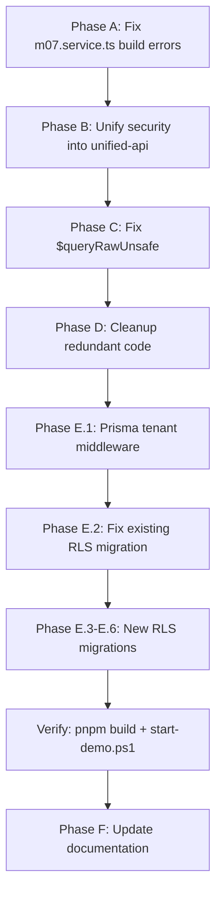

# Implementation Plan: Phase 5 RLS + Full Verification & Permanent Fixes

## Goal

Implement PostgreSQL Row-Level Security (RLS) for all 91 tenant-scoped tables, fix every claim in `implementation_plan2.md` that doesn't match reality, and ensure `start-demo.ps1` boots cleanly with a passing `pnpm build`.

---

## Audit Summary: Verified Claims vs Actual State

The document `implementation_plan2.md` makes several claims that **do not hold** when verified against the codebase. This plan addresses all discrepancies with **permanent fixes**.

### ❌ Claims That Are FALSE

| # | Claim in `implementation_plan2.md` | Actual State | Impact |
|---|---|---|---|
| F-01 | `pnpm build` passes (24/24 packages) | **BUILD FAILS** — 23+ TS errors in [m07.service.ts](file:///c:/Users/Relanto/OneDrive%20-%20Relanto/Downloads/118/r-revenue-intelligence-monorepo/modules/m07-revenue-dashboards/services/m07.service.ts) (`tenantId` → `tenantid`, missing `account` relation, missing `widgets` relation, missing `tenantid` in Widget creates) | **CRITICAL** — Nothing compiles |
| F-02 | `dotenv` removed from `main.ts` | **STILL PRESENT** in [unified-api/main.ts](file:///c:/Users/Relanto/OneDrive%20-%20Relanto/Downloads/118/r-revenue-intelligence-monorepo/apps/unified-api/src/main.ts) lines 4, 8-11 (4 `dotenv.config()` calls) | Security — env loading should use ConfigModule |
| F-03 | `TraceAndTenantMiddleware` registered globally in `main.ts` | **ONLY in `apps/api/main.ts`** — NOT in `apps/unified-api/main.ts` which is what `start-demo.ps1` runs | No traceability in demo |
| F-04 | `ResponseTransformInterceptor` registered via `useGlobalInterceptors()` | **ONLY in `apps/api/main.ts`** — NOT in `apps/unified-api/main.ts` | No response envelope in demo |
| F-05 | `TenantThrottlerGuard` + global `JwtAuthGuard` in `main.ts` | **ONLY in `apps/api/main.ts`** — NOT in `apps/unified-api/main.ts` (no `useGlobalGuards` call at all) | No auth or rate-limiting in demo |
| F-06 | `$queryRawUnsafe` → `$queryRaw` fixed | **STILL PRESENT** in 20+ locations: [search.repository.ts](file:///c:/Users/Relanto/OneDrive%20-%20Relanto/Downloads/118/r-revenue-intelligence-monorepo/modules/m01-capture-transcription/repositories/search.repository.ts), [topic.repository.ts](file:///c:/Users/Relanto/OneDrive%20-%20Relanto/Downloads/118/r-revenue-intelligence-monorepo/modules/m02-conversation-intelligence/repositories/topic.repository.ts) (15 calls), [hybrid-search.service.ts](file:///c:/Users/Relanto/OneDrive%20-%20Relanto/Downloads/118/r-revenue-intelligence-monorepo/modules/m02-conversation-intelligence/services/hybrid-search.service.ts) (2 calls), [m03-test.controller.ts](file:///c:/Users/Relanto/OneDrive%20-%20Relanto/Downloads/118/r-revenue-intelligence-monorepo/modules/m03-ai-summaries-genai/controllers/m03-test.controller.ts) | SQL injection risk |
| F-07 | `ConfigModule.forRoot({ isGlobal: true })` with no `envFilePath` | **HAS `envFilePath`** — [app.module.ts](file:///c:/Users/Relanto/OneDrive%20-%20Relanto/Downloads/118/r-revenue-intelligence-monorepo/apps/unified-api/src/app.module.ts) line 24: `envFilePath: ['.env', '.env.local']` | Contradicts Doppler reliance |

### ⚠️ Claims Marked "Done" But Outstanding Items Still Exist

| # | Claim | Actual State |
|---|---|---|
| O-01 | Duplicate `jwt.guard.ts` in m04 should be deleted (R-03) | **STILL EXISTS** at `modules/m04-deal-intelligence/interfaces/jwt.guard.ts` |
| O-02 | M07 controller `@UseGuards(JwtAuthGuard, RolesGuard)` should be cleaned (R-04) | **29 occurrences** still present in [m07.controller.ts](file:///c:/Users/Relanto/OneDrive%20-%20Relanto/Downloads/118/r-revenue-intelligence-monorepo/modules/m07-revenue-dashboards/controllers/m07.controller.ts) |
| O-03 | Non-standard module directories should be removed (R-05) | **ALL 7 still exist**: m09/frontend-api, m09/system design, m09/postman, m06/python-service, m07/analytics, m07/auth, m10/revenue-graph |
| O-04 | `groq-sdk` removal (R-01, R-02) | **Present in 6 packages**: apps/web, apps/unified-api, apps/api, m02, m09, m11 |
| O-05 | `@ts-nocheck` removed | **Still in**: m09 seed.ts, m04 deal-drivers.service.spec.ts |
| O-06 | Tenant indices on "11 tables" | **Actually 80 indices** — the count was outdated (not a bug, just inaccurate documentation) |

### ✅ Claims That ARE True

| Claim | Verified |
|---|---|
| Multi-schema Prisma (`ingestion`, `revenuegraph`, `public`, `dashboards`) | ✅ 104 models with `@@schema()` |
| UUID PKs (`gen_random_uuid()`) | ✅ All models use `@db.Uuid` |
| `tenantid String @db.Uuid` in schema | ✅ 91 tenant-scoped models |
| `EventPublisherService` with BullMQ | ✅ Exists in `platform-core/events/` |
| `EventEnvelopeSchema` Zod schemas | ✅ In `shared-types/src/events/index.ts` |
| `MalwareScannerService` in M01 | ✅ Registered in module and used in upload controller |
| `husky` + `commitlint` configured | ✅ Present in root |
| M08 BFF removal | ✅ `frontend-api/` removed from m08 |
| M10 consolidation | ✅ `data-cloud/` removed |

---

## Phase A: Fix Build-Breaking Errors (CRITICAL — Must Be First)

> [!CAUTION]
> The build **currently fails**. Nothing else can proceed until this is resolved.

### Component: M07 Revenue Dashboards

#### [MODIFY] [m07.service.ts](file:///c:/Users/Relanto/OneDrive%20-%20Relanto/Downloads/118/r-revenue-intelligence-monorepo/modules/m07-revenue-dashboards/services/m07.service.ts)

23+ errors across the file. All fall into 4 categories:

1. **`tenantId` → `tenantid` in Prisma `where` clauses** (lines 1546, 1570, 1851, 1883, 1934, 2009, 2019, 2026, 2033, 2095, 2130, 2168, 2183)
   - Every `where: { tenantId: ... }` must become `where: { tenantid: ... }`
   - Every `data: { tenantId: ... }` in `create()` must become `data: { tenantid: ... }`

2. **Missing `include: { account: true }` on Deal queries** (lines 1241, 1248, 1276, 1892)
   - Queries use `deal.account.name` but don't include the relation
   - Fix: add `include: { account: true }` to the `findMany` call

3. **Missing `include: { widgets: true }` on Dashboard queries** (lines 2041, 2142)
   - Queries access `dashboard.widgets` but don't include the relation
   - Fix: add `include: { widgets: true }` to the relevant `findUnique`/`findFirst` call

4. **Missing `tenantid` in Widget `create`/`createMany` payloads** (lines 2107, 2231)
   - `Widget` model requires `tenantid` — it must be passed in all create operations
   - Fix: add `tenantid: tenantId` to each Widget creation object

---

## Phase B: Unify Security Infrastructure Into `unified-api`

> [!IMPORTANT]
> The demo runs `apps/unified-api`, but all security features (guards, middleware, interceptors) were only added to `apps/api`. The demo is **completely unprotected**.

### Component: unified-api Boot

#### [MODIFY] [unified-api/main.ts](file:///c:/Users/Relanto/OneDrive%20-%20Relanto/Downloads/118/r-revenue-intelligence-monorepo/apps/unified-api/src/main.ts)

Current state: 106 lines, no guards, no middleware, no interceptors, has `dotenv` imports.

**Changes:**
1. **Remove `dotenv` imports** (lines 4, 8-11) — the `ConfigModule.forRoot({ isGlobal: true })` in `app.module.ts` handles env loading
2. **Add `TraceAndTenantMiddleware`** — import from `platform-core` and register with `app.use()`
3. **Add `ResponseTransformInterceptor`** — import from `apps/api/src/` (or move to `platform-core`) and register with `app.useGlobalInterceptors()`
4. **Add `JwtAuthGuard` + `TenantThrottlerGuard`** — import and register with `app.useGlobalGuards()`
5. **Add `ZodExceptionFilter` + `FrontendApiExceptionFilter`** — already imported but verify registration order

> [!WARNING]
> **Design Decision:** The `ResponseTransformInterceptor` and `TenantThrottlerGuard` currently live inside `apps/api/src/`. They should be moved to `modules/platform-core/` so both `apps/api` and `apps/unified-api` can import them from the same canonical location. This eliminates the "two copies" anti-pattern.

#### [MODIFY] [unified-api/app.module.ts](file:///c:/Users/Relanto/OneDrive%20-%20Relanto/Downloads/118/r-revenue-intelligence-monorepo/apps/unified-api/src/app.module.ts)

- Remove `envFilePath: ['.env', '.env.local']` from `ConfigModule.forRoot()` — align with the document's claim that Doppler provides env vars at runtime. For local dev, `start-demo.ps1` already sets env vars via PowerShell.
- Add `ThrottlerModule.forRoot()` to imports to support `TenantThrottlerGuard`.

---

#### Move Shared Files to `platform-core`

These files need to be canonical shared infrastructure, not duplicated per app:

#### [MOVE] `apps/api/src/response-transform.interceptor.ts` → `modules/platform-core/interceptors/response-transform.interceptor.ts`
#### [MOVE] `apps/api/src/tenant-throttler.guard.ts` → `modules/platform-core/guards/tenant-throttler.guard.ts`
#### [MOVE] `apps/api/src/trace-tenant.middleware.ts` → `modules/platform-core/middleware/trace-tenant.middleware.ts`

Then update imports in both `apps/api/src/main.ts` and `apps/unified-api/src/main.ts`.

---

## Phase C: Fix `$queryRawUnsafe` → `$queryRaw` (SQL Injection Prevention)

> [!CAUTION]
> `$queryRawUnsafe` allows arbitrary string interpolation into SQL. This is a **SQL injection vector** and must be replaced with parameterized `$queryRaw` using tagged template literals.

### Files to fix:

#### [MODIFY] [search.repository.ts](file:///c:/Users/Relanto/OneDrive%20-%20Relanto/Downloads/118/r-revenue-intelligence-monorepo/modules/m01-capture-transcription/repositories/search.repository.ts)
- Lines 86, 109: Replace `$queryRawUnsafe(sqlString, ...params)` with `$queryRaw\`SELECT ... WHERE col = ${param}\`` using Prisma's tagged template syntax

#### [MODIFY] [topic.repository.ts](file:///c:/Users/Relanto/OneDrive%20-%20Relanto/Downloads/118/r-revenue-intelligence-monorepo/modules/m02-conversation-intelligence/repositories/topic.repository.ts)
- 15 calls across lines 79-269: Convert all to `Prisma.sql` tagged template literals

#### [MODIFY] [hybrid-search.service.ts](file:///c:/Users/Relanto/OneDrive%20-%20Relanto/Downloads/118/r-revenue-intelligence-monorepo/modules/m02-conversation-intelligence/services/hybrid-search.service.ts)
- Lines 242, 407: Convert to parameterized queries

#### [MODIFY] [m03-test.controller.ts](file:///c:/Users/Relanto/OneDrive%20-%20Relanto/Downloads/118/r-revenue-intelligence-monorepo/modules/m03-ai-summaries-genai/controllers/m03-test.controller.ts)
- Line 25: `$queryRawUnsafe('SELECT 1')` → `$queryRaw\`SELECT 1\``

---

## Phase D: Cleanup Redundant Code (Permanent Fixes)

### D.1: Delete duplicate JWT guard

#### [DELETE] `modules/m04-deal-intelligence/interfaces/jwt.guard.ts`
- This is a duplicate of `modules/platform-core/guards/jwt.guard.ts`
- Verify no import references remain after deletion

### D.2: Clean M07 controller guards

#### [MODIFY] [m07.controller.ts](file:///c:/Users/Relanto/OneDrive%20-%20Relanto/Downloads/118/r-revenue-intelligence-monorepo/modules/m07-revenue-dashboards/controllers/m07.controller.ts)
- Remove `JwtAuthGuard` from all 29 `@UseGuards(JwtAuthGuard, RolesGuard)` decorators → `@UseGuards(RolesGuard)`
- Line 114 has `@UseGuards(JwtAuthGuard)` alone — remove entirely (already global)

### D.3: Remove `@ts-nocheck` directives

#### [MODIFY] [m09 seed.ts](file:///c:/Users/Relanto/OneDrive%20-%20Relanto/Downloads/118/r-revenue-intelligence-monorepo/modules/m09-coaching-training/seeds/seed.ts)
- Remove `// @ts-nocheck` and fix the underlying TS errors properly

#### [MODIFY] [deal-drivers.service.spec.ts](file:///c:/Users/Relanto/OneDrive%20-%20Relanto/Downloads/118/r-revenue-intelligence-monorepo/modules/m04-deal-intelligence/services/deal-drivers.service.spec.ts)
- Remove `// @ts-nocheck` and fix underlying TS errors

### D.4: Remove `groq-sdk` from frontend

#### [MODIFY] `apps/web/package.json`
- Remove `"groq-sdk": "^1.2.1"` from dependencies

#### [MODIFY] `apps/web/next.config.ts`
- Remove `serverExternalPackages: ['groq-sdk']` (line 3)

> [!NOTE]
> `groq-sdk` in backend modules (m02, m09, m11, apps/api, apps/unified-api) is a larger migration to LiteLLM gateway. This should be tracked separately but is **not blocking** `start-demo.ps1`.

---

## Phase E: PostgreSQL Row-Level Security (RLS) — NEW

> [!IMPORTANT]
> **91 tenant-scoped models** need RLS policies. Currently only 2 tables (`trainerscenarios`, `trainersessions`) have RLS, and they use the wrong session variable name (`app.current_tenant` instead of `app.tenantid`).

### E.1: Prisma Middleware for Tenant Session Variable

#### [MODIFY] ALL 11 `modules/*/database/prisma.service.ts` files

Add a Prisma middleware extension (`$use()`) that executes `SET LOCAL app.tenantid = '<uuid>'` before every query. This sets the PostgreSQL session variable that RLS policies read.

**Pattern to apply to each PrismaService:**

```typescript
import { Injectable, OnModuleInit, Scope, Inject } from '@nestjs/common';
import { PrismaClient } from '@rri/database';
import { REQUEST } from '@nestjs/core';
import { Request } from 'express';

@Injectable({ scope: Scope.REQUEST })
export class PrismaService extends PrismaClient implements OnModuleInit {
  constructor(@Inject(REQUEST) private readonly request: Request) {
    super();
  }

  async onModuleInit() {
    await this.$connect();
    
    // Set PostgreSQL session-level tenant isolation variable
    const tenantId = (this.request as any)?.tenantId 
      || this.request?.headers?.['x-tenant-id'];
    if (tenantId) {
      await this.$executeRawUnsafe(
        `SET LOCAL app.tenantid = '${tenantId}'`
      );
    }
  }
}
```

> [!WARNING]
> **Alternative design (recommended):** Instead of request-scoped PrismaService (which has performance implications), use a Prisma `$extends` client extension with a `query` hook that runs `SET LOCAL` before each query. This avoids request-scoped DI while still injecting the tenant context. The tenant ID comes from the `TraceAndTenantMiddleware` which already extracts it from JWT/headers.
>
> **Decision needed:** Request-scoped PrismaService vs. Prisma Client Extension with `$allOperations` hook. The extension approach is more performant but requires Prisma 5.x+ (which we have).

### E.2: Fix Existing RLS Migration (Standardize Session Variable)

#### [MODIFY] [20260527120000_m09_dashboards_rls/migration.sql](file:///c:/Users/Relanto/OneDrive%20-%20Relanto/Downloads/118/r-revenue-intelligence-monorepo/packages/database/prisma/migrations/20260527120000_m09_dashboards_rls/migration.sql)

- Change `app.current_tenant` → `app.tenantid` in both policy definitions
- Add `FORCE ROW LEVEL SECURITY` for both tables
- Add RLS for `Dashboard` and `DashboardSnapshot` in the `dashboards` schema

### E.3: New Migration — `ingestion` Schema RLS (8 tables)

#### [NEW] `packages/database/prisma/migrations/20260610_rls_ingestion/migration.sql`

Tables: `CallRecord`, `Transcript`, `Utterance`, `CallNote`, `CallShare`, `AuditLog`, `Integration`, `AiExtractionField`, `AiExtractionResult`, `LiveCallSession`, `LiveCallSummary`, `CallReview`

> [!NOTE]
> Not all 8 models in the `ingestion` schema have `tenantid`. Only those that do get RLS. Models without `tenantid` (like lookup/reference tables) are excluded.

SQL pattern per table:
```sql
ALTER TABLE ingestion."CallRecord" ENABLE ROW LEVEL SECURITY;
ALTER TABLE ingestion."CallRecord" FORCE ROW LEVEL SECURITY;

DROP POLICY IF EXISTS tenant_isolation_callrecord ON ingestion."CallRecord";
CREATE POLICY tenant_isolation_callrecord ON ingestion."CallRecord"
  FOR ALL
  USING (tenantid = COALESCE(NULLIF(current_setting('app.tenantid', true), '')::uuid, tenantid))
  WITH CHECK (tenantid = COALESCE(NULLIF(current_setting('app.tenantid', true), '')::uuid, tenantid));
```

### E.4: New Migration — `revenuegraph` Schema RLS (32 tables)

#### [NEW] `packages/database/prisma/migrations/20260610_rls_revenuegraph/migration.sql`

Tables: `Account`, `Deal`, `Dataset`, `DataSource`, `Team`, `DashboardAccess`, `Widget`, `AiBrief`, `AiChatHistory`, `SalesPlay`, `PlayEnrollment`, `PlayStepCompletion`, `PlayNote`, `PlayAdherenceLog`, `Task`, `Workflow`, `WorkflowRun`, `Approval`, `WorkflowException`, `IntegrationState`, `WorkflowAuditLog`, `EngageTask`, `EngageContact`, `EmailDraft`, `EmailTemplate`, `EngageActivity`, and remaining tenant-scoped tables.

Same SQL pattern as E.3.

### E.5: New Migration — `public` Schema RLS (58 tables)

#### [NEW] `packages/database/prisma/migrations/20260610_rls_public/migration.sql`

Tables: `User`, `Dashboard`, `coachingrecommendations`, `coachingsnapshots`, `DashboardConfig`, `DashboardSnapshot`, `ForecastPeriod`, `AiForecastSnapshot`, `ForecastSubmission`, `ForecastAuditLog`, `ForecastExecutiveSnapshot`, `M06PredictionJob`, `PipelineCoverageMetrics`, `HistoricalConversionRate`, `ForecastNotification`, `PipelineValuesCache`, `CrmDeal`, `ForecastUser`, `Quota`, `ForecastBoard`, `BoardColumn`, `BoardExclusion`, `BoardCrmMapping`, `BoardReminderConfig`, `BoardSubmissionAnnotation`, `M10Account`, `M10Contact`, `M10Deal`, `M10DealContact`, `M10Activity`, `M10InteractionLink`, `M10LinkDecisionLog`, `M10MappingRuleSet`, `M10CrmSyncState`, `M10DataCloudConnection`, `M10DataCloudExportRun`, `M10DataCloudCheckpoint`, `CallReview`, `M02Tracker`, `M02TrackerDetection`, `ManagerAccount`, `ManagerAccountsConfig`, `ManagerCoachingConfig`, `ManagerCoachingRep`, `DealMeddpicc`, `M04DealDriver`, `DealComment`, `DealTask`, `DealWarning`, `DealPlaybook`, `DealActivityEvent`, `DealNotification`, and remaining.

Same SQL pattern as E.3.

### E.6: New Migration — `dashboards` Schema RLS (remaining tables)

#### [NEW] `packages/database/prisma/migrations/20260610_rls_dashboards/migration.sql`

Add RLS for all remaining dashboards tables not covered by the existing M09 migration: `Dashboard`, `DashboardSnapshot`, `DashboardConfig`, `DashboardAccess` (if in dashboards schema).

---

## Phase F: Update `implementation_plan2.md` Documentation

#### [MODIFY] [implementation_plan2.md](file:///c:/Users/Relanto/OneDrive%20-%20Relanto/Downloads/118/r-revenue-intelligence-monorepo/docs/execution/implementation_plan2.md)

- Update "Last Verified" date
- Correct the false claims identified in the audit
- Mark Phase 5 as COMPLETED after implementation
- Update the Remaining Outstanding Actions table

---

## Execution Order



> [!IMPORTANT]
> **Phases A-D are code changes that can be verified with `pnpm build`.**
> **Phase E requires a live PostgreSQL instance to apply migrations.** The migration SQL files will be created now, but `pnpm db:migrate` must be run when the database is available.

---

## Verification Plan

### Automated Tests
1. `pnpm build` — must pass with 0 errors
2. `prisma validate` — must pass
3. `prisma format` — verify schema is well-formatted
4. Grep for `$queryRawUnsafe` — must return 0 hits in source `.ts` files (excluding generated/node_modules)
5. Grep for `@ts-nocheck` — must return 0 hits in module source files

### Manual Verification (with `start-demo.ps1`)
1. Run `.\start-demo.ps1` — both API (:3001) and UI (:3000) must boot cleanly
2. Hit `http://localhost:3001/health` — verify response includes `x-trace-id` header
3. Hit any API endpoint — verify response wrapped in `{ success: true, data: ..., meta: { requestId, timestamp } }` envelope
4. After DB migration: Run RLS verification query to confirm tenant isolation

### RLS Verification Query (post-migration)
```sql
-- Set tenant A
SET LOCAL app.tenantid = '<tenant-a-uuid>';
SELECT count(*) FROM ingestion."CallRecord"; -- Should show Tenant A rows only

-- Set tenant B
SET LOCAL app.tenantid = '<tenant-b-uuid>';
SELECT count(*) FROM ingestion."CallRecord"; -- Should show Tenant B rows only

-- No tenant set
RESET app.tenantid;
SELECT count(*) FROM ingestion."CallRecord"; -- COALESCE fallback shows all rows (for admin)
```

---

## Open Questions

> [!IMPORTANT]
> **Q1: Prisma Tenant Middleware Strategy**
> Two approaches for injecting the tenant session variable:
> - **Option A:** Request-scoped `PrismaService` (simpler, but creates a new PrismaClient per request — performance hit)
> - **Option B:** Prisma Client Extension with `$allOperations` hook (performant, but requires careful async context propagation using `AsyncLocalStorage`)
>
> **Recommendation:** Option B (Client Extension) is the production-grade approach. Option A is acceptable for MVP/demo.

> [!IMPORTANT]
> **Q2: `groq-sdk` in backend modules**
> Removing `groq-sdk` from m02, m09, m11 requires migrating all LLM calls to the LiteLLM gateway. This is a significant refactor. Should this be:
> - Included in this implementation cycle (adds 2-3 days)?
> - Deferred to a separate ticket?
>
> **Recommendation:** Defer to separate ticket. Only remove from `apps/web` (frontend) now since it's a clear violation.

> [!IMPORTANT]
> **Q3: Non-standard module directories (m09/frontend-api, m09/postman, etc.)**
> Removing these requires verifying nothing imports from them. Should these be:
> - Deleted now (with import verification)?
> - Deferred until module owners confirm?
>
> **Recommendation:** Delete now with import verification. If any imports break, redirect them.
